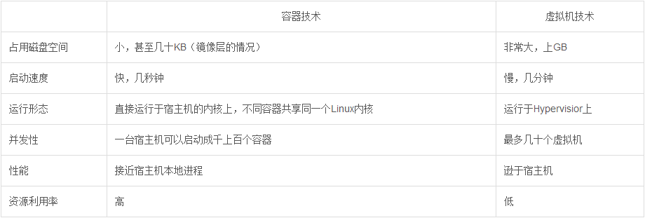
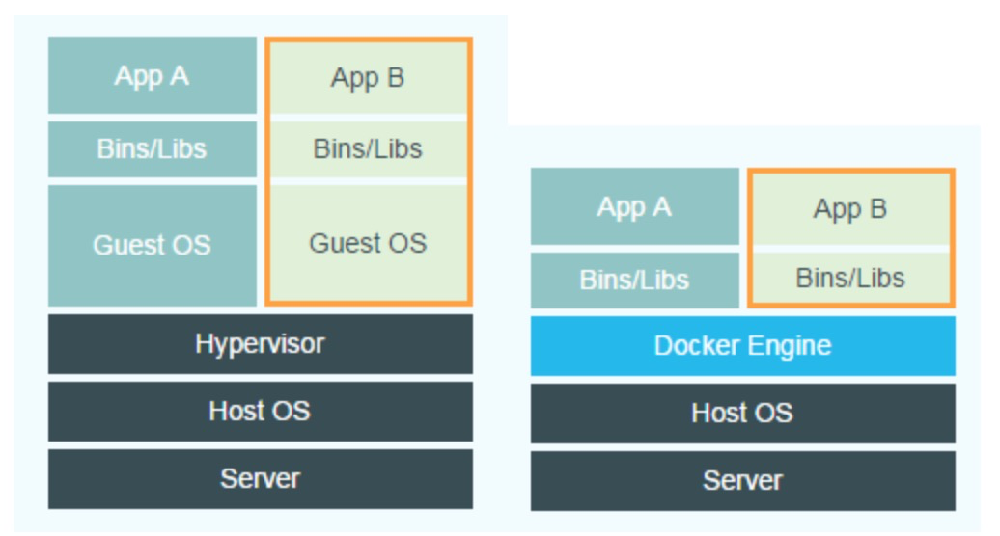
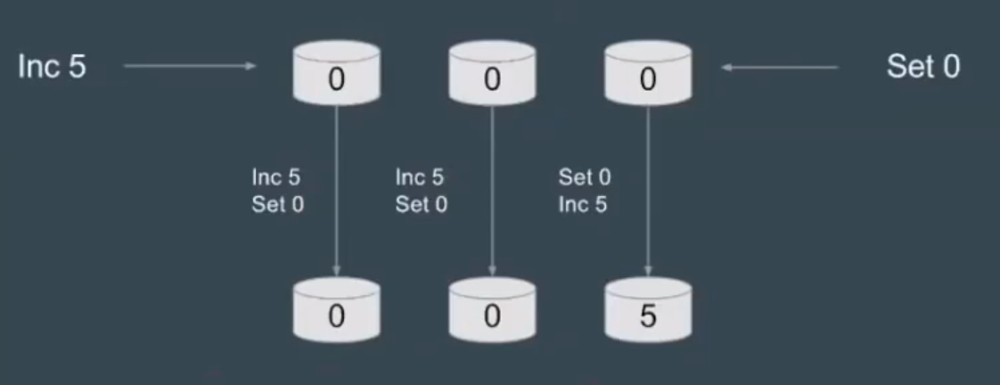
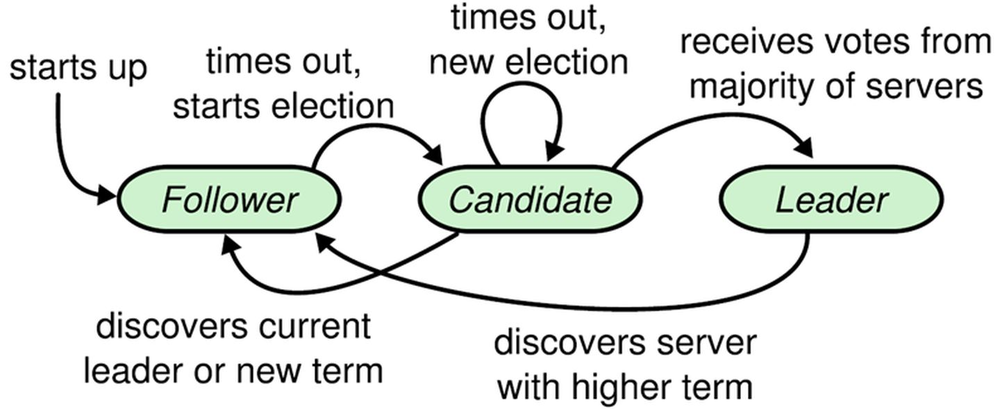
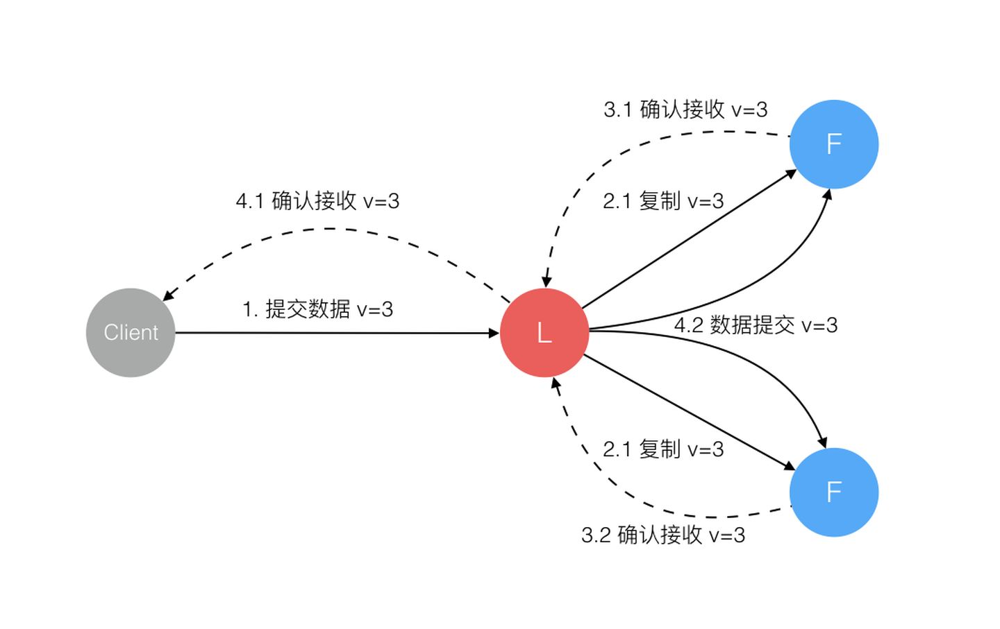
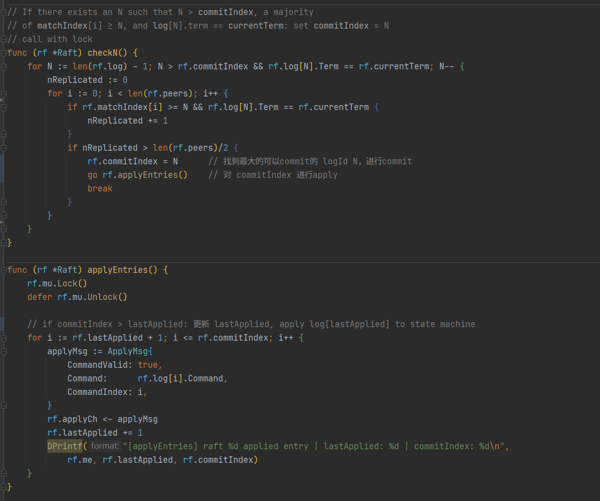
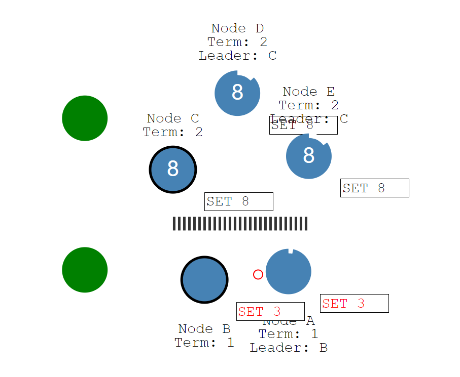
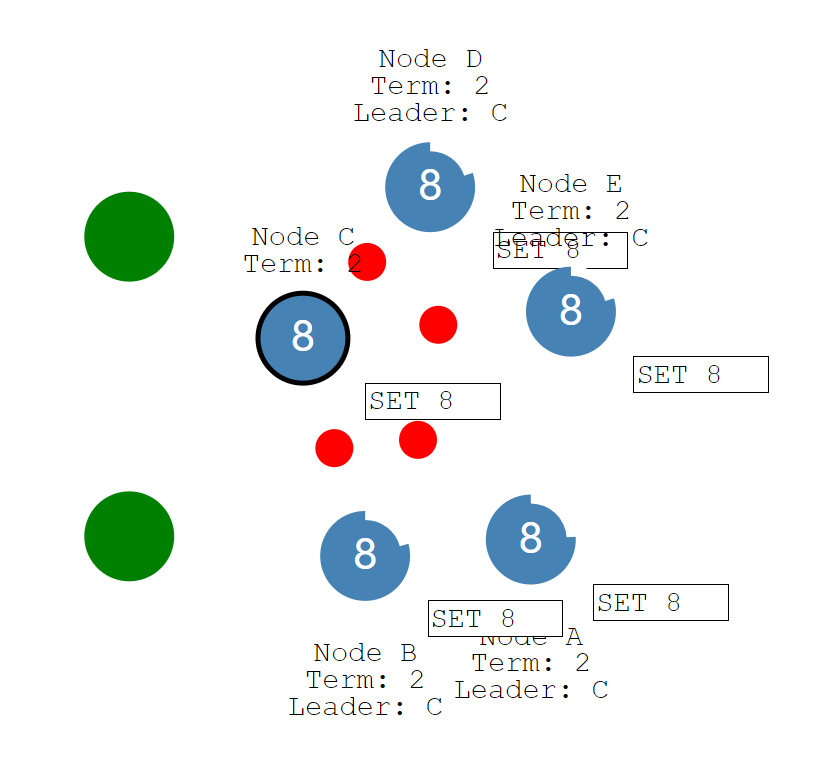
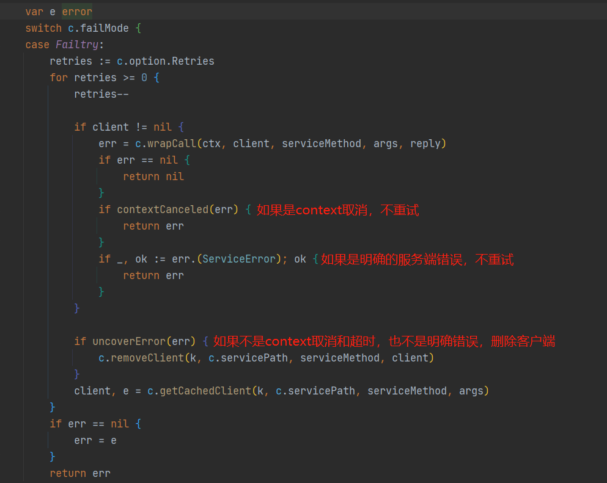

# 一、go web

## 1. MVC模式

- **模型(Model)：** 表示底层的数据
- **视图(View)：** 可视化方式向用户展示模型
- **控制器(Controllor)：** 根据用户输入来对模型修行修改 


## 2. 处理器和模板引擎

web应用主要完成三个任务：

1. 通过HTTP协议，以HTTP请求报文的形式获取客户端输入
2. 对HTTP请求报文进行处理，执行必要操作
3. 生成HTML，以HTTTP响应报文的形式返回给客户端

为了完成这三个任务，web应用被分成了 `处理器(handler)` 和 `模板引擎(template engine)`


**处理器**既是控制器，又是模型

**模板引擎**将模板转换为HTML，然后通过HTTP响应报文返回给客户端（静态模板：替换，动态模板：js）


## 3. 接收请求

`net/http库`可以分为客户端和服务器两个部分

客户端：Header, Request, Cookie, Client, Response

服务器：Header, Request, Cookie, ResponseWriter, Handler/HandlerFunc, Server, ServeMux


```go
func main(){
  http.ListenAndServe("", nil)
}
```

网络地址为空字符串""，则使用80端口，handler为nil，则使用`DefaultServeMux`


通过Server进行更详细的配置：

```go
func main() {
	handler := MyHandler{}
	server := http.Server{
		Addr:    "127.0.0.1:8080",
		Handler: &handler,
	}
	server.ListenAndServe()
}
```


通过HTTPS提供服务：

```go
func main() {
	server := http.Server{
		Addr:    "127.0.0.1:8080",
		Handler: nil,
	}
	server.ListenAndServeTLS("cert.pem", "key.pem")   //传入证书和私钥
}
```


### 3.1 处理器

Handler接口定义了一个ServeHTTP方法，所以一个**处理器必须实现ServeHTTP方法**

```go
type Handler interface {
	ServeHTTP(ResponseWriter, *Request)
}
```

而`DefaultServeMux` 就是 `ServeMux` 的实例，ServeMux又有用ServeHTTP方法，所以`DefaultServeMux`实际上就是一个Handler，它唯一要做的就是根据URL将请求重定向到不同的处理器

当我们使用自己的Handler传给ListenAndServe()函数时，就可以实现所有请求都由自定义的handler处理

但是多数时候，我们更希望使用`DefaultServeMux`多路复用器来实现多个处理器：

```go
type HelloHandler struct{}

func (h *HelloHandler) ServeHTTP(w http.ResponseWriter, r *http.Request) {
	fmt.Fprintf(w, "Hello!")
}

type WorldHandler struct{}

func (h *WorldHandler) ServeHTTP(w http.ResponseWriter, r *http.Request) {
	fmt.Fprintf(w, "World!")
}

func main() {
	hello := HelloHandler{}
	world := WorldHandler{}

	server := http.Server{
		Addr: "127.0.0.1:8080",
	}

	http.Handle("/hello", &hello)
	http.Handle("/world", &world)

	server.ListenAndServe()
}
```


### 3.2 处理函数

和处理器的使用类似，处理函数需要满足传入Handler的两个参数

```go
func hello(w http.ResponseWriter, r *http.Request) {
	fmt.Fprintf(w, "Hello!")
}

func main() {
	server := http.Server{
		Addr: "127.0.0.1:8080",
	}
	http.HandleFunc("/hello", hello)

	server.ListenAndServe()
}
```


原理：Go语言拥有一种`HandlerFunc`函数类型，可以把带有正确签名的函数 f 转换成一个带有f方法的Handler。最后将这个Handler与 `DefaultServeMux` 进行绑定。以此**简化创建和绑定Handler的工作**，本质还是Handler

```go
helloHanlder := HandlerFunc(hello)
```


### 3.3 串联多个处理器和处理函数

日志记录、安全检查、错误处理这样的操作同行被称为横切关注点，为了防止代码重复和依赖问题，使用串联技术分隔代码中的横切关注点

```go
func hello(w http.ResponseWriter, r *http.Request) {
	fmt.Fprintf(w, "Hello!")
}

func log(h http.HandlerFunc) http.HandlerFunc {
	return func(w http.ResponseWriter, r *http.Request) {
		name := runtime.FuncForPC(reflect.ValueOf(h).Pointer()).Name()
		fmt.Println("Handler function called - " + name)
		h(w, r)
	}
}

func main() {
	server := http.Server{
		Addr: "127.0.0.1:8080",
	}
	http.HandleFunc("/hello", log(hello))
	server.ListenAndServe()
}
```


### 3.4 ServeMux和多路复用器

ServeMux结构体是一个HTTP请求**多路复用器**，负责**接收HTTP请求**，并根据URL将请求**重定向**（根据结构中的一个映射）到正确的处理器

ServeMux也实现了ServeHttp方法，所以也是一个**处理器**

`DefaultServeMux`是ServeMux的一个实例，当没有指定Server结构的处理器时，服务器就会使用DefaultServeMux

- 如果被绑定的URL不是以`/`结尾，那么它只会与完全相同的URL匹配。如果以`/`结尾，则只要前缀匹配就认为两个URL匹配


**自定义多路复用器**：只需要实现ServeHttp方法即可替代ServeMux，ServeMux的缺陷是**无法实现URL模式匹配**


## 4. 处理请求


请求和响应的主体都是由Request结构的Body字段表示，这个字段是一个`io.ReadCloser`

Reader可以接受一个字节切片，读取到字节切片后返回读取的字节数和错误。Closer可以进行关闭，并返回错误


get请求也可以传递表单，只是表单数据将以键值对的形式包含在请求的URL里，而不是通过主体传递


### 4.2 ResponseWriter

**ServeHttp结构：**

```go
ServeHTTP(w http.ResponseWriter, r *http.Request){}
```

为什么接受request是指针，response不是指针呢，为了可以修改请求和响应，应该都是指针才对

其实 http.ResponseWriter 接口有一个实现的非导出结构：response，他在使用response的时候传递的就是指针

ResponseWriter接口：

```go
type ResponseWriter interface {
	Header() Header
	Write([]byte) (int, error)
	WriteHeader(statusCode int)     //写入响应状态码
}
```

举例：

```go
func headerExample(w http.ResponseWriter, r *http.Request) {
	w.Header().Set("Location", "http://google.com")
	w.WriteHeader(302)
}

func jsonExample(w http.ResponseWriter, r *http.Request) {
	w.Header().Set("Content-Type", "application/json")
	post := &Post{
		User:    "Sau Sheong",
		Threads: []string{"first", "second", "third"},
	}
	json, _ := json.Marshal(post)
	w.Write(json)
}

func main() {
	server := http.Server{
		Addr: "127.0.0.1:8080",
	}
	http.HandleFunc("/redirect", headerExample)
	http.HandleFunc("/json", jsonExample)
	server.ListenAndServe()
}
```


### 4.3 Cookie

http.Cookie结构：

```go
package http

type Cookie struct {
	Name  string
	Value string

	Path       string    // optional
	Domain     string    // optional
	Expires    time.Time // optional  未设置该字段，则为 临时Cookie/会话Cookie，一次会话有效
	RawExpires string    // for reading cookies only

	MaxAge   int   //Expires设置绝对的过期时间，MaxAge设置创建后存活多少秒。。IE678不支持MaxAge
	Secure   bool
	HttpOnly bool
	SameSite SameSite
	Raw      string
	Unparsed []string // Raw text of unparsed attribute-value pairs
}
```


设置Cookie和获取Cookie：

```go
func setCookie(w http.ResponseWriter, r *http.Request) {
	c1 := http.Cookie{
		Name:     "first_cookie",
		Value:    "Go Web Programming",
		MaxAge: 200,
		HttpOnly: true,
	}
	c2 := http.Cookie{
		Name:     "second_cookie",
		Value:    "Manning Publications Co",
		MaxAge: 200,
		HttpOnly: true,
	}
	w.Header().Set("Set-Cookie", c1.String())   //设置cookie方法1
	http.SetCookie(w, &c2)  //设置cookie方法2
}

func getCookie(w http.ResponseWriter, r *http.Request) {
	c1, err := r.Cookie("first_cookie")   //获取指定cookie
	if err != nil {
		fmt.Fprintln(w, "Cannot get the first cookie")
	}
	cs := r.Cookies()    //获取所有cookie
	fmt.Fprintln(w, c1)
	fmt.Fprintln(w, cs)  //打印到ResponseWriter
}
```


## 5. 模板和内容展示


## 6. 数据存储

### 6.1 sql数据库

```go
var Db *sql.DB

func init() {
	var err error
	Db, err = sql.Open("postgres", "user=gwp dbname=gwp password=gwp sslmode=disable")
	if err != nil {
		panic(err)
	}
}
```

`sql.DB` 是一个**数据库连接句柄**(不是实际的连接)，它代表的是一个包含零个或者任意多个数据库连接的连接池(pool)，连接有sql包来管理，通过sql.Open，传入数据库驱动和数据源

`Open` 函数执行时并**不会真正的与数据库进行连接**，甚至**不会检查给定的参数**，而是以惰性方式，等到真正需要的时候才建立数据库连接

`sql.DB`句柄代表的是一个会自动会连接进行管理的连接池，所以可以手动关闭sql.DB，但并不需要我们这么做


**驱动的注册：**

驱动注册一般要`sql.Register("postgres", &drv{})`，传入驱动名和对应实现Driver接口的结构

但是一般不需要手动注册，因为导入第三方数据库驱动的时候，驱动的`init()`函数实现了自行注册

```go
import (
	"database/sql"
	"fmt"
	_ "github.com/lib/pq"    //只是注册驱动，不会用这个包
)
```


## 7. Web应用的部署与Docker

一个Go Web应用，除了可执行的二进制文件外，通常还会包含一些模板文件，如JavaScript、图片、样式表等静态文件

越来越多的软件，开始采用云服务。

云服务只是一个统称，可以分成三大类，注意，都是云服务，不需要购买服务器了。

-  **基础设施即服务**(IaaS)： Infrastructure-as-a-Service，用户需要自己控制底层，实现基础设是的使用逻辑（不用买服务器了，只需要购买虚拟机，自己安装操作系统和软件）
- **平台即服务**(PaaS)： Platform-as-a-Service，提供软件部署平台(runtime)，抽象掉了硬件和操作系统细节，可以无缝的扩展，开发者只需要关注自己的业务逻辑，不需要关注底层（不需要买服务器和安装软件，只需要自己开发程序）
- **软件即服务**(SaaS)：Software-as-a-Service，软件开发、管理、部署都交给第三方，不需要关心技术问题，拿来即用，普通用户接触到的互联网服务几乎都是SaaS（购买使用开发好的程序，别人负责维护，我们只需要运营）


### 1. GoWeb应用部署到独立服务器

项目编译后放到可访问的路径执行，并设置init守护进程管理web服务，保证持续运行


### 2. GoWeb应用部署到云端


### 3. GoWeb应用部署到Docker

- **传统虚拟化技术是对硬件资源的虚拟**。传统的虚拟机需要模拟**整台机器包括硬件**，每台虚拟机都**需要有自己的操作系统**，虚拟机一旦被开启，预分配给他的资源将全部被占用。每一个虚拟机包括应用，必要的二进制和库，以及一个完整的用户操作系统
- **容器技术是对进程的虚拟**。容器技术是和我们的宿主机共享硬件资源及操作系统可以实现资源的动态分配。容器包含应用和其所有的依赖包，但是与其他容器共享内核。容器在宿主机操作系统中，在用户空间以分离的进程运行



虚拟机和容器都是在硬件和操作系统以上的，虚拟机有`Hypervisor层`，**Hypervisor是整个虚拟机的核心**。他为虚拟机提供了虚拟的运行平台，管理虚拟机的操作系统运行。每个虚拟机都有自己的系统和系统库以及应用。

**容器没有Hypervisor这一层**，并且每个容器是和宿主机**共享硬件资源及操作系统**，那么由Hypervisor带来性能的损耗，在linux容器这边是不存在的。**取消了Hypervisor和Guest OS层，使用Docker Engine进行调度和隔离，所有应用共用主机操作系统，所以更加轻量级，接近裸机性能。。但是隔离性和安全性也要差一点**



而Docker，实际上是一种管理容器的软件。。Docker的三大核心：镜像、容器、仓库


### 3.1 镜像images

镜像是一个**只读文件**，一个镜像是不会发生改变的。所有的变更都发生在顶层的可写层，下层的原始只读镜像不会改变

**镜像提供了容器运行的一些基础文件和配置文件，是容器启动的基础**

常用命令：

```
docker images 	展示本地已有的镜像

docker pull 		镜像拉取

docker run 			启动一个容器

docker rmi      删除镜像

docker push     docker镜像上传镜像库，便于共享

docker commit   用来保存运行的容器为镜像，因为镜像是只读的，一切写操作都是基于container的，并不会同步到镜像里，如果需要保存运行的容器为镜像，可使用此命令保存。
```


### 3.2 容器container

**container是image运行时的一种状态**。**使用`docker run`时会根据指定镜像生成对应的container**，container是image最上面的一层，提供读写

容器有自己独立的命名空间和资源限制，这意味着**在容器内部是无法看到主机上面的进程，环境变量等信息的**，这就是容器和物理机上的本质区别

容器相关操作：

```
$ docker run -d ubuntu:14.04 /bin/bash  //使用镜像创建容器
root@af8bae53bdd3:/# 进入容器内部
$ docker ps  //查看容器
CONTAINER ID  IMAGE         COMMAND               CREATED        STATUS       PORTS NAME
S1e5535038e28  ubuntu:14.04  /bin/bash    2 minutes ago Up 1 minute name
$ docker stop   S1e5535038e28 //停止容器
$ docker start   S1e5535038e28 //开始容器
$ docker kill S1e5535038e28    //kill掉容器
$ docker attach S1e5535038e28   //进入到容器内部
$ docker ps    //查看运行中的容器
$ docker commit  //将镜像保存为新容器
```


### 3.3 仓库 docker hub

存放镜像的共享平台，类似于代码仓库，分为公共镜像和私有镜像

命令：

``` 
docker pull

docker push

docker login

docker search
```


# 二、微服务架构和分布式理论

## 1. 单体服务和微服务

单体应用的困境：

1. **敏捷开发受挫**，主要问题是：应用程序实在非常复杂，其对于任何一个开发人员来说显得过于庞大。最终，正确修复 bug 和实现新功能变得非常困难而耗时
2. **持续部署受挫**，每天可能多次将变更推送到生产环境。这对于复杂的单体来说非常困难，因为这需要重新部署整个应用程序才能更新其中任何一部分
3. **应用难以扩展**，各个模块的功能不同，对硬件的需求不同，部署在一起就必须在硬件的选择上进行妥协
4. **技术升级困难**，单体应用因为提及庞大，使得采用新框架和语言变得非常困难


微服务的优点：

1. **解决复杂问题。**微服务架构把可能会变得庞大的单体应用程序分解成一套服务。虽然功能数量不变，但是应用程序已经被分解成可管理的块或者服务
2. **团队分工协作更容易。**微服务这种架构使得每个服务都可以由一个团队独立专注开发。开发者可以自由选择任何符合服务API的技术
3. **独立部署。**微服务架构模式可以实现每个微服务独立部署。开发人员根本不需要去协调部署本地变更到服务。这些变更一经测试即可立即部署
4. **程序扩展能力强。**微服务架构模式使得每个服务能够独立扩展。每个开发团队都可以使用与服务资源要求最匹配的硬件

微服务带来的缺点：

增加系统复杂度(通信，分布式事务)、项目测试难度增加(依赖其他服务)、需要多次部署、分区数据库问题(需要更新多个服务各自的数据库)


由于各个服务涉及下线、更新、升级，前台不可能记住所有服务的地址，所以需要增加一个`网关(API Gateway)`，提供后台服务的聚合，提供一个统一的服务出口


### 1.1 CAP理论

1985年，Lynch教授证明了：**在一个不稳定（消息要么乱序要么丢了）的网络环境里（分布式异步模型），想始终保持数据一致是不可能的**

也就是说，在分布式系统中，必须要妥协，于是有了CAP理论：


分布式系统的三个指标：

1. **数据一致性(C)**：指整个系统的数据能一起变化！对一个节点的成功写入，对之后从其他节点的读取而言是可见的。当系统内部发生问题导致节点数据不一致后，外部对每个节点的读取请求依然一致（读请求会看到旧的一致数据）。
2. **系统可用性(A)**：系统可以提供服务的时间占总时间的比例。。。（可靠性是提供服务的正确性，可用性是是否能提供服务）。要保证可用的意思是，即使数据不一致，数据落后，依然要想客户端返回这个数据
3. **分区容错性(P)**：分布系统多节点独立，需要相互通信，当节点之间通信出现问题，无法联通时（分区），我们就认为出现了分区。分区可能是网络故障或者机器故障。分区容忍性就是，即使系统发生了分区，依然要继续运行

显然分区容错性是必须要满足的，否则系统都不能工作了没有实际意义了，这就需要**复制多份**

**保证可用性：** 系统无法联通的时候忍受数据不一致的问题，为了可用，返回给客户端不一致的数据。AP系统例如：Eureka

**保证一致性：** 数据很重要，无法联通时要等待数据同步以后才能提供服务，只提供一致的数据。CP系统例如：ZooKeeper


我们说的都是出现分区的情况，当系统没有分区，当然满足CAP三者，系统拥有完美的数据一致性和可用性

CAP三种特性并不是布尔的，不是一致和不一致，可用和不可用，分区和不分区的二选一，这三种特性都是范围类型。例如如果一台机器出现问题，可能不影响业务，就会被机器投票认为分区不存在，然后一直等待多台出现问题（例如超过一半），才投票确认出现了分区问题。


## 2. 服务间的通信方式

同步调用、异步消息调用

### 2.1 同步调用

1. `REST`：REST基于HTTP，实现更容易，各种语言都支持，同时能够跨客户端，对客户端没有特殊的要求，只要具备HTTP的网络请求库功能就能使用
   - `POST` 创建资源(资源尚未存在的情况下)-------非幂等的，重复的POST是否改变服务器状态是根据服务器具体的实现来决定的，有可能会重复创建多份资源
   - `GET` 获取资源
   - `PUT` 重新给定URL上的资源(替换已有资源)-----幂等的
   - `DELETE` 删除一项资源
2. `RPC`：rpc的特点是传输效率高，安全性可控，在系统内部调用实现时使用的较多

基于REST和RPC的特点，我们通常采用的原则为：**向系统外部暴露采用REST，向系统内部暴露调用采用RPC方式**


#### 2.1.1 RPC

一个正常的RPC过程可以分为一下几个步骤：

1. client调用client stub，这是一次本地过程调用。
2. client stub将参数打包成一个消息，然后发送这个消息。打包过程也叫做marshalling。
3. client所在的系统将消息发送给server。
4. server的的系统将收到的包传给server stub。
5. server stub解包得到参数。 解包也被称作 unmarshalling。
6. server stub调用服务过程。返回结果按照相反的步骤传给client。

在上述的步骤实现远程接口调用时，所需要执行的函数是存在于远程机器中，即函数是在另外一个进程中执行的。因此，就带来了几个新问题：

- **Call ID映射。**远端进程中间可以包含定义的多个函数，本地客户端该如何告知远端进程程序调用特定的某个函数呢？因此，在RPC调用过程中，所有的函数都需要有一个自己的ID。开发者在客户端（调用端）和服务端（被调用端）分别维护一个`{函数<-->Call ID}`的对应表。两者的表不一定完全相同，但是相同的函数对应的Call ID必须相同。当客户端需要进行远程调用时，调用者通过映射表查询想要调用的函数的名称，找到对应的Call ID，然后传递给服务端，服务端也通过查表，来确定客户端所需要调用的函数，然后执行相应函数的代码。
- **序列化与反序列化。**在本地调用中，我们只需要把参数压到栈里，然后让函数自己去栈里读就行。但是在远程过程调用时，客户端跟服务端是不同的进程，不能通过内存来传递参数。这时候就需要客户端把参数先转成一个字节流，传给服务端后，再把字节流转成自己能读取的格式。这个过程叫序列化和反序列化。
- **网络传输。**远程调用往往用在网络上，客户端和服务端是通过网络连接的。所有的数据都需要通过网络传输，因此就需要有一个网络传输层。**网络传输层需要把Call ID和序列化后的参数字节流传递给服务端，然后在把序列化后的调用结果传回给客户端**，完成这种数据传递功能的被成为传输层。大部分的网络传输成都使用TCP协议，属于长连接。


### 2.2 异步消息调用

异步消息的方式在分布式系统中有特别广泛的应用，他既能减低调用服务之间的耦合，又能成为调用之间的缓冲，确保消息积压不会冲垮被调用方，同时能保证调用方的服务体验，继续干自己该干的活，不至于被后台性能拖慢


异步消息需要付出的代价就是一致性的减弱，需要接受数据的**最终一致性**

常见的异步消息调用框架有：`Kafka`、`Notify`、`MessageQueue`


## 3. 服务注册与服务发现

传统运行在物理机上的应用，某个服务的网络地址一般是静态的，偶尔更新，可以直接配置


在微服务架构中，一般每一个服务都是有多个拷贝，来做`负载均衡`。一个服务随时可能`下线`，也可能应对临时访问压力`增加`新的服务节点。这就涉及到**服务之间如何感知，服务如何管理**的问题

`服务发现`一般是通过**注册**的方式进行的。当服务上线时，服务提供者将自己的服务注册信息注册到某个专门的框架中，并通过**心跳**维持长链接，实时更新链接信息。服务调用者通过`服务管理框架`进行寻址，根据特定的算法，**找到对应的服务**，或者将服务的注册信息缓存到本地，这样提高性能。当服务下线时，服务管理框架会发送服务下线的通知给其他服务


### 3.1 服务注册

**服务注册表：**一个包含服务实例网络地址的的数据库

一个服务注册表需要`高可用和实时更新`，客户端可以缓存从服务注册表获取的网络地址。然而，这样的话缓存的信息最终会过期，客户端不能再根据该信息发现服务实例。因此，服务注册表对集群中的服务实例使用`复制协议`来维护一致性


**服务注册的方式：**

1. `self-registration`：服务实例**自己负责在服务注册中心的服务注册表中对自己进行注册和注销**。另外服务实例还可以通过发送心跳包请求防止注册过期
   - 优点：简单
   - 缺点：服务实例和服务注册表强耦合，要在每一个使用服务的客户端编程语言和架构代码中实现注册逻辑
2. `third-party registration`：服务实例本身并不负责通过服务注册表注册自己。而是通过`service registrar`系统组件来处理注册。service registrar通过**轮询或者订阅事件**来检测一些运行实例的变化，当它检测到一个新的可用服务实例时就把该**实例注册到服务注册表中**去，service registrar还负责**注销已经被终止的服务实例**
   - 优点：服务实例和服务注册表解耦，服务实例的注册被一个专有服务以集中式的方式处理
   - 缺点：需要额外设置和管理的可高可用的系统组件


### 3.2 服务发现


**服务发现的方式：**  (往往大公司会采用客户端发现机制来实现服务的发现与注册的模式)

1. `客户端发现模式`：**客户端负责决定可用服务实例的网络地址**并且在集群中对请求进行负载均衡。客户端访问**服务注册表**，也就是一个可用服务的数据库，然后客户端使用一种负载均衡算法选择一个可用的服务实例然后发起请求
   - 优点：只是增加了服务注册表，结构简单，客户端可以使用更加智能的负载均衡机制(例如一致性哈希)
   - 缺点：客户端与服务注册表紧密耦合在一起，开发者必须为每一种消费服务的客户端对应的编程语言和框架版本都实现服务发现逻辑
2. `服务端发现模式`：**客户端通过一个负载均衡器向服务发送请求**，**负载均衡器查询服务注册表**并把请求路由到一台可用的服务实例上。和客户端发现一样，服务实例通过服务注册表进行服务的注册和注销
   - 优点：对客户端隐藏服务发现的细节，客户端仅需向负载均衡器发送请求即可。减少了为消费服务的不同编程语言与框架实现服务发现逻辑的麻烦
   - 缺点：需要额外设置和管理的可高可用的系统组件(负载均衡器)


客户端服务发现的案例：Eureka、ZooKeeper

服务端服务发现的案例：Consul+Nginx


#### 3.2.1 Consul服务发现原理


1、**部署集群。**首先需要有一个正常的Consul集群，有Server，有Leader。这里在服务器Server1、Server2、Server3上分别部署了Consul Server。

2、**选举Leader节点。**假设他们选举了Server2上的 Consul Server 节点为Leader。这些服务器上最好只部署Consul程序，以尽量维护Consul Server的稳定。

3、**注册服务。**然后在服务器Server4和Server5上通过Consul Client分别注册Service A、B、C，这里每个Service 分别部署在了两个服务器上，这样可以避免Service的单点问题。服务注册到Consul可以通过 HTTP API（8500 端口）的方式，也可以通过 Consul 配置文件的方式。

4、**Consul client转发注册消息。**Consul Client 可以认为是无状态的，它将注册信息通过RPC转发到Consul Server，服务信息保存在Server的各个节点中，并且通过Raft实现了强一致性。

5、**服务发起通信请求。**最后在服务器Server6中Program D需要访问Service B，这时候Program D首先访问本机Consul Client提供的HTTP API，本机Client会将请求转发到 Consul Server。

6、Consul Server查询到Service B当前的信息返回，最终Program D拿到了Service B的所有部署的IP和端口，然后就可以选择Service B的其中一个部署并向其发起请求了。


## 4. 单点故障和分布式一致性算法

https://blog.csdn.net/ystyaoshengting/article/details/105048798

通常分布式系统采用**主从模式**。主节点负责**分发任务**，从节点负责**处理任务**，当我们的**主节点发生故障时**，整个系统就瘫痪了。这就是单点故障

单点故障 实际指的就是单个点发生故障的时候会波及到整个系统或者网络，从而导致整个系统或者网络的瘫痪。


根据CAP理论，分布式系统不能同时满足CAP三点。一致性的分类：

- **线性一致性：** 又称为强一致性、严格一致性、原子一致性。是程序能实现的最高一致性模型，也是分布式系统中用户最期望的一致性。保证系统改变提交以后立即改变集群的状态，例如 `Paxos, Raft(Multi-Paxos)`

- **顺序一致性：**顺序一致性中进程只关心大家认同的顺序一样就行，不需要与全局时钟一致，没有线性一致性严格，线性一致性要从这种偏序到达全序。例如 `ZAB(Multi-Paxos,准确讲是顺序一致性)`

- **弱一致性：** 也叫最终一致性，系统不保证改变提交后立即改变集群的状态，但是随着时间的推移，最终状态是一致的。例如 `DNS系统, Gossip协议`

  

ZAB主要保证的是**顺序一致性**语义，而Raft保证的则是**线性一致性**语义。尽管他们都算是强一致性，但是顺序一致性没有时间维度的约束，所以可能不满足现实世界的时序。也就是说现实中顺序一致性是可能返回旧数据的。尽管ZK保证了但客户端的FIFO顺序，但是有些场景还是有一些受限，etcd的线性一致性更好。

Raft实现线性一致性，要求所有的read/write都来到Leader，write有严格顺序，一个write被committed代表前面的write的log一定就被committed了，所有的write一旦被committed就可见了，所以是线性一致的。如果使用follower来read，要求follower去Leader查询最新的commitedIndex，然后根据这个Index从follower读，就能保证读取到最新的数据，当前etcd就实现了follower read


一致性算法举例：

- Google的Chubby分布式锁服务，采用了Paxos算法
- etcd分布式键值数据库，采用了Raft算法
- ZooKeeper分布式应用协调服务，Chubby的开源实现，采用ZAB算法


Paxos读音 帕克索斯


### 4.1 单点故障的解决办法

单点故障的解决方案是采用**多副本**，每一份数据都保存多个副本，这样部分副本失效就不会导致数据的丢失

但是每次更新操作都需要**更新所有副本**，如何使多个副本的数据保持一致性就成了需要解决的问题。根据CAP理论，一致性和可用性只能满足一个


Paxos、Raft等分布式一致性算法则可在一致性和可用性之间取得很好的平衡，在保证一定的可用性的同时，能够对外提供强一致性，因此Paxos、Raft等分布式一致性算法被广泛的用于管理副本的一致性，提供高可用性


### 4.2 主从复制和多数派

**主从同步复制：**

1. Master接受写请求
2. Master复制日志到Slave
3. Master等待，直到**所有的从库**返回

问题：一个节点失败，Master阻塞，导致整个集群不可用，保证了一致性却大大降低了可用性


**多数派：**

每次写入都保证写入大于 N/2 个节点，每次读也保证从大于 N/2 个节点中读

问题：并发环境下，无法保证系统的正确性，顺序非常重要




### 4.2 Paxos算法

Paxos算法解决的问题正是分布式一致性问题，即一个分布式系统中的各个进程如何就某个值（决议）达成一致

Paxos算法运行在允许宕机故障的异步系统中，**不要求可靠的消息传递，可容忍消息丢失、延迟、乱序以及重复**。它利用大多数 (Majority) 机制保证了2F+1的容错能力，即2F+1个节点的系统最多允许F个节点同时出现故障

一个或多个提议进程 (Proposer) 可以发起提案 (Proposal)，Paxos算法使所有提案中的某一个提案，在所有进程中达成一致。系统中的多数派同时认可该提案，即达成了一致。最多只针对一个确定的提案达成一致


Paxos将系统中的角色分为`提议者 (Proposer)`，`决策者 (Acceptor)`，和`最终决策学习者 (Learner)`:

- **Client:** 系统外部角色，请求的发起者

- **Proposer**: 接受Client请求，向集群提出提案 (Proposal)，在冲突发生时起到冲突调节的作用。Proposal信息包括`全局唯一递增的提案编号 (Proposal ID)` 和`提议的值 (Value)`
- **Acceptor**：参与决策，回应Proposers的提案。收到Proposal后可以接受提案，若Proposal获得多数Acceptors的接受，则称该Proposal被批准
- **Learner**：不参与决策，从Proposers/Acceptors学习最新达成一致的提案（Value），也可以说是一个备份，对集群一致性没什么影响


Paxos有三种实现版本：**Basic-Paxos版本**，**Multi-Paxos版本**，**Fast-Paxos版本**


**Basic-Paxos算法通过决议的过程：**

1. 第一阶段：Prepare阶段。Proposer向Acceptors发出`prepare(N)`请求，ProposalID=N (N大于这个Proposer之前提出的提案号)
2. 第二阶段：Promise阶段。决定讨论哪条提案。Acceptors针对收到的Prepare请求进行`promise`承诺，如果N大于此Acceptor之前接受的所有提案的编号，则接受，否则拒绝。(**Acceptor承诺不再接受小于等于当前Proposal ID的Prepare请求**，所以会应答Accept过的Proposal ID最大的提案)。
3. 第三阶段：Accept阶段。决定通过哪条提案。Proposer收到多数Acceptors承诺的Promise后，向Acceptors发出`accept`请求，Acceptors针对收到的请求进行Accept处理(判断该请求的提案是不是accept过的Proposal ID最大的提案，是则接受，否则不接受该Proposal)。
4. 第四阶段：Learn阶段。Proposer在收到多数Acceptors的Accept之后，标志着本次Accept成功，**决议形成**，将形成的决议发送给所有Learners。然后返回`response`


**节点故障：**

1. 若Proposer故障，没关系，其他Proposer依然可以保证可用性，继续提出提案
2. 若Acceptor故障，表决时能达到多数派也没问题


**Basic-Paxos的问题：** 难实现，效率低（两轮RPC通信），活锁


**活锁：**

- 假设系统又多个Proposer，不断向Acceptor发出提案，还没等到上一个填达到多数派，下一个提案又来了，这就会导致Acceptor放弃当前提案而转向处理下一个提案，这时候之前的Proposer提案失败，又发起了新的提案，这样就一直循环下去，提案不通过
- 解决办法：多等一会儿再进行下一次提案。。。


Basic-Paxos算法是一个纯粹的**去中心化的分布式算法**，两轮RPC为了确定讨论谁的提案会造成较大的网络开销，活锁的问题也是因为有多个Proposer，基于这个问题，有了**以Leader Proposer为核心的Multi-Paxos算法**

**Multi-Paxos算法：**

根据Basic-Paxos改进而来，整个系统**只有一个Proposer**，称为`Leader`

1. 若集群中没有Leader，则在集群中选举一个节点，声明为`第M任Leader`
2. **集群的Acceptor只表决最新的Leader发出的最新的提案**
3. **只要Leader不挂掉，Leader就一直在任期内，之后就只需要一轮RPC就可以提交提案了**，因为不再有其他Proposer

Multi-Paxos的每个Leader的任期开始的第一轮RPC其实就是选主


算法优化：


Multi Paxos角色过多，对于计算机集群而言，可以将Proposer、Acceptor和Learner三者身份**集中在一个节点上**，此时只需要从集群中选出Proposer，其他节点都是Acceptor和Learner，这就是接下来要讨论的Raft算法

**Paxos算法不容易实现，Raft算法是对Multi-Paxos算法的简化和改进**，主要增加了两个限制：

1. 日志添加次序性：raft要求日志必须串行的连续添加，而multi-paxos是可以并发添加日志的，没有顺序要求
2. 选主限制：raft要求拥有最新日志的节点才有资格成为Leader，因为日志的串行性，可以根据日志确定最新的节点。而Multi-Paxos由于日志是并发添加的，无法确定最新日志的节点，所以可以选择任意节点作为leader


### 4.3 Raft算法

Raft将Paxos划分为了三个子问题：**Leader Election,  Log Replicaiton,  Safety**，重新定义了角色，两个动画网站：

[Raft (thesecretlivesofdata.com)](http://thesecretlivesofdata.com/raft/)

[Raft Consensus Algorithm](https://raft.github.io/)


`Raft`：Raft中的节点总是处于三种状态之一( `follower`、`candidate`或`leader`)。

- **Leader**，总统节点，负责发出提案，Client交互和log复制，同一时刻系统中最多只存在1个Leader
- **Follower**，只被动响应其他服务器的请求(提案)，从不主动发起请求(提案)，只从Leader复制日志
- **Candidate**，由Follower向Leader转换的中间状态。**正常工作期间只有Leader和Follower节点**，Leader宕机了才会有Follower因为去竞选Leader而变成Candidate的中间态



一个最小的Raft集群需要三个参与者，这样才可以投出多数票。三个Follower有一个想竞选，变为Candidate，然后请求投票，两外两个给他投票，这样就成为了Leader

**所有的节点最初都是follower**。在这种状态下，节点可以接受来自leader的日志消息并进行投票

**每个follower都持有一个定时器**，如果follower在一段时间内没有收到leader的心跳，节点将自动提升到`Candidate`状态，将消息发给其他节点来争取他们的选票，从而开始一次Leader的选举，收到大多数服务器投票的Candidate将会**成为该term的Leader**。此外如果follower收到了leader的心跳，则会立马**刷新自己的定时器**


Raft算法将时间分为一个个的任期（term），每一个term的开始都是Leader选举。在成功选举Leader之后，Leader会在整个term内管理整个集群。如果Leader选举失败，该term就会因为没有Leader而结束，直接进入到下一个term

**在一个term内，Leader会不断的发送心跳给其他节点证明自己还活着**，其他节点收到心跳后就会清空自己的定时器并回复心跳，这个机制保证其他节点不会在Leader任期内参加Leader选举。如果leader节点故障，没有收到心跳的follower将准备成为Candidate进入下一轮选举

如果两个`Candidate`同时选举并且获得了相同的票数，那么这两个Candidate将**随机推迟一段时间后再向其他节点发出投票请求**，这样保证了再次发送选票请求以后不会冲突


#### 主要数据结构

Raft 节点的结构：

```go
type Raft struct {
	mu        sync.Mutex          // lock to protect shared access to this peer's state
	peers     []*labrpc.ClientEnd // RPC end points of all peers
	persister *Persister          // Object to hold this peer's persisted state
	me        int                 // this peer's index into peers[]
	dead      int32               // set by Kill()

	role Role
	term int

	electionTimer       *time.Timer
	appendEntriesTimers []*time.Timer
	applyTimer          *time.Timer
	notifyApplyCh       chan struct{}
	stopCh              chan struct{}

	voteFor           int        // server id, -1 for null
	logEntries        []LogEntry // lastSnapshot 放到 index 0
	applyCh           chan ApplyMsg
	commitIndex       int
	lastSnapshotIndex int // 快照中的 index
	lastSnapshotTerm  int
	lastApplied       int   // 此 server 的 log commit
	nextIndex         []int // 下一个要发送给peer的index（根据peer编号取）
	matchIndex        []int // 确认 match 的

	DebugLog  bool      // print log
	lockStart time.Time // debug 用，找出长时间 lock
	lockEnd   time.Time
	lockName  string
	gid       int
}
```


RequestVoteArgs 和 RequestVoteReply：

```go
type RequestVoteArgs struct {
	Term         int
	CandidateId  int
	LastLogIndex int
	LastLogTerm  int
}

type RequestVoteReply struct {
	Term        int
	VoteGranted bool
}
```


AppendEntriesArgs 和 AppendEntriesReply：

```go
type AppendEntriesArgs struct {
	Term         int
	LeaderId     int
	PrevLogIndex int
	PervLogTerm  int
	Entries      []LogEntry
	LeaderCommit int
}

type AppendEntriesReply struct {
	Term      int
	Success   bool
	NextIndex int
}
```


几个超时时间需要留意：

```go
	ElectionTimeout  = time.Millisecond * 300 // 选举超时时间，超时未收到AppendEntriesRPC则开始选举，每次开始选举时重置，150~300随机
	HeartBeatTimeout = time.Millisecond * 150 // leader 发送心跳(日志)的时间间隔，对每个peer都有一个
	ApplyInterval    = time.Millisecond * 100 // apply log的时间间隔
	RPCTimeout       = time.Millisecond * 100 // RPC的超时时间
```


#### 关于持久化

`Term, votedFor, log[]` 这三者每次改变都要进行持久化，这样宕机之后才可以顺利恢复

Term, voteFor 和 logs 这三个变量一旦发生变化就一定要在被其他协程感知到之前（释放锁之前，发送 rpc 之前）持久化，这样才能保证原子性


#### mainLoop和两个计时器


`timerElection()`和`timerHeartbeat()`，定时向通道写入数据：


#### Leader选举

**请求投票过程：**

```go
type RequestVoteArgs struct {
	Term         int
	CandidateId  int
	LastLogIndex int
	LastLogTerm  int
}
```

开启选举：


选举结果：

1. 收到大多数选票，切换为`Leader`，然后给其他server发送心跳，告诉他们自己是`current_term_id`的leader，每个RPC消息都要带上term_id以检测过期消息。如果一个server收到RPC消息的term_id比自己的大，就更新自己的current_term_id为消息中的term_id，并且如果当前状态是leader或者candidate时要切换为follower。如果RPC消息的term_id比自己的小，则发送拒绝这个RPC的消息（`GrantVote=false`）并带上自己的term_id
2. 如果等待选票过程中，收到了别的server的`AppendEntriesRPC`，并且其中的term_id大于自己的current_term_id，说明别的server抢先成为了leader，将自己的状态切换成follower，更新本地的current_term_id
3. 如果没有选出主，没有任何一个candidate收到了majority的vote。这时每个candidate等待到投票超时时间`RPCTimeout`，将current_term_id加1，发起`RequestVoteRPC`进行新一轮选举，并重置投票超时定时器（定时器会在base time的基础上增加一个额外的随机时间，防止冲突）


**处理投票的策略：**

```go
type RequestVoteReply struct {
	Term        int
	VoteGranted bool
}
```

处理RequestVoteRPC

- Candidate投票只会投给自己

- Follower投票只会投给 term 跟自己一样，且LogEntry至少跟自己一样（>=）


**角色切换：**


#### 日志同步

所有的写请求都是请求到Leader的，Leader将日志加到心跳包里面，发给Follower

Leader选出后，就开始接收客户端的请求。Leader把请求作为日志条目（Log entries）append到它的日志中，然后并行的向其他服务器发起 `AppendEntriesRPC` 复制日志条目。当Leader确认这条日志被复制到大多数服务器上（Follower进行commit），**Leader将这个LogEntry进行`commit`，然后`apply`这条LogEntry到状态机(异步向Follower发起提交请求，Follower进行apply)，向客户端返回执行结果**

- 只有当一条日志是`commited`时，Leader才能将它apply到状态机。Raft保证每条commited的LogEntry已经持久化了并且会被所有的peers执行

**

Leader发生改变的时候，它和其他节点的日志可能不一样，这时候就需要一个机制来保证日志的一致。

Follower会舍弃和Leader不同的日志条目，并按顺序复制Leader的日志条目

Raft 算法规定 **follower 强制复制 leader 节点的日志**，即 follower 不一致日志都会被 leader 的日志覆盖，最终 follower 和 leader 保持一致。简单的说，从前向后寻找 follower 和 leader 第一个公共 LogIndex 的位置，然后从这个位置开始，follower 强制复制 leader 的日志


每个格子代表一条`LogEntry`，格子内的数字代表这个LogEntry是在哪个`Term`产生的。

为了使Leader和Follower的log达成一致，Leader会为每个Follower维护一个`nextIndex`，标识leader给各个follower发送的下一条LogEntry的`logIndex`，**初始化为leader最后一条LogEntry的下一个位置**

Leader给Follower发送`AppendEntriesRPC`消息，带着`prevLogIndex=nextIndex-1, prevLogTerm = rf.getLogByIndex(prevLogIndex).Term`

Follower收到后会判断自己的log中有没有这条LogEntry，如果不存在（或冲突），就回复拒绝，Leader将`nextIndex--`，再**立马重发**（要立马重发，而不是等下一个心跳），直到AppendEntriesRPC消息被接收为止

如果leader送过来的entry与现存entry冲突（相同索引的term不同），则**删除该索引以及之后的所有entry**

如果follower已经有了leader发来的entries（不冲突），那么这些已有的entries一定不能删除！且后面的entries也不能删除！因为可能由于网络原因，follower收到之前过期的AppendEntriesRPC，删掉已有的可能会把leader已经apply的entries删掉。所以**没发生冲突的entries一定要保留，而不是直接用发过来的entries覆盖**

Follower最后还要检查`LeaderCommit`的值，将自己的`commitIndex = min(leaderCommit, index of last new entry)`

- commit是指 leader 收到过半的服务器都复制了该LogEntry，该logEntry就被commit了
- 如果心跳中，follower更新了commitIndex，就将entry进行apply


AppendEntriesRPC的两个结构：

```go
type AppendEntriesArgs struct {
	Term         int
	LeaderId     int
	PrevLogIndex int
	PervLogTerm  int
	Entries      []LogEntry
	LeaderCommit int
}

type AppendEntriesReply struct {
	Term      int
	Success   bool
	NextIndex int
}
```

**Leader心跳broadcastHeartbeat进行AppendEntries：** 


`checkN()`的实现：检查并更新当前可以commit的最大值（半数以上都收到reply.Success的logEntry的最大id），然后**进行commit，再进行`applyEntries()`**




**Follower进行AppendEntries：**


**安全问题--选举安全性**

选举安全性：避免脑裂。选举安全性要求一个term内只有一个leader，即不能出现脑裂，否则raft日志复制原则很可能出现数据覆盖丢失

raft通过下面的举措保证这个问题：

1. 一个term内，follower只会投一次票，先来先得
2. Candidate存储的日志至少要和follower一样新
3. 只有超过半数投票才有机会成为leader



分区后，Node C 在新的Term 2 竞选为了Leader，**这时候向NodeB写是写不成功的，B和C只会写日志，不会提交**，因为得不到集群多数派同意，而向Node C写是可以成功的

当分区解决后，系统连通，Node B 发现 Node C的term更大，**Node A B都会放弃自己未提交的日志**，然后去复制Node C最新的内容



**安全性问题--日志安全**

raft规定，所有的数据请求都要交给leader处理，日志只能由leader添加和修改

选举时，限制新leader日志包含所有已提交的日志项，即leader必须具备最新提交日志


### 4.4 ZAB协议

ZAB也是对 Multi-Paxos 算法的改进，大部分和 Raft 相同，见中间件-ZooKeeper

ZAB协议和 Raft 协议的主要区别：

1. 对于Leader的任期，raft叫做term，ZAB叫做epoch
2. 在状态复制的过程中，raft的心跳是从Leader向Follower发送，而ZAB则相反


### 4.5 Gossip算法

Gossip算法的每个节点都是对等的，即没有角色之分，Gossip算法中每个节点都会将数据改动告诉其他节点

1. 启动集群，如下图所示，这里设置集群有20个节点


2. 某节点收到数据改动，并将改动传播给其他4个节点


3. 收到数据改动的节点重复上面的过程，知道所有节点都被感染


# 三、rpc框架

一个函数需要能够被远程调用，需要满足如下五个条件：

- the method’s type is exported.  //**方法所属类型是导出的**
- the method is exported.  //**方法是导出的**
- the method has two arguments, both exported (or builtin) types. //**两个参数类型是导出的**
- the method’s second argument is a pointer.  //**第二个参数是指针类型**
- the method has return type error.  //**返回error**

```go
func (t *T) MethodName(argType T1, replyType *T2) error
```

## 1. 传输协议

```c
 *   0     1     2     3     4        5     6     7     8         9          10      11     12  13  14   15 16
 *   +-----+-----+-----+-----+--------+----+----+----+------+-----------+-------+----- --+-----+-----+-------+
 *   |   magic   code        |version | full length         | messageType| codec|compress|    RequestId       |
 *   +-----------------------+--------+---------------------+-----------+-----------+-----------+------------+
 *   |                                                                                                       |
 *   |                                         body                                                          |
 *   |                                                                                                       |
 *   |                                        ... ...                                                        |
 *   +-------------------------------------------------------------------------------------------------------+
 * 4B  magic code（魔法数）   1B version（版本）   4B full length（消息长度）    1B messageType（消息类型）
 * 1B compress（压缩类型） 1B codec（序列化类型）   4B  requestId（请求的Id）
```


### protobuf编码

#### 1. varint

`varint`方法是一种使用变长方式表示整数的方法，可以使用一个或者多个字节来表示小整数和大整数，数越小，使用的字节数越少

在`varint`表示的字节中，**除了最后一个字节，前面的字节都有一个bit来表示还有字节需要处理**，这个标记叫做most significant bit (msb) set。低位放在前面。

> 例如 ：
>
> 1表示为    0000 0001
>
> 
>
> 300对应的二进制为 100101100 超过7位了，需要两个字节表示，这里varint使用的是小端序
>
> 表示为     1010 1100   0000 0010

Protobuf编码的实际上是键值对，message就是一系列的键值对，其中键表明了**字段编号和value类型**，其中后三位表示 wire type ，value的数据类型

#### 2. wire type

protobuf只定义了 6 种 **wire类型**，34都被废弃了，目前只使用0，1，2，5

| Type | Meaning          | Used For                                                 |
| ---- | ---------------- | -------------------------------------------------------- |
| 000  | Varint           | int32, int64, uint32, uint64, sint32, sint64, bool, enum |
| 001  | 64-bit           | fixed64, sfixed64, double                                |
| 010  | Length-delimited | string, bytes, embedded message, packed repeated fields  |
| 011  | Start group      | groups（废弃）                                           |
| 100  | End group        | groups（废弃）                                           |
| 101  | 32-bit           | fixed32, sfixed32, float                                 |


#### 3. key的编码方式

key的计算方法：$key=(field\_number << 3) | wire\_type$

对于字段比较少的情况，使用一个字节就可以表示key


value的编码方式比较复杂，要分多种情况：

#### 4. 有符号整数的编码

对于负数，通常会被表示成很大的整数，对于一个很小的负数也会占用很大的空间

protobuf的做法是定义sint32这种类型，采用`zigzag编码`，将所有的数全都映射成无符号整数，然后再采用varint编码，这样绝对值小的数也会有一个比较小的varint编码值


映射方式：


#### 5. 非varint类型数字的编码

对于double，fixed64的wire_type为1，在解析时告诉解析器，该类型的数据需要一个64位大小的数据块即可

对于float和fixed32的wire_type为5，给32位大小的数据块

都是高位在后，低位在前（小端序）

**说protobuf压缩数据没有到极限，原因就在这里，因为并没有压缩float、double这些浮点类型**


#### 6. 字符串编码


wire_type为2的数据，是一种指定长度的编码方式：`key + length + content`

- **key** 的编码方式就是varint编码的field编码左移三位加上wire_type

- **length** 采用varint方式编码

- **content **就是length指定长度的Bytes（UTF8）


#### 7. 嵌入式message

例如定义一个嵌套消息：

```protobuf
message Test1 {
  required int32 a = 1;
}

message Test3 {
  optional Test1 c = 3;
}
```

设置字段为整数150，编码后的字节为：

```
1a 03 08 96 01
```


首先对Test1编码：

int32类型是第1个字段，wire_type是0，所以key编码为： 0000 1000 (1<<3|0) = 0x08

value是150=1001 0110，按varint编码，小端序，所以value为：1001 0110 0000 0001 = 0x9601

所以Test1的编码结果是 0x089601


下面对Test3编码：

嵌入类型是第3个字段，wire_type是010，所以key编码为：0001 1010 = 0x1a

然后对length编码，length显然为3，所以编码为 0x03


所以最终这条消息的编码为 0x1a03089601


#### 优缺点

protocol buffers 在序列化方面，与 XML 相比，有诸多优点：

- 更加简单
- 数据体积小 3- 10 倍
- 更快的反序列化速度，提高 20 - 100 倍
- 可以自动化生成更易于编码方式使用的数据访问类


https://cloud.tencent.com/developer/article/1199069


## 2. 结构体和服务的映射

客户端发来的请求包含ServiceMethod和Argv

```go
{
    "ServiceMethod"： "T.MethodName"
    "Argv"："0101110101..." // 序列化之后的字节流
}
```

硬编码需要每个方法进行判断，编写很多`switch case`代码

好的办法可以借助**反射**，获取结构体的方法，通过方法获取方法的所有参数类型和返回值

例如：

```go
func main() {
	var wg sync.WaitGroup
	typ := reflect.TypeOf(&wg)
	for i := 0; i < typ.NumMethod(); i++ {
		method := typ.Method(i)
		argv := make([]string, 0, method.Type.NumIn())
		returns := make([]string, 0, method.Type.NumOut())
		// j 从 1 开始，第 0 个入参是 wg 自己。
		for j := 1; j < method.Type.NumIn(); j++ {
			argv = append(argv, method.Type.In(j).Name())
		}
		for j := 0; j < method.Type.NumOut(); j++ {
			returns = append(returns, method.Type.Out(j).Name())
		}
		log.Printf("func (w *%s) %s(%s) %s",
			typ.Elem().Name(),
			method.Name,
			strings.Join(argv, ","),
			strings.Join(returns, ","))
    }
}

//结果：
//func (w *WaitGroup) Add(int)
//func (w *WaitGroup) Done()
//func (w *WaitGroup) Wait()
```

**通过反射实现Service**

```go
func (m *methodType) newArgv() reflect.Value {
	var argv reflect.Value
	if m.ArgType.Kind() == reflect.Ptr {
		argv = reflect.New(m.ArgType.Elem()) // reflect.Type.Elem() 获取指针类型的值的类型，相当于 * 操作
	} else {
		argv = reflect.New(m.ArgType).Elem()
	}
	return argv
}

func (s *service) registerMethods() {
	s.method = make(map[string]*methodType)
	for i := 0; i < s.typ.NumMethod(); i++ {
		method := s.typ.Method(i)
		mType := method.Type
		if mType.NumIn() != 3 || mType.NumOut() != 1 {
			continue
		}
		if mType.Out(0) != reflect.TypeOf((*error)(nil)).Elem() {
			continue
		}
		argType, replyType := mType.In(1), mType.In(2)
		if !isExportedOrBuiltinType(argType) || !isExportedOrBuiltinType(replyType) {
			continue
		}
		s.method[method.Name] = &methodType{
			method:    method,
			ArgType:   argType,
			ReplyType: replyType,
		}
		log.Printf("server [registerMethods] rpc server: register %s.%s\n", s.name, method.Name)
	}
}
```


## 3. 超时处理

超时处理是RPC框架的基本能力，缺少超时处理机制的话，无论是客户端还是服务端都容易因为网络或者其他错误导致资源耗尽，大大降低服务的可用性。

整个远程调用中，需要客户端处理的超时有：

1. 与服务端建立连接导致的超时
2. 发送请求到服务端，写报文导致的超时
3. 等待服务端处理时，等待处理导致的超时
4. 从服务端接收响应，读报文导致的超时

需要服务端处理的超时有：

1. 读取客户端请求报文时，读报文导致的超时
2. 发送响应报文时，写报文导致的超时
3. 调用映射服务的方法时，处理报文导致的超时


添加3个超时处理机制：

1. 客户端创建连接时
2. 客户端 `Client.Call()` 整个过程导致的超时（发送，等待处理，接收报文）
3. 服务端处理报文，即 `Server.handleRequest` 超时


## 4. 负载均衡策略

假设有多个服务实例，每个实例都提供相同的功能，为了提高整个系统的吞吐量，每个实例部署在不同的容器中。客户端可以选择任意一个实例进行调用，获取想要的结果。有一下几种策略：

1. 随机选择
2. 轮询(Round Robin)：依次调度不同的服务器，每次调度执行i = (i+1) mod n
3. 加权轮询(Weight Round Robin)：在轮询算法的基础上，为每个服务实例设置一个权重，高性能的机器赋予更高的权重，也可以根据服务实例的当前负载情况做出动态调整
4. 哈希/一致性哈希：根据请求的某些特征，计算hash值，根据hash值将请求发送到对应的机器。一致性hash还可以解决服务实例动态添加情况下调度抖动的问题


## 5. 服务发现和注册中心

负载均衡的前提是有多个服务实例，就需要服务发现模块


有了注册中心之后，客户端和服务端都无需感知对方的存在，只需要感知注册中心的存在即可

1. 服务端启动后，向注册中心发送注册消息，注册中心得知该服务已经启动，处于可用状态。一般来说，服务端还需要定期向注册中心发送心跳，证明自己可用
2. 客户端向注册中心询问哪些服务可用，注册中心将可用的服务列表返回给客户端
3. 客户端根据注册中心得到的服务列表，选择其中一个发起调用

**如果没有注册中心，客户端需要硬编码服务端的地址，而没有机制保证客户端是否处于可用状态**。当然注册中心还有其他功能，比如配置的动态同步、通知机制等，比较常见的注册中心有`etcd`、`zookeeper`、`consul`，一般比较出名的微服务或RPC框架，这些主流的注册中心都是支持的


使用zookeeper作为注册中心

创建永久节点：

```go
servicePath = ZK_REGISTER_ROOT_PATH + "/" + rpcServiceName + inetSocketAddress
```


当我们的服务被注册进ZooKeeper时，我们将完整的服务名称作为根节点，子节点是对应的服务地址(ip:port)


客户端根据完整的服务名称便可以找到对应的服务地址，查出来的地址可能不止一个，就可以根据负载均衡策略选出一个服务地址


## 6. 故障转移 

| **策略**         | **说明**                                           |
| :--------------- | :------------------------------------------------- |
| 重试熔断         | 请求失败 / 成功 > 0.1 时停止重试                   |
| 链路上传错误标志 | 下层重试失败后上传错误标志，上层不再重试           |
| 链路下传重试标志 | 重试请求特殊标记，下层对重试请求不会重试           |
| DDL              | 当剩余时间不够时不再发起重试请求                   |
| 框架熔断         | 微服务框架本身熔断、过载保护等机制也会影响重试效果 |


**失败重试`failtry`：** 需要判断失败的err，如果是**超时**或者是**用户取消**或者是**明确的服务端**的错误，会从client中删除这个call， 所以不重试，返回错误。




**故障转移`failover`：** 和失败重试类似，如果是超时或者取消或者或者明确的错误，不会进行重试

**快速失败`failfast`：** 直接返回错误


**限制链路重试：**链路每层重试都是指数增长，为了避免重试风暴，可以限制每层的重试。理想情况下只有最下一层发生重试，其他层提供一个特殊的错误码`nomore_retry`，表示调用失败但别重试，这样上层收到这个重试码后就停止对这个下游的重试，并将错误码返回给自己的上层

对重试请求打上一个`retry`的flag，使得下游对于**重试请求不重试**，避免连锁效应。避免A因为超时重试B，B又指数的重试C。


**超时的优化：** RPC请求的结果有三种状态：成功、失败、超时。其中超时最难处理却又经常发生。retry flag可以防止指数扩大，但是不能提高请求成功率，如果A和B的超时时间都是1秒，当C负载很高，导致B访问C超时，这时候B会重试C，但是时间已经超过1秒，A也超时了并且断开了和B的连接，所以B这次重试C不管成功与否都是无用功，从A的视角看本次请求已经失败了


这种场景本质原因是链路超时时间设置不合理，上游超时时间小于等于下游超时时间了。实际中如果没有配置超时时间，大家都用默认的，可能都是一样的超时时间

如果A到B的请求平均就是100ms以内，那么超过100ms的请求大改率都是会超时的，可以不用傻等而提前重试，这就是`backup`方案


**Backup Request：** 预先设定阈值t3（RPC请求延时的pct99），当Req1发出去超过t3时间没有返回，直接发起Req2，这样相当于同时又两个请求，然后等待请求返回，只要有任意一个返回成功就结束请求，整体耗时t4，大大减少整体延时。这实际上就是访问量换取低延时。


博客连接：[如何优雅地重试](https://blog.csdn.net/ByteDanceTech/article/details/112256069?spm=1001.2014.3001.5501)


# 四、分布式缓存框架

## 1. 缓存淘汰策略

缓存淘汰策略：FIFO、LFU、LRU
	

- **FIFO**：先进先出，淘汰最老的记录，世界使用队列即可，实现简单，但是很多时候最早添加的也经常被访问，却因为呆的时间太长被淘汰，导致缓存命中率降低
- **LFU**：最少使用，淘汰缓存中访问频率最低的记录，LFU认为数据过去被访问多次，将来被访问的频率也更高，需要维护一个按访问次数排序的队列。该方法命中率较高，但是维护队列成本大，此外如果数据访问模式发生变化，LFU需要花较大时间去适应(例如历史很高，最近很少使用)
- **LRU**：最近最少使用，相对于仅考虑时间的FIFO和仅考虑频率的LFU，LRU相对平衡，LRU认为最近被访问过的话，将来被访问的改率也会更高。实现简单，最近被访问的移动到队尾，每次从队首淘汰


LRU的核心数据结构：


- 字典map：存储键值对映射关系，使得根据key查找value的复杂度是O(1)，在字典中插入的复杂度也是O(1)
- 双向链表：队列，所有值存放在链表中，当访问某个值时，移动到队尾的复杂度是O(1)，在队尾新增和对头删除记录的复杂度也均为O(1)


## 2. 一致性哈希算法

对于分布式缓存来说，当一个节点接收到请求，如果该节点并没有存储缓存值，那么它面临的难题是，从谁那获取数据？自己，还是节点1, 2, 3, 4… 

我们可以对于一个给定的key，使用特定的hash算法（对key取hash后按模选择节点），使得该key每次都访问同一个节点，避免每次访问不同节点都不命中缓存，从而多次从数据源获取数据


但是有一个问题，**如果节点的数量发生了变化，那么缓存值对应的节点几乎都发生了变化**，即几乎所有的缓存值都失效了，节点收到请求时均需去数据源获取数据，容易引起`缓存雪崩`

> **缓存雪崩**：缓存在同一时刻全部失效，造成瞬时DB请求量大、压力骤增，引起雪崩。常因为缓存服务器宕机，或缓存设置了相同的过期时间引起。
>
> **缓存击穿**：一个存在的key，在缓存过期的一刻，同时有大量的请求，这些请求都会击穿到 DB ，造成瞬时DB请求量大、压力骤增。
>
> **缓存穿透**：查询一个不存在的数据，因为不存在则不会写到缓存中，所以每次都会去请求 DB，如果瞬间流量过大，穿透到 DB，导致宕机。

一致性哈希算法就是解决这个问题的。

一致性哈希算法将 key 映射到 2^32 的空间中，将这个数字首尾相连，形成一个环。

- 计算节点/机器(通常使用节点的名称、编号和 IP 地址)的哈希值，放置在环上。
- 计算 key 的哈希值，放置在环上，**顺时针寻找到的第一个节点，就是应选取的节点/机器**。


一致性哈希算法，在新增/删除节点时，**只需要重新定位该节点附近的一小部分数据，而不需要重新定位所有的节点**，这就解决了上述的问题


**数据倾斜问题：**

如果服务器的节点过少，容易引起 key 的倾斜。例如上面例子中的 peer2，peer4，peer6 分布在环的上半部分，下半部分是空的。那么映射到环下半部分的 key 都会被分配给 peer2，key 过度向 peer2 倾斜，缓存节点间负载不均。

为了解决这个问题，引入了**虚拟节点**的概念，一个真实节点对应多个虚拟节点

假设 1 个真实节点对应 3 个虚拟节点，那么 peer1 对应的虚拟节点是 peer1-1、 peer1-2、 peer1-3（通常以添加编号的方式实现），其余节点也以相同的方式操作。

- 第一步，计算虚拟节点的 Hash 值，放置在环上。
- 第二步，计算 key 的 Hash 值，在环上顺时针寻找到应选取的虚拟节点，例如是 peer2-1，那么就对应真实节点 peer2。

虚拟节点扩充了节点的数量，解决了节点较少的情况下数据容易倾斜的问题。而且代价非常小，只需要增加一个字典(map)维护真实节点与虚拟节点的映射关系即可


**虚拟节点还可以解决的问题：**

- 集群中如果有一台机器宕机，会导致该机器上的请求分配到临近的下一个机器上，那么该机器有可能导致负载过高而引起系统雪崩的情况。
- 集群中增加一台机器，并不能够均衡原有所有机器的服务压力，只会分担临近机器的压力，所以不能做到分担整个集群的压力。


