# 消息队列

消息中间件是基于队列与消息传递技术，在网络环境中为应用系统提供**同步或异步、可靠的**消息传输的支撑性软件系统。

消息中间件利用**高效可靠**的消息传递机制进行平台无关的数据交流，并基于数据通信来进行分布式系统的集成。通过提供消息传递和消息排队模型，它可以在分布式环境下扩展**进程间的通信**。

##  1. 消息队列的两种模式

1. 点对点模式：一对一，消费者主动拉取数据，消息收到后消息清除。速度由客户端控制，需要客户端自己监控队列
2. 发布订阅模式：一对多，速度由发送方控制，无需客户端自己监控队列。**可以队列主动推送或者消费者自己主动拉取**，消费者消费数据之后不会立即清除消息


## 2. 消息队列的优缺点

### **优点：**

**解耦**

扩展性

灵活性，峰值处理(**削峰**)

可恢复性：消息处理的进程挂掉，加入队列的消息仍然可以在系统恢复后被处理

顺序保证

缓冲：解决生产消息和消费消息的速度不一致的情况

**异步通信**


### 缺点：

系统**可用性降低**(MQ宕机对业务造成影响，如何保证高可用？)

系统**复杂度变高**(如何解决消息丢失？消息重复处理？保证消息的顺序？越来越复杂)

**一致性问题**：如何让保证消息数据处理的一致性(使用分布式事务)

## 3. 如何保证消息队列的高可用

### RabbitMQ：使用普通集群

1. 在多台机器上分别启动RabbitMQ实例
2. 多个实例之间可以相互通信
3. 创建的Queue只会放在一个RabbitMQ上，其他的实例都去同步元数据(元数据不是真正的实际数据，而只是实际数据的"引用")
4. 消费的时候，如果连接的实例没有Queue，则取queue所在的实例拉取数据

缺点：

没有真正做到高可用（如果真正存放queue的集群挂了，数据就丢失了）

有数据拉取的开销和单实例的瓶颈（所有的数据都要从主实例拉取，有性能瓶颈）


### RabbitMQ：使用镜像集群

1. 每次生产者写消息到queue的时候，都会自动把消息同步到多个实例的queue上，每个RabbitMQ的节点上都有queue的消息数据和元数据，某个节点宕机，其他节点依然保存了完整的数据，不影响消费者的消费

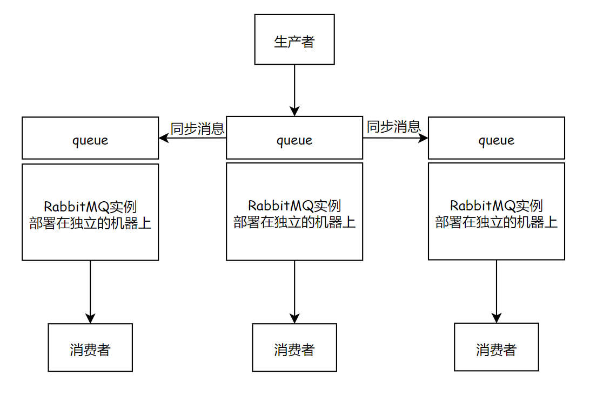

### RocketMQ：双主双从

1. 生产者通过Name Server发现Broker
2. 生产者发送队列消息到2个Broker主节点
3. Broker主节点分别和各自从节点同步数据
4. 消费者从主节点或者从节点订阅消息

数据真正存储在Broker中，Name Server记录了Broker的地址。因为生产者并不知道哪个主节点可用，所以要去Name Server询问


## 4. 如何保证消息不丢失

**消息丢失的原因：**

1. 生产者没有成功发送到MQ
2. 消息发送给MQ之后，MQ还没来得及持久化，MQ的Broker宕机，导致内存中的消息数据丢失了

3. 消费者获取到消息，但是消费者还没有来得及处理就宕机了，此时MQ的消息已经删除，消费者重启之后不能再消费之前的消息了            

**确保消息不丢失的方案**

1. 消息发送给MQ之后，MQ给生产者**确认收到**，否则生产者应重试
2. MQ收到消息之后进行消息的**持久化**
3. 消费者收到消息**处理完毕之后进行ack确认**，MQ收到ack之后才删除持久化的消息

## 5. 如何保证消息不被重复消费

**重复消息产生的原因**：

生产者发送消息，MQ应答的时候由于网络原因应答失败，生产者就会发送重复消息

消费者消费完成后，ack由于网络原因没有被MQ接收到，此时消费者就会收到两条相同的消息


**如何保证不被重复消费/保证消息的幂等性**

1. 消息发送者发送消息的时候携带一个全局唯一id
2. 消费者获取消息后先根据id在redis中查询是否存在消费记录
3. 如果没有消费过就正常消费，消费完后写入redis
4. 如果消息已经消费，就应该直接舍弃

## 6. 如何保证消息消费的顺序性

**顺序性消费**：

例如一笔订单产生了3条消息：订单创建，订单付款和订单完成，消费的时候要按照顺序依次消费才有意义

**但是多笔订单之间又是可以并行消费的**


**首先要保证消息顺序到达MQ，还要保证消息被顺序消费？** 生产者：MQ Server：消费者=1：1：1


但是这样效率太低了。。。多笔订单之间不能并行消费。。。。怎么进行并行消费呢

1. **生产者根据消息ID将同一组消息发送到一个queue中**

2. 多个消费者同时获取queue中的消息进行消费

3. **MQ使用分段锁，锁住该queue，保证单个queue中的有序消费**，当M1被消费完后，**消费者1回复ack，这时候MQ才释放该queue的锁**，这时候M2才能被消费

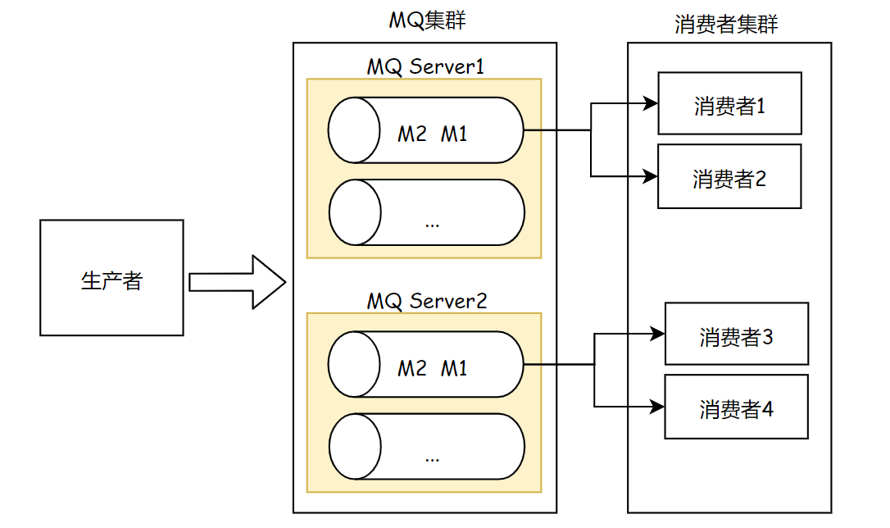

## 7. 基于MQ的分布式事务

分布式事务：用户提交订单，库存服务操作库存DB减库存，订单服务操作订单DB生成订单数据。库存服务和订单服务要么同时成功，要么同时失败。。分布式事务就是为了保证不同数据库的数据的一致性

基于MQ的分布式事务是一个异步模型，将两个服务方解耦了


## 8. 几种MQ的对比

| 特性       | ActiveMQ           | RabbitMQ                 | RocketMQ               | Kafka                                                        |
| ---------- | ------------------ | ------------------------ | ---------------------- | ------------------------------------------------------------ |
| 开发语言   | java               | erlang                   | java                   | scala                                                        |
| 单机吞吐量 | 万级               | 万级                     | **十万级**             | **十万级**                                                   |
| 时效性     | ms级               | **us级**                 | ms级                   | ms级以内                                                     |
| 可用性     | 高(主从架构)       | 高(主从架构)             | **非常高(分布式架构)** | **非常高(分布式架构)**                                       |
| 功能特性   | 文档多，协议支持好 | 并发能力强，延迟低性能好 | 功能完善，扩展性好     | 只支持主要的MQ功能，消息查询、<br>消息回溯等功能没有提供，大数据领域应用广泛 |

RabbitMQ，如果不考虑二次开发的话，追求稳定性和性能可以考虑使用

RocketMQ是java开发的，稳定性和性能都不错，还方便二次开发，推荐使用

Kafka一般在大数据领域用的多


## 9. Kafka原理

Kafka是`分布式`的基于`发布订阅`模式的`消息队列`，对消息保存时根据Topic进行归类，kafka集群有多个kafka实例，每个实例被称为一个broker

无论是kafka集群还是consumer，都依赖于`zookeeper`集群保存一些meta信息，来保证系统的可用性

### 9.1 Kafka的设计原则和使用场景

设计原则：

- `高吞吐、低延迟`：kakfa 最大的特点就是收发消息非常快，kafka 每秒可以处理几十万条消息，它的最低延迟只有几毫秒
- `高伸缩性`： 每个主题(topic) 包含多个分区(partition)，主题中的分区可以分布在不同的主机(broker)中
- `持久性、可靠性`： Kafka 能够允许数据的持久化存储，消息被持久化到磁盘，并支持数据备份防止数据丢失
- `容错性`： 允许集群中的节点失败，某个节点宕机，Kafka 集群能够正常工作
- `高并发`： 支持数千个客户端同时读写


使用场景：

- `活动跟踪`：Kafka 可以用来跟踪用户行为，比如我们经常回去淘宝购物，你打开淘宝的那一刻，你的登陆信息，登陆次数都会作为消息传输到 Kafka ，当你浏览购物的时候，你的浏览信息，你的搜索指数，你的购物爱好都会作为一个个消息传递给 Kafka ，这样就可以生成报告，可以做智能推荐，购买喜好等。
- `传递消息`：Kafka 另外一个基本用途是传递消息，应用程序向用户发送通知就是通过传递消息来实现的，这些应用组件可以生成消息，而不需要关心消息的格式，也不需要关心消息是如何发送的。
- `度量指标`：Kafka也经常用来记录运营监控数据。包括收集各种分布式应用的数据，生产各种操作的集中反馈，比如报警和报告。
- `日志记录`：Kafka 的基本概念来源于提交日志，比如我们可以把数据库的更新发送到 Kafka 上，用来记录数据库的更新时间，通过kafka以统一接口服务的方式开放给各种consumer，例如hadoop、Hbase、Solr等。
- `流式处理`：流式处理是有一个能够提供多种应用程序的领域。
- `限流削峰`：Kafka 多用于互联网领域某一时刻请求特别多的情况下，可以把请求写入Kafka 中，避免直接请求后端程序导致服务崩溃。

### 9.2 Kafka整体结构

一个典型的 Kafka 集群中包含若干Producer，若干broker（Kafka支持水平扩展，一般broker数量越多，集群吞吐率越高），若干Consumer Group，以及一个Zookeeper集群（2.8.0移除了ZooKeeper，使用`KRaft`进行自己的集群管理）。

Kafka通过Zookeeper管理集群配置，`选举leader`，以及在Consumer Group发生变化时进行`rebalance`。

Producer使用push模式将消息发布到broker，Consumer使用pull模式从broker订阅并消费消息


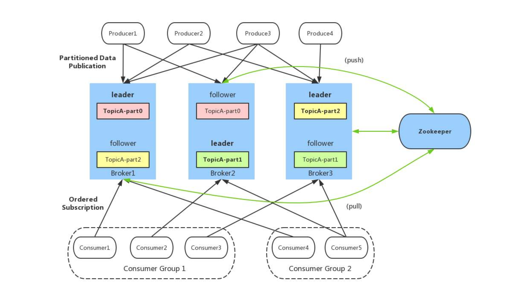

- `follower副本机制`：一个Topic的一个partition可以创建副本，放到其他的Broker里面，防止leader partition宕机，集群中节点故障时可以进行故障转移，保证高可用。**leader对外提供服务，follower只是被动跟随**
- `多个Partition`：提高并发量
- `多个Topic`：分类消息
- `消费者组`：提高消费能力
- `Offset`：每个Record发布到broker后，分配一个offset，offset在单个partition中是有序递增的
- `Record`：消息、记录，包含key, value, timestamp
- **Broker是物理概念**，指服务于Kafka的一个node
- **Topic是逻辑概念**，作为消息的分类标识
- **Partition是物理概念**，同一个topic的数据，会被分散的存储到多个partition中，这些partition可以在同一台机器上，也可以是在多台机器上。**单个partition中的数据有序，但整个topic是无法保证有序的**。每个partition都对应一个log文件，log文件存储的就是producer生产的数据，不断追加到log文件的末尾，每条数据都有自己的offset
  - 在实现上都是以每个Partition为基本实现单元的
  - 一个topic中partition的数量，就是每个user group中消费该topic的**最大并行度数量**
  - 每个Partition都有`Leader`和`Follower`，**生产者和消费者都只跟Leader交互**
  - Follower负责实时从Leader中同步数据，当Leader故障时，从Follower副本中重新选举新的Leader副本对外提供服务
- 消费者：一个消费者/消费者组按 Topic 进行消费（具体消费哪些个partition，是由rebalance决定的）
- **消费者组Consumer Group**也是逻辑概念，是Kafka实现单播和广播两种消息模型的手段。同一个topic的数据，会广播给不同的group；同一个消费者组中的消费者各自消费不同的分区（一个分区的消息，在一个组内只能由一个消费者消费，组间是重复消费的），所以只有一个worker能拿到这个数据。组中的每个消费者都会实时记录自己消费到哪个offset了，以便出错恢复时，从上次的位置继续消费
  - **重平衡 Rebalance**： 消费者组内某个消费者实例挂掉后，其他消费者实例自动重新分配订阅主题分区的过程。Rebalance 是 Kafka 消费者端实现高可用的重要手段
- **同一个Topic的同一个partition在一个消费者组内只能被一个消费者消费**。consumer group是kafka提供的可扩展且具有容错性的消费者机制。既然是一个组，那么组内必然可以有多个消费者或消费者实例(consumer instance，是一个线程或者一个进程)，它们共享一个公共的group ID。组内的所有消费者协调在一起来消费订阅主题(subscribed topics)的所有分区(partition)。当然，每个分区在一个消费者组内只能由一个consumer来消费。最好让partition的数量等于被消费的组中的消费者数量，这样正好一个partition被一个消费者消费


### 9.3 Kafka文件存储

涉及了磁盘IO，Kafka为什么依然那么快呢？

1. 消息是`顺序读写`到磁盘的，为了提高速度。。顺序磁盘IO的速度甚至快于随机内存访问
2. Kafka实现了`零拷贝`来快速移动数据，避免内核之间的切换
3. `消息压缩` Kafka生产者和消费者都会进行消息的压缩，使消息发的更快一些。最后由Consumer进行解压缩。压缩的算法是随着key、value一起发送过去的
4. `分批发送`


- 为了防止log文件过大导致数据定位效率低下，Kafka采用**分片**和**索引**机制，每个partition分为多个segment，每个segment对应两个文件：.log和.index，这些文件位于一个文件夹：topic名+分区号
- **而.log和.index文件命名以`当前segment中的第一条消息`的offset命名**：00000000000000239430.log


#### kafka不支持读写分离

读写分离的好处是让一个节点承担另一个节点的负载压力，做到一定程度的负载均衡

kafka如果实现读写分离，有两个很大的缺点：

- 数据不一致：读写分离涉及数据同步，必然会有数据不一致的问题存在
- 延时问题：如果将数据从一个节点同步到另一个节点，必然经过主节点磁盘和从节点磁盘，对一些延时性要求较高的应用来说不适用


### 9.4 Kafka生产者


#### 生产者消息发送模式

1. **发后即忘**（fire-and-forget）：它只管往 Kafka 里面发送消息，但是**不关心消息是否正确到达**，这种方式的效率最高，但是可靠性也最差，比如当发生某些不可充实异常的时候会造成消息的丢失

2. **同步**（sync）：producer.send()返回一个Future对象，调用get()方法变回进行同步等待，就知道消息是否发送成功，**发送一条消息需要等上个消息发送成功后才可以继续发送**

3. **异步**（async）：Kafka支持 producer.send() 传入一个回调函数，消息不管成功或者失败都会调用这个回调函数，这样就算是异步发送，我们也知道消息的发送情况，然后再回调函数中选择记录日志还是重试都取决于调用方


#### 消息的分区策略

分区的原因：方便在集群中扩展，可以提高并发(可以以Partition为单位读写)

`ProducerRecord对象的结构`：**Topic + Partition + Key + Value**

- 首先键值对对象由`序列化器`转化为字节数组，以便在网络上传输，然后到达分区器
- 分区器分区的原则：
  - 如果ProducerRecord指定了有效的分区号，`分区器`便分配到对应Partition
  - 否则将**key的hash值与topic的partition数进行取模**得到partition值
  - 没有partition也没有key，round-robin算法生成随机的partition值。(**第一个partition随机，后续就轮询了**)
- ProducerRecord 还有关联的时间戳，如果用户没有提供时间戳，则使用当前时间

如果使用hash值分区，在partition数量发生变化后，就很难保证key与分区之间的映射关系了


写入Broker失败后，会返回一个错误，成功后则返回Topic，Partition，Offset


### 9.5 Kafka Broker

#### 数据可靠性

**数据的可靠性**：

- Topic的**全部follower**与leader全部同步完成后，才发送ack给生产者：`延迟高`，容忍n台故障需要n+1个副本
- Topic的**半数以上follower**与leader全部同步完成后，才发送ack给生产者：`延迟低`，容忍n台故障需要2n+1个副本

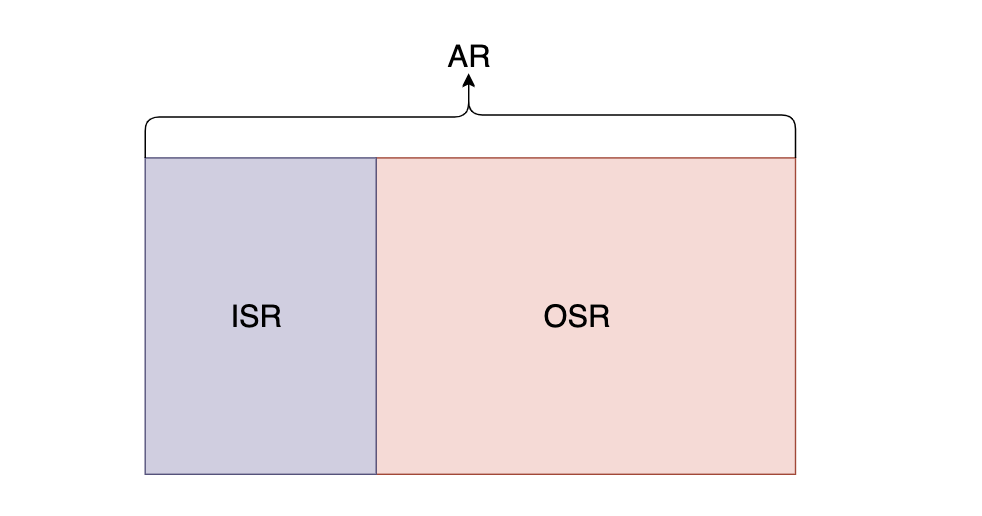

1. **Kafka采用全部follower同步才发送ack的方案，但进行了优化**，Leader维护了一个`ISR`(in-sync replica set)，即和leader保持同步的follower集合。只要ISR中的follower完成同步后，leader就给follower发送ack，**如果follower长时间**(replica.lag.time.max.ms)**未向leader同步数据**，**该follower将被踢出ISR**。Leader发生故障之后，会**从ISR中选举新Leader**
   - AR：分区中所有的Follower统称为AR
   - ISR：所有与Leader副本保持一定程度同步的Follower
   - OSR：与Leader副本同步滞后过多的Follower
   - 动态维护：当ISR中副本落后过多就放入OSR集合，当OSR中副本跟上Leader进度就放入ISR集合
2. **ack应答机制，三种级别，`acks`参数**：
   - 0：**producer不等待broker的ack**，最低延迟，最大吞吐，但是可能丢失数据，类似UDP
   - 1：**producer等待broker的ack**，**partition的leader落盘成功就返回ack**，如果follower同步之前leader故障，会丢失数据。同时消息的发送也可以选择同步或者异步，异步使用回调函数通知生产者
   - -1：**producer等待broker的ack，pritition的leader和ISR的所有follower全部落盘才返回ack**，但是follower同步完成后，broker返回ack前若leader故障，可能造成数据重复。最强可靠性
3. **生产者消息发送方式：** 9.4的发送模式，即，发完即忘，同步，异步

#### 数据一致性（可消费区间）

**数据的一致性：故障处理，如何确定当前消费者能消费到哪条数据**

- 日志文件中记录了每条消息的偏移量

- `HW(high water)`为4，表示0-3是可消费的区间，消费者只能消费这四条消息
- `LEO(log end offset)`表示即将要写入消息的偏移量 offset

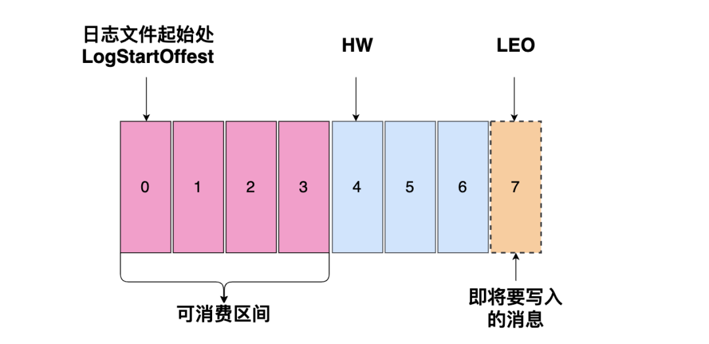

- **ISR集合**的每个副本都维护了自己的LEO，ISR集合最小的LEO即为分区的HW，如下图，所以这个Leader只能被消费0-2的数据。

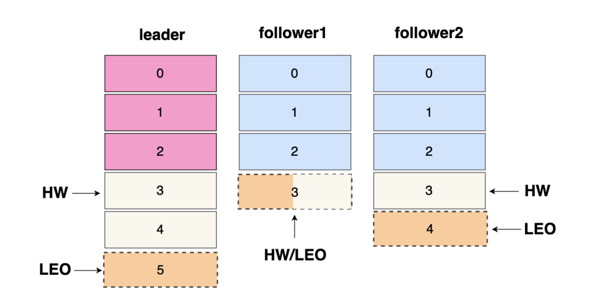

- **消费一致性：HW之前的数据才对Consumer可见**
- **存储一致性**：出现故障，重新选举Leader，会保证其他follower与HW一致，然后**同步新leader中HW到其LEO的数据**


#### 负载均衡策略


**每个 broker 都有消费者拉取消息，每个 broker 也都有生产者发送消息，每个 broker 上的读写负载都是一样的**，这也说明了 kafka 独特的架构方式可以通过主写主读来实现负载均衡。

kafka的负载均衡在绝对理想的状况下可以实现，但是某些情况会出现一定程度上的负载不均衡：

- **broker端分配不均**：可能某些broker分配到的分区多，有些分配的分区少，造成leader多副本不均
- **生产者写入消息不均**：生产者可能只对某些broker中的leader副本进行大量写入，而对其他leader副本不闻不问
- **消费者消费不均**：消费者可能只对某些broker的leader副本进行大量的拉取操作，而对其他leader副本不闻不问
- **leader副本切换不均**：当从主副本切换到分区副本进行了重分配后，可能导致各个broker副本分配不均匀


#### 分区再分配

分区再分配主要是用来维护kafka集群的负载均衡


**当集群中的一个节点下线了**：如果这个节点是单副本，这个分区将不可用。如果这个节点是多副本，就会进行leader选举，在其他机器的follower上选出这个分区的新leader

**kafka并不会将这些失效的分区迁移到其他可用的broker上**，这样就会影响集群的负载均衡，甚至影响服务的可靠性和可用性

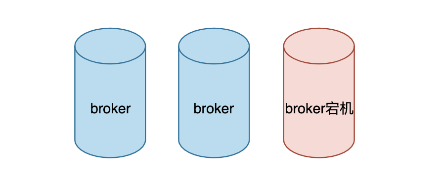


**当集群新增broker**：只有新的主题分区会分配在该broker上，而老的主题分区不会分配在该broker上，就造成了老节点和新节点之间的负载不均衡


为了解决上述问题，就出现了分区再分配，它可以**在集群扩缩容的时候进行分区迁移**

分区再分配的原理就是通过控制器给分区新增新的副本，然后通过网络把旧的副本数据复制到新的副本上，复制完成后删除旧的副本


#### 分区越多越好吗


**1.分区越多，客户端/服务器端需要使用的内存就越多**

- 服务端在很多组件中都维护了分区级别的缓存，分区数越大，**缓存成本**也就越大。
- 消费端的消费线程数是和分区数挂钩的，分区数越大消费线程数也就越多，**线程的开销成本**也就越大
- 生产者发送消息有缓存的概念，会为每个分区缓存消息，当积累到一定程度或者时间时会将消息发送到分区，**分区越多，这部分的缓存**也就越大

**2.文件句柄的开销**

**每个 partition 都会对应磁盘文件系统的一个目录**。在 Kafka 的数据日志文件目录中，每个日志数据段都会分配两个文件，一个索引文件和一个数据文件。**每个 broker 会为每个日志段文件打开一个 index 文件句柄和一个数据文件句柄**。因此，随着 partition 的增多，所需要保持打开状态的文件句柄数也就越多，最终可能超过底层操作系统配置的文件句柄数量限制。

**3.越多的分区可能增加端对端的延迟**

Kafka 会将分区 HW 之前的消息暴露给消费者。**分区越多则副本之间的同步数量就越多**，在默认情况下，每个 broker 从其他 broker 节点进行数据副本复制时，该 broker 节点只会为此工作分配一个线程，该线程需要完成该 broker 所有 partition 数据的复制。

**4.降低高可用性**

分区再分配会将数据复制到另一份副本当中，**分区数量越多，那么恢复时间也就越长**，而如果发生宕机的 broker 恰好是 controller 节点时：在这种情况下，新 leader 节点的选举过程在 controller 节点恢复到新的 broker 之前不会启动。controller 节点的错误恢复将会自动地进行，但是新的 controller 节点需要从 zookeeper 中读取每一个 partition 的元数据信息用于初始化数据。例如，假设一个Kafka 集群存在 10000个partition，从 zookeeper 中恢复元数据时每个 partition 大约花费 2 ms，则 controller 的恢复将会增加约 20 秒的不可用时间窗口。


#### kafka快的秘诀

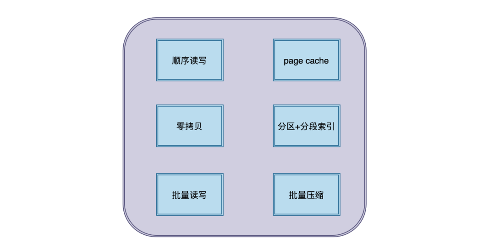

- **1.顺序读写**

  磁盘分为顺序读写与随机读写，基于磁盘的随机读写确实很慢，但磁盘的顺序读写性能却很高，kafka 这里采用的就是顺序读写。

- **2.Page Cache**

  为了优化读写性能，Kafka 利用了操作**系统本身的 Page Cache**，就是利用操作系统自身的内存而不是JVM空间内存。

- **3.零拷贝**

  Kafka使用了零拷贝技术，也就是**直接将数据从内核空间的读缓冲区直接拷贝到内核空间的 socket 缓冲区**，然后再写入到 NIC 缓冲区，避免了在内核空间和用户空间之间穿梭。

- **4.分区分段+索引**

  Kafka 的 message 是按 topic分 类存储的，topic 中的数据又是按照一个一个的 partition 即分区存储到不同 broker 节点。每个 partition 对应了操作系统上的一个文件夹，partition 实际上又是按照segment分段存储的。

  通过这种分区分段的设计，Kafka 的 message 消息实际上是分布式存储在一个一个小的 segment 中的，每次文件操作也是直接操作的 segment。为了进一步的查询优化，Kafka 又默认为分段后的数据文件建立了索引文件，就是文件系统上的.index文件。这种分区分段+索引的设计，不仅提升了数据读取的效率，同时也提高了数据操作的并行度。

- **5.批量读写**

  Kafka **数据读写也是批量的而不是单条的**,这样可以避免在网络上频繁传输单个消息带来的延迟和带宽开销。假设网络带宽为10MB/S，一次性传输10MB的消息比传输1KB的消息10000万次显然要快得多。

- **6.批量压缩**

  Kafka 把所有的消息都变成一个**批量的文件**，并且进行合理的**批量压缩**，减少网络 IO 损耗，通过 mmap 提高 I/O 速度，写入数据的时候由于单个Partion是末尾添加所以速度最优；读取数据的时候配合 sendfile 进行直接读取。


### 9.6 Kafka消费者

#### 消费者的消费方式

一般消息消费有两种模式：**队列主动推** 和 **消费者主动拉**， kafka属于是拉模式

拉模式又对应了两种：点对点和发布订阅

**拉模式的两种消费方式：**

1. `点对点模式`：一个主题中的消息只能被一个消费者组消费，点对点的消费方式又被称为`消息队列`
2. `发布-订阅模式`：一个主题中的消息可以被多个消费者组共同消费


#### 消费者重平衡

当生产者生产速度超过了消费者的消费速度，就需要多个消费者共同参与该主题的消费(消费者组)


如果生产者产生的消息依然很多，让消费者吃不消，就继续增加消费者


此时如果再向消费者组中增加消费者已经不起作用了，因为一个分区只能被消费者组中的一个消费者消费(**消费者组中的消费者数量应该≤该主题的分区数**)。所以**创建主题的时候要考虑使用比较多的分区数**，这样可以再消费负载高的情况下增加消费者来提高性能


**消息只需一次写入，就可支持任意多的应用读取这个消息**，也就是说，**每个应用都可以读取到全量的消息**。

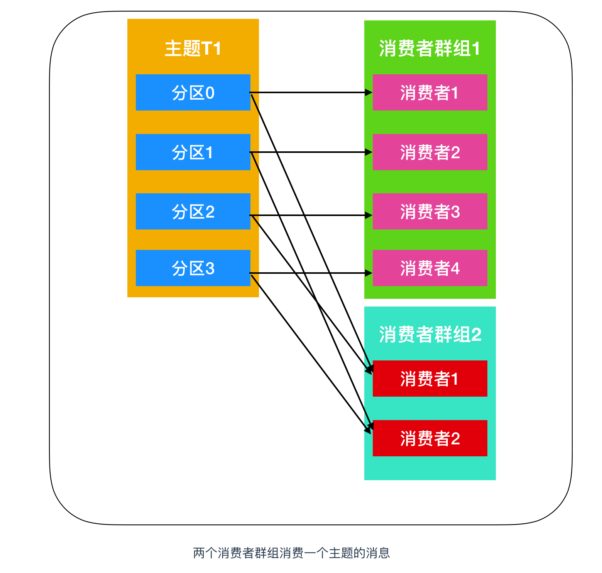


**消费者重平衡(rebalance)**: 最初是一个消费者订阅一个主题并消费其全部分区的消息，后来有一个消费者加入群组，随后又有更多的消费者加入群组，而新加入的消费者实例`分摊`了最初消费者的部分消息，这种把分区的所有权通过一个消费者转到其他消费者的行为称为`重平衡`

重平衡为消费者群组带来了`高可用性` 和 `伸缩性`，使得我们可以放心的添加和移除消费者

消费者通过向`组织协调者`（Kafka Broker）发送心跳来维护自己是消费者组的一员并确认其拥有的分区。只要消费者定期发送心跳，就会认为消费者是存活的并处理其分区中的消息。当消费者检索记录或者提交它所消费的记录时就会发送心跳。如果过了一段时间未收到心跳，会话（Session）就会过期，组织协调者就会认为这个 Consumer 已经死亡，就会触发一次`重平衡`。

重平衡的过程对消费者组有极大的影响。因为每次重平衡过程中都会导致万物静止(STW)


#### 消费过程

**poll()轮询**

`max.partition.fetch.bytes`参数：该属性指定了服务器从每个分区里返回给消费者的`最大字节数`。它的默认值时 1MB，也就是说，`KafkaConsumer.poll()` 方法从每个分区里返回的记录最多不超过 max.partition.fetch.bytes 指定的字节。在为消费者分配内存时，可以给它们多分配一些，因为如果群组里有消费者发生崩溃，剩下的消费者需要处理更多的分区。max.partition.fetch.bytes 的值必须比 broker 能够接收的最大消息的字节数(通过 max.message.size 属性配置)大，**否则消费者可能无法读取这些消息，导致消费者一直挂起重试**。 在设置该属性时，另外一个考量的因素是消费者处理数据的时间。消费者需要频繁的调用 poll() 方法来避免会话过期和发生分区再平衡，如果单次调用poll() 返回的数据太多，消费者需要更多的时间进行处理，可能无法及时进行下一个轮询来避免会话过期。如果出现这种情况，可以把 max.partition.fetch.bytes 值改小，或者延长会话过期时间


**偏移量**

消费者在每次调用`poll()` 方法进行定时轮询的时候，会向一个叫做 `_consumer_offset` 的特殊主题中发送消息，这个主题会保存每次所发送消息中的分区偏移量，这个主题的主要作用就是消费者触发重平衡后记录偏移使用的。正常情况下不触发重平衡，这个主题是不起作用的，当触发重平衡后，消费者停止工作，每个消费者可能会分到对应的分区，这个主题就是让消费者能够继续处理消息所设置的

1. 如果提交的偏移量小于客户端最后一次处理的偏移量，那么位于两个偏移量之间的消息就会被重复处理


2. 如果提交的偏移量大于最后一次消费时的偏移量，那么处于两个偏移量中间的消息将会丢失

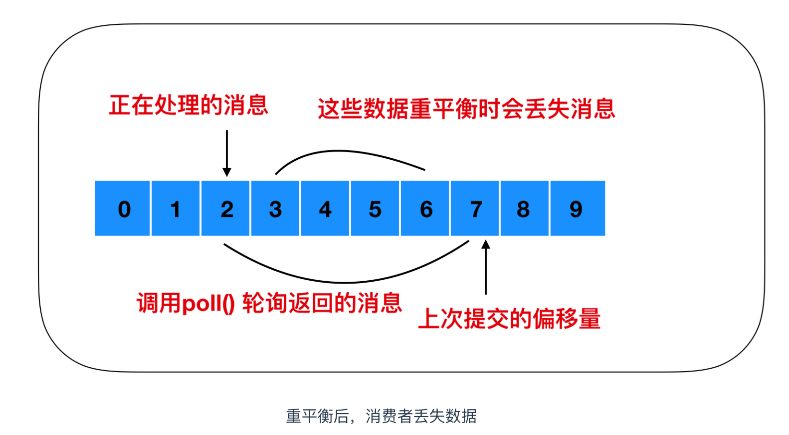


**偏移量的提交方式：**

1. 自动提交：`enable.auto.commit`，每过 5s，消费者会自动把从 poll() 方法轮询到的最大偏移量提交上去，消费者里的其他东西一样，自动提交也是在轮询中进行的。消费者在每次轮询中会检查是否提交该偏移量了，如果是，那么就会提交从上一次轮询中返回的偏移量
2. 提交当前偏移量：使用 `commitSync()` 提交偏移量，由`poll()`返回最新偏移量。
3. 异步提交：异步提交 `commitAsync()` 与同步提交 `commitSync()` 最大的区别在于异步提交不会进行重试，同步提交会一致进行重试
4. **同步和异步组合提交：** 一般情况下，针对偶尔出现的提交失败，不进行重试不会有太大的问题，因为如果提交失败是因为临时问题导致的，那么后续的提交总会有成功的。但是如果在关闭消费者或再均衡前的最后一次提交，就要确保提交成功


### 9.7 消息丢失问题

Kafka 有三次消息传递的过程：生产者发消息给 Broker，Broker 同步消息和持久化消息，Broker 将消息传递给消费者。这其中每一步都有可能丢失消息。

- 生产者发送数据: `ack`机制

- - 当 acks 为 0，**只要服务端写消息时出现任何问题，都会导致消息丢失**。
  - 当 acks 配置为 1 时，生产者发送消息，只要 leader 副本成功写入消息，就代表成功。这种方案的问题在于，当返回成功后，**如果 leader 副本和 follower 副本还没有来得及同步，leader 就崩溃了，那么在选举后新的 leader 就没有这条消息，也就丢失了**。
  - ack为-1，必须要ISR全部写入成功才返回ack

- Broker 存储数据:kafka 通过 Page Cache 将数据写入磁盘。

- - Page Cache 就是当往磁盘文件写入的时候，系统会先将数据流写入缓存中，但是**什么时候将缓存的数据写入文件中是由操作系统自行决定**。所以**如果此时机器突然挂了，也是会丢失消息的**。

- 消费者消费数据:在开启**自动提交 offset** 时，只要消费者消费到消息，那么就会自动提交偏移量，**如果业务还没有来得及处理，那么消息就会丢失**。


# ZooKeeper

**ZooKeeper是一个分布式协调组件**，相当于一个解决分布式一致性问题的分布式数据库，拥有文件系统特点，具有发布订阅功能。

可以用ZooKeeper来做：注册中心、配置中心、统一命名服务、分布式锁、集群管理

核心机制：

- Leader选举算法
- 2PC两阶段提交
- 过半机制
- 同步机制

ZK和客户端之间以socket形式进行双向通讯，并且支持事件watch机制

ZK满足了CAP理论的CP，牺牲了高可用的A，存储能力有限

ZK服务器节点越多，读性能越好，但写性能越差，**ZK服务器节点不宜过多，因为每个节点和其他节点之间要进行p2p的连接。**


## 1. ZooKeeper特点和应用

**特点**

- **顺序一致性：** 从同一客户端发起的事务请求，最终将会严格地按照顺序被应用到 ZooKeeper 中去。
- **原子性：** 所有事务请求的处理结果在整个集群中所有机器上的应用情况是一致的，也就是说，要么整个集群中所有的机器都成功应用了某一个事务，要么都没有应用。
- **单一系统映像 ：** 无论客户端连到哪一个 ZooKeeper 服务器上，其看到的服务端数据模型都是一致的。
- **可靠性：** 一旦一次更改请求被应用，更改的结果就会被持久化，直到被下一次更改覆盖。


**应用场景：**

1. **分布式锁** ： 通过创建唯一节点获得分布式锁，当获得锁的一方执行完相关代码或者是挂掉之后就释放锁。
2. **命名服务** ：可以通过 ZooKeeper 的顺序节点生成全局唯一 ID
3. **数据发布/订阅** ：通过 **Watcher 机制** 可以很方便地实现数据发布/订阅。当你将数据发布到 ZooKeeper 被监听的节点上，其他机器可通过监听 ZooKeeper 上节点的变化来实现配置的动态更新。


**几个著名的开源项目中都用到了ZooKeeper：**

1. **Kafka** : ZooKeeper 主要为 Kafka 提供 Broker 和 Topic 的**注册**以及多个 Partition 的负载均衡等功能。
2. **Dubbo**：ZooKeeper 可以作为Dubbo的注册中心
3. **Hbase** : ZooKeeper 为 Hbase 提供确保整个集群只有一个 Master 以及保存和提供 regionserver 状态信息（是否在线）等功能。
4. **Hadoop** : ZooKeeper 为 Namenode 提供高可用支持。


## 2. 数据结构和基本操作

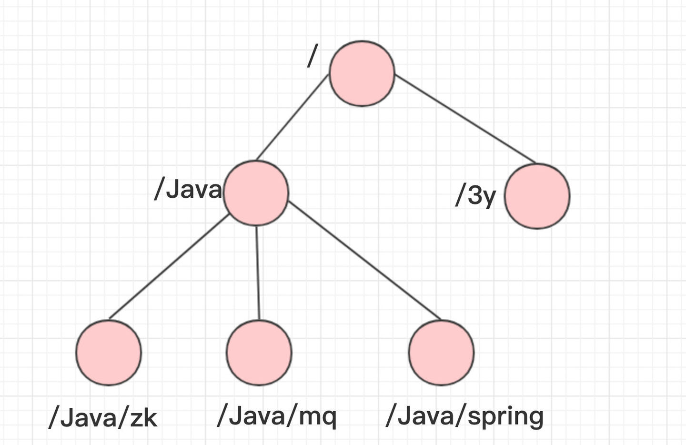

ZooKeeper的数据结构，跟Unix文件系统非常类似，可以看做是一颗**树**，每个节点叫做**Znode**。每一个节点可以通过**路径**来标识


ZooKeeper的数据类型：数字、字符串、二进制序列


Znode节点类型：

- **持久（PERSISTENT）节点** ：一旦创建就一直存在即使 ZooKeeper 集群宕机（会持久化），直到将其删除。
- **临时（EPHEMERAL）节点** ：临时节点的生命周期是与 **客户端会话（session）** 绑定的，**会话消失则节点消失** 。并且，临时节点 **只能做叶子节点** ，不能创建子节点。
- **持久顺序（PERSISTENT_SEQUENTIAL）节点** ：除了具有持久（PERSISTENT）节点的特性之外， 子节点的名称还具有顺序性。比如 `/node1/app0000000001` 、`/node1/app0000000002` （ZK会在路径后面自动添加10位数字）。
- **临时顺序（EPHEMERAL_SEQUENTIAL）节点** ：除了具备临时（EPHEMERAL）节点的特性之外，子节点的名称还具有顺序性。


基本操作：

```
create /Java/zk 123   //创建节点名为/Java/zk , value为 数字 123
set  /Java/zk "aaa"   //更新节点数据内容， value为 字符串 "aaa"
get /Java/zk          //获取节点内容
delete /Java/zk		  //删除节点，删除一个节点的条件是该节点必须没有子节点

ls /Java			  //查看该目录下的节点
stat  /Java			  //查看节点状态
ls2  /Java			  //查看节点的子节点列表和节点状态，相当于 ls + stat
```


Znode包含了**存储数据(data)**、**访问权限(acl)**、**子节点引用(child)**、**节点状态信息(stat)**

- **data**: znode存储的业务数据信息
- **acl**: 记录客户端对znode节点的访问权限，如IP等。
- **child**: 当前节点的子节点引用
- **stat**: 包含Znode节点的状态信息，比如事务id、版本号、时间戳等等。

## 3. Watcher监听机制

Watcher（事件监听器），是 ZooKeeper 中的一个很重要的特性。ZooKeeper 允许用户在指定节点上注册一些 Watcher，并且在一些特定事件触发的时候，ZooKeeper 服务端会将事件通知到感兴趣的客户端上去，该机制是 ZooKeeper 实现分布式协调服务的重要特性


- 监听Znode节点的**数据变化**
- 监听子节点的**增减变化**

ZK的事件有传递机制，**子节点的增删改触发的事件会向上层依次传播**，所有的父节点都可以收到子节点的数据变更事件，所以层次太深/子节点太多会给服务器的事件系统带来压力


**监听机制的四个特性：**

- **一次性**： 一旦一个watcher触发后，zookeeper就会将它从存储中移除，如果还要继续监听这个节点，就需要在客户端的监听回调中再次对节点的加你太能干watch事件设置位true，否则客户端只能收到一次该节点的变更通知
- **客户端串行**： 客户端的watcher回调处理是串行同步的过程，不要因为一个watcher的逻辑阻塞整个客户端
- **轻量**： watcher通知的单位是WatchedEvent，只包含通知状态、事件类型和节点路径，不包含具体的事件内容，具体的事件内容需要客户端主动去重新获取数据
- **异步**： 服务器发送watcher的事件通知到客户端是异步的，不能期望能够监控到节点每次的变化，只能保证最终一致性，不能保证强一致性


Java通过Watcher实现的，可以在节点变化后**自定义回调操作**

Go是通过Event实现的，道理都是一样的

 ```go
 func main() {
 	// 连接zk
 	conn, _, err := zk.Connect(hosts, time.Second*5)
 	defer conn.Close()
 	if err != nil {
 		fmt.Println(err)
 		return
 	}
 
 	// 开始监听path
 	_, _, event, err := conn.ExistsW(path)
 	if err != nil {
 		fmt.Println(err)
 		return
 	}
 
 	// 协程调用监听事件
 	go watchZkEvent(event)
 
 	// 触发创建数据操作
 	create(conn, path, data)
 
 }
 
 // zk 回调函数
 func watchZkEvent(e <-chan zk.Event) {
 	event := <-e
 	fmt.Println("###########################")
 	fmt.Println("path: ", event.Path)
 	fmt.Println("type: ", event.Type.String())
 	fmt.Println("state: ", event.State.String())
 	fmt.Println("---------------------------")
 }
 
 // 创建数据
 func create(conn *zk.Conn, path string, data []byte) {
 	_, err := conn.Create(path, data, flags, acls)
 	if err != nil {
 		fmt.Printf("创建数据失败: %v\n", err)
 		return
 	}
 	fmt.Println("创建数据成功")
 }
 ```


## 4. 简化2PC机制

Zab协议简化了2PC，不需要所有的Follower都响应成功，只要过半即可


- WAL：先写日志，确保可以收到过半的ACK后才进行提交
- 第一阶段提交：收到过半的ACK(加上Leader自己的ACK)，本地内存提交
- 第二阶段提交：异步将commit命令发送到一个队列(异步，只保证**最终一致性**)，发送之后便响应客户端成功。Follower异步地消费队列，更新内存


## 5. 实现分布式锁

锁服务可以分为两类：

1. 保持独占锁：所有试图来获取这个锁的客户端，**最终只有一个可以成功获得这把锁**。通常的做法是把zk上的一个znode看做是一把锁，通过`create znode`的方式来实现。所有客户端都去创建`/distribute_lock`节点，最终**成功创建的那个客户端也即拥有了这把锁**
2. 控制时序锁：所有试图来获取这个锁的客户端，最终都是会被安排执行，只是有个全局时序了。与保持独占锁的做法类似，不同点是`/distribute_lock`已经预先存在，客户端在它下面创建临时有序节点（可以通过节点控制属性控制：`CreateMode.EPHEMERAL_SEQUENTIAL`来指定）。zk的父节点(/distribute_lock)维持一份sequence，保证子节点创建的时序性，从而形成每个客户端的全局时序


系统A、B、C都去访问`/locks`节点

访问的时候会**创建带顺序号的临时/短暂**(`EPHEMERAL_SEQUENTIAL`)节点，比如，系统A创建了`id_000000`节点，系统B创建了`id_000002`节点，系统C创建了`id_000001`节点


接着，拿到`/locks`节点下的所有子节点(id_000000,id_000001,id_000002)，**判断自己创建的是不是最小的那个节点**

- 如果是，则拿到锁。

- - 释放锁：执行完操作后，把创建的节点给删掉

- 如果不是，则**监听**比自己要小1的节点变化

当比自己小1的节点释放锁后(节点删除)，自己就成为了最小的节点，于是顺利拿到锁


## 6. ZooKeeper集群

为了保证高可用，最好是以集群形态来部署 ZooKeeper，这样只要集群中大部分机器是可用的（能够容忍一定的机器故障），那么 ZooKeeper 本身仍然是可用的

ZooKeeper 分为**服务器端**（Server） 和**客户端**（Client），客户端可以连接到整个 ZooKeeper 服务的任意服务器上，客户端使用并维护一个 **TCP 连接**，通过这个连接发送请求、接受响应、获取观察的事件以及发送信息。

在 ZooKeeper 的服务节点中没有选择传统的 Master/Slave 概念，而是引入了 Leader、Follower 和 Observer 三种角色。如下图所示

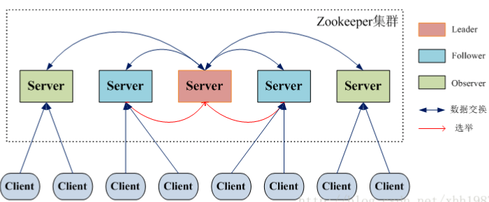

ZooKeeper 集群中的所有机器通过一个 **Leader 选举过程** 来选定一台称为 “**Leader**” 的机器，`Leader 既可以为客户端提供写服务又能提供读服务`。除了 Leader 外，**Follower** 和 **Observer** 都`只能提供读服务`。

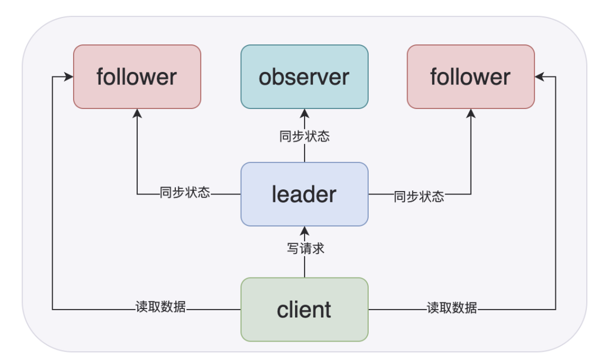

Follower 和 Observer 唯一的区别在于 Observer 机器不参与 Leader 的选举过程，也不参与写操作的“过半写成功”策略，因此 Observer 机器可以在不影响写性能的情况下提升集群的读性能。

| 角色     | 说明                                                         |
| -------- | ------------------------------------------------------------ |
| Leader   | 为客户端提供读和写的服务，负责投票的发起和决议，更新系统状态。 |
| Follower | 为客户端提供读服务，如果是写服务则转发给 Leader。在选举过程中参与投票。 |
| Observer | 为客户端提供读服务器，如果是写服务则转发给 Leader。不参与选举过程中的投票，也不参与“过半写成功”策略，只同步Leader的状态。在不影响写性能的情况下提升集群的读性能。此角色于 ZooKeeper3.3 系列新增的角色。 |

增加Observer状态的节点主要是为了避免太多的从节点参与过半写的过程，导致影响写性能，这样ZooKeeper只需要使用几台机器的小集群就可以实现高性能了，如果要横向扩展的话，只需要增加Observer节点即可


当 Leader 服务器出现网络中断、崩溃退出与重启等异常情况时，就会进入 Leader 选举过程，这个过程会选举产生新的 Leader 服务器。

这个过程大致是这样的：

1. **Leader election（选举阶段）**：节点在一开始都处于选举阶段，只要有一个节点得到超半数节点的票数，它就可以当选准 leader。
2. **Discovery（发现阶段）** ：在这个阶段，followers 跟准 leader 进行通信，同步 followers 最近接收的事务提议。
3. **Synchronization（同步阶段）** :同步阶段主要是利用 leader 前一阶段获得的最新提议历史，同步集群中所有的副本。同步完成之后 准 leader 才会成为真正的 leader。
4. **Broadcast（广播阶段）** :到了这个阶段，ZooKeeper 集群才能正式对外提供事务服务，并且 leader 可以进行消息广播。同时如果有新的节点加入，还需要对新节点进行同步。


## 7. Zab协议详解

Zab协议 的全称是 Zookeeper Atomic Broadcast （Zookeeper原子广播）。Zookeeper 是通过 Zab 协议来保证分布式事务的最终一致性

https://houbb.github.io/2018/10/30/zab


**ZAB协议核心：**

Zab 协议需要确保那些**已经在 Leader 服务器上提交（Commit）的事务最终被所有的服务器提交**

Zab 协议需要确保**丢弃那些只在 Leader 上被提出而没有被提交的事务**


针对这个要求,如果让leader选举算法能够保证新选举出来的Leader服务器拥有集群中所有机器**最高的ZXID事务proposal**，就可以保证这个新选举出来的Leader一定具有所有已经提交的提案，也可以省去Leader服务器检查proposal的提交与丢弃的工作


### 7.1 数据一致性

ZooKeeper从以下几点保证了数据的一致性


#### 顺序一致性

来自任意特定客户端的更新都会按其发送顺序被提交。

也就是说，如果一个客户端将Znode z的值更新为a，在之后的操作中，它又将z的值更新为b，则没有客户端能够在看到z的值是b之后再看到值a（如果没有其他对z的更新）。


如何保证的？

Leader收到请求后，会将每个请求分配一个全局唯一的递增的事务ID：ZXID，然后把请求放入到一个FIFO队列，之后按照FIFO策略发送给所有的Follower，所以保证了顺序一致性


#### 原子性

每个更新要么成功，要么失败。这意味着如果一个更新失败，则不会有客户端会看到这个更新的结果。


#### 单一系统映像

一个客户端无论连接到哪一台服务器，它看到的都是同样的系统视图。

这意味着，如果一个客户端在同一个会话中连接到一台新的服务器，它所看到的系统状态不会比在之前服务器上所看到的更老。

**当一台服务器出现故障，导致它的一个客户端需要尝试连接集合体中其他的服务器时，所有滞后于故障服务器的服务器都不会接受该连接请求，除非这些服务器赶上故障服务器**。


#### 持久性

一个更新一旦成功，其结果就会持久存在并且不会被撤销。

这表明更新不会受到服务器故障的影响。


### 7.2 两种模式

Zab 协议包括两种基本的模式：崩溃恢复 和 消息广播


**模式转换：**当整个集群启动过程中，或者当 Leader 服务器出现网络中断、崩溃退出或重启等异常时，Zab协议就会 进入**崩溃恢复模式**，选举产生新的Leader。 当选举产生了新的 Leader，同时集群中有过半的机器与该 Leader 服务器完成了状态同步（即数据同步）之后，Zab协议就会退出崩溃恢复模式，进入**消息广播模式**，剩下未同步完成的机器会继续同步，**直到同步完成并加入集群后该节点的服务才可用**。 之后，如果有一台遵守Zab协议的服务器以`LOOKING`态加入集群，因为此时集群中已经存在一个`LEADING`态的Leader服务器在广播消息，那么该新加入的服务器自动进入**恢复模式**：找到Leader服务器，并且完成数据同步。同步完成后，转变为`FOLLOWING`态并作为新的Follower一起参与到消息广播流程中

**消息有序：**在整个消息广播中，Leader会将每一个事务请求转换成对应的 proposal 来进行广播，并且在广播事务 Proposal 之前，Leader服务器会首先为这个事务Proposal分配一个全局单递增的唯一ID，称之为事务ID（即zxid），由于Zab协议需要保证每一个消息的严格的顺序关系，因此**必须将每一个proposal按照其zxid的先后顺序进行排序和处理**


**ZAB协议三个阶段：**

1）选举（Fast Leader Election）

2）恢复（Recovery Phase）

3）广播（Broadcast Phase）

前两个都算是崩溃恢复阶段

### 7.3 领导者选举

领导者选举的触发机制：`集群启动时`、`Leader挂掉时`、`Follower挂掉超过一半时`

领导者选举期间，集群是不能对外提供服务的


术语说明：

`ZXID`：高32位是epoch，表示Leader的周期，单增；低32位是Leader产生的propose编号，在一个epoch内单调递增，epoch变更后从0开始

`SID`：服务器ID，用来唯一标识一台ZooKeeper集群中的服务器，每台机器都不能重复，和myid一致

`vote_sid`：接收到的投票信息中所推举的Leader服务器的SID

`vote_zxid`：接收到的投票信息中所推举的Leader服务器的ZXID

`self_sid`：当前服务器自己的SID

`self_zxid`：当前服务器自己的ZXID

`electionEpoch`：当前服务器的选举轮次


**选举状态：**

- LOOKING，竞选状态。
- FOLLOWING，随从状态，同步leader状态，参与投票。
- OBSERVING，观察状态,同步leader状态，不参与投票。
- LEADING，领导者状态。


**选举过程：**

- 每个zk节点收到客户端请求时，首先就会**生成并持久化一条日志和`zxid`(自增)**，然后发送日志给其他服务器，收到半数以上ack后，再去**更新数据(内存)**，返回成功。所以zxid越大的zk节点的数据就越新。（由于一致性保证，大多数情况下zxid都是一样的）
- 每个发起投票的服务器需要将别人的投票`(vote_sid, vote_zxid)`和自己的信息`(self_sid, self_zxid)`进行比较，处理投票规则如下：
  - 先比较ZXID，ZXID比较大的节点优先作为自己投票的Leader
    - 如果收到的`vote_zxid > self_zxid`，就认可收到的投票，改投
    - 如果收到的`vote_zxid < self_zxid`，就坚持自己的投票，不做变更
  - 如果ZXID相同，则比较sid，sid大的节点作为Leader
    - 如果收到的`vote_sid > self_sid`，就认可收到的投票，改投
    - 如果收到的`vote_sid < self_sid`，就坚持自己的投票，不做变更
- 投票统计：如果有一个节点得到了过半的票数，那么得到过半票数的机器就作为Leader，终止投票，否则重新进入下一轮选举


每个zk节点都有一个自己的投票箱，记录自己收到的和发出的投票信息，一开始都是投给自己`{vote_sid, vote_zxid}={self_sid, self_zxid}`。之后每个节点都会把自己的投票信息发送出去

例如下图：一开始都是投给自己，然后zk1将自己的投票发给zk2，zk2首先比较zxid相同，然后发现投出者zk1的sid小于自己，于是不更新。而zk1收到zk2的投票信息后，发现投出者sid更大，于是跟投{2,100}

**只要Leader节点不挂掉，是不会产生新的Leader的，即使新来的节点的zxid更大或者myid更大**

如果有新来的zxid=101，虽然zxid更大，但是这些更大的zxid只有日志，没有进行两阶段的提交(否则过半节点都有101的zxid)，这些更大的请求是无效的

所以zk3虽然发出了{3,101}选票，但是会收到zk1: {2,100}, zk2: {2,100}两条信息，所以直接取同步zk2


如果Leader挂了：

1. 剩下的非Observer服务器都把自己的状态改变`LOOKING`，然后进入领导者选举
2. 每个`LOOKING`态的server都会广播一个投票（SID，ZXID），同时接收来自其他服务器的投票
3. 各自处理投票信息
4. 统计投票信息
5. 当发现有服务器获得了超过一半的选票，则改变服务器的状态


### 7.4 恢复阶段

这一阶段 Follower 发送他们的 `lastZxid` 给 Leader，Leader 根据 lastZxid 决定如何同步数据。

Follower 收到 TRUNC 指令会终止 `Leader.lastCommitedZxid` 之后的 Proposal ，收到 DIFF 指令会接收新的 Proposal。


### 7.5 广播模式：数据同步

在zookeeper集群中，数据副本的传递策略就是采用消息广播模式。

zookeeper中数据副本的同步方式与二段提交相似，但是却又不同。

二段提交要求协调者必须等到所有的参与者全部反馈ACK确认消息后，再发送commit消息。要求所有的参与者要么全部成功，要么全部失败。二段提交会产生严重的阻塞问题

Zab协议中 Leader 等待 Follower 的ACK反馈消息是指“只要半数以上的Follower成功反馈即可，不需要收到全部Follower反馈”


Leader会为每个请求生成一个ZXID，然后放入一个队列中依次执行，我们把这个队列中最大的ZXID称为`maxZXID`，最小的ZXID称为`minZXID`，将Observer和Follower中最新的ZXID称为`lastSyncZXID`


**差异化同步**

> 触发条件：`minZXID < lastSyncZXID < maxZXID`

1. leader向observer和follower发送`DIFF`指令，开始差异化同步
2. 将差异数据的提议proposal发送给observer和follower，observer和follower返回ACK表示同步完成
3. 只要集群中过半的observer和follower都响应了ACK，就发送`UPTODATE`命令进行提交
4. leader返回ACK，同步流程结束


**回滚同步**

> 触发条件：`maxZXID < lastSyncZXID` 

1. 直接将observer和follower回滚到maxZXID处


**回滚同步+差异化同步**

> 触发条件：Leader生成一个proposal，还没来得及发出去，宕机了，重新选举之后作为Follower，但是新的Leader没有这个给proposal数据

1. observer和follower将数据回滚
2. 进行差异化同步


**全量同步**

> 触发条件：`lastSyncZXID < minZXID`，Leader服务器上没有缓存队列

1. leader向follower和observer发送`SNAP`命令，进行全量数据的同步


## 8. 数据不一致问题

**查询不一致**

因为Zookeeper是过半成功即代表成功，假设我们有5个节点，如果123节点写入成功，如果这时候请求访问到4或者5节点，那么有可能读取不到数据，因为可能数据还没有同步到4、5节点中，也可以认为这算是数据不一致的问题。

解决方案可以`在读取前使用sync命令`。


**leader未发送proposal宕机**

这也就是数据同步说过的问题。

leader刚生成一个proposal，还没有来得及发送出去，此时leader宕机，重新选举之后作为follower，但是新的leader没有这个proposal。

这种场景下的日志将会被丢弃。


**leader发送proposal成功，发送commit前宕机**

如果发送proposal成功了，但是在将要发送commit命令前宕机了，如果重新进行选举，还是会选择zxid最大的节点作为leader，因此，这个日志并不会被丢弃，会在选举出leader之后重新同步到其他节点当中。


## 9. ZooKeeper和etcd

**ZooKeeper的缺点：**

- zookeeper 是 java 写的，那么自然就会继承 java 的缺点，例如 GC 暂停。
- 如果开启了**快照**，数据会写入磁盘，此时 zookeeper 的读写操作会有一个暂时的停顿。
- 对于每个 watch 请求，zookeeper 都会打开一个新的 socket 连接，这样 zookeeper 就需要实时管理很多 socket 连接，比较复杂。


**etcd的特点**

- etcd是用go开发的，使用raft实现数据的一致性
- etcd没有使用zookeeper的树形结构，而是提供了一个分布式的k-v存储
- etcd可以顺序一致，也可以做到线性一致性
- 支持增量快照，避免了zookeeper的快照暂停问题
- 堆外存储，没有gc的stw问题
- 无需像zk一样为每个watch都做一个socket连接，可以复用
- zk每个watch只能收到一次事件通知，etcd可以持续监控，一次watch触发后无需再次设置一次watch


**etcd缺点：**

- 如果超时，或者client与etcd网络中断，client不会明确的直到当前操作的状态
- leader选举时，etcd会放弃擦欧总，并且不会给client发送放弃响应
- 在网络分区时，当leader处于小分区时，读请求会继续被处理


# 分布式搜索引擎

Lucene是迄今为止最先进、性能最好、功能最全的搜索引擎库，但是配置复杂，只支持java，不易用

ElasticSearch解决了Lucene的缺点

## 1. ES和Solr

- 单纯的对已有数据进行搜索时，Solr更快
- 当实时建立索引时, Solr会产生io阻塞，查询性能较差, Elasticsearch具有明显的优势
- Solr 利用 Zookeeper 进行分布式管理，而Elasticsearch 自身带有分布式协调管理功能
- Solr 支持更多格式的数据，比如JSON、XML、CSV，而 Elasticsearch 仅支持json文件格式
- Solr 在传统的搜索应用中表现好于 Elasticsearch，但在处理实时搜索应用时效率明显低于 Elasticsearch
- Solr 是传统搜索应用的有力解决方案，但 Elasticsearch更适用于新兴的实时搜索应用


## 2. Lucene全文检索框架

**全文检索**是指：

- 通过一个程序扫描文本中的每一个单词，针对单词建立索引，并保存该单词在文本中的位置、以及出现的次数
- 用户查询时，通过之前建立好的word索引来查询，将索引中单词对应的文本位置、出现的次数返回给用户，因为有了具体文本的位置，所以就可以将具体内容读取出来了

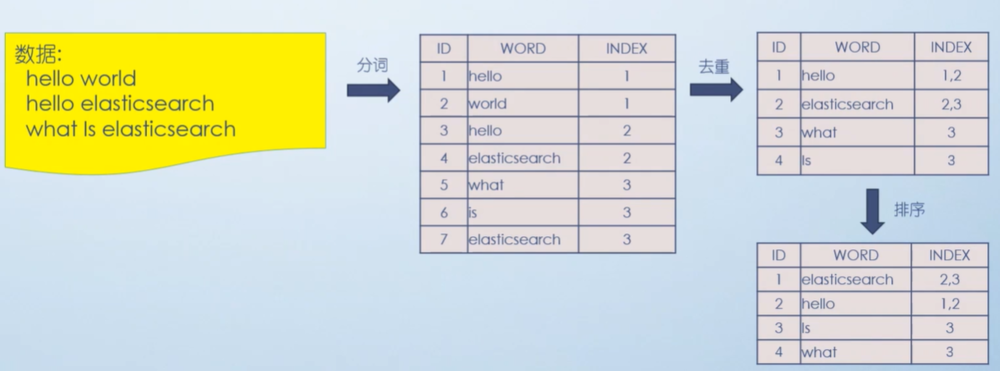


## 3. ES的一些基本概念

**索引 `Index`**

索引库，相当于关系型数据库的`Database`

一个索引就是一个拥有几分相似特征的文档的集合。比如说，可以有一个客户数据的索引，另一个产品目录的索引，还有一个订单数据的索引

一个索引由一个名字来标识(必须全部是小写字母的)，并且当我们要对对应于这个索引中的文档进行索引、搜索、更新和删除的时候，都要使用到这个名字


**映射 `mapping`**

ElasticSearch中的**映射(Mapping)用来定义一个文档**

mapping是处理数据的方式和规则方面做一些限制，如某个字段的数据类型、默认值、分词器、是否被索引等等，这些都是映射里面可以设置的


**字段 `Field`**

相当于是数据表的字段|列


**字段类型 `Type`**

每一个字段都应该有一个对应的类型


**文档 `Document`**

一个文档是一个可被索引的基础信息单元，类似一条记录。文档以JSON(Javascript Object Notation)格式来表示


集群 cluster

一个集群就是由一个或多个节点组织在一起，它们共同持有整个的数据，并一起 提供索引和搜索功能


节点 node

一个节点是集群中的一个服务器，作为集群的一部分，它存储数据，参与集群的索引和搜索功能


**分片和副本 shards&replicas**

分片：将索引划分成多份。每个分片本身也是一个功能完善并且独立的“索引”，这个“索引”可以被放置 到集群中的任何节点上

允许水平分割/扩展你的内容容量 

允许在分片之上进行分布式的、并行的操作，进而提高性能/吞吐量

副本：故障转移机制

在分片/节点失败的情况下，提供了高可用性

扩展搜索量/吞吐量，因为搜索可以在所有的副本上并行运行
