数据库

- 常见的数据库：Oracle、MySQL、SQLServer、DB2、MongoDB、SQLite、Redis 
- 关系型数据库：MySQL、Oracle、SQLServer等，数据之间有关联关系，数据存储在**硬盘**的文件上
- 非关系型数据库：MongoDB、Redis等，数据之间没有关联关系，数据存储在**内存**中

关系型数据库中，数据组置涉及到两个最基本的结构：**表**和**索引**
表中存储的是完整的记录，按**堆表**(无序存储，如Oracle，DB2，PostegreSQL)或者**聚簇索引表**(按主键排序存储)
索引中存储的是完整记录的一个子集，用于加速查询，索引的组织形式一般是B+树

# 1. MySQL     


## 1.1 MySQL基础    

### 1.1.1 mysql基本配置
- 配置my.ini
~~~

//设置 mysql 客户端默认字符集  
default-character-set=utf8 

//设置 3306 端口  
port = 3306  

//设置 mysql 的安装目录  
basedir=D:\Program Files\mysql-5.7.31-winx64

//设置 mysql 数据库的数据的存放目录  
datadir=D:\Program Files\mysql-5.7.31-winx64\data 

//允许最大连接数  
max_connections=200  

//服务端使用的字符集默认为 8 比特编码的 latin1 字符集  
character-set-server=utf8mb4  

//创建新表时将使用的默认存储引擎  
default-storage-engine=INNODB
~~~

- 启动服务： net start mysql       
   - linux: service mysqld start 
- 登录： `mysql -uroot -proot` //连接本地数据库，密码默认为 root，mysql -u <用户名> -p <密码>                
 `mysql -h <ip> -P <port> -u <username> -p <password>`   //连接网络数据库      
- 设置密码： ALTER USER 'root'@'localhost' IDENTIFIED BY 'new_password';        
- 退出：quit
- 停止服务：net stop mysql      
- 备份数据库：mysqldump -u用户名 -p密码 数据库名 > 保存的路径        
- 还原数据库: 登陆创建使用数据库，执行文件： source 文件路径
- 查看数据库版本：`select version();`
- 显示所有数据库：`show databases;`
- 显示当前数据库所有表：`show tables`
- 显示指定数据库的所有表：`show tables from <database>`
- 查看当前数据库支持的存储引擎：`show engines`
- 查看系统变量及其值：`show variables`
- 查看某个系统变量：`show variables like <变量名>` 如`show variables like 'port';`
- **关于mysql的编码**：mysql的utf8并不是真正的utf-8，只支持3个字节的编码，对于4个字节的复杂文字会写入失败，真正的utf-8是`utf8mb4`
### 1.1.2 sql语句介绍
SQL : Structured Query Language 结构化查询语言，定义了操作所有关系型数据库的规则        

- SQL语句可以多行书写，**分号结尾**        
- MYSQL 数据库的 SQL 语句**不区分大小写**，关键字建议使用大写       
- 单行**注释**： -- 单行注释 或者 # 单行注释 （--之后必须加空格，#之后可以不加空格）
- 多行注释：/* 多行注释 */

**SQL操作的分类**       
- **DDL(data define language)：** DDL是数据库定义语言，用来定义数据库对象：数据库、表、列等           
关键字：create、drop、alter等  
- **DML(data manipulation language)：** DML是数据库操作语言，用来对数据库表中的数据进行增删改           
关键字：insert、delete、update等  
- **DQL(data query languafe)：** DQL是数据库查询语言，用来查询数据库中表的记录(数据)     
关键字：select、where等
- **DCL(data control language)：** DCL是数据库控制语言，用来定义数据库的访问特权和安全级别，以及创建用户           
关键字：GRANT、REVOKE等

### 1.1.3 mysql数据类型
mysql有四种数据类型
- **整数类型：** bit, bool, tinyint, smallint, mediumint, int, bigint
- **浮点数类型：** float, double, decimal
- **字符串类型：** char, varchar, tinyblob, blob, mudiumblob, longblob, tinytext, text, mediumtext, longtext
- **日期类型：** Date, DateTime, TimeStamp, Time, Year

1. 整数类型

|类型	        |大小	    |范围（有符号）  |范围（无符号）        |用途|
|---|----|---|---|---|
|TINYINT	    |    1byte	|$(-2^7, 2^7-1)$      |       $(0, 2^8-1)$	 |小整数值|
|SMALLINT	    |2bytes	|$(-2^{15}, 2^{15}-1)$|  $(0, 2^{16}-1)$	 |大整数值|
|MEDIUMINT	    |3bytes	|$(-2^{23}, 2^{23}-1)$|$(0, 2^{24}-1)$| 大整数值|
|INT或INTEGER	|4bytes	|$(-2^{31}, 2^{31}-1)$|$(0, 2^{32}-1)$  |大整数值|
|BIGINT	        |8bytes	|$(-2^{63}, 2^{63}-1)$|$(0, 2^{64}-1)$	|极大整数值|

`int(N)` 无论N等于多少，int永远占4字节，N表示宽度，不足用0不足，但是要设置zerofill

~~~
mysql> CREATE TABLE test3 (
    -> `a` int,
    -> `b` int(5),
    -> `c` int(5) unsigned,
    -> `d` int(5) zerofill,
    -> `e` int(5) unsigned zerofill,
    -> `f` int zerofill,
    -> `g` int unsigned zerofill
    -> );
Query OK, 0 rows affected (0.35 sec)

mysql> insert into test3 values (1,1,1,1,1,1,1),
    -> (11,11,11,11,11,11,11),(12345,12345,12345,12345,12345,12345,12345);
Query OK, 3 rows affected (0.08 sec)
Records: 3  Duplicates: 0  Warnings: 0

mysql> select * from test3;
+-------+-------+-------+-------+-------+------------+------------+
| a     | b     | c     | d     | e     | f          | g          |
+-------+-------+-------+-------+-------+------------+------------+
|     1 |     1 |     1 | 00001 | 00001 | 0000000001 | 0000000001 |
|    11 |    11 |    11 | 00011 | 00011 | 0000000011 | 0000000011 |
| 12345 | 12345 | 12345 | 12345 | 12345 | 0000012345 | 0000012345 |
+-------+-------+-------+-------+-------+------------+------------+
3 rows in set (0.00 sec)
~~~

2. 浮点数类型

|类型	        |大小	    |范围（有符号）  |范围（无符号）|用途|
|---|----|---|---|---|
|FLOAT|4 bytes|---|---|单精度浮点数|
|DOUBLE|8 bytes|---|---|双精度浮点数|
|DECIMAL|DECIMAL(M,D)||M>D为M+2否则为D+2|依赖于M和D|

`float(5,2)`表示总共5位(包括小数点)，保留两位小数
`但是decimal是四舍五入，float和double是四舍六入五成双`(是5的时候永远将最后一位凑双)
`如果decimal不写精度，会四舍五入为整数，float和double不写精度会正常显示`
除此之外，float和double的sum会存在精度问题，而decimal不会，银行等对结果要求精准的要采用decimal

3. 字符串类型

   char和varchar：char是定长字符串，char(10)即使存储三个字符也会占用十个字节。`char效率更高，而varchar更节省空间`

| 类型       | 大小                  | 用途                            |
| ---------- | --------------------- | ------------------------------- |
| CHAR       | 0-255 bytes           | 定长字符串                      |
| VARCHAR    | 0-65535 bytes         | 变长字符串                      |
| TINYBLOB   | 0-255 bytes           | 不超过 255 个字符的二进制字符串 |
| TINYTEXT   | 0-255 bytes           | 短文本字符串                    |
| BLOB       | 0-65 535 bytes        | 二进制形式的长文本数据          |
| TEXT       | 0-65 535 bytes        | 长文本数据                      |
| MEDIUMBLOB | 0-16 777 215 bytes    | 二进制形式的中等长度文本数据    |
| MEDIUMTEXT | 0-16 777 215 bytes    | 中等长度文本数据                |
| LONGBLOB   | 0-4 294 967 295 bytes | 二进制形式的极大文本数据        |
| LONGTEXT   | 0-4 294 967 295 bytes | 极大文本数据                    |

4. 日期类型

|类型	    |大小|范围|格式	                |用途|
|---|---|---|---|---|
|DATE|	3bytes	|1000-01-01/9999-12-31|	YYYY-MM-DD	|日期值|
|TIME|	3bytes|	'-838:59:59'/'838:59:59'|	HH:MM:SS	|时间值或持续时间|
|YEAR|	1byte|	1901/2155|	YYYY|	年份值|
|DATETIME|	8bytes|1000-01-01 00:00:00/<br>9999-12-31 23:59:59|YYYY-MM-DD HH:MM:SS|混合日期和时间值|
|TIMESTAMP|	4bytes|1970-01-01 00:00:00/2038-1-19 11:14:07(北京时间)<br>结束时间是第 2147483647 秒|YYYYMMDD HHMMSS|	混合日期和时间值，时间戳|


## 1.2 SQL语法

### 1.2.1 DDL(data define language)
1. **C(Create)**        
    - 创建数据库
        ~~~sql
        CREATE DATABASE [IF NOT EXISTS] 数据库名 [CHARACTER SET 字符集];  
        
        //创建数据库的通用写法：
        drop database if exists 库名;
        create database 库名;
        ~~~
    - 创建表
        ~~~sql
        CREATE TABLE 表名(
            列名1 数据类型1 [(宽度)] [约束条件] [comment '字段说明'],
            列名2 数据类型2, 
            ...     //最后一个字段不能加逗号
            )[表的一些设置];
        ~~~
        ~~~
        //例如
        mysql> create table test1(
            -> a int not null comment '字段a',
            -> b int not null default 0 primary key comment '字段b',
            -> );
        
        //另一种primary key的限定方式
        mysql> create table test2(
            -> a int not null comment '字段a',
            -> b int not null default 0 comment '字段b',
            -> primary key(a)
            -> );
        
        //foreign key的用法
        mysql> create table test5(
            -> a int not null comment '字段a' primary key
            -> );
        Query OK, 0 rows affected (0.02 sec)
        mysql> create table test6(
            -> b int not null comment '字段b',
            -> ts5_a int not null,
            -> foreign key(ts5_a) references test5(a)
            -> );
        ~~~
        常用约束：not null、default 默认值、primary key、foreign key、unique key、auto_increment 
    - `CREATE TABLE name1 like name2;` 按表2的样式创建一个表1，复制表结构
    - `CREATE TABLE name1 as SELECT 字段 from 被复制表 [where..];` 按条件复制
        ~~~
        mysql> create table test1_copy as select * from test1;
        ~~~

2. **R(Retrive)**  
    - `SHOW DATABASES;`  查询所有数据库的名称
    - `SHOW CREATE DATABASE 数据库名称;`  查询数据库的创建语句
    - `SHOW TABLES;`  查询数据库中所有的表  
    - `DESC 表名;` 或者 `DESCRIBLE 表名;`  查询表的结构
3. **U(update)**  
    - `ALTER DATABASE name character set UTF8;`
    - `ALTER TABLE 表名 rename name1;`  修改表名
    - `ALTER TABLE 表名 character set utf8;`  修改表的字符集
    - `ALTER TABLE 表名 add 列名 数据类型;`  添加一列
    - `ALTER TABLE 表名 change 原列名 新列名 数据类型;`  修改列名和类型
    - `ALTER TABLE 表名 modify 列名 数据类型;`  修改列的数据类型
    - `ALTER TABLE 表明 drop 列名;`   删除列
4. **D(DELETE)**       
    - `DROP DATABASE [IF EXISTS] name;`
    - `DROP TABLE [IF EXISTS] name;`
5. **使用数据库**           
   
    - 查询正在使用的数据库名称: `SELECT DATABASE();`
    - 使用数据库：`USE name`

### 1.2.2 DML(data manipulation language)
DML是数据库操作语言，用来对数据库表中的数据进行增删改           
1. 添加数据：       
    - `INSERT INTO 表名[(列名1,列名2,...)] values(值1,值2,...),(值1,值2,...);`  如果表明之后不写列名默认给所有列添加数据(未知为NULL)        
    
2. 删除数据：
    - `DELETE FROM 表名 WHERE 条件;`    不加条件则删除表中全部数据，但是一条一条执行删，效率低      
    - `TRUNCATE 表名;`    删除表并创建一个一模一样结构的表(相当于删除全部记录，比上面的删效率高)     
    - **注意：** **delete语句是数据库操作语言DML**，操作会放到rollback segement中，**事务提交之后才生效**。**truncate、drop是数据库定义语言DDL**，操作立即生效，**不能回滚**，即使手动开启事务也不行
3. 修改数据：
    - `update 表名 [as 别名] set [别名.]列名1=值1, 列名2=值2,... [WHERE 条件];`  不加条件则把所有数据对应列都修改

### 1.2.3 DQL(data query languafe)      
DQL是数据库查询语言，用来查询数据库中表的记录(数据)     

查询常量和表达式：
~~~
mysql> select 1,'b';
+---+---+
| 1 | b |
+---+---+
| 1 | b |
+---+---+
1 row in set (0.01 sec)

mysql> select 1+2,3*10,10/3;
+-----+------+--------+
| 1+2 | 3*10 | 10/3   |
+-----+------+--------+
|   3 |   30 | 3.3333 |
+-----+------+--------+
1 row in set (0.01 sec)
~~~

- `SELECT * FROM 表名;`
- `SELECT DISTINCT ...` 去重查询
~~~sql   
SELECT name AS 名字,   --起别名(AS可省略)
      math 数学, 
      english 英语, 
      IFNULL(math, 0) + IFNULL(english,0) 总分 -- 计算两者的行和,处理NULL，起别名
FROM student;
~~~
#### 条件查询

- WHERE条件：
`>, <, >=, <=, =, <>, !=`：<> 和 != 都是不等于，<>可移植性好，一般用<>
`BETWEEN...AND...`：介于二值之间 
`IN(集合)`：相当于多个 OR
`NOT IN(集合)`：和in正好相反
`LIKE`：模糊查询，**占位符 _(单个任意字符), %(多个任意字符)**
`IS　NULL`：查询NULL 只能用 IS 和 IS NOT 不能用 = 和 != 
`AND &&`
`OR ||`
`NOT !`
- `UNION` 操作符: 用于连接两个以上的 SELECT 语句的结果 组合到一个结果的集合中，多个SELECT 语句会删除重复的数据   
- **NULL值，通过>,>=,like '%'，in(NULL), not in, between等都查询不到**，只能通过`IS NULL`和`IS NOT NULL`或者安全等于`<=>`(安全等于用的少)

#### 函数
- `COUNT` 计算个数(排除NULL)
~~~sql
SELECT COUNT(id) FROM student WHERE score>92;
~~~
- `MAX`
- `MIN`
- `SUM`
- `AVG`
- `MOD`
- `abs`,`sqrt`
- `ceil`,`floor`
- `rand()` 生成一个0~1之间的随机数
- `pow`,`sin`,`asin`...
- `isnull(a)` 判断a的参数是否为空，为空返回1，不为空返回0
- `ifnull(a,b)` 如果a的参数是空则返回为b值
~~~sql
CASE [<表达式>]
    WHEN <条件1> 
        THEN <操作1> 
    WHEN <条件2> 
        THEN <操作2> 
    ...
    ELSE <操作>
END CASE;
~~~
- CASE的使用，如
~~~
mysql> SELECT
    t.name 姓名,
    (CASE t.sex
    WHEN 1
        THEN '男'
    WHEN 2
        THEN '⼥'
    ELSE '未知' END) 性别
    FROM t_stu t;
~~~

- 其他的mysql系列函数：
~~~
select version();  //查询当前版本
select database(); //查询当前数据库
select user();     //查询当前用户
select password('pw') //查询字符串的密码形式
select md5('str')  //查询指定str的md5码
~~~
#### 排序查询

- `SELECT * FROM 表名 ORDER BY 排序字段1 [asc|desc], 排序字段2 [asc|desc],...;`  排序方式: ASC(默认)、DESC。多字段排序时按照顺序进行
~~~
mysql> select * from stu order by age desc,id asc;
+------+-----+---------------+
| id | age | name |
+------+-----+---------------+
| 1004 | 20 | 张国荣 |
| 1005 | 20 | 刘德华 |
| 1010 | 19 | 梁朝伟 |
| 1001 | 18 | 路⼈甲Java |
| 1003 | 18 | 张学友 |
+------+-----+---------------+
5 rows in set (0.00 sec)
~~~
**注意：排序中存在相同的值时，需要再指定⼀个排序规则，通过这种排序规则不存在⼆义性，否则分页结果对相同值会存在混乱，每次分页结果不一致** 

#### 分页查询
- `LIMIT 开始的索引,每页条目数`   MySQL的语法，开始的索引=(页码-1)*每页条目数
~~~sql
SELECT * FROM student LIMIT 0,3;    -- 第一页
SELECT * FROM student LIMIT 3,3;    -- 第二页
SELECT * FROM student LIMIT 6,3;    -- 第三页
~~~

**注意：排序中存在相同的值时，需要再指定⼀个排序规则，通过这种排序规则不存在⼆义性，否则分页结果对相同值会存在混乱，每次分页结果不一致**

#### 分组查询
- 聚合函数(group_function)：`max`，`min`，`count`，`sum`，`avg`
~~~sql
SELECT  column, 
        group_function,
        ... 
FROM    table 
WHERE   ... 
GROUP BY group_by_expressin 
HAVING  [group_condition]   //分组后数据过滤
~~~

**注意：SELECT后面的列只能有两种：`出现在GROUP BY后面的列`和`使用聚合函数的列`**，**不能再使用其他的列作为查询结果!!!!!!!!!!!!!!!!!**

- 多字段分组
~~~sql
mysql> SELECT
            user_id ⽤户id, the_year 年份, COUNT(id) 下单数量
        FROM
            t_order
        GROUP BY user_id , the_year;
+----------+--------+--------------+
| ⽤户id | 年份 | 下单数量 |
+----------+--------+--------------+
| 1001 | 2017 | 1 |
| 1001 | 2018 | 2 |
| 1002 | 2018 | 3 |
| 1002 | 2019 | 1 |
| 1003 | 2018 | 1 |
| 1003 | 2019 | 1 |
+----------+--------+--------------+
6 rows in set (0.00 sec)
~~~

- 分组前筛查
~~~sql
//需要查询2018年每个⽤户下单数量，输出：⽤户id、下单数量
mysql>  SELECT
            user_id ⽤户id, COUNT(id) 下单数量
        FROM
            t_order t
        WHERE
            t.the_year = 2018
        GROUP BY user_id;
~~~

- 分组后筛查

~~~sql
//查询2018年订单数量⼤于1的⽤户，输出：⽤户id，下单数量
mysql>  SELECT
            user_id ⽤户id, COUNT(id) 下单数量
        FROM
            t_order t
        WHERE
            t.the_year = 2018
        GROUP BY user_id
        HAVING count(id)>=2;
~~~

- **where和having的区别：** where在分组前筛查，having在分组后筛查；**where的条件不能有聚合函数**

- `WITH ROLLUP` : 可以对分组统计的数据的基础上再进行相同的统计
~~~sql
mysql> SELECT name, SUM(singin) as singin_count FROM  employee_tbl GROUP BY name WITH ROLLUP;
+--------+-------------+
| name   | sum(singin) |
+--------+-------------+
| 小丽   |           2 |
| 小明   |           7 |
| 小王   |           7 |
| NULL   |          16 |
+--------+-------------+
~~~

#### 查询总结

~~~sql
SELECT
    字段列表
FROM
    表名列表
WHERE
    条件列表
GROUP BY
    分组字段
HAVING
    分组后的条件限定
ORDER BY
    排序
LIMIT
    分页限定
~~~


### 1.2.4 DCL(data control language)
DCL是数据库控制语言，用来定义数据库的访问特权和安全级别，以及创建用户              

1. 管理用户：

    - 添加用户：`CREATE USER '用户名'@'主机名' IDENTIFIED BY '密码';`   
        (主机名：localhost表示本地登陆，% 表示外部任意主机可以登陆)
    - 查询用户：`SELECT * FROM USER;`  
    - 删除用户：`DROP USER '用户名'@'主机名';`  
    - 修改用户密码：            
    `UPDATE USER SET PASSWORD = PASSWORD('新密码') WHERE USER = '用户名';`          
    `SET PASSWORD FOR '用户名'@'主机名' = PASSWORD('新密码');`   
    - 忘记root密码？            
    重新使用无验证方式启动MySQL服务：`mysql --skip-grant-tables`        
    打开新的命令行直接使用命令`mysql`即可登陆数据库             
    `USE mysql`         
    `UPDATE USER SET PASSWORD = PASSWORD('新密码') WHERE USER = '用户名';`      
    任务管理器结束mysql服务，重新登陆即可       

2. 授权：
    - 查询权限：`SHOW GRANTS FOR '用户名'@'主机名';`  
    - 授予权限：            
    `GRANT 权限列表 ON 数据库名.表名 TO '用户名'@'主机名'`          
    `GRANT ALL ON *.* TO '用户名'@'主机名'`  :给予全部权限
    - 撤销权限：`REVOKE 权限列表 ON 数据库名.表名 FROM '用户名'@'主机名'`
    - 授予远程访问的所有权限：` grant all privileges on *.* to 'root'@'%' identified by 'root';`或者` grant all privileges on *.* to 'root'@'%' with grant option;`
    - mysql8开始不能再隐式使用grant命令创建用户，应该：
~~~sql
mysql> CREATE USER 'root'@'%' IDENTIFIED BY 'root';
mysql> GRANT ALL PRIVILEGES ON *.* TO 'root'@'%' WITH GRANT OPTION;
~~~


### 1.2.5 连接操作
- `INNER JOIN`（内连接,或等值连接）：获取两个表中字段匹配关系的记录，也可以省略 INNER，只写 JOIN
- `LEFT JOIN`（左连接）：获取左表所有记录，即使右表没有对应匹配的记录
- `RIGHT JOIN`（右连接）： 与 LEFT JOIN 相反，用于获取右表所有记录，即使左表没有对应匹配的记录
- 连接条件用 `ON` 表示，例如：
    ~~~sql
    SELECT a.id, a.name, b.main_teacher FROM student a INNER JOIN class b ON a.classid=b.classid
    ~~~

### 1.2.6 NULL
NULL的查询处理
- `IS NULL` : 当列的值是NULL 时返回true
- `IS NOT NULL` 
- `<=>` : 比较操作符，当二者值相等或都等于NULL时返回true        
- `IFNULL(列名, 新值)`      
---

- 比较运算中的NULL：任何数和NULL比较、运算、in 结果都是NULL
~~~sql
mysql> select 1>NULL, 1<NULL, 1<>NULL;
+--------+--------+--------+
| 1>NULL | 1<NULL | 1<>NULL |
+--------+--------+--------+
|   NULL |   NULL |   NULL |
+--------+--------+--------+
1 row in set (0.00 sec)

mysql> select NULL=NULL,NULL!=NULL;
+-----------+------------+
| NULL=NULL | NULL!=NULL |
+-----------+------------+
|      NULL |       NULL |
+-----------+------------+
1 row in set (0.00 sec)

mysql> select 1 in (null),1 not in (null),null in (null),null not in (null);
+-------------+-----------------+----------------+--------------------+
| 1 in (null) | 1 not in (null) | null in (null) | null not in (null) |
+-------------+-----------------+----------------+--------------------+
|        NULL |            NULL |           NULL |               NULL |
+-------------+-----------------+----------------+--------------------+
1 row in set (0.00 sec)
~~~

- IN和NULL：当IN和NULL比较时，无法查询出为NULL的记录。
~~~sql
mysql> select * from test1 where a in (null,1);
+------+------+
| a    | b    |
+------+------+
|    1 |    1 |
|    1 | NULL |
+------+------+
2 rows in set (0.00 sec)
~~~
- NOT IN 和 NULL：当NOT IN 后面有NULL值时，不论什么情况下，整个sql的查询结果都为空
~~~sql
mysql> select * from test1 where a not in (null,2);
Empty set (0.00 sec)
~~~

- 聚合函数和NULL：**count(属性)不能统计NULL，而COUNT(*)可以统计NULL**
~~~sql
mysql> select count(a),count(b),count(*) from test1;
+----------+----------+----------+
| count(a) | count(b) | count(*) |
+----------+----------+----------+
|        2 |        1 |        3 |
+----------+----------+----------+
1 row in set (0.00 sec)
~~~

### 1.2.7 子查询
按结果集的行列数分为四种
1. **标量子查询**：结果集只有一行一列
2. **列子查询**：结果集只有一列多行
3. **行子查询**：结果集只有一行多列
4. **表子查询**：结果集为多行多列

按子查询出现的位置，分为四种
1. **select后面**：只支持标量子查询
2. **from后面**：支持表子查询
3. **where或having后面**：支持标量子查询、列子查询、行子查询
4. **exists后面**：支持表子查询

#### select后的子查询
只支持标量子查询
~~~sql
//查询每个部门的员工数
SELECT
    a.*,
    (SELECT count(*)
    FROM employees b
    WHERE b.department_id = a.department_id) AS 员⼯个数
FROM departments a;

//查询员⼯号=102的部门名称
SELECT (SELECT a.department_name
        FROM departments a, employees b
        WHERE a.department_id = b.department_id
        AND b.employee_id = 102) AS 部门名;
~~~

#### from后的子查询
支持表子查询
要求from后的子查询必须起别名，否则找不到这个表，然后将真实的表和子查询结果表进行连接查询

~~~sql
//查询每个部门平均工资的工资等级
SELECT
  t1.department_id,
  sa AS '平均工资',
  t2.grade_level
FROM (SELECT
        department_id,
        avg(a.salary) sa
      FROM employees a
      GROUP BY a.department_id) t1, job_grades t2
WHERE
  t1.sa BETWEEN t2.lowest_sal AND t2.highest_sal;
~~~

#### where和having后面的子查询
支持标量、列、行子查询
子查询的执行优先于主查询，因为主查询的条件用到了子查询的结果

- 列子查询要搭配多行操作符使用`in(not in), any/some, all`
~~~sql
//标量子查询：查询谁的工资比Abel的高
SELECT *
FROM employees a
WHERE a.salary > (SELECT salary
                  FROM employees
                  WHERE last_name = 'Abel');


//标量子查询：查询最低工资大于50号部门最低工资的部门id和其最低工资
SELECT
  min(a.salary) minsalary,
  department_id
FROM employees a
GROUP BY a.department_id
HAVING min(a.salary) > (SELECT min(salary)
                        FROM employees
                        WHERE department_id = 50);

//列子查询：返回location_id是1400或1700的部门中的所有员工姓名 <> ALL 等价于 NOT IN
SELECT a.last_name
FROM employees a
WHERE a.department_id <> ALL (SELECT DISTINCT department_id  -- <> ALL 等价于 NOT IN
                             FROM departments
                             WHERE location_id IN (1400, 1700));

//行子查询：查询员工编号最小并且工资最高的员工信息
SELECT *
FROM employees a
WHERE (a.employee_id, a.salary) in (SELECT
                                     min(employee_id),
                                     max(salary)
                                   FROM employees);
~~~

#### exists后的子查询(相关子查询)
exists查询结果：1或0，exists查询的结果用来判断子查询的结果集中是否有值
一般来说，能用exists的子查询，绝对都能用in代替，但是exists性能更好

~~~sql
mysql> SELECT exists(SELECT employee_id
              FROM employees
              WHERE salary = 300000) AS 'exists返回1或者0';
~~~

### 1.2.8 正则表达式    
MySQL中，正则表达式使用 `REGEXP` 声明(Regular Expression)      
- `^` : 匹配起始位置
- `$` : 匹配结束位置
- `.` : 匹配除 "\n" 外的所有单字符，要匹配包括 "\n" 则使用 `[.\n]`      
- `[...]` : 匹配字符集中的任一字符
- `[^...]` : 匹配未包含在字符集的任一字符 
- `\d` : 匹配所有单个数字[0-9]
- `[\w]` :匹配单个单词字符[a-zA-Z0-9]      
- `p1|p2|p3` : 或的单字符匹配  
- `*` : 匹配前面子表达式零次或多次  
- `+` : 匹配前面子表达式一次或多次  
- `{n}` : n 是非负数，匹配确定的 n 次  
- `{n, m}` : 最少匹配 n 次，最多匹配 m 次   


通配符： _ 替代一个字符， % 替代零个或多个字符

~~~sql
# 查找name字段中以'st'为开头的所有数据：
mysql> SELECT name FROM person WHERE name REGEXP '^st';

#查找name字段中以元音字符开头或以'ok'字符串结尾的所有数据：
mysql> SELECT name FROM person WHERE name REGEXP '^[aeiou]|ok$';
~~~


## 1.3 约束     
对表中的数据进行限定，保证数据的正确性、完整性、有效性      
- 约束的分类          
主键约束：primary key           
非空约束：not null      
唯一约束：unique            
外键约束：foreign key           

### 1.3.1 非空约束          
- 创建表时，对应列加上 NOT NULL 约束  
    ~~~sql
    CREATE TABLE student(
        id INT NOT NULL,
        name VARCHAR(20) NOT NULL
    );
    ~~~

- 修改约束      
    ~~~sql
    ALTER TABLE student MODIFY name VARCHAR(20);
    ~~~

### 1.3.2 唯一约束      

- 创建表时，添加唯一约束(MySQL中唯一约束的列可以有多个NULL)    
    ~~~sql
    CREATE TABLE student(
        id INT NOT NULL,
        name VARCHAR(20) NOT NULL
    );
    ~~~
- 唯一约束的添加可以直接modify(要保证唯一)，去除时，直接modify修改不了，必须删除索引
    ~~~sql
    ALTER TABLE student DROP INDEX id;
    ~~~

### 1.3.3 主键约束  
- 主键非空且唯一，一个 table 只能有一个主键     
- 创建表时添加主键约束  
    ~~~sql
    CREATE TABLE student(
        id INT PRIMARY KEY,     -- 添加主键约束
        name VARCHAR(20) NOT NULL
    );
    
    create table student(   -- 创建表
    -> id int,
    -> name varchar(20),
    -> address varchar(20),
    -> primary key(id, name)       -- 直接设置主键
    -> );
    ~~~

- 删除主键
    ~~~sql
    ALTER TABLE student DROP PRIMARY KEY;
    ~~~

- 添加主键
    ~~~sql
    ALTER TABLE student MODIFY id INT PRIMARY KEY;
    ~~~

- 自动增长，一般与主键结合使，当下一个记录的该值为 NULL 时从上一个记录值自动增长
    ~~~sql
    ALTER TABLE student MODIFY id INT PRIMARY KEY AUTO_INCREMENT;
    ~~~

- 删除自动增长          
    ~~~sql
    ALTER TABLE student MODIFY id INT PRIMARY KEY;
    ~~~

### 1.3.4 外键约束  

外键值可以为NULL，但是不能为外表对应列不存在的其他值
- 创建表时，添加外键约束        
    ~~~sql
    CREATE TABLE 表名(
        ......
        外键列
        CONSTRAINT 起外键名 FOREIGN KEY (外键的列名) REFERENCES 外部主表名(列名)  -- 关联外表唯一约束的列(不一定是主键)       
    
        -- 例如
        department_id INT
        CONSTRAINT dep_fk FOREIGN KEY (department_id) REFERENCES department(id)
    );
    ~~~

- 删除外键  
    ~~~sql
    ALTER TABLE 表名 DROP FOREIGN KEY 外键名
    ~~~

- 添加外键      
    ~~~sql
    ALTER TABLE 表名 ADD CONSTRAINT 起外键名 FOREIGN KEY (外键的列名) REFERENCES 外部主表名(列名)
    ~~~

- 级联操作      
  `ON UPDATE CASCADE;`  外部表对应列修改时，外键自动更新  
  `ON DELETE CASCADE;`  级联删除       
  
    ~~~sql
    ALTER TABLE 表名 ADD CONSTRAINT 起外键名 FOREIGN KEY (外键的列名) REFERENCES 外部主表名(列名) ON UPDATE CASCADE;
    ~~~

## 1.4 数据库的设计     

### 1.4.1 第一范式(1NF)
- 如果一个关系模式R的**所有属性都是不可分的**基本数据项，则R∈1NF
- 1NF 强调的是**列的原子性**，即列不能够再分成其他几列  

如学生（学号，姓名，性别，出生年月日），如果认为最后一列还可以再分成（出生年，出生月，出生日），它就不是一范式了，否则就是

### 1.4.2 第二范式(2NF)
- 关系模式R∈1NF，并且每一个非主属性都完全函数依赖于R的主键，则R∈2NF
- 2NF 在1NF 的基础上要求**非主键字段必须完全函数依赖于主键**，不能只依赖于主键的一部分，所以只有一个主键的表如何符合第一范式，必然也符合第二范式              

如表：学号、课程号、姓名、成绩          
这个表明显说明了两个事务:学生信息, 课程信息; 主键是学号和课程号，姓名只依赖于学号，不满足 2NF       

### 1.4.3 第三范式(3NF)
- 3NF 要求在 1NF 的基础上，任何 非主属性不依赖于其他非主属性，即**在2NF的基础上消除传递依赖**    

如表: 学号, 姓名, 年龄, 学院名称, 学院电话   
因为存在依赖传递: (学号) → (学生) → (学院名称) → (学院电话)

### 1.4.4 BCNF范式  
- BCNF范式是对 3NF 的改进，关系模式R属于第一范式，且每个表中只有一个候选键（在一个数据库中每行的值都不相同，则可称为候选键）   

## 1.5 事务

### 1.5.1 事务的基本介绍        
事务是并发控制的基本单位，是一个操作序列，这些操作要么都执行，要么都不执行           
- 开启事务： `start transaction`    
- 回滚： `rollback`
- 提交： `commit`       

~~~sql
START TRANSACTION;
UPDATE account SET balance = balance - 500 WHERE name = "张三";
UPDATE account SET balance = balance + 500 WHERE name = "李四";
COMMIT;
~~~

- MySQL 中事务会默认自动提交，一条 DML 语句会自动提交一次，手动时，开启后如果未提交就退出，则会自动回滚       
- Oracle 默认为手动提交
~~~sql
SET autocommit = 0        -- 设置默认为手动提交
~~~

### 1.5.2 事务的四大特征(ACID)        
- **原子性(Atomicity)：** 事务是不可分割的最小操作单位，要么全部做完，要么全部不做                
- **一致性(Consistency)：** 事务执行的结果必须是使数据库从一个一致性状态到另一个一致性状态      
- **隔离性(Isolation)：** 多个事务之间，相互独立，相互隔离。该事务提交前对其他事务不可见          
- **持久性(Durability)：** 事务一旦提交后，它对数据库中数据的改变会持久化到硬盘，修改是永久性的             

### 1.5.3 事务的隔离级别        

**多个事务操作同一批数据时存在的问题**          
1. 第一类丢失更新：A事务撤销时，把已提交的B事务的更新数据覆盖了       
<center>

| 时间点 | 事务A                        | 事务B                     |
| ------ | ---------------------------- | ------------------------- |
| T1     | 开始事务                     |                           |
| T2     |                              | 开始事务                  |
| T3     | 查询账户余额为1000元         |                           |
| T4     |                              | 查询账户余额为1000元      |
| T5     |                              | 存入100元把余额改为1100元 |
| T6     |                              | 提交事务                  |
| T7     | 取出100元把余额改为900元     |                           |
| T8     | 撤销事务                     |                           |
| T9     | 余额恢复为1000元（丢失更新） |                           |
</center>

2. 第二类丢失更新：A事务提交时，把已提交的B事务的更新数据覆盖了
<center>

| 时间点 | 事务A                        | 事务B                    |
| ------ | ---------------------------- | ------------------------ |
| T1     |                              | 开始事务                 |
| T2     | 开始事务                     |                          |
| T3     |                              | 查询账户余额为1000元     |
| T4     | 查询账户余额为1000元         |                          |
| T5     |                              | 取出100元把余额改为900元 |
| T6     |                              | 提交事务                 |
| T7     | 存入100元把余额改为1100      |                          |
| T8     | 提交事务                     |                          |
| T9     | 余额恢复为1100元（丢失更新） |                          |
</center>

3. 脏读：一个事务读取到另一个事务没有提交的数据          
<center>

| 时间点 | 事务A                       | 事务B                          |
| ------ | --------------------------- | ------------------------------ |
| T1     |                             | 开始事务                       |
| T2     | 开始事务                    |                                |
| T3     |                             | 查询账户余额为1000元           |
| T4     |                             | 取出500元把余额改为500元       |
| T5     | 查询账户余额为500元（脏读） |                                |  |  |
| T6     |                             | **撤销事务**，余额恢复为1000元 |
| T7     | 存入100元把余额改为600元    |                                |
| T8     | 提交事务                    |                                |
</center>

4. 不可重复读(虚读)：同一个事务中，两次读取到的数据不一样
<center>

| 时间点 | 事务A                                                      | 事务B                    |
| ------ | ---------------------------------------------------------- | ------------------------ |
| T1     |                                                            | 开始事务                 |
| T2     | 开始事务                                                   |
| T3     |                                                            | 查询账户余额为1000元     |
| T4     | 查询账户余额为1000元                                       |
| T5     |                                                            | 取出100元把余额改为900元 |
| T6     |                                                            | 提交事务                 |
| T7     | 查询账户余额为900元 <br>（与T4读取的一不一致，不可重复读） |
</center>


5. 幻读：幻读指的是当某个事务读取某个范围内的记录时，另一个事务又在该范围内插入了新纪录，当之前的事务再次读取范围内的记录时，会产生幻行。InnoDB存储引擎通过MVCC解决了幻读的问题（部分解决，快照读可以避免幻读，当前读不能，例如下面两个例子的插入删除都是当前读，依然有幻读）


| 时间点 | 事务A                                                         | 事务B                          |
| ------ | ------------------------------------------------------------- | ------------------------------ |
| T1     |                                                               | 开始事务                       |
| T2     | 开始事务                                                      |                                |
| T3     |                                      |   插入数据a                             |
| T4     | 查询发现数据a不存在                                                              |  |
| T5     |                                                               | 提交事务                       |
| T6     | 尝试插入数据a，报错 |                                |
|T7|查询发现数据a依然不存在||
|T8|提交事务||

A产生幻觉：明明不存在为什么不能插入？？？

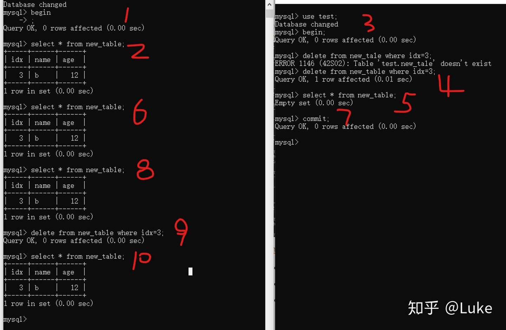

幻觉：存在，却删除不了

**不可重复读和幻读的区别：** 不可重复读是由于数据修改引起的，幻读是由数据插入或者删除引起的。

**隔离级别：** 级别越高约安全，但是效率越低          
1. **READ UNCOMMITTED（读未提交）:** 一个事务在执行过程中可以看到其他事务没有提交的新插入的记录，而且还能看到其他事务没有提交的对已有记录的更新      
2. **READ COMMITTED（读已提交）:** 一个事务在执行过程中可以看到其他事务已经提交的新插入的记录，而且还能看到其他事务已经提交的对已有记录的更新（允许第二类丢失更新）       
3. **REPEATABLE READ（可重复读）：** 一个事务在执行过程中可以看到其他事务已经提交的新插入的记录，但是不能看到其他事务对已有记录的更新。**mysql的默认隔离级别**   
4. **SERIALIZABLE（串行化）：** 一个事务在执行过程中完全看不到其他事务对数据库所做的更新。当两个事务同时操作数据库中相同数据时，如果第一个事务已经在访问该数据，第二个事务只能停下来等待，必须等到第一个事务结束后才能恢复运行。因此这两个事务实际上是串行化方式运行。使用的是**`表级读写排它锁`**，效率低

实际上SERIALIZABLE的性能和READ COMMITTED相比并不会损失太大。。（MySQL技术内幕说的）

<center>

| 隔离级别                     | 第一类丢失更新 | 第二类丢失更新 | 脏读 | 不可重复读 | 幻读 |
| ---------------------------- | :------------: | :------------: | ---- | :--------: | ---- |
| READ-UNCOMMITTED（读未提交） |      避免      |      允许      | 允许 |    允许    | 无 |
| READ-COMMITTED （读已提交）  |      避免      |      允许      | 避免 |    允许    | 无 |
| REPEATABLE-READ（可重复读）  |      避免      |      避免      | 避免 |    避免    | 允许 |
| SERIALIZABLE （可串行）      |      避免      |      避免      | 避免 |    避免    | 避免 |
</center>

隔离级别越高越安全，但是并发性能越低，最高级别直接让操作变成串行了

**数据库隔离级别的查询和设置：**            
- `show variables like 'transaction_isolation'`  查看隔离级别 
- `select @@transaction_isolation;` 查看隔离级别
- `set global transaction isolation level REPEATABLE READ;`   设置全局隔离级别(重启之后会恢复，如果不想重启重新设置，可以修改ini文件)
- `set session transaction isolation level read uncommitted;`  设置会话的隔离几倍
- `set @@transaction_isolation='REPEATABLE-READ';`

**怎么实现可重复读呢？**在读取数据的时候给读取的行加读锁，这样其他事务就无法修改这些数据了，就可以实现可重复读了，但是这种方法无法锁住insert的数据(行锁)，所以这时候就会产生幻读。但是`mysql的InnoDB`使用的是MVCC，是基于版本控制的**乐观锁**

- 串行化解决幻读不好，效率太低，使用MVCC和间隙锁更好

## 1.6 锁       
锁也是数据库管理系统区别文件系统的重要特征之一。锁机制使得在对数据库进行并发访问时，可以保障数据的完整性和一致性。不同数据库实现方法有所不同，主要介绍的是 MySQL 中的 InnoDB 引擎的锁

### 1.6.1 锁的类型      

**数据库的增删改操作默认都会加排他锁，而查询不会加任何锁**

**共享锁(S锁)**：又称为读锁，允许多个事务读取同一行数据，但无法修改，要修改必须等所有共享锁都释放。如果事务1获取了行r的S锁，其他事务再获取行r的S锁，但不能加X锁     

~~~sql
SELECT * FROM tableName WHERE... LOCK IN SHARE MODE;   -- 手动加 S 锁
~~~

**独占锁(X锁，排他锁)**： 又称为写锁，只能独占，允许事务删除或更新一行数据。如果事务1获取了行r的X锁，其他事务获取S或X锁都不行     

~~~sql
// 一致性锁定读，此时其他事务想要再操作被锁定的行，只能等待该事务完成之后才行
SELECT * FROM tableName WHERE... FOR UPDATE;   --手动加 X 锁
~~~

- S 锁和 S 锁是 **兼容** 的，X 锁和其它锁都 **不兼容** ，举个例子，事务 T1 获取了一个行 r1 的 S 锁，另外事务 T2 可以立即获得行 r1 的 S 锁，此时 T1 和 T2 共同获得行 r1 的 S 锁，此种情况称为 **锁兼容** ，但是另外一个事务 T2 此时如果想获得行 r1 的 X 锁，则必须等待 T1 对行 r1 的锁的释放，此种情况也成为 **锁冲突**              


**乐观锁和悲观锁：** 读多写少用乐观锁，写多读少用悲观锁

- 乐观锁：乐观锁认为数据一般不会造成冲突，所以在数据提交更新的时候才会正式对数据的冲突进行检测

  - 可以添加version版本字段或者timestamp时间戳字段等，**首先读出数据的version，更新的时候判断当前版本信息与之前取出来的version值是否相等，相等证明没有冲突，可以更新**。更新有可能会失败，甚至是更新几次都失败，这是有风险的。所以如果写入频繁，对吞吐要求不高，应该使用悲观锁

  ~~~sql
  /* 乐观锁举例 */
  update table set n=n+1, version=version+1 where id=#{id} and version=#{version};
  ~~~

- 悲观锁：数据处理过程中，使数据处于锁定状态，一般使用数据库的锁机制实现。共享锁和排它锁都是悲观锁。尤其是排它锁，当程序独占锁时，其他程序就连查询都是不允许的，导致吞吐较低。如果在查询较多的情况下，可使用乐观锁


**意向锁(Intention Locks)：** 意向锁是表级锁，用来表示该表中的row锁需要的锁(S,X)的类型
意向锁可以分为意向共享锁(IS)和意向排它锁(IX)，事务要获得某个表某行的S或X锁时，必须先分别获得IS锁和IX锁


**死锁问题：**

例如事务A锁住区间a，事务B锁住区间b

这时候事务B向区间a插入数据被阻塞，事务A向区间b插入数据被阻塞

这就造成了死锁


### 1.6.2 行锁详解

InnoDB下行锁可以细分为：`记录锁(Record Lock)`、`间隙锁(Gap Lock)`、`临键锁(Next-Key Lock)`，是**基于索引实现的**

所以一旦某个加锁操作没有使用索引，那么该锁就会退化为**表锁**

默认RR级别：


```sql
mysql> create table t (
    -> id int primary key,
    -> multi_num int,
    -> uiq_num int,
    -> key idx_multi_num(multi_num),
    -> unique key idx_uiq_num(uiq_num)
    -> );
    
mysql> desc t;
+-----------+------+------+-----+---------+-------+
| Field     | Type | Null | Key | Default | Extra |
+-----------+------+------+-----+---------+-------+
| id        | int  | NO   | PRI | NULL    |       |
| multi_num | int  | YES  | MUL | NULL    |       |
| uiq_num   | int  | YES  | UNI | NULL    |       |
+-----------+------+------+-----+---------+-------+

mysql> select * from t;
+----+-----------+---------+
| id | multi_num | uiq_num |
+----+-----------+---------+
|  1 |         1 |       1 |
|  3 |         3 |       3 |
|  7 |         7 |       7 |
| 10 |         7 |      10 |
| 15 |         7 |      15 |
| 18 |         5 |      18 |
+----+-----------+---------+
```


**记录锁(Record Lock):** 

必须是`主索引或唯一索引`，使用精确匹配(只能=，不能使用like等字段)，可以精确的加到某一个索引值上。（否则会退化为临键锁）

```sql
select * from t where id = 7 for update;       //精准的加到 id=7 这一索引值


事务1:
update t set uiq_num = 100 where uiq_num = 15; //精准的加到 uiq_num=15 这一索引值，无法插入或修改其他行的 uiq_num 为15 (阻塞)
事务2:
insert into t values(16,16,16);   			   //成功
update t set uiq_num=15 where id = 18;		   //失败，uiq_num=15 这个索引值已经被锁住了
```


**间隙锁(Gap Lock)**：锁加在不存在的空闲空间，可以是两个索引记录之间，也可能是第一个索引记录之前或者而最后一个索引之后的无限空间。间隙锁的一个很大的作用是在`RepeatableRead`级别下，**可以防止幻读**！！！将前后的间隙都锁住，这样新的值就没有办法插入，就不会发生幻读。**一方面防止间隙有新的数据插入，另一方面防止已存在的数据更新成间隙内的数据**

- 间隙锁锁定的是某个开区间，而不是某个键值。用索引的时候要explain一下，确保sql走了索引(mysql查询优化器认为全表扫描比用索引快时会锁表)。

- 除了手动加 gap lock 外，**InnoDB也会自动加间隙锁**

```sql
select * from t where id between 1 and 10 for update;  // (1,10)区间内的所有数据行，以及间隙，都会被锁住，具体1和10会不会锁要根据mysql排序策略
```


**临键锁(Next-Key Lock)**：可以理解为特殊的间隙锁，基于`非唯一索引上的等值查询`，通过临键锁可以解决幻读问题。每个数据行上的`非唯一索引列` 都会存在一把临键锁，当某个事务持有该行的临键锁时，会锁住一段左开右闭区间。唯一索引上不存在临键锁

对于非唯一索引的等值查询，如果向右遍历且最后一个值不满足等值条件的时候(索引值不存在)，`Next-Key Lock` 就会退化为 `Gap Lock`

至于临键锁区间，哪边开哪边闭，实际上还要受索引的排序策略影响，不一定

**非唯一索引的临键锁形成原因：** 由于是非唯一索引，在索引树中等值查询过程中就算找到了目标值，也不确定后一个是不是重复的目标值，只能继续往后遍历，直到遇到不等于目标值的索引值，于是就形成了 `Next-Key Lock`。 这些个锁实际上都是**对查找过程中访问的索引值加的**

```sql
事务1:
select * from t where multi_num=5 for update;   // 事务1获取了 5 左右两个值 3，7， 形成临键锁 [3,7)，锁住了该区间
                                                // 临键锁就是左边的 GapLock + LockRecord + 右边的 GapLock
                                                // 即 (3,5) ∪ 5 ∪ (5,7)
                                                // 如果where条件的索引值在索引树中不存在，那就会退化为一个纯粹的 GapLock
                                                           
事务2:
insert into t values(30, 2, 30);	//成功
insert into t values(20, 3, 20);	//失败
insert into t values(20, 5, 20);    //失败
insert into t values(20, 7, 20);	//成功
```


### 1.6.3 分布式锁
1. 分布式锁的使用者位于不同机器中，锁获取成功后才可以对共享资源进行操作
2. 锁具有重入功能：一个使用者可以多次获取某个锁
3. 获取锁具有超时的功能：超时仍未获得锁就返回失败
4. 能够自动容错：保证持有锁的机器即使出现故障也可以成功归还锁

## 1.7 视图
- 视图是mysql5之后才有的。是一种虚拟表，行和列的数据都来自于定义视图时使用的表中，视图的数据是在使用视图时动态生成的，`视图只保存了sql的逻辑，不保存查询的结果`
- 视图的好处是可以**简化复杂的sql操作**，不用知道它的实现细节，**隔离了原始表**，可以不让使用视图的人接触原始表，提高了安全性
- 创建视图：`CREATE VIEW 视图名 AS 查询语句;`
- 修改视图：`CREATE OR REPLACE VIEW 视图名 AS 查询语句;` 或者 `ALTER VIEW 视图名 AS 查询语句;`
- 删除视图：`DROP VIEW 视图名;`
- 查看视图结构：`DESC 视图名;`
~~~sql
/*案例1：查询姓名中包含a字符的员工名、部门、工种信息*/
/*①创建视图myv1*/
CREATE VIEW myv1
AS
  SELECT
    t1.last_name,
    t2.department_name,
    t3.job_title
  FROM employees t1, departments t2, jobs t3
  WHERE t1.department_id = t2.department_id
        AND t1.job_id = t3.job_id;

/*②使用视图*/
SELECT * FROM myv1 a where a.last_name like '%a%';
~~~

## 1.8 变量
全局变量：每次重启都会被赋予初值
会话变化：仅当次会话有效

- `SHOW GLOBAL VARIABLES` 查看全局变量
- `SHOW SESSION VARIABLES` 查看会话变量
- `SHOW GLOBAL VARIABLES LIKE '%变量名%'` 通过模糊匹配查找变量
- `SELECT @@GLOBAL.变量名;` 查看全局变量
- `SET @@GLOBAL.变量名=值;` 设置全局变量的值

自定义变量：仅当次会话有效
- `SET @变量名=值`
- `SELECT @变量名`

局部变量：一般用于函数中
- `DECLARE 变量名 变量类型` 声明局部变量
- 局部变量的使用和自定义变量一样，set，select

## 1.9 游标
游标（Cursor）是处理数据的一种方法，为了查看或者处理结果集中的数据，游标提供了在结果集中一次一行遍历数据的能力

- `DECLARE 游标名称 CURSOR FOR 查询语句;` 声明游标
- `open 游标名称;` 打开游标
- `fetch 游标名称 into 变量列表;` 遍历游标，将当前行结果存放到对应的变量列表中
- `close 游标名称;` 游标使用完要关闭

## 1.10 索引

### 1.10.1 索引和页
- **索引**：通过不断地缩小想要获取数据的范围来筛选出最终想要的结果，同时把随机的事件变成顺序的事件，也就是说，有了这种索引机制，我们可以总是用同一种查找方式来锁定数据
- **磁盘块**：磁盘进行读写的最小单位是扇区，**磁盘块的大小=扇区*2^n**，操作系统与磁盘之间是按块进行读写的，一般磁盘块大小为`4KB`
- **页：** mysql中和磁盘交互的最小单位是页，一页默认是`16KB`

### 1.10.2 可能的加快查找的办法
- 二叉查找树：最坏时间复杂度是O(n)，查询效率不稳定。当数据量大时高度很高，如果每个节点对应磁盘的一个块来存储一条数据，io次数依然很多
- 二叉平衡树：无法支持范围查找，同样一个节点对应一个磁盘块存储，io次数多
- B-树：每个节点占用一个磁盘块。B-树相对于avl树，通过在节点中增加节点内部数据的个数来减少磁盘的io操作。缺点是不利于范围查找

- B+树：额外支持顺序查找，非叶节点不再存储数据，**只存储关键字和子节点的指针**。叶节点的页之间是双向链表，页内的记录按单链表存储，并按索引字段排序

- **B-树和B+树的区别：**
  - **B+树**一个节点k个关键字，则**最多包含k个子节点**；**B-树最多包含k+1个子节点**。因为B+树路径上不含数据，所以叶子节点必须要包含路径节点，所以无法做开区间的k+1子节点
  - B+树除叶节点外，其他节点存储关键字和指向子节点的指针，而**B-树还存储了数据**，所以同样内存大小下，B+树可以存储更多关键字
  - **B+树叶子节点支持顺序遍历**，便于快速的范围查找
- **B-树和B+树的查询对比：**
  - 由于B-树非叶节点也有数据，所以**单个关键字的查找效率高于B+树**
  - **B+树支持范围查找**，而B-树可能需要多次查找(不在一个磁盘块时)
  - B-树每层都需要一次io操作去磁盘读取数据，而B+树查找到之后才需要IO

mysql内部索引是由不同的引擎实现的，主要用**InnoDB**和**MyISAM**两种，这两种都是使用**B+树**的结构存储的  
### 1.10.3 InnoDB引擎和MyISAM引擎
聚簇索引和非聚簇索引：主要指**数据和索引是否存放在一起存储**(一个文件中)。非聚簇索引的表数据和索引是分开存储的，主索引和二级索引在存储上没有区别，**所有叶子节点存放的都是指向存放数据的物理块的指针**，表存放在独立的地方。

- **聚簇索引 / 聚集索引 的优势：**
  
  - 由于行数据和叶子节点存储在一起，同一页中会有多条行数据，访问同一数据页不同行记录时，已经把页加载到了Buffer中，**再次访问的时候，会在内存中完成访问，不必访问磁盘**。这样主键和行数据是一起被载入内存的，找到叶子节点就可以立刻将行数据返回了，如果按照主键Id来组织数据，获得数据更快
  - 减少了当出现行移动或者数据页分裂时辅助索引的维护工作，使用主键值当作指针会让辅助索引占用更多的空间，换来的好处是InnoDB在移动行时**无须更新辅助索引中的这个"指针"**
- **聚簇索引的劣势：**
  
  - **插入速度严重依赖于插入顺序**，表如果使用UUId（随机ID）作为主键，使数据存储稀疏，这就会出现聚簇索引有可能有比全表扫面更慢，所以建议使用auto_increment的主键
  - **维护聚集索引代价很昂贵**，特别是插入新行或者主键被更新导至要分页(page split)的时候
  - 如果主键比较大的话，那辅助索引将会变的更大，因为**辅助索引的叶子存储的是主键值；过长的主键值，会导致非叶子节点占用占用更多的物理空间**
  
  

1. `InnoDB`中有两种索引：**主键索引(聚簇索引索引)**、**辅助索引(二级索引)**
**主键索引**：每个表只有一个主键索引，叶子节点同时保存了主键的**值和数据**
**辅助索引**：叶子节点保存了索引字段的**值以及主键的值**
所以检索非主键的数据，需要两步，先在辅助索引中找到其主索引，再到主索引中检索，辅助索引这个查询过程叫`回表`
所以InnoDB中最好**采用主键查询**，这样只需要一次索引，如果使用辅助索引还需要回表操作，比主键查询要耗时一些
2. `MyISAM`不管是主键索引还是辅助索引结构都是一样的，叶子节点保存了**索引字段的值以及数据记录的`地址`（非聚簇索引）**
- 二者的对比：
  - InnoDB由于是聚集索引，辅助索引记录的是主键，所以**主键不应过大**，否则其他索引也会很大。而MyISAM是非聚集索引，数据文件是分离的，**索引仅仅保存数据文件的指针**。
  - InnoDB支持外键，MyISAM不支持外键。对包含外键的InnoDB表转为MyISAM会失败
  - InnoDB支持**行锁**，而MyISAM**只支持表级锁**
  - InnoDB支持事务，**MyISAM强调的是性能，不支持事务，每次查询操作速度更快**。InnoDB默认把每条sql都封装成事务，所以最好把多条sql放在begin和commit中，组成事务，提高速度
  - InnoDB不保存表的行数，**执行count(*)需要全表扫描**。MyISAM用一个变量保存了整个表的行数，速度很快
  - 如果绝大多数都是读操作，且不需要事务支持，可以考虑MyISAM

- **InnoDB辅助索引只保存主键的原因：** 如果辅助索引保存的是数据地址，对于写操作较多的情况，那么当数据地址变了的话，所有的辅助索引也要频繁跟着更新。而主键的值一般很少更新，数据地址变化对辅助索引是没有影响的


### 1.10.5 页
mysql的`页`是InnoDB中数据存储的基本单位，也是mysql中管理数据的最小单位，和磁盘交互的基本单位，默认是`16KB`，对应的是`B+树的一个节点`
- Page之间是双向链表连接
- Page主体的记录record是采用链表的方式存储的，Infimum是头节点，superemum是尾节点
- **为了提高查找效率，page主体还存储了一个数组结构的Directory，每个slot占两个字节，多个slot组成有序数组，可以用于二分法快速定位，行记录被Page Directory逻辑的分成了多个块，块之间是有序的，能够加速查找**
- 每个记录都有一个n_owned区域，表示所属的slot块有多少条数据，Inf的n_onwen为1，Sup的n_owned为1-8，其他位4-8.


**数据检索过程：** 先通过B+树查询定位到数据所在的页，将页整体加载到内存，通过二分法在Page Directory中检索数据，缩小范围，然后从对应slot开始查找，直到查找到slot边界还没有就结束

### 1.10.6 索引的管理
- **聚集索引：**
  - **每个表有且仅有一个聚集索引**，未指定主键时，mysql首先会选择一个**不含null的唯一键作为主键**，如果没有唯一键，mysql自动给每个记录添加一个隐藏的`RowID`字段(6字节)作为主键，用RowID构建聚集索引
- **非聚集索引的分类：**
  - **单列索引**：一个索引只包含一个列
  - **多列索引(复合索引)**：一个索引包含多个列
  - **唯一索引**：索引列的值必须唯一，允许一个空值
- 创建索引：char和varchar的索引的length可以指定小于实际长度的值，blog、text等长文本必须指定length
  - `create [unique] index 索引名 on 表名(列名[(length)]);`
  - `alter table 表名 add [unique] index 索引名 (列名[(length)]);`
- 删除索引：`drop index 索引名 on 表名;`
- 查看索引：`show index from 表名`

~~~sql
/*无索引速度*/
mysql> select * from test1 a where a.name = javacode1;
+----+-----------+-----+-------------------+
| id | name      | sex | email             |
+----+-----------+-----+-------------------+
|  1 | javacode1 |   1 | javacode1@163.com |
+----+-----------+-----+-------------------+
1 row in set (0.77 sec)

/*创建索引后的速度*/
mysql> create unique index idx2 on test1(name);
Query OK, 0 rows affected (9.67 sec)
Records: 0  Duplicates: 0  Warnings: 0

mysql> select * from test1 where name = 'javacode1';
+----+-----------+-----+-------------------+
| id | name      | sex | email             |
+----+-----------+-----+-------------------+
|  1 | javacode1 |   1 | javacode1@163.com |
+----+-----------+-----+-------------------+
1 row in set (0.00 sec)


/*email后面结尾字符都是一样的，前面最多15个字符，所以可以指定创建的索引字段的长度*/
mysql> create index idx3 on test1 (email(15));
Query OK, 0 rows affected (7.67 sec)
~~~

### 1.10.7 索引与sql优化

#### 索引建立原则和索引区分度

- **索引建立的原则：**
  - 数据量小的表不需要建立索引，建立索引会增加额外的索引开销
  - 不经常使用的列不要建立索引，没意义
  - 频繁更新的列不要建立索引，插入或更新的时候需要额外的维护开销
  - 数据重复大且分布平均的字段不要建立索引，没有区分度，如性别
  - 索引越多，占据越多的存储空间，而且维护索引的开销也越大
- **模糊匹配：** 模糊匹配如果是包含索引开头的字段，如`a%`，是可以走索引的，如果是`%a`或者`%a%`，则索引对查询无效，只能进行遍历
- **索引区分度：** $索引区分度=distinct 记录数/总记录数$，当索引区分度低的时候，说明重复数据较多，检索的时候需要访问更多的记录才能找到所有目标数据。所以**建立索引的时候要尽量选择区分度高的列作为索引**

当多个where条件都有索引，并且条件间的关系是and的时候，mysql会`优先走索引区分度高的索引进行检索`，**并不会按where后面的顺序来查**

~~~sql
/*为name和sex均建立索引*/
mysql> create index idx1 on test1(name);
Query OK, 0 rows affected (13.50 sec)
Records: 0  Duplicates: 0  Warnings: 0

mysql> create index idx2 on test1(sex);
Query OK, 0 rows affected (6.77 sec)
Records: 0  Duplicates: 0  Warnings: 0


/*where多条件查询，并不是先查出sex=2的人之后，再过滤name，而是先查找到索引区分度高的name，再过滤sex*/
mysql> select * from test1 where sex=2 and name='javacode3500000';
+---------+-----------------+-----+-------------------------+
| id      | name            | sex | email                   |
+---------+-----------------+-----+-------------------------+
| 3500000 | javacode3500000 |   2 | javacode3500000@163.com |
+---------+-----------------+-----+-------------------------+
1 row in set (0.00 sec)

/*可以看到单独查找sex的速度远远慢于上面的速度*/
mysql> select count(id) from test1 where sex=2;
+-----------+
| count(id) |
+-----------+
|   2000000 |
+-----------+
1 row in set (0.36 sec)
~~~


#### 最左匹配原则

**最左匹配原则：** 对于联合索引，比如`(name,age,sex)`的时候，b+树是**按照从左到右的顺序来建立搜索树的**，比如当(张三,20,F)这样的数据来检索的时候，b+树会优先比较name来确定下一步的所搜方向，如果name相同再依次比较age和sex，最后得到检索的数据；但当(20,F)这样的没有name的数据来的时候，b+树就不知道下一步该查哪个节点，因为建立搜索树的时候name就是第一个比较因子，必须要先根据name来搜索才能知道下一步去哪里查询。比如当(张三,F)这样的数据来检索时，b+树可以用name来指定搜索方向，但下一个字段age的缺失，所以只能把名字等于张三的数据都找到，然后再匹配性别是F的数据了， 这个是非常重要的性质，即索引的最左匹配特性

- [最左匹配原则！详看](https://bbs.huaweicloud.com/blogs/169243)
- 例如3个字段(a,b,c)的联合索引，索引顺序是按 a ASC, b ASC, c ASC排序存储，即首先按a升序，如果a相同再按b升序，以此类推
  此时如果要查询的记录是 `包含a` 的，自然可以利用索引
  如果要查询 `不包含a` 的记录，例如查询 `b=1` 的记录，就没法判断b=1的记录在哪些页，只能遍历所有的记录，然后进行过滤


#### 索引覆盖、回标、索引条件下推

**索引覆盖和回表：** 查询中采用的索引树包含了查询所需要的所有字段的值，不需要再去主索引检索数据，这种就叫做`索引覆盖`。反之，如果不包含，则还需要去主索引进行检索(`回表`)

~~~sql
/*仅查找name和id，name的索引数包含了id，不需要回表，索引覆盖*/
mysql> select id,name from test1 where name='javacode3500000';

/*查找所有信息，所查找的索引树仅仅包含了name和id，需要回表*/
mysql> select * from test1 where name='javacode3500000';
~~~


**索引条件下推(Index Condition Pushdown ICP)：** mysql5.6添加的，可以**减少存储引擎查询基础表的次数**，也可以**减少MySQL服务器从存储引擎接收数据的次数**。用于**联合索引的情况下没有索引覆盖**的查询优化

- 不使用索引条件下推优化时存储引擎**通过索引检索到数据**，然后全部进行回表，再由**服务器判断数据是否符合where条件**。
- 当使用索引条件下推优化时，如果存在某些索引列的判断条件时，MySQL服务器将这一部分**判断条件传递给存储引擎**，然后由存储引擎通过判断索引是否符合MySQL服务器传递过来的条件，**只有当索引符合条件时才会将数据检索出来返回给MySQL服务器**，从而减少IO次数和回表次数


例如检索name以javacode35开头的，性别为1的记录： 

~~~sql
select * from test1 a where name like 'javacode35%' and address like "%222";
~~~
我们创建了一个`(name,address)`的组合索引

这条查询语句明显只能走联合索引中name的索引，address的索引失效了

- 不使用ICP时，首先根据索引检索出所有 name='javacode35%' 的记录id，利用id去主键索引中查找记录R，最后再筛选出 R 中满足address以222结尾的记录

- 使用ICP时，检索出所有 name='javacode35%' 的记录R，筛选出R的address以222结尾的记录，再进行回表，显然回表查询的次数要少很多


#### 索引失效

- **数字使字符串索引失效：** 如果索引是字符串类型的数字，查询的时候传入的是int数字，mysql进行比较就需要把字符串转换为数字再进行比较，导致索引失效，需要全表扫描。反之如果索引是数字，查询传入的是字符串则可以正常利用索引进行快速检索

- **函数使索引失效：** 索引字段使用函数查询会使索引无效，变成全表数据扫描
~~~sql
mysql> select a.name+1 from test1 a where a.name = 'javacode1';
+----------+
| a.name+1 |
+----------+
|        1 |
+----------+
1 row in set, 1 warning (0.00 sec)


/*索引字段使用函数使索引失效*/
mysql> select * from test1 a where concat(a.name,'1') = 'javacode11';
+----+-----------+-----+-------------------+
| id | name      | sex | email             |
+----+-----------+-----+-------------------+
|  1 | javacode1 |   1 | javacode1@163.com |
+----+-----------+-----+-------------------+
1 row in set (2.88 sec)
~~~

- **运算符使索引失效：** 索引字段使用了运算符也会使索引无效，变成全表的数据扫描
~~~sql
mysql> select * from test1 a where id = 2 - 1;
+----+-----------+-----+-------------------+
| id | name      | sex | email             |
+----+-----------+-----+-------------------+
|  1 | javacode1 |   1 | javacode1@163.com |
+----+-----------+-----+-------------------+
1 row in set (0.00 sec)

mysql> select * from test1 a where id+1 = 2;
+----+-----------+-----+-------------------+
| id | name      | sex | email             |
+----+-----------+-----+-------------------+
|  1 | javacode1 |   1 | javacode1@163.com |
+----+-----------+-----+-------------------+
1 row in set (2.41 sec)
~~~


#### 索引用于排序

**使用索引优化排序：**
我们有个订单表t_order(id,user_id,addtime,price)，经常会查询某个用户的订单，并且按照addtime升序排序，应该怎么创建索引呢？
在user_id上创建索引，可以通过user_id索引查询到id，最后将这些订单按addtime进行排序，但是当订单数量很多的时候排序非常花费时间。
更好的做法是让查询出来的数据刚好是排好序的。就可以将user_id和addtime放在一起组成联合索引(user_id,addtime)，这样根据user_id检索出来的数据自然就是按照addtime排好序的了，减少了一步排序操作，效率提高了


#### EXIST和IN

**合理使用EXISTS和IN：** 当两个表大小差不多的时候，两者性能差不多
EXISTS用于检查子查询是否至少会返回一行数据，该子查询实际上并不返回任何数据，而是返回值True或False
当外部表较小，而子查询**结果集很大**时，应该使用`EXIST`。只需要查找出所有外部表，逐一试是否满足EXIST条件
当外部表较大，而子查询**结果集很小**时，应该使用`IN`。IN的外表索引优势明显

~~~sql
//首先将tableA所有记录取到，对结果，逐行去tableB中进行子查询，判断是否有返回数据，有返回数据则将tableA当前记录返回到结果集
SELECT * FROM tabA WHERE EXISTS (SELECT x FROM tabB WHERE y>0 and tabB.x=tabA.x);

//首先执行tableB的子查询得到结果集B，然后执行tableA的查询，查询条件是tableA.x在结果集B里面，可以使用到tableA的索引x
SELECT * FROM tabA WHERE tabA.x IN (SELECT x FROM tabB WHERE y>0 );
~~~


#### EXPLAIN

写完sql**先EXPLAIN查看执行计划**，分析走不走索引

- **select_type** 表示查询的类型
  - `SIMPLE` 简单select，不使用union或者子查询
  - `PRIMARY` 若包含子查询，最外层的查询就是PRIMARY
  - `UNION` UNION的查询
  - `SUBQUERY` 子查询

- **type类型** 表示对表的访问方式：性能NULL、system、const、eq_ref、ref、range、index、ALL 越来越差
  - `NULL` 执行优化时的分解语句，可能都不用访问表或者索引
  - `const, system` 执行优化时对某些部分转换为常量
  - `eq_ref`表示唯一索引扫描
  - `ref` 表示非唯一索引扫描
  - `range`表示范围索引扫描
  - `index` **表示需要遍历整棵索引树！！** index虽然命中了索引，但是全索引树扫描也是很慢的
  - `ALL` **表示需要全表扫描**，索引失效，性能最差
- **key字段** 表示当前实际使用的是哪个key（索引）。（possible_keys表示可能用的所有的索引）
  - `NULL` 表示没有使用索引
  - `PRIMARY` 表示使用了主索引
  - 其他索引，例如 `idx_user_name`，表示使用该普通索引
- **key_len 表示使用了索引中的字节数**：可以通过这个字节数计算查询中使用的索引长度，**如果索引可以为NULL，需要增加一个字节**，对于varchar，**额外还需要一两个字节存储长度**
  - Latin，一个字符一个字节，如 varchar(4) 存储需要4个字节，其中一个字节记录长度
  - GBK，一个字符两个字节，如 varchar(4) 存储需要7个字节，其中一个字节记录长度
  - UTF-8，一个字符三个字节，如varchar(4) 存储需要10个字节
- **rows** MySQL估算的扫描行数，当rows比较大的时候要重点关注
- **Extra字段**：
  - `Using index` 表示直接访问索引就能够获取到所需要的数据（索引覆盖）
  - `Using Where` 表示优化器需要通过索引回表去查询所需要的数据
  - `Using index condition` 会先条件过滤索引，过滤完索引后找到所有符合索引条件的数据行，随后用 WHERE 子句中的其他条件去过滤这些数据行。也就是**索引条件下推**
  - `Using Where;Using index`表示查询的列被索引覆盖，where条件所需要的数据都在索引列中能找到，不需要回表
  - `NULL`

~~~sql
// 例如name 是允许为null的 char(10) 类型的索引，explain结果如下
mysql> explain select * from t1 where name='xuanzhi';
+----+-------------+-------+------+---------------+------+---------+-------+------+-----------------------+
| id | select_type | table | type | possible_keys | key  | key_len | ref   | rows | Extra                 |
+----+-------------+-------+------+---------------+------+---------+-------+------+-----------------------+
|  1 | SIMPLE      | t1    | ref  | name          | name | 31      | const |    1 | Using index condition |
+----+-------------+-------+------+---------------+------+---------+-------+------+-----------------------+
1 row in set (0.00 sec)

// 不允许为null时。。。。
mysql> explain select * from t1 where name='xuanzhi';
+----+-------------+-------+------+---------------+------+---------+-------+------+-----------------------+
| id | select_type | table | type | possible_keys | key  | key_len | ref   | rows | Extra                 |
+----+-------------+-------+------+---------------+------+---------+-------+------+-----------------------+
|  1 | SIMPLE      | t1    | ref  | name          | name | 30      | const |    1 | Using index condition |
+----+-------------+-------+------+---------------+------+---------+-------+------+-----------------------+
1 row in set (0.01 sec)

// name是varchar时允许为null：keylen=10*3+1+2=33 虽然次数name不足10个字符，但是索引是算的应该有多少长度。。也可以理解为最大长度，1个字节的null处理，2个字节的长度记录。。。。
//不允许为null的时候，就变成了32了
mysql> explain select * from t1 where name='xuanzhi';
+----+-------------+-------+------+---------------+------+---------+-------+------+-----------------------+
| id | select_type | table | type | possible_keys | key  | key_len | ref   | rows | Extra                 |
+----+-------------+-------+------+---------------+------+---------+-------+------+-----------------------+
|  1 | SIMPLE      | t1    | ref  | name          | name | 33      | const |    1 | Using index condition |
+----+-------------+-------+------+---------------+------+---------+-------+------+-----------------------+
1 row in set (0.02 sec)
~~~

[MySQL Explain详解](https://www.cnblogs.com/tufujie/p/9413852.html)


#### 其他小优化

- **开启查询缓存：** 开启缓存可以提高查询效率
- **使用ENUM而不是varchar：** 对于字段取值有限且固定的情况，如性别，民族，部门等，使用ENUM枚举，枚举的数量应该控制在20个以内，**mysql自动将这些字符串映射为(1，2，3...)数字**

~~~sql
CREATE TABLE table_name (
    ...
    col ENUM ('value1','value2','value3'),  /*表示该列只接收者三个值*/
    ...
);
~~~


- **操作delete或者update语句的时候加上LIMIT**
  
  - 可以降低写错sql的代价(避免误修改过多数据)
  - 可能会提高sql的效率(limit 1当命中一条就不再扫描，否则还会继续扫描表)
  - 避免长事务(如果修改的量很大，会导致很多行都被上锁，导致数据库长时间无法响应其他业务)，分批修改
- 设计数据库表时都应加上`主键，create_time, update_time` 三个字段
- **select具体的字段而不是***，节省资源，减少网络开销，而且这样有**可能覆盖到索引**，减少回表，提高效率
- 索引命名规范：主键`pk_字段名`，唯一索引`uk_字段名`，普通索引`idx_字段名`
- **把多条sql语句放在一个事务中**，因为InnoDB对每条DML语句都会封装成一个事务，自动提交，这样会影响执行速度
- **InnoDB不保存表的行数，select count(*)需要全表扫描**，而MyISAM引擎使用一个变量保存了整个表的行数，执行很快
- **避免在where中使用null值判断和表达式计算、函数计算**，这将导致索引失效，全表扫描
- 使用字符串建立索引的时候，如果字符串有很长的情况，应该使用截取的一段做索引。`前缀索引`，只要区分度够高就行

~~~
//分别看看区分度
select count(distinct left(city, 4))/count(*) as sel4,
count(distinct left(city, 5))/count(*) as sel15,
count(distinct left(city, 6))/count(*) as sel16;
~~~


### 1.10.8 索引和锁

MySQL的数据锁 加在哪儿？

对于InnoDB引擎

MySQL锁的类型有：行锁、表锁、GAP锁、Next-Key锁

**所有加锁对象只能是 `索引` 或者 `表`**


## 1.11 缓存
MySQL查询缓存是MySQL中比较独特的一个缓存区域，用来缓存特定Query的整个结果集信息

当MySQL Server打开Query Cache之后，MySQL Server会对接收到的每一个**SELECT语句**通过特定的Hash算法计算该Query的**Hash值**，然后通过该hash值到**Query Cache**中去匹配
1. 如果没有匹配，将hash值和查询结果分别存放到hash链表和cache中
2. 匹配则直接将cache中对应的query结果集返回

**缓存的一些规则：**
当表中**`任意一个`数据变化时**，缓存中**该表的`所有缓存查询都将失效`**
缓存的hash值计算是大小写敏感的，任何的大小写、空格、注释等不同都将导致hash值不同！
缓存的结果是通过**sessions共享**的，所以一个client查询的缓存结果，另一个client也可以使用
where条件中如包含任何一个不确定的函数将永远不会被cache, 比如current_date, now等
太大的result set不会被 cache (< query_cache_limit)

**缓存的缺点：**

1. 每条查询语句都需要计算hash并进行hash查找，带来额外的性能开销
2. 表变更频繁的话，造成缓存失效频繁，查询结果添加缓存就带来额外开销
3. 查询语句字符大小写、空格、注释不同，都会重复缓存，带来额外开销
4. 内存碎片？
5. **MySQL缓存是本地缓存，对于多机数据库无法保证相同请求发送给同一台服务器，命中率低**


## 1.12 buffer pool 和 redo

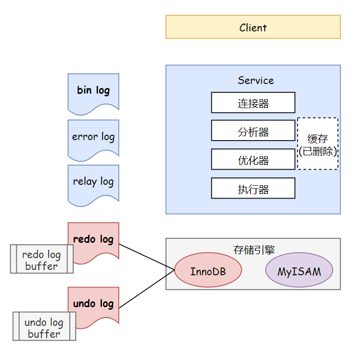


### 1.12.1 buffer pool

`buffer pool`：如果mysql不使用内存缓冲池，每次读取数据时，都需要访问磁盘，会大大的增加磁盘的IO请求，导致效率低下；在Innodb引擎在读取数据的时候，**把相应的数据和索引载入到内存的缓冲池（buffer pool）中**，一定程度的提高了数据的读写速度

buffer pool用来存放**各种数据的缓存**包括：**索引页，数据页，undo页，插入缓冲，自适应哈希索引，innodb存储的锁信息，数据字典等**。工作方式是将数据库文件**按照页（每页16k）读取到缓冲池**，然后按照最近最少使用算法（`LRU`）来保留缓冲池中的缓冲数据。如果数据库文件需要修改，总是首先修改在缓冲池中的页（发生修改后即成为`脏页`），然后在按照一定的频率将缓冲池中的脏页刷新到文件


buffer pool 好处多多，但是引发了新的问题，数据更新不会即使持久化到硬盘，**当系统崩溃时，buffer pool中没有持久化的数据就丢失了**。

为此引入了redolog，将buffer pool中的修改持久化到redolog文件中


redo log 是物理文件，记录了**某个数据页上所做的修改**


**Redo log 和 Undo log：**

redo log 和 undo log文件是分开的，innodb将 undo log的内容看成是数据，因此**对undo log本身的操作都会记录 redo log**

undo log可以不必立即持久化到磁盘上，因为undo log即便丢失了也可以通过redo log将其恢复


因此插入记录时：

1. 向 undo log 插入一条 undo log记录
2. 向 redo log 插入一条"插入undo log记录"的redo log记录
3. 插入数据
4. 向 redo log 插入一条 "insert" 的redo log 记录


### 1.12.2 Redo log

- **redo log记录的是新数据的备份**，在事务提交前，只要将redo log持久化即可，不需要将数据持久化，当系统崩溃的时候，虽然数据没有持久化，但是redo log已经持久化了，系统可以根据redo log的内容将所有数据恢复到最新的状态
- **redo log 是物理日志，记录了对每个页的修改，在事务执行过程中不断的写 redo log buffer，事务提交后将redo log buffer的数据写入到 redo log 文件**
- redo log 文件按 log block 组织，每个block大小未512B，而磁盘扇区大小也是512B，因此redo log的写入可以保证原子性，不需要doublewrite技术

~~~sql
start transaction;
update t_user set name = 'Java1' where user_id = 666;
update t_user set name = 'java2' where user_id = 888;
commit;
~~~

上面的过程，如果666和888在不同的页，当第一页加载到内存，修改后写回磁盘，再去读第二页的时候，mysql宕机了，此时id666修改成功，id888修改失败，数据是有问题的。mysql的办法是用 **redo log**

>mysql内部有个redo log buffer，是内存中一块区域，我们将其理解为数组结构，向redo log文件中写数据时，会先将内容写入redo log buffer中，后续会将这个buffer中的内容写入磁盘中的redo log文件，这个redo log buffer是整个mysql中所有连接共享的内存区域，可以被重复使用。

1. mysql收到start transaction后，生成一个全局的事务编号trx_id，比如trx_id=10

2. user_id=666这个记录我们就叫r1，user_id=888这个记录叫r2

3. 找到r1记录所在的数据页p1，将其从磁盘中加载到内存中

4. 在内存中找到r1在p1中的位置，然后对p1进行修改（这个过程可以描述为：将p1中的pos_start1到pos_start2位置的值改为v1），这个过程我们记为rb1(内部包含事务编号trx_id)，将rb1放入 **redo log buffer** 数组中，此时p1的信息在内存中被修改了，和磁盘中p1的数据不一样了

5. 找到r2记录所在的数据页p2，将其从磁盘中加载到内存中

6. 在内存中找到r2在p2中的位置，然后对p2进行修改（这个过程可以描述为：将p2中的pos_start1到pos_start2位置的值改为v2），这个过程我们记为rb2(内部包含事务编号trx_id)，将rb2放入redo log buffer数组中，此时p2的信息在内存中被修改了，和磁盘中p2的数据不一样了

7. 此时redo log buffer数组中有2条记录[rb1,rb2]

8. mysql收到commit指令，将redo log buffer数组中内容写入到 **redo log文件** 中，写入的内容：

~~~
1.start trx=10;
2.写入rb1
3.写入rb2
4.end trx=10;
~~~

9.  返回给客户端更新成功。

这样之后，实际上内存中的p1、p2被修改了还未同步到磁盘，而是**持久到了redo log中**，也不会丢失
一个成功的事务在redo log中是有start和end的，如果redo log中只有start没有end就说明是有问题的

**回写到磁盘：** 当redo log满了，或者系统比较闲的时候，就会对redo log中的内容进行读取，对完整的trx_id对应的信息进行处理，如果p1在内存中还存在，直接将p1的信息回写到所在磁盘位置，如果不存在则将p1从磁盘中加载到内存，通过redo log中信息在内存中对p1进行修改，回写到磁盘。然后释放redo log中trx_id=10的空间区域。如果redo log中对应的trx_id没有end，则跳过不处理


redo文件是循环利用的，即文件写满了，就会从头开始写，重复利用空间。在很多资料上，Redo Log文件都会被画成一个环，实际上也确实如此


#### LSN 和 恢复

**数据库宕机后redo log怎么判断哪些数据需要刷盘？**

**LSN概念**：即`Log Sequence Number`，标记了**日志的序列号**，是一个单调递增的64位无符号整数，LSN表示**事务写入redo log的字节总量**

此外，**每个数据页也记录了LSN**，该页的LSN用来判断是否需要恢复操作

> 例如页 P1 的LSN为10000，而数据库启动时，redo log的LSN为13000，并且事务已经提交，那么数据库需要进行恢复，将 redo log 日志中10000到13000字节的数据应用到页 P1，对于 redo log 中LSN小于P1 LSN的日志则不需要重做了，因为P1页中已经有了


**Chickpoint概念**：一个保存点，在这个点之前的数据修改页（redo log LSN < Chickpoint LSN）都已经写入到磁盘文件了，**InnoDB每次刷盘都会更新Chickpoint**，即把`此次更新中最新的 redo log LSN`更新到`Chickpoint LSN`中，方便恢复数据的时候作为起始点的判断


一般来说，磁盘文件页中的`LSN`都会小于Redo中`最新的redo log LSN`，那么这两者之间的数据块，就是没有刷入磁盘数据文件的数据块了，在崩溃重启后，数据库只需要将redo中这部分没有刷入磁盘的数据块刷到数据文件中就可以了（当然还要利用binlog判断该redolog到底是否是成功的事务），这样崩溃恢复的速度就会大大提高


**恢复**

InnoDB引擎在启动时，保护管上次数据库运行时是否正常，都会尝试进行恢复操作。

redo log记录的是物理日志，恢复速度比 binlog 的逻辑日志快很多


#### 物理日志 redo log

redo log 是 物理日志

例如对于下面表执行：

```sql
create table t (a int, b int, primary key(a), key(b));

# 执行：
insert into t select 1,2;
```

需要对聚集索引页和辅助索引页进行操作，redo log大致为：

```
page(2,3), offset 32, value(1,2)  #聚集索引
page(2,4), offset 64, value 2     #辅助索引
```


**由于redo log 是物理日志，所以是幂等的！！**

而binlog 是逻辑日志，即使设置为 ROW 格式，也不是幂等的

例如 insert 操作，在binlog中就不是幂等的，重复执行可能会插入重复的多条记录，而对于redo log是幂等的


### 1.12.2 WAL机制和组提交

WAL：

- WAL机制 (Write Ahead Log)定义:

  WAL指的是**对数据文件进行修改前，必须将修改先记录日志**。MySQL为了保证ACID中的一致性和持久性，使用了WAL

- Redo log的作用:

  Redo log就是一种WAL的应用。当数据库忽然掉电，再重新启动时，MySQL可以通过Redo log还原数据。也就是说，每次事务提交时，不用同步刷新磁盘数据文件，只需要同步刷新Redo log就足够了。**相比写数据文件时的随机IO，写Redo log时的顺序IO能够提高事务提交速度**


组提交：

若事务为非只读事务，则事务每次提交都需要fsync操作，以保证redolog都已经写入磁盘。磁盘的fsync性能有限，为了提高磁盘fsync效率，数据库提供了group commit的功能，即一次fsync操作可以刷新确保多个事务的日志被写入文件

- 在没有开启binlog时

**Redo log的刷盘操作将会是最终影响MySQL TPS的瓶颈所在**。为了缓解这一问题，MySQL使用了组提交，将多个刷盘操作合并成一个，如果说10个事务依次排队刷盘的时间成本是10，那么将这10个事务一次性一起刷盘的时间成本则近似于1。

- 当开启binlog时

  为了保证Redo log和binlog的数据一致性，MySQL使用了二阶段提交，由binlog作为事务的协调者。而 引入二阶段提交 使得binlog又成为了性能瓶颈，先前的Redo log 组提交 也成了摆设。为了再次缓解这一问题，**MySQL增加了binlog的组提交**，目的同样是将binlog的多个刷盘操作合并成一个，结合Redo log本身已经实现的 组提交，分为三个阶段(Flush 阶段、Sync 阶段、Commit 阶段)完成binlog 组提交，最大化每次刷盘的收益，弱化磁盘瓶颈，提高性能

  

  https://mp.weixin.qq.com/s/_LK8bdHPw9bZ9W1b3i5UZA


### 1.12.3 Redo log的两阶段提交

再看mysql对sql语句的执行顺序：

~~~
update t1 set c=c+1 where ID=2;
~~~

1. **执行器**首先找存储引擎取ID=2的这一行，**存储引擎**进行搜索，如果ID=2在内存中，就直接返回，否则从磁盘读入内存，然后返回
2. **执行器**拿到存储引擎给的数据，将c进行`加1`，得到新的一行数据，再次调用**存储引擎**进行`写入`
3. **存储引擎将**这行新的数据`更新到内存`，同时将这个更新操作`记录到redo log`文件中，此时redo log处于prepare阶段，然后告知执行器执行完成
4. **执行器**生成这个操作的`bin log`，并把bin log`写入磁盘`
5. 执行器调用**存储引擎**的提交事务接口，把刚刚写入的`redo log改成commit`状态


- **Flush阶段**：将redo log中prepare阶段的数据flush刷盘(组提交)， 同时将bin log数据写入缓冲区
  - redo log 从 redo log buffer 写入到os的文件系统缓存后，为了确保写入磁盘，必须进行一次 `fsync`操作，由于fsync效率取决于磁盘性能，因此磁盘性能决定了事务提交的性能，为了避免频繁多次刷盘，redo log 可以进行组提交
  - 若完成后崩溃，则binlog不保证有该事务，MySQL重启之后可能会回滚该事务
  - `innodb_flush_log_at_trx_commit`参数（默认1）：
    - 为0时：**延迟写**，每隔一秒jian给redo log buffer的数据写入os buffer，然后写入磁盘的redo log文件，写入效率最高，但是安全性最低
    - 为1时，**实时写实时刷**，事务每次提交都将redolog写入文件系统缓存，并且调用`fsync()`将文件系统缓冲区中的数据真正写入磁盘，确保不会丢失数据。写入效率最低，但是安全性最高。设置为1才能保证事务的持久性
    - 为2时，**实时写延时刷**，事务提交也会写入到redolog buffer 和 os的文件buffer，但是不会调用`fsync()`，而是让文件系统自己去判断何时将缓存写入磁盘，属于是平衡效率和安全性

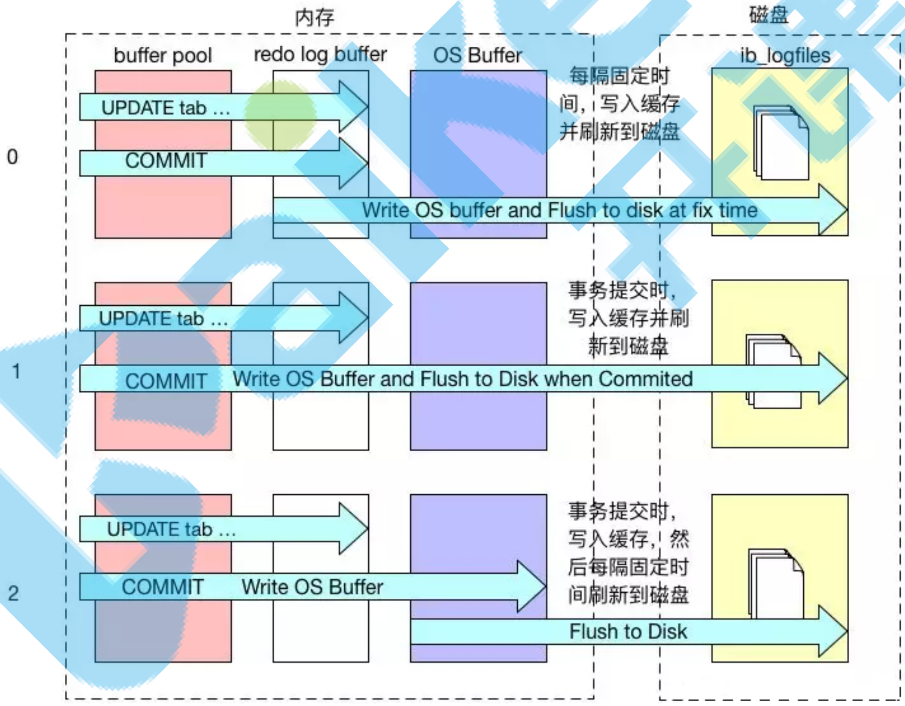

- **Sync阶段**：对bin log的组提交，若完成后数据库崩溃，由于binlog已经记录了事务，重启后可以通过redo log继续进行事务提交
  - binlog_group_commit_sync_delay=N：在等待N μs后，开始事务刷盘(图中Sync binlog)
  - binlog_group_commit_sync_no_delay_count=N：如果队列中的事务数达到N个，就忽视binlog_group_commit_sync_delay的设置，直接开始刷盘(图中Sync binlog)
- **commit阶段**：将redo log中已经prepare的事务在引擎中提交。无需刷盘了，Flush的redo log已经够保证数据库崩溃的数据安全。完成最后的引擎提交使Sync可以进行下一组事务的处理
- **直接写完redo log提交commit再写binlog的问题**：redo写完，事务提交，binlog还没写完，系统崩溃，此时可以通过redo恢复。但是由于binlog没写完，binlog里缺少sql语句，因此，之后备份日志的时候，存起来的binlog就缺少了这条语句，如果用binlog恢复临时库就会缺少更新，与原库数据不同
- **先写完binlog提交再写redo log的问题**：binlog写完如果crash，redo没写完，所以崩溃之后这个事务无效，之后用binlog恢复的时候就多出了一个事务，恢复的依然与原数据库不同
- **只有两个日志都写完之后才能提交事务**

那么他们俩是如何配合进行**故障恢复**来保证crash-safe的呢？

- 它们有一个共同的事务ID字段TRX_ID。崩溃恢复的时候，会按顺序扫描 redo log
  - 如果在prepare阶段就crash，则该事务是不会被持久化为prepare状态到redo log的
  - 如果碰到既有 prepare、又有 commit 的 redo log，就直接提交
  - 如果碰到只有 parepare、而没有 commit 的 redo log，就拿着 TRX_ID 去 binlog 找对应的事务，**由binlog决定提交还是回滚**，如果binlog中存在该事务则commit提交，否则回滚事务


**MySQL如何判断一个事务的bin log是否完整?**

- row 格式的 binlog，最后会有一个 XID event
- statement 格式的 binlog，最后会有 COMMIT


**什么是crash safe？**

- CrashSafe指MySQL服务器宕机重启后，能够保证：`所有已经提交的事务的数据仍然存在。所有没有提交的事务的数据自动回滚`。


**如果只使用binlog可以实现crash safe嘛？**

- 不能
- 已经刷盘的数据，redolog会进行标记（chickpoint机制和LSN机制），而binlog没有这种机制，所以crash后binlog无法判断事务中哪些刷盘了哪些没刷盘，就没办法进行正常的恢复
- 如果 binlog 写入成功了（write），数据还没写入磁盘（fsync），数据库异常崩溃，重启后主库没有这部分数据，而通过 binlog 同步的从库却有了这部分配置，**导致主从数据不一致**


**如果只使用redolog可以实现crash safe嘛？**

- 可以的，但是bin log有着redo log无法替代的功能：`归档`(因为redo log会循环写，日志历史没法保留)，`高可用系统的实现`(MySQL集群基于binlog的复制)，因为历史原因，mysql系统很多方面都依赖于binlog，是mysql一开始就有的功能，所以没有办法去替代这些功能


### 1.12.4 Redo log和bin log的区别

为什么有这样两份日志呢：

一开始MySQL 里并没有 InnoDB 引擎。MySQL 自带的引擎是 MyISAM，但是 MyISAM 没有 crash-safe 的能力，binlog 日志只能用于**归档**。而 InnoDB 是另一个公司以插件形式引入 MySQL 的，既然只依靠 bin log 是没有 crash-safe 能力的，所以 InnoDB 使用另外一套日志系统——也就是 redo log 来实现 crash-safe 能力

- redo log是**InnoDB引擎层**的日志，而bin log是**MySQL Server层**记录的日志，虽然记录有重复，但是格式是不一样的
- redo log记录数据的修改，**不管事务是否提交都会记录下来**。是**物理日志**，记录对于每个数据页的**修改**，用于数据库异常重启的时候进行恢复，**redo log日志的大小是固定的，记录满了以后就要从头`循环写`**，当然覆盖之前会保证更新到磁盘先
- bin log又称为归档日志，属于**逻辑日志**，二进制形式记录的是语句的**原始逻辑**。不记录真实数据，所以**依靠binlog是没有crash-safe的能力的**，bin log是**`追加写`的方式**，一份文件写到一定的大小就会更换下一份文件，**不会覆盖**
- 写入时机：binlog只在事务提交后进行一次写入，而redolog在事务进行中不断写入（redolog不是随事务提交顺序写入的，而是按实际语句的执行顺序）。而这也是后面RR级别的binlog的statement格式在主从复制有问题的原因！
- bin log可以用作恢复数据的时候使用，也可以用作主从复制，而redo log用于异常宕机或者介质故障后的数据恢复使用


## 1.13 undo log 和 slow log

### undo log

- undo log是为了实现事务的`原子性`，在MySQL的InnoDB存储引擎中用还用undo log来实现`多版本并发控制(MVCC)`
- **为了满足事务原子性，每次对记录操作前，都会把旧值备份到undo log，如果执行出错或者用户主动执行rollback，系统可以利用undo log中的备份将数据恢复到事务开始之前的状态**，备份之后才进行数据的修改

- redo log基本上都是是顺序写的，而undo log是需要进行**随机读写**的
- **磁盘上不存在单独的 undo log 文件**，它存放在数据库内部的特殊段(segment)中，这称之为 **undo 段**，innodb为每行undo log记录都实现了三个隐藏字段
  - 6字节的事务ID (`DB_TRX_ID`)
  - 7字节的回滚指针 (`DB_ROLL_PTR`)
  - 隐藏的ID
- **undo log会产生redo log**，也就是说undo log的产生会伴随着redo log的产生，因为undo log也需要持久性的保护


**undo log的用途：**

- 保证`事务`进行`rollback`时的`原子性和一致性`，当事务进行`回滚`的时候可以用undo log的数据进行`恢复`。
- 用于MVCC`快照读`的数据，在MVCC多版本控制中，通过读取`undo log`的`历史版本数据`可以实现`不同事务版本号`都拥有自己`独立的快照数据版本`。


**undo log主要分两种：**

- `insert undo log`：代表事务在insert新记录时产生的undo log , 由于insert操作只对事务自己可见，所以在事务提交后可以立即删除

- `update undo log（主要）`：事务在进行update或delete时产生的undo log ; 这种undo log可能需要提供MVCC机制，不仅在事务回滚时需要，在快照读时也需要，所以不能在事务提交时删除。只有在快照读或事务回滚不涉及该日志时，对应的日志才会被purge线程统一清除


**undo log的删除**

当事务提交的时候，innodb不会立即删除undo log，因为后续还可能会用到undo log，如隔离级别为repeatable read时，事务读取的都是开启事务时的最新提交行版本，只要该事务不结束，该行版本就不能删除，即undo log不能删除。但是在事务提交的时候，会将该事务对应的undo log放入到删除列表中，未来通过purge来删除

- delete操作实际上不会直接删除，而是将delete对象打上delete flag，标记为删除，最终的删除操作是purge线程完成的。

- update分为两种情况：update的列是否是主键列

  - 如果不是主键列，在undo log中直接反向记录是如何update的。即update是直接进行的
  - 如果是主键列，update分两部执行：先删除该行，再插入一行目标行

  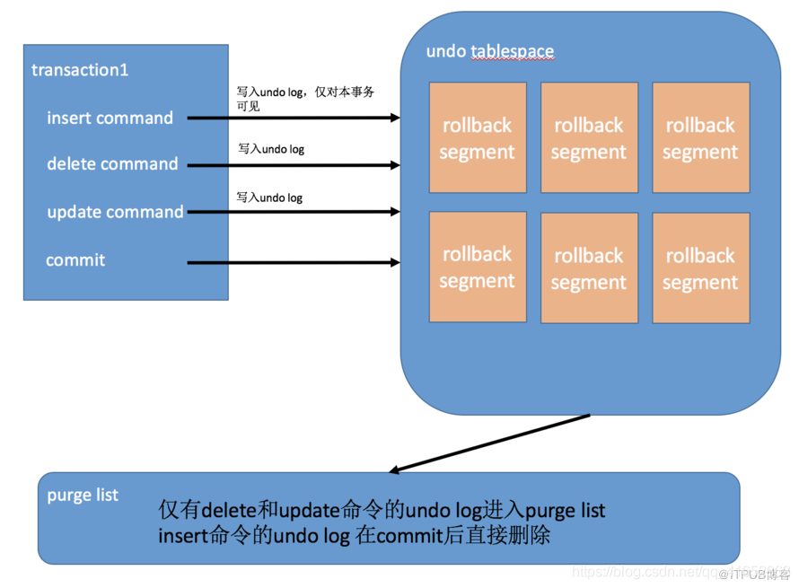


### slow log

慢查询定义：

> MySQL的慢查询日志是MySQL提供的一种日志记录，用来记录在MySQL中响应时间超过阀值的语句，具体指运行时间超过long_query_time值的SQL，则会被记录到慢查询日志中。


相关参数：

- `slow_query_log`：是否开启慢查询日志，1表示开启，0表示关闭。
- log-slow-queries：旧版（5.6以下版本）MySQL数据库慢查询日志存储路径。可以不设置该参数，系统则会默认给一个缺省的文件host_name-slow.log
- `slow-query-log-file`：新版（5.6及以上版本）MySQL数据库慢查询日志存储路径。可以不设置该参数，系统则会默认给一个缺省的文件host_name-slow.log
- `long_query_time`：慢查询阈值，当查询时间高于设定的阈值时，记录到日志
- `log_queries_not_using_indexes`：未使用索引的查询也被记录到慢查询日志中（可选项）

默认情况下慢查询日志是禁用的，需要手动开启

默认情况下`long_query_time`的值是10秒，可以修改，一般设置为1秒，业务敏感还可以设置更低


## 1.14 MVCC详解

MVCC（Multi Version Concurrency Control）只工作在两种事务级别底下：`Read Committed `和 `Repeatable Read`, 因为READ UNCOMMITTED总是读取最新的数据，不符合当前事务版本的数据行，Serializable则会对所有的行加锁，都不需要MVCC

- 对于Read Commited级别：**读取的是最新版本的数据**

- 对于Repeatable Read级别：**读取的一直都是当前事务开启之前的最后一个版本状态**

### 1.14.1 当前读和快照读

**当前读**：读取的都是数据当前最新的版本，**会对当前读取的数据进行加锁，防止其他事务修改数据**，是一种`悲观锁`的操作。如：

- select ... lock in share mode （共享锁）
- select ... for update （排它锁）
- update （排它锁）
- insert （排它锁）
- 相当于提升到SERIALIZABLE隔离级别

**快照读**：快照读的实现是基于多版本并发控制，即MVCC，多版本，就不一定是当前最新的数据，有可能是历史版本的数据。如：

- 不加锁的select操作（非串行化级别）

### 1.14.2 数据库并发场景

- `读-读`：不存在任何问题，不需要并发控制
- `读-写`：有线程安全问题，可能会造成事务隔离性的问题，可能遇到脏读，幻读，不可重复读
- `写-写`：有线程安全问题，可能会存在更新丢失的问题，比如第一类丢失更新，第二类丢失更新

### 1.14.3 MVCC解决的问题

MVCC就是为事务分配一个单项增长的时间戳(版本号)，`读操作只读取该事务开始前的数据库快照`

- **并发多读一写时**：可以做到读操作不阻塞写操作，同时写操作也不会阻塞读操作。**读写操作互不阻塞**
- 解决**脏读、幻读、不可重复读**等事务隔离问题，但是**不能解决写写丢失更新的问题**

不同存储引擎对MVCC的实现是不同的：

- `悲观MVCC`：MVCC解决读写冲突，悲观锁解决写写冲突
- `乐观MVCC`：MVCC解决读写冲突，乐观锁解决写写冲突


InnoDB的MVCC是通过在每行记录后面保存两个隐藏列来实现的

### 1.14.4 MVCC的实现原理

MVCC的实现原理主要是通过`版本链、undo log、read view`


**版本链**

数据库每行的数据，除了我们能查看到的之外，还有三个隐藏字段（Undo log的segment字段）

- `DB_TRX_ID`：6B，记录插入或更新该行的最后一个事务的**事务ID**
- `DB_ROLL_PTR`：7B，**回滚指针**，指向这条记录的上一个版本（rollback segment中）
- `DB_ROW_ID`：6B，隐藏的自增ID(**隐藏主键**)，如果数据库没有指定主键，则会以DB_ROW_ID产生一个聚簇索引
- 实际上还有一个删除flag隐藏字段，记录被更新或者删除并不代表真正的删除，而是删除的flag改变了


每次对数据库的记录进行更改的时候，都会生成一条undo log日志，每条undo log也都有一个`DB_ROLL_PTR`属性，随着更新次数的增多，所有的版本都会被`roll_ptr`属性连接成一个`链表`，将这些undo log串起来，就形成了**`版本链`**。另外，每个版本中还包含生成该版本时对应的`事务id`，这个信息很重要，在根据ReadView判断版本可见性的时候会用到


**Read View(读视图)可见性判断**

事务开启（并不是begin/start事务的时候，刚开始并不会立即分配事务id，而是真正执行了操作才会分配事务id）的时候会被分配一个递增的事务id，事务进行`快照读`操作的时候会生产`读视图`(Read View)。在该事务执行的快照读的那一刻，会生成数据库系统当前的一个`快照`

快照记录并维护系统当前`活跃事务的ID`，是系统中当前不应该被`本事务`看到的`其他事务id列表`

Read View的几个属性：

- `min_trx_id`：read view生成时，活跃事务id列表中的最小id
- `max_trx_id`：read view生成时，数据库即将分配的事务id，也就是当前已创建最大事务id+1


**Read View的控制**：

一个事务在对一行数据做读取操作的时候，会从undo log历史版本链中**从最新版本开始往前比对**，通过一系列的规则，根据快照版本中的trx_id字段和read view来确定该版本对于当前事务是否可见，**如果当前比对版本不可见，那么就通过roll_pointer找到上一个版本进行比对**，直到找到可见版本或找不到任何一个可见版本。这些规则定义如下：

对某一行数据的trx_id：

- 如果 **trx_id < min_trx_id**，则说明该版本对于当前事务(read view)来说，是已提交事务生成的，那么对于当前事务**可见**。
- 如果**trx_id >= max_trx_id**：则说明该版本对于当前事务(read view)来说，是"将来"的事务生成的，那么对于当前事务**不可见**。
- 如果**min_trx_id <= trx_id < max_trx_id**：
  - 如果trx_id在read view的**活跃事务id列表**中，则说明该版本对于当前事务(read view)来说，是已开始但未提交的事务生成的，那么对于当前事务**不可见**。
  - 如果trx_id不在read view的**活跃事务id列表**中，则说明该版本对于当前事务(read view)来说，是已提交的事务生成的，那么对于当前事务**可见**。

> 注意：当前事务id也会在活跃事务id列表中，如果undo log是当前事务生成的，那么当然是可见的

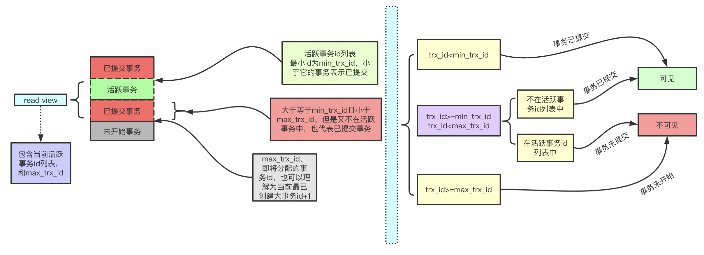

一句话，就是**只显示创建视图的时候已提交的事务**

> 注意：事务并不是begin的时候立即分配事务id，而是真正执行操作的时候才会分配，会产生一个现象：
>
> 
>
> 虽然事务A先begin，但是select的时候仍然是可以看到事务B提交的数据的，因为begin的时候没有真正开始事务，事务A的read view是在select操作的时候生成的，此时事务B对数据修改的快照版本就属于是：trx_id < min_trx_id，属于已提交事务，对A可见


**对于SELECT语句**： InnoDB只查找当前版本(DB_TRX_ID)早于当前事务ID的数据行，并且行的删除版本号(版本链中找)未定义或者高于当前事务ID

**对于INSERT语句**：InnoDB为新插入的每一行保存当前系统版本号作为行版本号

**对于DELETE语句**：InnoDB为删除的每一行保存当前系统版本号作为行删除版本号

**对于UPDATE语句**：InnoDB重新插入一行记录，保存当前系统版本号为新行的版本号，同时保存当前版本号为原来行的删除版本号


### 1.14.5 MVCC和事务隔离级别

上面的`Read View`用于支持`RC`（Read Committed，读提交）和`RR`（Repeatable Read，可重复读）`隔离级别`的实现

**RC读已提交级别下**：每个快照读都会生成并获取最新的Read View，**对之后的修改是可见的**

**RR可重复读界别下**：同一个事务中的第一个快照读才会创建Read View，之后的快照读都是获取的同一个Read View，就不会重复生成了，获取的都是事务开启的时候的最后一个版本状态，**对之后的修改不可见**

至于READ UNCOMMITTED，总是读取的是最新的数据行，不需要多版本并发控制。而SERIALIZABLE则会对所有读取的行都加锁，也不需要MVCC


**MVCC解决幻读的问题**：MVCC解决了快照读的幻读

- `快照读(snapshot read)`：通过MVCC来进行控制的，不用加锁。快照读的时候是不会产生幻读的
- `当前读(locking read)`：可以通过行锁和区间锁来解决问题，相当于变相提高到了serializable级别，从而消除了幻读
- 对于快照读后执行update，则还是会访问最新数据(虽然破坏了可重复读，但是update就是读后写)，所以update时执行的实际上是当前读

解释：https://blog.csdn.net/qq_35590091/article/details/107734005

~~~
//事务1
mysql> select id,name from test where name = "xiaozhang";
+----+-----------+
| id | name      |
+----+-----------+
|  7 | xiaozhang |
+----+-----------+
1 row in set (0.00 sec)

mysql> update test set id = id+1 where name = "xiaozhang";
Query OK, 1 row affected (0.09 sec)
Rows matched: 1  Changed: 1  Warnings: 0

mysql> commit;
Query OK, 0 rows affected (0.04 sec)

//事务2
mysql> select id,name from test where name = "xiaozhang";
+----+-----------+
| id | name      |
+----+-----------+
|  7 | xiaozhang |
+----+-----------+
1 row in set (0.00 sec)

mysql> update test set id = id+1 where name = "xiaozhang";
Query OK, 1 row affected (29.36 sec)	//等待事务1提交释放锁
Rows matched: 1  Changed: 1  Warnings: 0

mysql> select id,name from test where name = "xiaozhang";
+----+-----------+
| id | name      |
+----+-----------+
|  7 | xiaozhang |
|  9 | xiaozhang |
+----+-----------+
2 rows in set (0.00 sec)
~~~


### 1.14.6 互联网项目中选RC而不是RR

Mysql在5.0这个版本以前，binlog只支持`STATEMENT`这种格式！而这种格式在**读已提交(Read Commited)**这个隔离级别下主从复制是有bug的，因此Mysql将**可重复读(Repeatable Read)**作为默认的隔离级别！ 接下来，就要说说当binlog为`STATEMENT`格式，且隔离级别为**读已提交(Read Commited)**时，有什么bug呢？如下图所示，在主(master)上执行如下事务

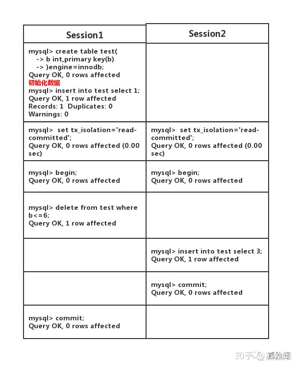

由于RC级别下，事务没有gap锁，Session1在delete b<=6后，Session2依然可以插入b=3，但是在主从复制的时候复制的是binlog，binlog按commit顺序写入STATEMENT格式，会先插入后删除，最后导致Master上有b=3的记录，而Slave上没有。于是出现了数据不一致的问题。


解决方案有两种！

 (1) 隔离级别设为**可重复读(Repeatable Read)**,在该隔离级别下引入间隙锁。当`Session 1`执行delete语句时，会锁住间隙。那么，`Ssession 2`执行插入语句就会阻塞住！ 

(2) 将binglog的格式修改为row格式，此时是基于行的复制，自然就不会出现sql执行顺序不一样的问题！奈何这个格式在mysql5.1版本开始才引入。因此由于历史原因，mysql将默认的隔离级别设为**可重复读**


互联网项目使用RC而不是RR的原因主要是：

1. **RR隔离级别下，存在间隙锁，导致出现死锁的几率比RC大的多**
2. **在RR隔离级别下，条件列未命中索引会锁表！而在RC隔离级别下，只锁行**
3. **在RC隔离级别下，半一致性读(semi-consistent)特性增加了update操作的并发性！**
4. **不可重复读不是问题，因为数据都提交了**

在RC级别下主从复制用的binlog应该是 row 模式，避免上面的bug


上面第2条的解释：

> 例如RR级别 执行`select ... for update`
>
> 所有扫描过的行都会加锁！所以如果没有命中索引，会全表扫描就会将整个表锁住
>
> 所以RR级别的MySQL中使用悲观锁，必须要确定走了索引，否则整个数据表锁住太影响性能的


## 1.15 MySQL分布式集群

**主从复制**，读写分离，不适合写入后立马查询，因为可能还没被同步，这时候可以要求查询必须去主db查询

主从复制一般适用于读远远多于写的情况

此外也有**主主复制，一主多从，多主一从(备份)**的情况

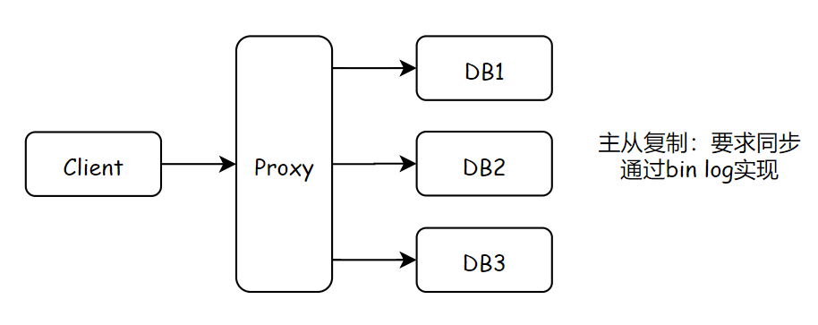

- 主服务器的数据发生修改后，bin log会记录命令，通过IO传输到从服务器，从服务器写入到Relay log中，通过SQL Thread进行重做，以同步


### 1.15.1 binlog

**必须要开启binlog才能进行主从复制**

binlog的数据格式：

- row：把改变的内容直接复制过去（MySQL默认，效率高）
- statement：在主服务器上执行的SQL语句重复去从服务器执行
- mixed：混合

**MySQL如何判断一个事务的bin log是否完整**

- row 格式的 binlog，最后会有一个 XID event
- statement 格式的 binlog，最后会有 COMMIT

### 1.15.2 主从复制的延迟问题

- **所有的读写过程**，以及主从复制延迟的原因

  - 1. Master写入bin log（顺序写）
    2. IO Thread读取bin log（顺序读，局域网或专线，很快）
    3. IO 写入relay log（顺序写）
    4. SQL Thread读relay log（顺序读）
    5. `SQL Thread写，执行sql语句（随机！！！因为不同数据可能不在同一个磁盘块）`
  - 所以整体的延迟，性能瓶颈在于最后**执行replay sql语句的随机写过程**
  - 为了性能应使用多线程执行Replay
  - 由于备库所在机器性能一般都比主库差，备库主要承担读的压力，如果备库查询压力大，就会消耗大量CPU资源，这时候就必然会**影响到主从同步的速度**
  - 对于**大事务**，主库执行完用了很长时间，bin log等待事务完成后才写入，传到备库，这时候已经延迟了很长的时间了。（无解）
  - 从库进行数据同步的时候可能会跟查询的线程发生**锁抢占**的情况，此时也会发生延迟
  - 当**主库的TPS并发非常高**的时候，产生的DDL数量超过一个线程所能承受的范围，也会带来延迟
  - bin log传输的时候，如果**网络带宽不好**，也会造成数据同步的延迟

- Relay的规则：

  - mysql5.6版本的时候，只支持库级复制，效率低，单线程SQL Thread，虽然支持多线程，但是库级复制用处不大

  - mysql5.7开始，引入了并行复制，coordinator负责分发任务给各个线程

    - 由于事务是有执行顺序的，执行顺序不同可能会对结果造成影响，所以coordinator分发的时候，要求**更新同一行的多个事务必须分发到同一个worker**
    - **同一个事务的不同操作(即使是操作不同的行)必须分发到同一个worker**，否则可能破坏事务的原子性，查询到没有完全完成的事务
    - 多库事务？？很难解决，所以引入了`全局事务id，GTID`(全局唯一的id，包含了服务器唯一标识+递增的事务id)
    - 5.7的并行复制策略：enhanced multi-threaded slave（简称`MTS`）技术。`组复制`，当主库的一些事务同时提交的时候进行分组，同时提交意味着不存在锁问题，没有冲突，可以在slave中并行运行事务。**主库中同时处于prepare或者commit状态的事务之间是没有冲突的，在备库是可以并行的**。由于主库采用`组提交`解决写日志时频繁刷磁盘的问题，将多个事务redolog的刷盘动作合并，减少磁盘的顺序写，因此，**一个组提交（group commit）的事务都是可以并行回放**，因为**这些事务都已进入到事务的prepare阶段**，则说明事务之间没有**任何冲突**（否则就不可能提交）
    - 5.7引入了新的变量`slave-parallel-type`：`DATABASE`（默认值，基于库的并行复制方式）、`LOGICAL_CLOCK`（基于组提交的并行复制方式）
    - 如何知道两个事务是一个组呢？mysql5.7将组提交的信息存放在`GTID`中。GTID记录了**prepare阶段的全局计数器值**(global counter，每次存储引擎提交，计数器就会自增)，所以只要GTID中的全局计数值一样，就说明是一个组的事务

    

### 1.15.3 读写分离

读写分离一般使用Mycat或者Amoeba变形虫

读写分离顾名思义就是读和写分离了，对应到数据库集群一般都是一主一从(一个主库，一个从库)或者一主多从(一个主库，多个从库)，业务服务器把需要**写的操作都写到主数据库中，读的操作都去从库查询**。**主库会同步数据到从库保证数据的一致性**


在单机的情况下，一般我们做数据库优化都会加索引，但是加了索引对查询有优化，但是会影响写入，因为写入数据会更新索引。所以做了主从之后，我们可以单独的针对从库(读库)做索引上的优化，而主库(写库)可以减少索引而提高写的效率


**主从同步延迟问题**

1. 二次读取：意思就是读从库没读到之后再去主库读一下

2. 写之后的马上的读操作访问主库

3. 关键业务读写都由主库承担，非关键业务读写分离

### 1.15.4 分库

假设数据库中有两张表分别是用户表和订单表。如果要分库的话需要两台机子，搞两个数据库分别放在两台机子上，并且一个数据库放用户表，一个数据库放订单表。但是会带来新的问题：

1. **联表查询**：也就是join了，之前在一个数据库里面可以用上join用一条sql语句就可以联表查询得到想要的结果，但是现在分为多个数据库了，所以join用不上了。

2. **事务问题**：搞数据库基本上都离不开事务，但是现在不同的数据库事务就不是以前那个简单的本地事务了，而是分布式事务了，而引入分布式事务也提高了系统的复杂性。

### 1.15.5 分表

虽然已经分库了，但是一个表中的数据还是有可能存不下，就得分表了，分表又有垂直分表和水平分表两种情况

**垂直分表**：将表中存在**不常用并且占用了大量空间的字段**拆分出去，带来的影响就是以前只需要一次查询就得到全部信息，现在需要两次查询，将信息组合。而且无法解决单表数据过大的问题(需要水平分表了)

**水平分表**：用户数量太多了，所以水平切分表，当一个表行数超过**千万级别的时候**关注一下，但是水平分表带来的问题比垂直分表还多：

- 按id分：范围路由，将不同值范围内的id分到同一张表中，容易分，但是范围不好选取
- 按哈希分：取几列做哈希，取模，确定分到哪个表，这样分的均匀，但是新增数据后如果又要分表的话，以前的表都得动，麻烦-------一致性哈希？
- 用一张表存储路由关系，记录每个记录在哪个表中，但是再分表还要改路由表，并且每次查询都要查询两次，如果路由表太大，路由表又变成了性能瓶颈


## 1.16 MySQL优化


# 2. JDBC           

Java DataBase Connectivity          
- 官方(sun)定义的一套操作所有关系型数据库的接口，各个关系型数据库厂商均实现了这些接口，提供数据库驱动jar包。我们使用这套接口(JDBC)编程，真正执行的代码是驱动jar包中的实现类       

## 2.1 整体步骤         
1. 导入jar包：复制到目录，add as library
2. 注册驱动 ：          
3. 获取数据连接对象 Connection
4. 定义 sql
5. 获取执行sql 语句的对象 Statement
6. 执行sql ，接收返回的结果
7. 处理结果  
8. 释放资源 

~~~java
public class DemoJDBCPractice {
    public static void main(String[] args) {
        
        //提升释放的资源的作用域
        Connection connectionnn = null;
        Statement statement = null;
        try {
            //1. 注册驱动包   MySQL8.0以上版本使用com.mysql.cj.jdbc.Driver
            Class.forName("com.mysql.jdbc.Driver");

            //2. 获取数据库连接对象
            connectionnn = DriverManager.getConnection("jdbc:mysql://localhost:3306/mydb?characterEncoding=utf8&useSSL=false", "root", "janshan123");
            
            //3. 获取执行sql的对象
            statement = connectionnn.createStatement();

            //4. 定义sql
            //String sql = "insert into student values(124,'小蓝','北京',null)";
            //String sql = "update student set address='上海' where id = 121";
            String sql = "delete from student where name='小蓝'";
            
            //5. 执行sql，处理结果
            int count = statement.executeUpdate(sql);
            System.out.println("count=" + count);

        } catch (ClassNotFoundException e) {
            e.printStackTrace();
        } catch (SQLException throwables) {
            throwables.printStackTrace();
        } finally {

            //6. 释放资源
            if (statement != null) {    //空指针判断
                try {
                    statement.close();
                } catch (SQLException throwables) {
                    throwables.printStackTrace();
                }
            }

            try {
                connectionnn.close();
            } catch (SQLException throwables) {
                throwables.printStackTrace();
            }
        }
    }
}
~~~

## 2.2 常用类   
### 2.2.1 DriverManager：驱动管理对象 
**功能：**
1. **注册驱动** 
- `static void registerDriver(Driver driver)`        
- MySQL5之后驱动jar包可以省略注册驱动的步骤，会自动注册驱动
~~~java
public class Driver ...{
    ...
    static {        //使用Class.forname加载类的时候执行了该类的静态代码块
        try {
            DriverManager.registerDriver(new Driver()); //实际调用DriverManager注册驱动
        } catch (SQLException var1) {
            throw new RuntimeException("Can't register driver!");
        }
    }
    ...
}
~~~

2. **获取数据库连接对象** 
- `public static Connection getConnection(String url)`
- `static Connection getConnection(String url,String user, String password)`  
- url语法：`jdbc:mysql://ip地址:端口/数据库名称` ，本地数据库直接省略 ip:端口

### 2.2.2 Connection：数据库连接对象
1. **获取执行sql的对象**        
- `Statement createStatement()`     
- `PreparedStatement prepareStatement(String sql)`  
2. **管理事务**  
- `boolean getAutoCommit(boolean autoCommit)`  开启事务
- `void commit()`  提交事务
- `void rollback()`   回滚
### 2.2.3 Statement：执行静态sql的对象    
- `boolean execute(String sql)`  执行任意sql，不常用
- `int executeUpdate(String sql)` 执行**DML**(insert、update、delete) 和 DDL(create、alter、drop)，DML返回值是**影响的行数**，DDL返回0  
- `ResultSet executeQuery(String sql)` 执行**DQL**(slelect) 
### 2.2.4 ResultSet：结果集对象     
- `boolean next()`  游标向下移动，并判断是否位于最后一行之后，最开始移动前位于第一行之前
- `Xxx getXxx(int columnIndex)`  根据列的编号(从1开始)返回对应类型的数据
- `Xxx getXxx(String columnLabel)`  根据列的标签返回对应数据        
~~~java
//查询示例，查询结果并封装为对应的对象      
class Student {     //根据查询创建相应的对象
    private int id;
    private String name;
    private String address;
    private Timestamp add_time;

    public Student(int id, String name, String address, Timestamp add_time) {
        this.id = id;
        this.name = name;
        this.address = address;
        this.add_time = add_time;
    }

    @Override
    public String toString() {
        return '\n'+
                "Student{" +
                "id=" + id +
                ", name='" + name + '\'' +
                ", address='" + address + '\'' +
                ", add_time=" + add_time +
                '}';
    }
}

public class DemoJDBCPractice2 {

    public static void main(String[] args) {
        List<Student> students = new DemoJDBCPractice2().findAll();
        System.out.println(students);
    }

    public List<Student> findAll(){
        Connection connection = null;
        Statement statement = null;
        List<Student> students = new ArrayList<>();     //使用列表存储student对象
        try {
            Class.forName("com.mysql.jdbc.Driver");

            connection = DriverManager.getConnection("jdbc:mysql://localhost:3306/mydb?useSSL=false", "root", "janshan123");

            statement = connection.createStatement();

            String sql = "select * from student";

            ResultSet resultSet = statement.executeQuery(sql);
            while(resultSet.next()){
                int id = resultSet.getInt("id");
                String name = resultSet.getString("name");
                String address = resultSet.getString("address");
                Timestamp add_time = resultSet.getTimestamp("add_time");
                students.add(new Student(id, name, address, add_time));
            }

        } catch (ClassNotFoundException e) {
            e.printStackTrace();
        } catch (SQLException throwables) {
            throwables.printStackTrace();
        }finally{
            if(statement!=null){
                try {
                    statement.close();
                } catch (SQLException throwables) {
                    throwables.printStackTrace();
                }
            }

            try {
                connection.close();
            } catch (SQLException throwables) {
                throwables.printStackTrace();
            }
            return students;
        }
    }
}

/*
[
Student{id=121, name='小红', address='上海', add_time=2020-08-09 16:08:10.0}, 
Student{id=123, name='小强', address='深圳', add_time=2020-08-08 18:32:40.0}]
*/
~~~

- 但是上述方法很麻烦，更好的办法是写一个工具类：
~~~java
public class JDBCS {
    private static String url;
    private static String user;
    private static String password;
    private static String driver;

    static { //静态代码块只在类加载的时候执行一次，读取相关的参数
        try {
            Properties pro = new Properties();  //创建Properties

            //获取src路径下文件
            ClassLoader classLoader = JDBCS.class.getClassLoader();
            URL resource = classLoader.getResource("jdbc.properties");
            String path = resource.getPath();

            //加载Properities的配置
            pro.load(new FileReader(path));
            url = pro.getProperty("url");
            user = pro.getProperty("user");
            password = pro.getProperty("password");
            driver = pro.getProperty("driver");

            //注册驱动
            Class.forName(driver);
        } catch (IOException e) {
            e.printStackTrace();
        }catch (ClassNotFoundException e) {
            e.printStackTrace();
        }
    }
    
    //定义连接数据库的函数
    public static Connection getConnection() throws SQLException {
        return DriverManager.getConnection(url, user, password);
    }

    //定义最后抛出异常的函数
    public static void close(Statement statement, Connection connection) {
        if (statement != null) {
            try {
                statement.close();
            } catch (SQLException e) {
                e.printStackTrace();
            }
        }

        try {
            connection.close();
        } catch (SQLException e) {
            e.printStackTrace();
        }
    }

    public static void close(ResultSet resultSet, Statement statement, Connection connection) {

        if (resultSet != null) {
            try {
                resultSet.close();
            } catch (SQLException throwables) {
                throwables.printStackTrace();
            }
        }

        close(statementm, connextion)
    }
}
~~~

### 2.2.5 PreparedStatement：执行sql的对象  

- **SQL注入问题：** 在拼接sql时，一些sql的特殊关键字参与字符串的拼接会造成安全问题      
~~~java
//例如登录时的查询
String sql = "select * from users where userid=" + userid + " and password='" + password + "'";

//如果登录时输入：
输入用户id：
10000
输入密码：
a' or 'a'='a

//则会登录成功，因为此时的sql语句实际上是：
select * from users where userid=10000 and password='a' or 'a'='a'  
~~~

**解决办法：PreparedStatement**
- 预编译sql，使用参数？作为占位符       
- 获取PreparedStatement对象:            
    `PreparedStatement Connection.prepareStatemnt(String sql)`      
- 给 ? 赋值：`preparedStatement.setXxx(参数编号, 参数的值)`         
- 直接调用无参`executeQuery()`或者`executeUpdate()`执行     


~~~java
        String sql = "select * from users where userid = ? and password = ?";
        preparedStatement = connection.prepareStatement(sql);
        preparedStatement.setInt(1, userid);
        preparedStatement.setString(2, password);
        resultSet = preparedStatement.executeQuery();
~~~

### 2.2.6 JDBC控制事务  

**使用Connection管理事务**  
- `boolean setAutoCommit(boolean autoCommit)`  开启事务
- `void commit()`  提交事务
- `void rollback()`   回滚

~~~java
        try{
            ......
            //开启事务
            connection.setAutoCommit(false);
            ....
            //提交事务
            connection.commit();
        } catch (SQLException throwables) {
            try {
                //有异常时回滚事务，判空
                if (connection != null) {
                    connection.rollback();
                }
            } catch (SQLException e) {
                e.printStackTrace();
            }
            throwables.printStackTrace();
        } finally {
            JDBCS.close(resultSet, preparedStatement, connection);
        }

~~~

## 2.3 数据库连接池     
- 数据库连接池时一个存放数据库连接的容器。当系统初始化好后，容器被创建，并申请一些连接对象，用户访问数据时，从容器中获取连接对象，访问完之后把连接对象归还给容器。达到**节约资源**和用户**高效访问**的目的

- 数据库连接池的标准接口：**DataSource**，获取连接的方法 `getConnection()`，由数据库厂商来实现          
- 如果连接对象 connection 是从连接池获取的，那么调用 close() 方法时不再关闭连接，而是归还给连接池           

### 2.3.1 C3P0 数据库连接池
- 注意 c3p0-0.9.5.2.jar 包 依赖 mchange-commons-java-0.2.12.jar 包， 同样要导入数据库驱动jar包
- 配置文件：c3p0.properties 或者 c3p0-config.xml , 放在 src 目录
- 创建核心对象 `ComboPooledDataSource`   
- 获取连接对象 `getConnection()`    

~~~java
        //获取数据库连池接对象
        DataSource dataSource = new ComboPooledDataSource("otherc3p0"); //无参时使用默认配置

        //获取数据库连接对象
        Connection connection = dataSource.getConnection();
~~~

### 2.3.2 Druid
- durid-1.0.9.jar       
- 配置文件 durid.properties 可以叫任意名字放在任意地方(手动加载)        
- 获取数据库连接池对象，工厂类 `DruidDataSourceFactory`     

~~~java
        Reader rr = new FileReader("jdbc/src/druid.properties");
        Properties properties = new Properties();
        properties.load(rr);
        DataSource dataSource = DruidDataSourceFactory.createDataSource(properties);

        Connection connection = dataSource.getConnection();
~~~

## 2.4 Spring JDBC  
- Spring 框架对JDBC 的简单封装，提供了一个 `JDBCTemplate` 对象简化JDBC 的开发               

**创建JdbcTemplate对象**            
~~~java
    JdbcTemplate template = new JdbcTemplate(dataSource)
~~~

**CRUD操作**    
- `update(String sql)` 执行DML语句    
- `Map<String, Object> queryForMap(String sql)` 查询结果，封装为 Map，**只能查询一条记录**，列明为key，值为value       
- `List<Map<String, Object>> queryForList(String sql)` 查询结果集，封装为List，**List里存放的是Map**，一条记录封装为一个Map，装载到List           
- `List<T> query(String var1, RowMapper<T> var2)`  查询结果，封装为 JavaBean 对象         
- `T queryForObject(String var1, Class<T> var2)` 查询结果，封装为对象，也可以传入RowMapper       
- 自动释放资源，无需再手动释放资源


~~~java
public class DemoJDBCTemplate {
    public static void main(String[] args) {

        //获取连接池对象
        DataSource dataSource = JDBCDataSources.getDataSource();

        //创建Jdbctemplate对象
        JdbcTemplate template = new JdbcTemplate(dataSource);

        String sql = "update student set address = ? where id = 121";
        //传入sql语句 和 参数
        template.update(sql, "北京");

        sql = "select * from student";
        List<Student> students = template.query(sql, new BeanPropertyRowMapper<Student>(Student.class));

        for(Student student:students){
            System.out.println(student);
        }
    }
}
~~~

- **BeanPropertyRowMapper** 是 **RowMapper** 的实现类，通过无参构造创建对象，所以传入的类必须有 setter 方法，否则创建的全是初始化的对象       

# 3. Redis     
## 3.1 sql和nosql
- redis是一款高性能的NOSQL(Not Only SQL)系列的非关系型数据库
- 数据存储格式：nosql存储格式是 key,value形式、文档形式、图片等，sql只能存储基础类型
- 速度和成本：nosql数据存储在缓存中，查询速度快，成本低(开源)
- 扩展性：关系型数据库有类似join的多表查询机制的限制，导致扩展艰难，nosql没有这种限制       
- nosql缺点：维护工具和资料有限(新技术)、不提供对sql的支持、不提供关系型数据库对事务的支持(Redis支持)
- 通常两者是互补的，一般数据存储在关系型数据库中，在nosql中备份存储关系型数据库的数据       

## 3.2 Redis简介
redis存储的是键值对
### 3.2.1 Redis支持的键值数据类型
**键始终都是字符串对象(string object)，值有以下几种：**

- 字符串 string
- 哈希类型 hash
- 列表类型 list
- 集合类型 set
- 有序集合类型 sorted set

### 3.2.2 Redis的应用场景
- 缓存(数据查询、短链接、新闻内容、商品内容等)
- 聊天室的在线好友列表
- 任务队列(秒杀、抢购、12306等)
- 应用排行榜
- 网站访问统计
- 数据过期处理(可以精确到毫秒)
- 分布式集群架构中的session分离         

### 3.2.3 启动
~~~
./redis-server.exe redis.windows.conf
~~~

## 3.3 Redis操作命令

### 3.3.1 redis按不同数据结构的命令

redis存储的是 key,value，其中key都是字符串，value有5中不同的数据结构        


| 数据结构                   | 存储类型       | 存储命令                           | 获取命令                           | 删除命令                        |
| -------------------------- | -------------- | ---------------------------------- | ---------------------------------- | ------------------------------- |
| 字符串<br>string           | 字符串         | set key value                      | get key value                      | del key                         |
| 哈希类型<br>hash           | 套娃           | hset key field value               | hget key field<br>hgetall key      | hdel key field                  |
| 列表类型<br>list           | 元素可重复     | lpush key value<br>rpush key value | lrange key start end<br>没有rrange | lpop key 删除并返回<br>rpop key |
| 集合类型<br>set            | 不可重复，无序 | sadd key value                     | smembers key                       | srem key                        |
| 有序集合类型<br> sortedset | 不可重复，排序 | zadd key score value               | zrange key start end (withscores)              | zrem key value                  |


~~~r
127.0.0.1:6379> set username zhangsan
OK
127.0.0.1:6379> get username
"zhangsan"
127.0.0.1:6379> del username
(integer) 1
127.0.0.1:6379> hset user username zhangsan
(integer) 1
127.0.0.1:6379> hset user password 123
(integer) 1
127.0.0.1:6379> hget user username
"zhangsan"
127.0.0.1:6379> hgetall user
1) "username"
2) "zhangsan"
3) "password"
4) "123"
127.0.0.1:6379> hdel user username
(integer) 1
127.0.0.1:6379> lpush user zhangsan
(integer) 1
127.0.0.1:6379> lpush user lisi
(integer) 2
127.0.0.1:6379> rpush user wangwu
(integer) 3
127.0.0.1:6379> lpop user
"lisi"
127.0.0.1:6379> lrange user 0 -1
1) "zhangsan"
2) "wangwu"
127.0.0.1:6379> rpop user
"wangwu"
127.0.0.1:6379> sadd username zhangsan
(integer) 1
127.0.0.1:6379> sadd username lisi
(integer) 1
127.0.0.1:6379> smembers username
1) "lisi"
2) "zhangsan"
127.0.0.1:6379> srem username lisi
(integer) 1
127.0.0.1:6379> zadd student 60 zhangsan
(integer) 1
127.0.0.1:6379> zadd student 20 lisi
(integer) 1
127.0.0.1:6379> zadd student 70 wangwu
(integer) 1
127.0.0.1:6379> zrange student 0 -1
1) "lisi"
2) "zhangsan"
3) "wangwu"
127.0.0.1:6379> zrem student zhangsan
(integer) 1
127.0.0.1:6379> zrange student 0 -1 withscores
1) "lisi"
2) "20"
3) "wangwu"
4) "70"
~~~

### 3.3.2 通用命令 
- `KEYS *` : 查询所有的键，支持正则表达式
- `TYPE key` ：获取键对应的value的类型
- `DEL key` : 删除指定的key value   
- `EXPIRE`：设置键的过期时间
- `RENAME`
- `OBJECT`
## 3.4 Redis数据结构

### 3.4.1 简单动态字符串 SDS
Redis没有直接使用C语言传统字符串，而是构建了一种`简单动态字符串(Simple Dynamic Strign, SDS)`的结构，其中buf依然遵循以'\0'结尾，且'\0'的一个字节不用做计算长度
~~~c
struct sdshdr{
    int len;    //buf已使用字节数，即SDS字符串长度
    int free;   //buf未使用字节数
    char buf[]; //字节数组
}
~~~


**好处：**

- **O(1)时间获得字符串长度**，c语言的字符串长度需要遍历字符数组O(n)
- **避免缓冲区溢出**，进行拼接时检查free是否足够，不够就先扩容，再拼接。c语言的字符串拼接不检查，有可能缓冲区溢出，覆盖其他内容
- **减少修改字符串带来的内存重分配次数**，对于c，每次修改字符串都将进行内存重分配，耗时，数据库不允许这样的性能损失。SDS采用**空间预分配**和**惰性空间释放**，减少执行字符串增长、缩短操作所需要的内存重分配次数
  - 空间预分配：字符串扩展，若空间够用**直接分配**。否则若扩展后SDS<1MB，则分配`free=len`的额外空间；若扩展后SDS>1MB，分配`1MB`的额外空间
  - 惰性空间释放：字符串缩短后，不立即使用内存重分配来回收内存，SDS可用空间不变，将来拼接无需再次分配内存。也支持手动释放未使用空间，避免惰性空间释放策略造成内存浪费
- **二进制安全，可以存储'\0'**，buf保存的是二进制数据而非字符，由于记录了len，所以也支持存储'\0'，可以保存任意格式的二进制数据。(C字符串只能保存文本)。`客户端自己负责编码负责解码，SDS只存储二进制数据`
- **兼容部分C字符串**，保存文本数据的SDS可以重用string.h的函数

### 3.4.2 链表 list
- 双向链表
~~~c
//节点
typedef struct listNode{
    struct listNode *prev;
    struct listNode *next;
    void *value;
}listNode;

//封装成链表
typedef struct list{
    listNode *head;
    listNode *tail;
    unsigned long len; //链表长度
    void *(*dup)(void *ptr); //节点值复制函数
    void (*free)(void *ptr); //节点值释放函数
    int (*match)(void *ptr, void *key); //节点值对比函数
}list;
~~~


### 3.4.3 字典 map
应用：
**Redis数据库底层就是使用字典来实现的**，对数据库的增删改查操作都是构建在对字典的操作之上
字典也是**哈希键的底层实现之一**，当一**个哈希键包含的键值对比较多**时，或者**键值对中的元素都是比较长的字符串**时，Redis就会使用字典作为哈希键的底层实现

**字典的基本结构如下：**
字典中存放了两个哈希表，一般使用ht[0]，扩展和收缩hash表通过rehash，需要ht[1]的帮助
$sizemask = size-1$，用于哈希计算位置：$index=hash \& sizemask$
used表示哈希表中存放的Entry节点数量


**rehash操作**
- 如果是扩容操作，ht[1]的大小等于 ht[0].used*2 (始终保持为$2^n$)
- 如果是收缩操作，ht[1]的大小等于 大于等于ht[0].used 的最小的2的幂
- 将ht[0]中所有键值对rehash到ht[1]
- 释放ht[0]，将ht[1]设置为ht[0]，在ht[1]新创建一个空白哈希表，用于下一次rehash

**渐进式rehash**
如果hash表中存放了很多键值对，一次性全部rehash代价太大，所以采用的是分多次、渐进式rehash

- 为ht[1]分配空间
- rehashindex设置为0，表示rehash工作开始
- **每执行一次对字典的操作(增删改查)，程序就将哈希表中rehashindex索引位置的所有键值对rehash到ht[1]，然后rehashindex+1**
- 当ht[0]中所有键值对都被rehash到ht[1]后，将rehashindex设置为-1，操作完成

**rehash期间所有对字典的操作都会在两个hash表中执行**
- 查找操作，如果在ht[0]中未找到，则去ht[1]中查找
- 添加操作则只添加到ht[1]，保证ht[0]的键值对只减不增，随着rehash慢慢变为空表

### 3.4.4 跳跃表 skipList
有序的数据结构，支持平均O(logN)、最坏O(N)的查找，大部分情况下效率可以和平衡树媲美，实现还比平衡树简单，所以多用跳表代替平衡树

应用：
跳表是**有序集合键**的底层实现之一，如果**有序集合包含的元素数量较多**，或者元素是**比较长的字符串**的时候，Redis就会使用跳表作为有序集合键的底层实现
跳表还作为集群节点中的内部数据结构。除此之外跳表在Redis中没别的用途了


**zskiplist结构**
- `zskiplistNode *header`：指向跳跃表的头节点
- `zskiplistNode *tail`：指向跳跃表的尾节点
- `int level`：跳跃表内最大的层数(表头节点层数不计算在内)
- `unsigned long length`：跳跃表长度(表头节点不计算)
~~~c
typedef struct zskiplist{
    struct zskiplistNode *header, *tail; //头尾指针
    unsigned long length;   //节点数量
    int level;  //最大层数
}
~~~

**zskiplistNode结构**
- `struce level[]`：层，每个层都有两个属性：**前进指针forward和跨度span**，**前进指针指示该层的前进后的zskiplistNode**，跨度指示前进指针所指节点和当前节点的距离，**通过累加走过的跨度就知道了排位**
- `zskiplistNode *backword`：BW指针，后退指针，用于从表尾向表头遍历时使用
- `double score`：分值，按分值从小到大排序
- `robj *obj`：成员对象。分值可以相同，obj却是唯一的，指向一个字符串对象(SDS)，分值相同的节点按照成员对象的顺序排序
~~~c
typedef struct zskiplistNode{
    struct zskiplistNode *backward; //后退指针
    double score;   //分数
    robj *obj;      //成员对象
    struct zskiplistLevel{  //层数组
        struct zskiplistNode *forward;  //前进指针
        unsigned int span;  //跨度
    }level[];
}zskiplistNode;
~~~


### 3.4.5 整数集合 intset
整数集合是redis用于保存整数值的集合抽象数据结构可以保存int16_t、int32_t、int64_t的整数值，**不保存重复值**

应用
因为**不保存重复值**，所以是**集合键的底层实现之一**，当一个集合只包含整数值的元素，并且集合元素数量不多时，Redis就使用整数集合作为集合键的底层实现

**intset结构**
- encoding：编码方式
- length：整数集合包含的元素数量
- contents：数组，虽然声明为int8_t，但是真正**类型取决于encoding方式**
~~~c
typedef struct intset{
    uint32_t encoding;
    uint32_t length;
    int8_t contents[];
}
~~~


**升级**
将一个新元素添加到整数集合，如果新元素类型比整数集合现有元素类型长，就要进行升级(如，向encoding是int16_t中添加超过范围的int32_t)，由于升级机制的存在，**向整数集合中添加元素的最坏时间复杂度是O(N**)
升级过程：
- 根据新元素类型，扩展底层数组空间大小，并为新元素分配空间
- **将现有元素转换为新元素相同的类型**，从后向前(预留新元素位置)放置到新的空间上
- 将新元素添加到数组中，新元素只会是最大或最小的元素(正溢出或负溢出)

**不支持降级操作**

### 3.4.6 压缩列表 ziplist

应用
ziplist是**列表键和哈希键**的底层实现之一，当列表键只包含**少量的列表项**，并且列表项要么就是**小整数值**，要么就是长度**短的字符串**时，Redis就采用压缩列表来作为列表键的底层实现；当哈希键只包含少量的键值对，并且键值对的键和值都要么是小整数，要么是短的字符串时，Redis就采用压缩列表作为哈希键的底层实现

**ziplist结构**
- `zlbytes`：4字节，记录整个压缩列表占用的内存字节数
- `zltail`：4字节，压缩列表**最后一个entry节点**距离起始地址的字节长度，不是zlend，而是最后一个entry的距离
- `zllen`：2字节，压缩列表的节点数量。当数量小于UINT16_MAX(65535)时，其值就是真实节点数量，当数量超过2字节能表示的最大数则需要遍历来计算节点数量
- `entryX`：不定，节点列表，长度由节点具体保存的内容决定
- `zlend`：1字节，0xFF，结束标志

**entry结构**
- `previous_entry_length`：前一个节点的长度，字节为单位（小于254则用一个字节记录，大于254则用5个字节记录，第一个字节0xFE）
- `encoding`：表示content保存的数据类型(1，2，5字节的字节数组/各种类型的整数)，对于字节数组还要保存数组长度
- `content`：**保存字节数组或者整数**的具体内容

**ziplist的content中保存的是字节数组或者整数**！所以一般用来保存短的字符串或者数量不多的字符串和小整数！

**压缩列表的遍历方式**是：通过zlbytes和zltail，找到最后一个entry节点位置，**通过previous_entry_length从后向前遍历**！ziplist更适合从后往前遍历

从前往后也可以，根据前一个entry的长度，计算previous_entry_length字段长度，然后根据encoding字段得知数据的具体编码方式，就知道内容是1，2，5字节的哪一个了


**连锁更新**
由于压缩链表的机制，如果一开始都是长度小于254字节的entry，要在头节点插入一个较长的entry，就会引发第二个节点的previous_entry_length增长到5字节，同样后面都有可能产生连带反应，可能全都需要扩展，同理，如果删除一个长entry后的短entry，同样会引发连锁更新
因为连锁更新，最坏的情况需要对压缩列表执行N次空间重分配操作，而每次空间重分配复杂度都是O(N)，所以连锁更新最坏复杂度为$O(N^2)$


## 3.5 对象和命令大全
Redis并没有直接使用前面的SDS、list、dict、skiplist、ziplist、intset来实现键值对数据库。而是基于这些数据结构创建了一个**对象系统**，对象系统包含**字符串对象、列表对象、哈希对象、集合对象、有序集合**对象五种类型对象，每种对象都至少用了一种数据结构

对象的好处：
- Redis在执行命令前根据对象类型判断一个对象是否可以执行给定的命令
- 针对不同的使用场景，为对象设置多种不同的数据结构实现，优化效率
- Redis还实现了基于引用计数的内存回收机制，对象不再使用时，对象所占内存就会被释放
- 对象共享：多个数据库键共享同一个对象，节约内存
- 对象带有访问时间记录信息，帮助删除数据库键空转时间长的键

每当在Redis中创建一个键值对时，至少都会创建**两个对象**，一个是键对象，一个是值对象
**键对象总是一个字符串对象**，而值对象有五种，我们说一个键是`列表键`，其实是说这个键所对应的值是列表对象

**对象结构**：对象中存放了对象类型，编码方式，指向底层数据结构的指针，引用计数，lru时间

~~~c
typedef struct residObject{
    unsigned type:4;    //类型
    unsigned encoding:4; //编码
    void *ptr;          //指向底层实现数据结构的指针
    unsigned int ref;   //引用计数
    unsigned int lru;   //最后一次被访问时间
    ...
}
~~~

**对象类型**
|对象|type属性值|TYPE命令输出|
|---|---|---|---|
|字符串对象|REDIS_STRING|"string"|
|列表对象|REDIS_LIST|"list"|
|哈希对象|REDIS_HASH|"hash"|
|集合对象|REDIS_SET|"set"|
|有序集合对象|REDIS_ZSET|"zset"|

**编码方式**
对象的ptr指针指向对象底层的数据结构，这个数据结构具体是什么由对象的encoding属性决定

|编码常量|对应底层数据结构|OBJECT ENCODING命令输出|
|---|---|---|
|REDIS_ENCODING_INT|long类 型整数|"int"|
|REDIS_ENCODING_EMBSTR|embstr编码的简单动态字符串|"embstr"|
|REDIS_ENCODING_RAW|简单动态字符串|"raw"|
|REDIS_ENCODING_HT|字典|"hashtable"|
|REDIS_ENCODING_LINKEDLIST|双端链表|"linkedlist"|
|REDIS_ENCODING_ZIPLIST|压缩列表|"ziplist"|
|REDIS_ENCODING_INTSET|整数集合|"intset"|
|REDIS_ENCODING_SKIP_LIST|跳跃表|"skiplist"|
`REDIS_ENCODING_INT`表示long类型整数

**不同对象类型和编码方式的对应表**

|对象类型|编码方式|
|:---:|:---:|
|string|**int、embstr、raw**|
|list|**ziplist、linkedlist**|
|hash|**ziplist、hashtable**|
|set|**intset、hashtable**|
|zset|**ziplist、skiplist**|


### 3.5.1 字符串对象

**编码方式**：字符串对象可以用**int、embstr、raw**三种方式存储
1. 当字符串对象保存的是整数值，并且在long类型范围内，字符串对象就会把整数值保存在ptr属性中(void*转换为long)
2. 当字符串对象保存的是字符串，并且长度小于等于39字节，就用embstr编码方式保存
3. 当字符串对象保存的是字符串，并且长度大于39字节，就用简单动态字符串SDS存储(void*转换为raw)


**embstr和raw**
- 底层都是使用redisObject结构和sdshdr结构来表示字符串对象
- raw编码会调用**两次内存分配**函数，**分别创建redisObject和sdshsr**，释放raw也需要调用两次内存释放函数
- embstr编码对于短字符串，**将redisObject和sdshdr分配到一块连续的空间**，创建只需要一次内存分配，释放也只需要一次
- Redis没有为embstr编码的字符串提供修改方式，执行修改后，程序会将embstr转换为raw，再修改，所以**embstr编码的字符串一旦修改就变成了raw**

字符串对象可以保存
1. **long类型整数**（int编码）
2. **超过long的整数、浮点数、字符串**（embstr或者raw编码）

`STRLEN`返回的是字节长度

可以作为轻量级的文件系统
~~~
SET /root/../xx.jpg  <图片的字节数组>
~~~

**字符串命令的实现**


### 3.5.2 列表对象
**编码方式**：列表对象可以用**ziplist、linkedlist**两种方式存储
**编码转换**：列表对象少于512个，且每个长度都小于64字节，使用ziplist存储，否则使用linkedlist存储

~~~
redis> RPUSH numbers 1 "three" 5
(integer) 3
~~~


链表中，每个节点保存了一个**字符串对象**，字符串对象保存1和5采用int编码，保存three采用embstr编码，redis中多种对象都嵌套了字符串对象！


### 3.5.3 哈希对象
**编码方式**：哈希对象可以用**ziplist、hashtable**两种方式存储

ziplist方式：每当有新键值对要存入哈希对象时，程序把保存了键的压缩列表节点存入压缩列表的表尾，然后把保存了值的压缩列表节点存入压缩列表的表尾，因此，**哈希对象的一对键值对总是紧挨在一起的，保存键的在前，保存值的在后**
hashtable方式：使用字典方式存储，字典的每个键和值都是StringObject，分别保存键和值
**编码转换**：键值对数量不超过512，且每个长度都小于64字节，使用ziplist，否则使用hashtable


**哈希命令的实现**


### 3.5.4 集合对象
**编码方式**：集合对象可以用**intset、hashtable**两种方式存储
使用hashtable方式存储的话，hashtable每个键都是StringObject，而**值都是NULL**
**编码转换**：集合对象少于512个，且都是整数值时，使用intset存储，否则使用hashtable存储


**集合命令的实现**


### 3.5.5 有序集合
**编码方式**：有序集合可以用**ziplist、skiplist+hashtable**两种方式存储
ziplist方式：两个紧挨着的节点分别存储元素值和元素的分值score，**按分值递增排序的方式存放**
skiplist方式：**同时使用了dict和skiplist**，使用dict使随机查找成员的score变为O(1)，使用skiplist按score排序，空间换时间，使两种查询方式效率都高 
实际中，字典和跳跃表是**共享元素的成员和分值**的，不会造成数据重复，浪费空间

**编码转换**：有序集合对象少于128个，且每个元素长度都小于64字节，使用ziplist，否则使用skiplsit


**有序集合命令的实现**


### 3.5.6 类型检查
由于Redis有两类命令：针对不同对象的以及通用的
对于针对特定对象的命令，redis会先做类型检查，确保指定类型的键可以执行指定的命令

- 客户端发出命令
- 服务器通过redisObject的**type属性**检查key值对应对象类型是否是执行改命令所需的类型
- 是才执行，否则返回类型错误

至于底层用不同数据结构来实现对象，直接**利用对象的多态性**，就可以正确执行对应数据结构的函数了

### 3.5.7 内存回收和对象共享
使用引用计数的方式进行内存的回收

得益于引用计数，可以通过该方式实现对象共享
Redis在初始化服务器时，会创建一万个字符串对象，包含0-9999的所有整数值，用于共享
不共享复杂对象：验证复杂的共享对象和目标对象是否完全相同的代价太大了
所以一般只对包含整数值的字符串对象进行共享

### 3.5.8 对象的空转时长
**redisObject除了type、encoding、ptr、refcount属性之外，还包含lru属性**，用于记录对象最后被访问的时间
`OBJECT IDLETIME`命令可以查看给定键的空转时长（当前时间-lru时间），这个命令本身访问键的值对象时不会更新对象的lru属性
此外，如果服务器打开了`maxmemory`选项，内存回收算法选择为`volatile-lru`或`allkeys-lru`，则在内存占用超过maxmemory后，空转时间长的键就会被服务器释放掉，回收内存

### 3.5.9 命令大全


## 3.6 单机数据库实现

### 3.6.1 数据库
Redis数据库的结构是redisDb，Redis服务器将所有数据库都保存在redisServer结构的db数组中（每个元素都是redisDb），默认数组大小是16，即Redis服务器默认会创建16个数据库，默认使用的是0号数据库
同时redisClient结构的db属性记录了客户端目前链接的目标数据库，是指向redisDb的指针
- 切换数据库：客户端使用`SELECT`命令切换目标数据库，即**修改redisClient.db指针，指向目标redisDb**
~~~
127.0.0.1:6379> set msg "hello"
OK
127.0.0.1:6379> select 1
OK
127.0.0.1:6379[1]> get msg
(nil)
~~~

**键空间**：Redis是键值对的服务器，每个redisDb结构中都有一个dict字典，用于**保存数据库中所有的键**，这个字典就是键空间(key space)
数据库的添加操作，其实就是添加一个新键值对到键空间。
删除更新取值同理
`FLUSHDB`清空数据库其实就是清空键空间的键值对


**读写键空间的维护操作**

- 读取键后，服务器会根据是否命中来更新键空间的命中(hit)次数和未命中次数(miss)，可以通过`INFO status`命令的`keyspace_hits`和`keyspace_misses`属性查看
- 读取键后，服务器还会更新键的LRU时间，用于计算键的闲置时间，使用`OBJECT idletime <key>`命令可以查看闲置时间
- 读取键，发现键已经过期(超过生存时间)，则会删除键，然后才执行剩余操作
- 服务器每次修改一个键之后，都会将 dirty 计数器+1，这个计数器会触发服务器的持久化以及复制操作
- 如果配置了通知，键被修改后，还会发送相应的通知

**键的过期时间**
- `EXPIRE <key> <秒>`或`PEXPIRE <key> <毫秒>`： 设置多少时间之后过期，到时间后服务器自动删除这个键。
- `EXPIREAT <key> <timestamp>`或`PEXPIREAT <key> <timestamp>`：设置key的过期时间为timestamp所指定的秒数/毫秒数时间戳
- 实际上都会转换成PEXPIREAT执行
- `PERSIST <key>` 可以**移除键的过期时间**
- `TTL <key>` 返回键的剩余生存时间，单位秒，毫秒可以使用PTTL
~~~
127.0.0.1:6379> EXPIRE msg 5
(integer) 1
127.0.0.1:6379> get msg
"hello"
127.0.0.1:6379> get msg
(nil)
~~~

**过期字典**：redisDb中的expires字典保存了所有键的过期时间

**redisDb主要就是由dict和expire两个字典构成**，dict保存键值对，expires保存键的过期时间


**过期键删除策略**：

- 定时删除：设置键过期时间的同时创建一个定时器，让定时器在键的过期时间到来时立即执行键的删除操作。
  - 可以保证尽快删除，对内存友好，但是对于集中大量过期的情况增加了CPU的负担
- 惰性删除：**获取时删除**，每次从键空间获取键时检查过期时间是否到达，过期时间到了就删除，没到就返回键。
  - 对CPU时间友好，不会浪费CPU时间，但是对内存不友好，过期键依然占用内存
- 定期删除：每隔一段时间就检查一遍过期字典，删除过期键
  - 折衷方案，难点在于确定删除操作的执行时长和频率
  Redis实际采用的是**惰性删除和定期删除相结合**的方式，在CPU时间和内存使用之间取得平衡。**定期删除只会随机检查`部分键`的过期时间，保证性能**


**过期键对RDB的影响**
- 执行SAVE、BGSAVE命令时，程序只会将未过期的数据保存到RDB文件中，过期数据会被忽略
- 服务器以主服务器模式运行，载入RDB文件时，过期的键会被直接忽略
- 服务器以从服务器模式运行，所有RDB文件的键都会载入到数据库，但是主从服务器同步时，从服务器数据会被清空，所以也不会造成影响

**过期键对AOF的影响**
- AOF模式运行，键过期后如果未被惰性删除或定期删除，则AOF文件不会进行操作。惰性、定期删除后程序会向AOF文件追加一条DEL命令显示记录该键已被删除
- `BGREWRITEAOF`执行AOF文件重写过程时，已过期键不会被保存到重写后的AOF文件中

**过期键对复制模式的影响**

- 复制模式下，从服务器的数据删除动作由主服务器控制，当主服务器删除一个过期键后，会向所有从服务器发送DEL命令，从服务器删除这个过期键。**从服务器只有接收到主服务器的DEL命令才会删除过期键**
- 主服务器未发送DEL命令时，即使从服务器中数据过期也不会删除，而是继续**像未过期数据一样提供服务**
- **过程**：当主从服务器的message键过期后，客户端请求从服务器的message键，正常返回。之后又有客户端请求主服务器的message键，主服务器发现过期，于是返回空，并删除message键，同时向从服务器发送DEL命令，之后主从服务器就都删除了message键

**通知**
- 键空间通知：`SUBSCRIBE keyspace@0:message`，记录message键上的所有操作
- 键事件通知：`SUBCRIBE keyevent@0:del`，记录del命令被哪些键执行过

### 3.6.2 RDB快照持久化
RDB持久化可以将内存中的数据库状态保存到磁盘，可以手动执行也可以根据配置定期执行，生成压缩的二进制文件：RDB文件，并且可以还原
**RDB快照是某个时间点的一次全量数据备份，是压缩的二进制文件，存储紧凑**

- **优点**：
  - RDB文件小，适合定时备份，用于灾难恢复
  - RDB文件加载比AOF快很多，因为直接存储的数据
- **缺点**：
  - 无法做到实时持久化，两次BGSAVE期间的数据不安全，不适用于实时性要求高的场景
  - fork子进程属于重量级操作，fork期间阻塞redis主进程


**RDB文件载入**：文件载入是在服务器**启动时自动执行的**，RDB文件载入过程中服务器会一直阻塞直到载入完成，没有专门用于主动载入RDB文件的命令。另外，由于AOF文件更新频率高，只有**AOF持久化功能关闭**时，才使用RDB文件还原数据库状态，否则使用AOF文件还原数据库。

**SAVE和BGSAVE**
- `SAVE`命令会**阻塞Redis服务器进程**，直到RDB文件创建完毕为止，阻塞期间不能处理任何命令(客户端所有命令都会被**阻塞**)

- `BGSAVE`是创建子进程来创建RDB文件，不会阻塞服务器进程(**fork子进程期间需要阻塞**)。**BGSAVE执行期间会拒绝客户端的SAVE和BGSAVE命令**，如果期间有`BGREWRITEAOF`命令，则会被延迟到BGSAVE完毕之后执行。而BGREWRITEAOF期间的BGSAVE命令则会被直接拒绝。虽然这两个命令都是子进程进行大量磁盘写入操作，可以同时进行，但考虑到性能问题，Redis选择不同时执行。

  fork是重量级操作，虽然创建子进程不需要拷贝父进程的物理内存空间，但是会复制父进程的页表。父子进程共享相同的物理内存页，由于**Copy-On-Write**技术，当父进程处理写请求时会把修改前的的页创建副本，复制一份给子进程

  可以通过配置redis的conf文件，让服务器每隔一段时间执行BGSAVE，用户可以指定多个save条件，任一条件满足即执行`BGSAVE`。服务器每隔`100ms`执行一个周期函数，检查save选项的条件是否满足
~~~c
//Redis默认的配置：以下三个条件，任意一个满足时，即执行BGSAVE
save 900 1          //900秒内对数据库进行了至少1次修改
save 300 10         //300秒内对数据库进行了至少10次修改  
save 60 10000       //60秒内对数据库进行了至少10000次修改
~~~
服务器用saveparams数组记录了save选项设置的条件，此外，服务器还维持了一个`dirty`属性，表示上次SAVE、BGSAVE之后数据库被修改的次数，`lastsave`属性记录上一次成功执行SAVE、BGSAVE的时间戳

**RDB文件结构**


#### copy-on-write


### 3.6.3 AOF日志持久化

AOF(append only file)，与RDB保存键值对的方式不同，AOF 是通过**保存Redis服务器所执行的写命令**来记录数据库状态的

**AOF日志是持续增量的备份，是文本文件，是目前的主流方式**

- **优点**：
  - 追加写日志文件，对服务器性能影响较小，速度比RDB快，消耗内存较少
- **缺点**：
  - 日志文件太大，需要不断的AOF重写，进行瘦身
  - 即使经过AOF重写，由于是文本文件，依然较大
  - 命令式恢复数据比RDB慢很多

**配置开启AOF：**
- 配置redis.windows.conf
- appendonly 默认为no，修改为yes
~~~java
appendonly yes   

//appendfsync always    //每一次写入都进行主动持久化
appendfsync everysec    //写入后每隔一秒进行一次主动持久化
//appendfsync no        //不进行主动持久化，由操作系统自己决定何时持久化
~~~
#### 持久化的实现

AOF持久化功能的实现可以分为 **命令追加(append)、文件写入、文件同步（sync）** 三个步骤实现
命令追加：AOF功能打开后，服务器执行完一个写命令就会以redis命令协议的格式**将被执行的写命令追加到服务器的aof_buf缓冲区**
文件写入和同步：通过设置`appendfsync`实现是否将aof_buf缓冲区内容写入到AOF文件

|appendfsync选项值|flushAppendOnlyFile函数行为|效率和安全性|
|---|---|---|
|always|始终将aof_buf缓冲区的所有内容写入并同步到AOF文件|效率最低，安全性最高|
|everysec|将aof_buf缓冲区所有内容写入到AOF文件，如果距离上次同步AOF文件时间超过一秒，则还要进行AOF文件同步，有一个线程单独完成线程同步|效率足够，只有1秒不安全，也不错|
|no|将aod_buf缓冲区所有内容写入到AOF文件，但是不主动对AOF文件进行同步，何时同步由操作系统决定|效率最高，安全性最低|

**为什么写入文件还要同步？** 因为操作系统为了提高文件写入效率，用户调用write写入时，操作系统也将数据存放到内存缓冲区，而不是立即写入，只有当缓冲区空间满了，或者超过指定时限才进行真正的写入。为此，redis同步是调用操作系统的fsync和fdatasync函数强制让操作系统立即将内存缓冲区的数据写入到硬盘

数据还原的时候，根据AOF文件中的命令，重新执行一遍写操作即可（通过**伪客户端**）

#### 文件重写的实现
一个key可能被写入多次，而重复记录之前的过期无效写入就可能导致AOF文件过大，所以Redis提供了文件重写技术，重写后大大降低AOF文件的大小
**原理：** 首先从数据库中读取当前的键的值，然后用一条命令去记录键值对的写入操作，代替之前的多条命令。

例如，下面三条命令重写时，直接读取animal键值，使用sadd animals pig dog cat  一条命令替代三条命令即可

~~~
127.0.0.1:6379> sadd animals pig
(integer) 1
127.0.0.1:6379> sadd animals dog
(integer) 1
127.0.0.1:6379> sadd animals cat
(integer) 1

~~~


同时，为了避免执行命令时客户端缓冲区溢出，对于包含元素数量特别多的键，采用多条命令来记录键的值。目前`REDIS_AOF_REWRITE_ITEMS_PER_CMD=64`，即一个SADD命令最多包含64个元素

**后台重写**
`BGREWRITEAOF`命令，AOF重写是由子进程进行的，父进程继续处理命令请求。**使用子进程而不用子线程是因为子进程有父进程的内存空间拷贝(快照！)，父进程对内存的修改对于子进程是不可见的，两者互不影响，保证安全性**

数据不一致问题：AOF持久化过程中产生的键值对的改变问题。解决办法，创建AOF重写操作的子进程后，Redis使用了一个AOF重写缓冲区，Redis服务器执行完一个写命令后，会**将写命令同时保存到AOF缓冲区(aof_buf)和AOF重写缓冲区**，AOF重写完成后，还要将AOF重写缓冲区的内容再次写入到新的AOF文件中，最后再原子地覆盖原有AOF文件


### 3.6.4 事件
Redis服务器是一个事件驱动程序。需要处理两类事件
文件事件：即来自客户端或其他redis服务器的套接字连接、通信产生相应事件的抽象
时间事件：redis服务器一些操作需要在给定的时间点执行，时间事件就是这些定时操作的抽象

#### 文件事件
Redis基于Reactor模式开发了自己的网络事件处理器，即文件事件处理器(file event handler)
文件事件处理器使用**IO多路复用程序**`epoll`同时监听多个套接字，根据套接字目前执行的任务来为套接字关联不同的事件处理器
被监听的套接字准备好执行accept、read、write、close等操作时，相应的文件事件就会产生，文件事件处理器调用套接字之前关联好的事件处理器来处理这些事件
**文件事件处理器以单线程运行，通过IO多路复用技术实现了同时监听多个套接字**


尽管多个文件事件(套接字)可能会并发的出现，但是IO多路复用总是将所有产生事件的套接字放在队列里，以有序、同步、每次一个套接字的方式向事件分派器传送套接字，当一个套接字产生的事件处理完毕后，IO多路复用程序才会继续分派下一个套接字

**事件类型**：AE_READABLE 和 AE_WRITABLE，IO多路复用技术可以同时监听一个套接字的读写事件。**如果一个套接字同时产生了这个两种事件，那么文件事件分配器先分配读事件，后分配写事件**

**文件事件处理器：** 
1. 连接应答处理器：对连接服务器监听套接字的客户端进行应答
2. 命令请求处理器：当连接应答成功后，客户端发出的命令请求就会产生AE_READABLE事件，由命令请求处理器执行
3. 命令回复处理器：将命令请求的执行结果返回给客户端。当客户端准备好接收服务端的命令回复时，就会产生AE_WRITABLE事件
服务器启动后就监听AE_READABLE事件，有客户端发起连接请求，就产生AE_READABLE事件，由连接应答处理器处理。然后创建该客户端套接字，将该套接字的AE_READABLE事件和命令请求处理器关联，客户端就可以发送命令请求了。执行命令将产生返回结果，于是服务器将客户端套接字的AE_WRITABLE事件与命令回复处理器进行关联，当客户端尝试读取命令回复时，客户端套接字就会产生AE_WRITABLE事件，触发命令回复处理器执行，当回复全部写入到套接字后，服务器就结束客户端套接字的AE_WRITABLE事件和命令回复处理器的关联

#### 时间事件
Redis时间事件分为：定时事件和周期性事件
时间事件由：事件id，事件到达时间when，事件处理器timeProc 三部分组成。多个事件组成一个**time_events无序链表(不按when排序)**，每次事件事件执行器运行时就遍历链表，查找已到达时间的事件，调用相应事件处理器处理


Redis有很多周期性事件(`serverCron函数`)：更新服务器状态，清理过期键值对，关闭和清理连接失效的客户端，AOF和RDB持久化，对从服务器进行同步，对集群进行定期同步和连接测试等等

服务器轮流处理文件事件和时间事件，合作关系，不会进行抢占

**时间事件的实际处理时间通常要比设定值晚一些**


### 3.6.5 客户端
通过使用**IO多路复用**技术实现的文件事件处理器，**Redis服务器使用单线程单进程的方式处理命令请求**，并与多个客户端进行网络通信

对每个与服务器连接的客户端，Redis都为这些客户端建立了`redisClient`结构，保存客户端当前的状态信息，以及执行相关功能时需要用到的数据结构。`clients`链表中记录了所有的`redisClient`

~~~c
struct redisServer{
    //...
    list *clients; //redisClient结构的链表
}
~~~

**伪客户端**：**由于redis命令只能只能在客户端的上下文中被执行，所以Lua脚本和AOF文件执行，都需要创建伪客户端(没有网络连接的客户端)**

#### 客户端clients的属性
通过`CLIENT list`命令可以查看客户端的属性
通过`CLIENT setname`给客户端设置名字

~~~
127.0.0.1:6379> client list
//age是客户端创建之后的时长，idle是最后一次交互时间
id=7 addr=127.0.0.1:65449 fd=11 name= age=70622 idle=0 flags=N db=0 sub=0 psub=0 multi=-1 qbuf=26 qbuf-free=32742 obl=0 oll=0 omem=0 events=r cmd=client
127.0.0.1:6379> client setname "mylocal"
OK
127.0.0.1:6379> client list
id=7 addr=127.0.0.1:65449 fd=11 name=mylocal age=70752 idle=0 flags=N db=0 sub=0 psub=0 multi=-1 qbuf=26 qbuf-free=32742 obl=0 oll=0 omem=0 events=r cmd=client
~~~
**套接字描述符**：`fd`，-1表示伪客户端(请求来自于AOF文件还原数据库操作或者Lua脚本，而不是网络，无需套接字)。大于-1的整数表示普通客户端连接
**名字**：客户端的`name`域默认是空的，可以自己使用`CLIENT setname`设置名字，让客户端身份更清晰
**标志**：`flags`，记录客户端的角色以及目前所处状态。如主从服务器角色，版本，专用于Lua脚本的伪客户端；阻塞中，事务中，。。。
**输入缓冲区**：`querybuf` 临时保存客户端发送的命令请求，动态大小，但不能超过1GB，否则服务器将关闭该客户端
**命令和命令参数**：使用一个数组`argv`，表示`querybuf`中一条命令，argv[0]存放命令，后面依次存放命令参数。
**命令表**：一个dict，服务器根据argv[0]的值去`命令表`中查找对应的`实现函数`。
**输出缓冲区**：一个固定缓冲区保存长度小的回复，一个可变缓冲区是链表，可以保存很长的命令(不超过硬性限制)
**身份验证**：一个`authenticated`属性，记录该客户端是否通过验证，通过`AUTH 密码`命令进行验证。仅在服务器启用身份验证功能后使用
**时间**：`ctime`客户端创建时间(CLIENT list age域)，`lastinteraction`最后一次交互时间(CLIENT list idle域)

#### 创建客户端
**创建普通客户端**：(网络连接的普通客户端)，客户端使用connect函数连接服务器时，服务器调用事件连接处理器，为客户端创建相应`redisClient`，并添加到`clients`链表末尾

**创建Lua脚本伪客户端**：服务器初始化时创建一个负责执行Lua脚本中所包含Redis命令的为客户端`redisClient`，放到`lua_client`属性中，**lua_client伪客户端只有在服务器被关闭时才会关闭**

**创建AOF文件的伪客户端**：服务器载入AOF文件时，会创建一个用于执行AOF文件包含的Redis命令的伪客户端，**载入完成后便关闭这个伪客户端**


#### 关闭普通客户端
1. 客户端进程退出或被杀死，网络连接关闭，造成客户端被关闭
2. 客户端发送了带有不符合协议格式的命令请求
3. 客户端成为`CLIENT KILL`命令的目标
4. 服务器设置了`timeout`配置，客户端空转超时，关闭。(客户端是主服务器时不会关闭)
5. 客户端发送的命令请求超过输入缓冲区大小(1GB)
6. 服务器发送给客户端的命令回复超过输出缓冲区限制


### 3.6.6 服务器

#### 命令请求执行过程
客户端键入命令请求时会转换成协议格式，通过连接到服务器的套接字，将协议格式的命令发送给服务器。
服务器读取套接字中协议格式的命令请求，保存到客户端状态的输入缓冲区中
对输入缓冲区命令进行分析，提取命令、参数、参数个数，将参数保存到`redisClient.argv`
调用命令执行器执行命令：`redisClient.cmd`命令表中查找到命令，检查参数个数，检查服务器状态(maxmemory,SAVE,等)，调用命令的实现函数执行`setCommand(redisClient *c)`
函数的返回则保存到`redisClient.buf`中
后续工作：写命令写入AOF缓冲(若开启)，更新redisCommand.milliseconds属性，慢查询日志

#### serverCron函数
Redis中的serverCron函数每隔100ms执行一次，负责管理服务器的资源，并保持服务器自身的良好运转

**更新服务器时间缓存**：为避免频繁系统调用获取时间，服务器每隔100ms更新一次`unixtime`和`mstime`属性，用于精确度要求不高的时间，如打印日志、LRU时钟、持久化等。对于**键的过期时间、慢查询日志**这种高精度时间，服务器还是会执行**系统调用**来获取准确时间
**更新LRU时钟**：每10秒更新一次`redisServer.lruclock`，每个redis对象的`redisObject.lru`属性保存了最后一次被访问时间，于是计算键的空转时长`idle=redisServer.lruclock-redisObject.lru`
**更新服务器每秒执行命令次数**：每隔100ms执行一次，估算，期间每毫秒命令次数*1000
**更新服务器内存峰值记录**

~~~
127.0.0.1:6379> INFO stats                        
...  
instantaneous_ops_per_sec:10   
...      

127.0.0.1:6379> INFO memory
...
used_memory_peak:722520
used_memory_peak_human:705.59K
...
~~~
**处理SIGTERM信号**：收到该信号时，打开服务器状态的shoutdown_asp标识，每次serverCron函数运行时检查标识，决定是否关闭服务器(服务器关闭自身之前会进行RDB持久化)
**管理客户端资源**：每次执行serverCron都调用clientsCron函数，会对一定数量的客户端检查，是否连接超时，输入缓冲区是否超过阈值，超时和超阈值要进行关闭
**管理数据库资源**：每次执行都会调用databaseCron函数，检查一部分数据库，删除过期键(即定时删除)，对字典进行收缩
**执行被延迟的BGREWRITEAOF**：BGSAVE期间的BGREWRITEAOF会被延迟到BGSAVE执行完成之后，所以要检查是否有BGREWRITEAOF，有，且此时没有BGSAVE和BGREWRITEAOF在执行，则执行
**检查持久化操作的子进程状态**：如果RDB文件生成完毕或者AOF文件重写完毕，要进行后续操作(替换原有文件)
**将AOF缓冲区内容写入AOF文件**
**关闭异步客户端**：缓冲区超出限制的客户端
**增加Cronloops计数器值**：cronloops记录了serverCron函数执行次数


#### 初始化服务器
创建 struct redisServer 实例
载入配置 
初始化数据结构
还原数据库状态（AOF/RDB）
执行事件循环

## 3.7 多机数据库

### 3.7.1 复制
通过命令`SLAVEOF ip port`去复制目标ip的数据库的数据，被复制的目标数据库是主服务器(master)，发出slave的服务器是从服务器(slave)
~~~
127.0.0.1:6379> SLAVEOF 127.0.0.2 12345
//那么127.0.0.1:6379将成为127.0.0.2:12345的从服务器
~~~

#### 2.8以前的旧版复制
Redis的复制功能分为`同步(sync)`和`命令传播(command propagate)`两个操作
同步是将从服务器的数据库状态更新至与主服务器一致
命令传播是在主服务器的数据库状态被修改，导致主服务器数据库状态不一致时，让主从服务器状态重新一致

**同步**
1. 客户端向从服务器发送`SLAVEOF 主服务器`命令后，从服务器通过向主服务器发送`SYNC`命令来实现**同步操作**，将从服务器数据库状态更新至与主服务器一致
2. 收到`SYNC`的主服务器执行`BGSAVE`，在后台生成RDB，**并使用缓冲区记录在BGSAVE期间又执行了的写命令**
3. 主服务器BGSAVE完后，将RDB文件发送给从服务器，从服务器收到后**进行载入**
4. 从服务器将**缓冲区**所有的`写命令`发送给从服务器，从服务器**执行写命令**，更新至主服务器当前状态

**命令传播**
同步操作后，客户端向主服务器发起修改键值的写命令，导致主从服务器数据不一致，于是主服务器需要对从服务器执行**命令传播操作**，即将自己执行的写命令发送给从服务器执行

**旧版复制功能的缺陷**
旧版，从服务器在初次连接主服务器或者断线重连后，都需要进行完全的复制操作`SYNC`，复制完全的RDB文件。但是对于断线后没有必要完全复制，效率太低，只需要断线期间的命令进行传播即可。
SYNC效率非常低，因为**SYNC会让主服务器执行BGSAVE**，耗费大量CPU、内存、IO！传送RDB又浪费很多带宽，载入RDB期间从服务器需要阻塞，无法处理命令请求

#### 2.8开始的新版复制
使用`PSYNC`命令替代`SYNC`命令，PSYNC具有完整重同步和部分重同步两种模式
完整重同步用于初次复制
部分重同步用于从服务器断线重连，只发送断线期间的命令

部分重同步功能实现：**主从服务器的复制偏移量、主服务器的复制积压缓冲区、服务器的运行ID**

**复制偏移量**
主从服务器都会维护一个复制偏移量，主服务器每次发送N字节数据就会将偏移量加N，从服务器收到N字节数据也会将偏移量加N。
当从服务器断线后，发送`PSYNC`时报告自己的偏移量，主服务器发现和自己的偏移量不相同，就会进行部分重同步

**复制积压缓冲区**
主服务器维护了一个固定长度的FIFO队列，默认1MB(可修改，从服务器平均重连时间$second*write\_size\_per\_second$)。由于固定长度，队列满时，不得不让队首出队，从而从队尾入队
当主服务器进行命令传播时，**将命令发送给所有从服务器，同时将命令写入复制积压缓冲区**，同时复制积压缓冲区中每个字节都记录了**复制偏移量**
如果从服务器发送的`PSYNC`中的偏移量在复制积压缓冲区的范围内，就从offset+1开始进行部分重同步，否则才进行完整重同步

**服务器运行ID**
每个服务器启动时都会生成40个随机16进制字符序列ID。
从服务器初次复制时，发送`PSYNC ? -1`，请求完整重同步
主服务器将自己ID发送给从服务器`runid`
从服务器断线重连后发送`PSYNC <runid> <从offset>`，带着之前的主服务器ID以确认是复制该主服务器
主服务器如果返回`+FULLRESYNC <runid> <主offset>`，则需要执行完整冲突公布
主服务器如果返回`+CONTINUE` 说明是增量复制
主服务器如果返回`-ERR` 说明主服务器版本低于2.8，识别不了PSYNC，从服务器将发起SYNC命令进行完整重同步


#### 心跳检测
命令传播阶段，从服务器每秒一次向主服务器发送`REPLCONF ACK <replication_offset>`命令，其中offset是从服务器当前的复制偏移量，作用：检测网络连接状态、辅助实现min-slaves、检测命令丢失

**检测网络连接状态**：主服务器超过1秒没收到从服务器的REPCONF ACK，就知道连接出问题了，向主服务器发送`INFO replicaiton`命令，可以查看所有从服务器的最后一次REPLCONF ACK命令距离现在多少秒，`lag`的值

**辅助实现min-slaves**：例如设置主服务器`min-slaves-to-write 3, min-slaves-max-lag 10` 表示从服务器数量少于3，或者延迟都大于等于10时，主服务器拒绝写命令

**检测命令丢失**：主服务器发现从服务器发来的偏移量小于自己的偏移量，就把复制积压缓冲区中从服务器缺少的数据重发给从服务器

Redis2.8以前没有REPLCONF ACK命令和复制积压缓冲区，不会补发从服务器丢失的数据，不安全


### 3.7.2 Sentinel


Sentinel是Redis高可用的解决方案，一个Sentinel系统由多个Sentinel组成，可以监听任意多个主服务器，以及这些主服务器下的从服务器。当某个主服务器下线时，从服务器的复制操作将被中止，Sentinel系统察觉到主服务器下线，**自动将下线主服务器的某个从服务器升级为新的主服务器**，然后向其他从服务器发送新的复制命令，让其他从服务器复制新的主服务器，同时Sentinel还继续监视着原来的主服务器，当它重新上线时会被降级为从服务器                

**Sentinel本质是运行在特殊模式下的Redis服务器**

#### Sentinel的初始化
`redis-sentinel /path/to/sentinel.conf`
或`redis-server /path/to/sentinel.conf --sentinel`

Sentinel初始化过程
1. 初始化服务器：Sentinel本身就是Redis服务器，所以要初始化一个普通的Redis服务器，但不载入RDB/AOF
2. 将普通Redis服务器使用的代码替换成Sentinel专用代码，将`PING, SENTINEL, INFO, SUBSCRIBE, UNSUBSCRIBE, PUBSUNSCRIBE`七个命令变为Sentinel专有，其他命令不使用
3. 初始化Sentinel状态：初始化一个`SentinelState`结构，保存所有和Sentinel有关的状态
    ~~~c
    struct sentinelState{
        //当前纪元，用于实现故障转移
        uint64_t current_epoch;
    
        //所有被该sentinel监视的主服务器的字典
        dict *masters;
        
        //是否进入TILT模式
        int tilt;  
        
        //目前正在执行的脚本数量
        int running_scripts;  
        
        //进入TILT模式的时间
        mstime_t tilt_start_time;  
        
        //最后一次执行时间处理器的时间
        mstime_t previous_time;  
        
        //所有要执行的用户脚本队列
        list *scripts_queue;  
    }sentinel;
    ~~~
4. 根据配置文件，初始化Sentinel的监视主服务器列表：sentinel的masters字典中存放了所有的被监视主服务器的相关状态，如名字，id，地址，判断下线的无响应时间等等
5. 创建连向主服务器的网络连接：sentinel将成为主服务器的客户端，可以向主服务器发送命令，从回复中获取相关信息。sentinel会对每个监视的主服务器创建两个连接，一个是命令连接，一个是订阅连接

#### 获取主从服务器信息
**每隔10秒向主从服务器发送一次INFO命令**

- sentinel每隔10秒通过命令连接发送一次`INFO`命令给所有监视的主服务器，获得命令回复并保存/更新到主服务器的`sentinelRedisInstance`结构中，并创建/更新`slaves`字段的子服务器的ip:port的`dict`，命令回复包含两方面信息：
    1. 主服务器本身信息：run_id，role
    2. 主服务器下属从服务器信息：slave字段中记录了所有从服务器的IP:port

- 当sentinel发现有新的从服务器出现时，不仅会创建相应的`sentinelRedisInstance`实体结构，还会**创建连接到从服务器的命令连接和订阅连接**。每隔十秒发送一次INFO命令，获取如下信息：
    1. 从服务器run_id，role，flags，name
    2. 所属主服务器的ip，port
    3. 主从服务器连接状态master_link_status
    4. 从服务器优先级 slave_priority
    5. 从服务器的复制偏移量 slave_repl_offset


#### 发布和订阅
Sentinel通过PUBLISH命令发送和接收订阅

订阅连接建立之后，Sentinel每隔两秒通过**命令连接**向服务器的`__sentinel__:hello频道`发送一次`PUBLISH`命令，内容是sentinel和master的ip,port,runid,epoch。每两秒一次直到Sentinel与服务器连接断开为止
~~~
PUBLISH __sentinel__:hello "<s_ip>,<s_port>,<s_runid>,<s_epoch>,<m_name>,<m_ip>,<m_port>,<m_epoch>"
~~~

之后，Sentinel通过**订阅连接**从服务器的`__sentinel:hello__频道`接收信息，`SUBSCRIBE`命令
对于监视同一个服务器的多个Sentinel来说，**一个Sentinel的信息会被其他Sentinel接收到(包括自己)**，这些信息用于更新其他Sentinel对发送信息的Sentinel的认知

收到`__sentinel__:hello`频道消息的sentinel会提取消息中的sentinel的ip端口runid等参数，如果消息中的sentinel是自己(自己发送的)就丢弃，否则说明是监视同一个服务器的其他sentinel发来的，根据参数更新参数中的主服务器的`sentinels字典`

之后sentinel根据更新的`sentinels字典`，和其他sentinel互相建立命令连接(**sentilen之间只有命令连接**)，最终监视同一个服务器的sentinel之间都会互相建立命令连接


#### 检测主观下线状态
sentinel每秒一次向所有与他建立联系的实例(主从服务器，sentinel)发送`PING`命令，通过返回值判断实例是否在线
sentinel配置文件中的`down-after-milliseconds`指定了PING命令连续多少毫秒内返回无效回复，就认定为主观下线

#### 检测主服务器客观下线状态
当主服务器被检测为主观下线之后，为了确认是否真的下线，会向监视该主服务器的其他sentinel发送`SENTINEL is-master-down-by-addr <ip> <port> <current_epoch> <runid>`命令询问，如果足够多(根据sentinel配置)的sentinel都认为该主服务器是下线状态，则判断为客观下线，然后对主服务器执行**故障转移操作**

#### 领头Sentinel
当一个主服务器客观下线时，监听这个主服务器的各个Sentinel会进行协商，选举出一个领头Sentinel，由领头Sentinel对下线的主服务器执行故障转移操作

由发现主服务器进入客观下线的Sentinels发起，要求其他Sentinel把自己设置为局部领头Sentinel，**在相同的epoch里，每个Sentinel只有一次机会设置另一个Sentinel为局部领头Sentinel**，所以是先到先得，当某个局部领头Sentinel的票数大于一半时，就变成了真正的领头Sentinel。不管选举成功与否，**选举完后所有sentinel的epoch都会+1**，在新的epoch里所有Sentinel又有一次机会投票了

#### 故障转移
领头Sentinel选举完成后，由领头Sentinel对已下线的主服务器执行故障转移操作
1. 在已下线的主服务器的所有在线的从服务器中，选出一个从服务器，转换为主服务器(规则：状态良好，最近与回复过sentinel的`INFO`命令且最近与原主服务器有交互，数据完整，偏移量最大)
2. 修改其他从服务器的复制目标，让其他从服务器复制新的主服务器
3. 将已下线的主服务器设置为新的主服务器的从服务器(在sentinel的实例结构中)，当其再度上线，sentinel就会向它发送`SLAVEOF`指令，让它去复制新的主服务器


### 3.7.3 集群
Redis集群是Redis提供的分布式数据库方案，集群通过分片(sharding)来进行数据共享，提供复制和故障转移功能

#### 节点
一个节点就是运行在集群模式下的一个Redis服务器，Redis启动时根据`cluster-enabled`设置决定是否开启集群模式
`CLUSTER NODES`命令，查看当前集群的节点
`CLUSTER MEET <ip> <port>`命令，与指定节点握手，握手成功后将目标节点添加到当前节点所在的集群中(互相为对方节点创建一个`clusterNode`存放到`clusterState.nodes`字典里)
- A和B进行CLUSTER MEET三次握手：
  - A发送CLUSTER MEET命令给B
  - B返回PONG
  - A返回PING，握手完成
  握手完成后A会将B的信息通过Gossip协议传播给集群中的其他节点，让其他节点也与节点B进行握手，最后B就会被集群中所有节点认识

`clusterNode`结构保存了一个节点的当前状态，比如节点的创建时间、节点名、节点标志、节点当前纪元epoch、节点的IP、端口、一个连接节点所需信息的指针`clusterLink`(连接的创建时间、套接字描述符、输入输出缓冲区、相关联的节点)、以及该节点视角下集群目前的状态`clusterState`(集群是否在线、包含的节点、集群纪元等)

~~~c
struct clusterNode{
    //节点创建时间
    mstime_t ctime;

    //节点名字，40个十六进制字符组成
    char name[REDIS_CLUSTER_NAMELEN];

    //节点标志：标志节点的角色(主从)以及节点所处状态(在线/下线)
    int flags;

    //节点当前纪元，用于实现故障转移
    uint64_t configEpoch;

    //节点ip
    char ip[REDIS_IP_STR_LEN];

    //节点端口
    int port;

    //连接节点所需信息：节点创建时间、套接字描述符、输入输出缓冲区、相关联的节点
    clusterLink *link;

    //当前节点视角下，集群目前的状态：是否在线、包含的节点、集群纪元等
    clusterState *cluster_state;

    ...
}
~~~

#### slot槽
Redis集群通过**分片**的方式保存数据库中的键值对。
集群的整个数据库被分为16384个槽(slot)，数据库中的每个键都属于其中一个slot，每个节点可以处理0~16384个slot。
当集群的16384个slot全都有节点在处理时，集群处于上线状态(ok)，否则处于下线状态(fail)

`CLUSTER ADDSLOTS <slot> [slot ...]`命令可以将一个或多个**slot指派给当前节点**负责
`CLUSTER KEYSLOT <key>` 查看**对应key属于哪个slot**槽

集群的每个节点 `clusterNode` 结构的`slots`属性(bit数组)和`numslot`属性记录了该节点负责处理哪些slot，节点除了记录自己处理的slot，**还会把自己的slots数组通过消息发送给集群中的其他节点**，告诉其他节点自己目前负责处理哪些slot。所以**集群中每个节点都知道数据库中的16384个槽分别被指派给集群中哪些节点**

同时，`clusterState`结构的`clusterNode *slot[16384]`数组记录了每个slot槽分配给了哪个 clusterNode


#### 集群中的命令执行
当16384个slot全都被指派后，集群就进入了上线状态，客户端可以向集群中的节点发送数据了

1. 客户端向一个节点发送命令
2. 节点检查该命令要处理的槽是否指派给了自己
3. 目标槽指派给了自己则执行，否则向客户端返回一个MOVED错误`MOVED <slot> <ip>:<port>`，指引客户端转向(redirect)至正确的节点重新发送命令

**集群模式的redis-cli收到MOVED错误时不会打印，而是自动进行节点转向，并打印出转向信息，所以我们看不见节点返回的MOVED错误**

每个节点有自己的`slots_to_keys`**跳跃表**，保存了每个slot中的keys。方便进行按slot的keys查找 
如`CLUSTER GETKEYSINSLOT <slot> <count>`命令可以返回最多count个属于槽slot的keys


#### 重新分片
重新分片即**重新将任意数量的槽指派给另一个目标节点**，槽所属的键值对(跳跃表中)也会移动到目标节点中。
重新分片的过程中集群无需下线，源节点和目标节点都可以继续处理命令请求
重新分片的过程由Redis的集群管理软件redis-trib负责执行

1. redis-trib对目标节点发送`CLUSTER SETSLOT <slot> IMPORTING <source_id>`，让目标节点准备从源节点导入slot的键值对
2. redis-trib对源节点发送`CLUSTER SETSLOT <slot> MIGRATING <target_id>`，让源节点准备迁移(migrate)slot的键值到目标节点 
3. redis-trib向源节点发送`CLUSTER GETKEYSINSLOT <slot> <count>`，获得最多count个属于slot的键值对的键名
4. 对3中的每个键名，redis-trib向源节点发送`MIGRATE <target_ip> <target_port> <key_name> 0 <timeout>`，将该键迁移到目标节点
5. 重复34直到源节点在该slot的所有键值对都迁移到了目标节点
6. redis-trib向集群中任意一个节点发送`CLUSTER SETSLOT <slot> NODE <target_id>`，将槽指派给目标节点，该信息会通过消息发送至整个集群，最终集群中所有节点都知道该slot已经指派给了目标节点


**ASK错误**：如果slot从源节点迁移到目标节点的过程中，**客户端向源节点请求了一个slot中的key**，如果该key尚未迁移，则可以查找到，直接返回value，否则若查找不到，则去源节点的`clusterState.migrating_slots_to[i]`查看该key所属slot是否正在迁移，以及迁移的目标`clusterNode`，如果slot确实存在于数组中，说明正在迁移，则**源节点将返回ASK错误**，指引客户端转向目标节点再次发送之前的命令。
客户端向目标节点发送`ASKING`命令，打开客户端的`REDIS_ASKING`标识，如果未打开ASKING标识是查找不到的，因为slot尚未分配给目标节点。之后带有ASKING标识的客户端再发起查找请求，目标节点收到ASKING后破例去查找`clusterState.importing_slots_from[i]`，**找到正在导入过程中的slot[i]**，然后去slot[i]中查找目标key
同样ASK错误和MOVED错误类似，**集群的redis-cli收到错误不会打印，而是自动转向**
MOVED错误是永久重定向，之后所有关于该槽的请求都直接发送至新节点。而ASK是临时重定向，每次都要收到ASK错误后重定向一次

#### 复制与故障转移
Redis集群的节点分为主节点(Master)和从节点(slave)，其中**主节点用于处理槽，从节点用于复制某个主节点**，主节点下线后，其从节点将选出一个作为新的主节点，继续接管原主节点负责的槽，继续处理客户端的命令请求。同时，故障转移完成后，主节点从新上线将作为新的主节点的从节点

**复制**：`CLUSTER REPLICATE <node_id>` 让接收命令的节点去复制node_id节点，成为node_id节点的从节点(相当于非集群模式的SLAVE命令)
**故障检测**：集群中节点定期向集群中其他节点发送PING，检测对方是否在线，规定时间未收到回复PONG，则被主观标记为疑似下线`PFAIL`。集群中一半以上负责处理槽的主节点都认为某个主节点x疑似下线，则x被标记为已下线`FAIL`

**故障转移**：从下线的主节点的从节点中挑选出新的主节点，将原主节点的所有槽指派给新主节点，向集群广播一条`PONG消息`，告知其他节点，自己已经成为了新的主节点

**选举办法**：epoic是自增计数器，一次故障转移自增一次。一个epoic中每个处理槽的主节点都有一次投票机会，第一个向主节点要求投票的从节点获得投票(先到先得)，当某个从节点的票大于N/2时成为主节点。否则进入下一个纪元重新选举投票，直到选出新的主节点


#### 消息
集群中各个节点通过发送和接收消息来进行通信
所有消息都有一个消息头，包括了消息长度、类型、消息包含的节点数量、发送者纪元、发送者ID、发送者槽指派信息、发送者主从状态、发送者所处集群状态等

节点发送的消息有五种，其中MEET、PING、PONG是Gossip协议实现
**MEET消息**：当节点接收到客户端的`CLUSTER MEET <ip> <port>`命令后，就会向目标ip:port节点发送MEET消息，请求目标节点加入到自己所在的集群
**PING消息**：集群中每个节点默认每隔一秒就从自己已知节点列表中随机选出5个，再从5个中**选出一个最长时间没发送PING的节点**来发送PING消息，检测是否在线。此外若距离A最后一次收到B的PONG时间点超过A的`cluster-node-timeout`的一半，A也会向B发送PING，防止长时间未选中B导致消息更新落后
**PONG消息**：接收者收到PING或MEET消息后就会发送PONG回应。此外节点可以通过向集群广播自己的PONG消息，让其他节点立即刷新对这个节点的认识(如故障转移成功后的新主节点就会广播一条PONG)
**FAIL消息**：当一个主节点A判断另一个主节点B已经进入`FAIL`下线状态时，A会广播一条关于B下线的FAIL消息，收到消息的节点立即将B标记为下线
**PUBLISH消息**：当节点收到PUBLISH命令时，节点会执行这个命令并向集群广播一条PUBLISH消息，所有收到PUBLISH消息的节点都会执行相同的PUBLISH命令

## 3.8 独立功能的实现

### 3.8.1 发布与订阅
`PUBLISH` 向频道发送消息
`SUBSCRIBE` 订阅一个或多个频道
`UNSUBSCRIBE` 退订频道
`PSUBSCRIBE` 订阅一个或多个模式
`PUNSUBSCRIBE` 退订模式


Redis将所有频道的订阅关系都保存在服务器状态的`pubsub_channels`字典里面，字典的键是某个被订阅的频道，值是所有订阅该频道的所有客户端的链表
Redis将所有模式的订阅关系都保存在服务器状态的`pubsub_patterns`链表中，链表包含了一个`pubsub_pattern`结构，结构包含被订阅的模式和订阅该模式的客户端

#### 发送消息
`PUBLISH <channel> <message>` 将消息发送到指定的频道channel。
服务器需要执行两个动作：**将消息发送给channel频道的订阅者**，如果有一个或多个模式与频道相匹配，还要**将消息发送到这些匹配的模式的订阅者**
**发送给channel频道的订阅者**：只需要`pubsub_channels`**字典**的channel键对应的值的**链表**，将消息发送给链表中的客户端即可
**发送给模式订阅者**：**遍历**整个`pubsub_patterns`链表，查找到那些与channel匹配的模式，然后将消息发送给这些模式的订阅者

#### 查看订阅信息
`PUBSUB`命令，Redis2.8才有，可以查看频道或者模式的相关信息，如目前多少订阅者
`PUBSUB CHANNELS [pattern]` 返回服务器当前被订阅的频道。不给定pattern返回服务器当前被订阅的所有频道，给定pattern给返回匹配的所有频道。通过遍历服务器状态的pubsub_channels字典的所有键来实现
`PUBSUB NUMSUB [channel-1 channel-2 ... channel-n]` 返回这些频道的订阅者数量
`PUBSUB NUMPAT` 返回当前服务器被订阅的模式数量，通过遍历pubsub_patterns链表得到长度来实现

### 3.8.3 事务
Redis的事务通过`MULTI`、`EXEC`、`WATCH`等命令来实现
使用`MULTI`开启事务，使用`EXEC`提交事务，使用

#### 事务的实现
事务开启后，客户端发送的命令除了`EXEC、DISCARD、WATCH、MULTI`四个之外会立即执行，其他命令都会放入**事务队列**里，向客户端返回QUEUED
当客户端发送`EXEC`命令之后，EXEC命令被立即执行，之后服务器会遍历这个客户端的事务队列，**依次执行队列中保存的所有命令**，最后将执行结果全部返回给客户端

#### WATCH命令的实现
WATCH是一个乐观锁，在EXEC命令前监视任意数量的数据库键，如检查被监视的键是否至少有一个被改变了，如果改变了，服务器就拒绝执行事务，返回空回复


每个Redis数据库都保存着一个`watched_keys`字典，键是某个被watch命令监视的数据库键，值是监视该键的客户端的链表
当所有对数据库进行修改的命令执行后，都会调用touchWatchKey函数对`watch_keys`字典进行检查，查看刚刚修改的数据库键是否被监视，如果被监视，就把监视该键的客户端的`REDIS_DIRTY_CAS`标志打开，表示该事务的安全性已经被破坏了，客户端发送EXEC命令后，服务器发现客户端的`REDIS_DIRTY_CAS`标志打开，于是就拒绝执行客户端的提交

#### 事务的ACID特性
Redis事务总是有原子性、一致性、隔离性的，持久性在某种特性的持久化模式下也具有

**原子性**：由于Redis事务的提交是事务队列，队列中要么全部执行，要么全部不执行，所以具有原子性。但是Redis**不支持事务的回滚操作**，当开启事务后发送了错误的命令(Redis不识别的命令)，事务提交后不会被执行。若开启事务后发送了简单的错误，如命令对应的类型错误，**Redis会跳过错误语句继续执行，而不是回滚**
**一致性**：
- 命令入队错误：提交了错误的命令(Redis不识别的命令)，在提交时直接报错，不执行
- 命令执行错误：如对string执行rpush，在实际执行时出错，除了出错的命令外，其他命令都正常执行，不会影响事务一致性
- 服务器停机：RDB或AOF恢复到上一个一致状态

**隔离性**：由于Redis单线程的方式执行事务(事务队列)，所以执行事务期间不会对事务进行中断，串行方式运行，总是具有隔离性

**持久性**：
- 无持久化模式显然不具有持久性
- RDB模式下，只有特定条件满足时才执行BGSAVE，异步BGSAVE不能保证事务数据第一时间保存到硬盘，所以也不具有持久性
- AOF模式下，只有appendfsync=always时每次写入都持久化，才具有持久性。否则每秒的持久化也可能丢失数据，而不主动持久化更是丢失数据

### 3.8.5 排序
Redis的`SORT`命令可以对列表键、集合键、有序集合键的值进行排序。输出排序结果，但是不改变存储的数据顺序
~~~c
typedef struct _redisSortObject{
    //被排序的值
    robj *obj;

    //权重
    union{
        double score;   //排序数字值时使用
        robj *compobj;  //排序带有BY选项的字符串值使用
    }
}
~~~
#### 1. SORT <key>命令
~~~
127.0.0.1:6379> rpush numbers 2 3 1
3
127.0.0.1:6379> sort numbers
1
2
3
~~~

SORT nbumbers命令的详细步骤
1. 创建一个和numbers同长度的数组，数组的每一项都是一个`redisSortObject`结构
2. 遍历数组，将obj指针分别指向numbers列表的各个项，一一对应
3. 遍历数组，将obj指针指向的列表项转换成`double`类型浮点数，然后保存到`u.score`属性里
4. 根据`u.score`进行排序
5. 遍历数组，将各个数组项的obj指针指向的列表项作为结果返回给客户端

#### 2. ALPHA选项
通过`ALPHA`选项，可以对包含字符串的键进行排序`SORT <key> ALPHA`
~~~
127.0.0.1:6379> rpush strs "one" "two" "three" "four"
4
127.0.0.1:6379> sort strs
ERR One or more scores can't be converted into double

127.0.0.1:6379> sort strs alpha
four
one
three
two
~~~

#### 3. ASC和DESC
默认是ASC升序
降序排序`SORT <key> DESC`

#### 4. BY、LIMIT
将列表/集合/有序集合 按指定的某个字符串键，或者某个哈希键所包含的某些域来作为元素的权重，对一个键进行排序
~~~
127.0.0.1:6379> SADD fruits "apple" "banana" "cherry"
(integer) 3
127.0.0.1:6379> MSET apple-price 4 banana-price 2 cherry-price 8
OK
127.0.0.1:6379> SORT fruits BY *-price
1) "banana"
2) "apple"
3) "cherry"
~~~

过程：
- 创建redisSortObject数组，长度等于fruits集合大小
- 遍历数组，将数组各项的obj指针指向fruits集合的各个元素
- 遍历数组，根据obj指向的元素，以及BY所指定的模式*-price，查找对应的权重键
- 将权重键的值转换为double，保存到u.score，然后排序
- 按顺序依次输出各项的obj指针对应集合元素

**如果给定的权值是字符串，还可以将BY和ALPHA结合**
~~~
127.0.0.1:6379> MSET apple-id "fruits-2" banana-id "fruits-3" cherry-id "fruits-1"
OK
127.0.0.1:6379> SORT fruits BY *-id ALPHA DESC
1) "banana"
2) "apple"
3) "cherry"
~~~

**还可以使用LIMIT限制结果的数量**：`LIMIT <offset> <count>`，表示跳过offset个元素，然后返回count个元素
~~~
127.0.0.1:6379> SORT fruits BY *-id ALPHA DESC LIMIT 0 2
1) "banana"
2) "apple"
~~~

#### 5. GET命令
SORT对键进行排序之后，根据被排序的元素，以及GET选项所指定的模式，查找并返回某些键的值
~~~
127.0.0.1:6379> SORT fruits ALPHA
1) "apple"
2) "banana"
3) "cherry"
127.0.0.1:6379> SORT fruits ALPHA GET *-id
1) "fruits-2"
2) "fruits-3"
3) "fruits-1"
127.0.0.1:6379> SORT fruits ALPHA GET *-price
1) "4"
2) "2"
3) "8"
~~~

#### 6. STORE保存结果
默认情况下SORT只向客户端返回排序结果，而不保存排序结果，使用STORE选项，可以将结果保存到指定的键中

~~~
127.0.0.1:6379> SORT fruits ALPHA GET *-id STORE stored_fruit_get_id
(integer) 3
127.0.0.1:6379> LRANGE stored_fruit_get_id 0 -1
1) "fruits-2"
2) "fruits-3"
3) "fruits-1"
~~~

#### 7. 组合排序
`SORT <key> ALPHA DESC BY <by-pattern> LIMIT <offset> <count> GET <get-pattern> STORE <store_key>`

### 3.8.6 二进制位数组
`SETBIT`、`GETBIT`、`BITCOUNT`、`BITOP`四个命令
~~~
127.0.0.1:6379> SETBIT bits 0 1     //0000 0001
(integer) 0
127.0.0.1:6379> SETBIT bits 3 1     //0000 1001
(integer) 0
127.0.0.1:6379> SETBIT bits 7 1     //1000 1001
(integer) 0
127.0.0.1:6379> GETBIT bits 3       
(integer) 1
127.0.0.1:6379> GETBIT bits 2
(integer) 0
127.0.0.1:6379> BITCOUNT bits
(integer) 3
~~~
**BITOP**可以进行and，or，xor，not运算
~~~
127.0.0.1:6379> SETBIT x 0 1
(integer) 0
127.0.0.1:6379> SETBIT x 1 1    //0000 0011
(integer) 0
127.0.0.1:6379> SETBIT y 2 1
(integer) 0
127.0.0.1:6379> SETBIT y 3 1    //0000 1100
(integer) 0
127.0.0.1:6379> BITOP AND and-result x y    //0000 0000
(integer) 1
127.0.0.1:6379> BITOP OR or-result x y      //0000 1111
(integer) 1
127.0.0.1:6379> BITOP XOR xor-result x y    //0000 1111
(integer) 1
~~~

#### 二进制位数组的存储
二进制位数组使用`SDS`结构存储，是一字节长的位数组。 最后一个字节是`\0`
**每个字节的位数组的位是倒序存放的，便于SETBIT和GETBIT命令的实现**
如下图对应了 `1101 0111 0100 1101` 的内存结构：


这样`SETBIT`和`GETBIT`的时候只需要通过除法和mod运算就可以查找到要修改的位了


#### BITCOUNT的实现
**遍历算法**：一次一位，效率低下
**查表法**：需要额外 2^8 B 的空间，一次比较8位，也可以用 2^17 B 空间来一次比较16位
**variable-precision SWAR算法**：
~~~
//计算32位二进制的汉明重量
uint32_t swar(uint32_t i)
{
	i = (i & 0x55555555) + ((i >> 1) & 0x55555555);			//步骤1
	i = (i & 0x33333333) + ((i >> 2) & 0x33333333);			//步骤2
	i = (i & 0x0F0F0F0F) + ((i >> 4) & 0x0F0F0F0F);			//步骤3
	i = (i * (0x01010101) >> 24);							//步骤4

	return i;
}
~~~
**Redis的实现**：如果未处理的二进制位数大于等于128，则使用variable-precision SWAR算法。否则使用查表法(8位的表)

### 3.8.7 慢查询日志
`CONFIG SET slowlog-log-slower-than <ms>`配置服务器超过多少微秒的命令会被记录到日志上。(例如100，则执行时间超过100微秒的命令就会被记录到慢查询日志)
`CONFIG SET slowlog-max-len <len>`指定服务器最多保存多少条慢查询日志。(先进先出的方式保存)
`SLOWLOG GET`获得慢查询日志
`SLOWLOG LEN`查看当前保存的慢查询日志的条数
~~~
127.0.0.1:6379> CONFIG SET slowlog-log-slower-than 0
OK
127.0.0.1:6379> CONFIG SET slowlog-max-len 2
OK
127.0.0.1:6379> SET msg1 "hello"
OK
127.0.0.1:6379> SET msg2 "hello"
OK
127.0.0.1:6379> SET msg3 "hello"
OK
127.0.0.1:6379> SLOWLOG GET
1) 1) (integer) 10              //唯一标识符
   2) (integer) 1605534574      //命令执行时的时间
   3) (integer) 136             //命令执行消耗的时间
   4) 1) "SET"                  //命令与命令参数
      2) "msg3"
      3) "hello"
   5) "127.0.0.1:50313"
   6) ""
2) 1) (integer) 9
   2) (integer) 1605534569
   3) (integer) 8
   4) 1) "SET"
      2) "msg2"
      3) "hello"
   5) "127.0.0.1:50313"
   6) ""
127.0.0.1:6379>
~~~

### 3.8.9 监视器
通过`MONITOR`命令，可以将客户端变为一个监视器，实时的打印出服务器当前处理的命令请求的相关信息。每当其他客户端向服务器发送一条命令请求时，服务器除了会处理这条命令请求之外，还会将关于这条命令请求的信息发送给所有的监视器


### 3.8.9 Lua脚本


## 3.9 Redis的应用

### 3.9.1 value类型的使用场景
- **Redis的本地方法**：存储数据后，每种value都有很多本地方法，对于list可以直接取到一个index的值，对数字的string可以加减，计算放在服务器，**减少了本地计算和网络压力**
- **单worker线程的好处**：高并发时，多个服务器访问数据库，`value`有自己的本地方法`INCRBY, DECRBY`，由于是单线程，不需要加锁，直接就保证了数据的安全性。**虽然是单worker线程，但是可能有多个io线程(6.x版本)，负责读写socket**

- **String的应用**：
  - `字符串处理`：二进制安全，所以存放**字节**而不是字符，不负责编解码，必须把存放的数据转换成字节数组。
    - **场景**：session, 对象, 文件, ..., 存一切，可以做一个内存级的文件系统提高访问速度
  - `数值计算`：多个jvm无法实现atomicInteger，直接放redis计算。
    - **场景**：多机数据计算的数值一致性
  - `bitmap`：12306买票，二进制操作
  - 本地方法：APPEND, STRLEN, INCRBY, DECRBYset 

- **list的应用**：
  - 模拟`栈`(同一端进出)、`队列`、`数组`(LINDEX)、`截取`(LTRIM)
    - **场景**：数据共享，迁出
- **hash的应用**：
  - 存储对象，根据需要取，不用每次都取出一整个json，还可以取`HKEYS, HVALS`
    - **场景**：商品详情页
- **set的应用**：
  - `SRANDMEMBER`给正数时只给不重复元素，且不超过集合总元素个数。给负数时可以重复，给足个数
    - **场景**：随机事件，抽奖。求交集并集(SUNION, SINTER, SDIFF)，如`共同好友(交集)，推荐好友(差集)`
- **sorted set的应用**：
  - **场景**：排行榜


### 3.9.2 关于持久化
- **Redis做缓存为什么还要开启AOF**：Redis如果挂掉，丢失的都是最近的热点数据，如果没有AOF，热点数据就会直接访问mysql数据库，没有了redis的限流
- **混合的持久化**：RDB保存一个时间点的内存状态，增量的数据使用AOF持久化。混合使用方式恢复更快！


### 3.9.3 Redis与秒杀系统


### 3.9.4 集群，分布式，cap
- **CAP理论**：CAP原则又称CAP定理，指的是在一个分布式系统中，`一致性（Consistency）`、`可用性（Availability）`、`分区容忍性（Partition tolerance）`。CAP 原则指的是，这三个要素最多只能同时实现两点，不可能三者兼顾。分区容忍性是指对分布式系统分区(不再连通了)的容忍性，一般来说只要是分布式系统，分区是无法容忍的，为了提高分区容忍就要进行数据的复制，数据复制就会带来一致性和可用性的矛盾问题，因此可以认为P总是成立的，剩下的C和A无法同时满足

- **解决单点故障**：使用主从集群，解决高可用，`需要同步`
- **解决压力过大**：使用分片集群，解决压力，`不需要同步`，那如果其中的某个及其还是有单点故障呢？整合使用，再度解决高可用
- **整合使用**：主从集群+分片集群。
-----
- **主从复制的弱一致性保证可用性**：客户端修改一个redis后，不会立即同步，而是立即返回ok，异步进行同步。弱一致性保证了可用性，但是一致性弱
- **怎么使用强一致性保证可用性**：提供一个**可靠的中间集群**，每次都向可靠集群进行强一致性同步，再由可靠的中间集群同步到集群中的其他服务器
- **可靠的中间集群**：ZooKeeper，分布式协调服务，自带高可靠光环


---
- **Redis主要是作为满足AP的架构(可用性)，ZooKeeper主要是作为满足CP的架构(一致性)**

### 3.9.5 缓存雪崩、缓存穿透、缓存击穿、缓存预热、缓存降级等问题
1. **缓存雪崩**
    我们可以简单的理解为：由于原有缓存失效，新缓存未到的这个期间(例如：我们设置缓存时采用了相同的过期时间，在同一时刻出现大面积的缓存过期)，所有原本应该访问缓存的请求都去查询数据库了，而对数据库CPU和内存造成巨大压力，严重的会造成数据库宕机。从而形成一系列连锁反应，造成整个系统崩溃。
    **解决办法**：
    大多数系统设计者考虑用加锁（ 最多的解决方案）或者`队列`的方式保证来保证不会有大量的线程对数据库一次性进行读写，从而避免失效时大量的并发请求落到底层存储系统上。
    
    还有一个简单方案就时`将缓存失效时间分散开`。批量往redis存数据的时候，为每个key的失效时间都加上一个随机值
    
    或者设置`热点数据永不过期`，有更新操作就更新缓存

2. **缓存穿透**
    缓存穿透是指用户查询数据，在数据库没有，自然在缓存中也不会有。这样就导致用户查询的时候，在缓存中找不到，每次都要去数据库再查询一遍，然后返回空（相当于进行了两次无用的查询）。这样请求就绕过缓存直接查数据库，这也是经常提的缓存命中率问题。
    **解决办法**：
    最常见的则是采用`布隆过滤器`，将所有可能存在的数据哈希到一个足够大的bitmap中，一个一定不存在的数据会被这个bitmap拦截掉，从而避免了对底层存储系统的查询压力。

  另外也有一个更为简单粗暴的方法，如果一个查询返回的数据为空（不管是数据不存在，还是系统故障），我们仍然`把这个空结果进行缓存`，但它的过期时间会很短，最长不超过五分钟。通过这个直接设置的默认值存放到缓存，这样第二次到缓冲中获取就有值了，而不会继续访问数据库，这种办法最简单粗暴

  还有一种办法是在接口层进行`参数校验`，不合法的参数直接return

3. **缓存击穿**

  缓存击穿是指一个热点缓存在扛着大并发，当这个热点缓存失效的一瞬间，持续的大并发就穿破缓存，直接请求数据库了

  **解决办法**：

  热点数据永不过期(逻辑上)，续命

  设置一个分布式互斥锁，拿到锁才能去查询数据库，然后回设缓存。也就是只让单线程进行数据库的操作

4. **缓存预热**
    缓存预热就是系统上线后，将相关的缓存数据直接加载到缓存系统。这样就可以避免在用户请求的时候，先查询数据库，然后再将数据缓存的问题！用户直接查询事先被预热的缓存数据！
5. **缓存降级**
    当访问量剧增、服务出现问题（如响应时间慢或不响应）或非核心服务影响到核心流程的性能时，仍然需要保证服务还是可用的，即使是有损服务。系统可以根据一些关键数据进行自动降级，也可以配置开关实现人工降级。


### 3.9.6 分布式锁
1. 分布式锁的使用者位于不同机器中，锁获取成功后才可以对共享资源进行操作
2. 锁具有重入功能：一个使用者可以多次获取某个锁
3. 获取锁具有超时的功能：超时仍未获得锁就返回失败
4. 能够自动容错：保证持有锁的机器即使出现故障也可以成功归还锁


#### 1. SETNX指令

`SETNX`指令，**当key不存在时，设置其值为value**。
与`SETEX`区分，setex虽然可以设置key value的同时设置失效时间，但是没有当key不存在时才设置value的机制


**(a) 死锁问题：**

但是存在一个很大的问题，当客户端1拿到锁后，有可能因为异常或者宕机导致没有释放锁，可能造成死锁。这就需要申请锁的时候设置一个过期时间。

```c
127.0.0.1:6379> SETNX lock 1    // 加锁
(integer) 1
127.0.0.1:6379> EXPIRE lock 10  // 10s后自动过期
(integer) 1
```


但是 SETNX 和 EXPIRE 是两条命令，可能第一条执行完了，第二条还没来得及执行，这时候Redis宕机了，依然不会释放锁。可以通过 `lua`脚本原子执行，此外在Redis2.6.12之后扩展了SET命令，**可以使用一条命令完成**：

```c
// 一条命令保证原子性执行
127.0.0.1:6379> SET lock 1 EX 10 NX
OK
```


**(b) 过期时间和锁误释放问题：**

这时还存在两个问题：

1. **锁过期**：客户端1加锁成功，但是操作共享资源时间过长，超过锁的过期时间，锁被提前释放了，之后客户端2提前拿到锁了(互斥资源被两者同时访问了)
2. **释放别人的锁**：客户端1操作完共享资源后，释放锁，但是此时释放的是客户端2的锁！！

第一个问题，具体设计多长的过期时间，其实是很难界定的。。遇到的场景可能会很复杂，很难估算。

第二个问题关键点在于客户端释放锁的时候都是无脑操作，没有检查该锁是不是自己持有的，解决方法是加锁的时候将锁的value设置成一个自己认识的id，例如线程ID或者一个UUID，`SET $lock_key $unique_id EX $expire_time NX`，操作完共享资源后，释放锁的时候要判断这把锁是否归自己持有(使用Lua脚本，先GET判断锁是否归自己所有，是自己的才DEL释放锁)。

```c
// 锁的VALUE设置为UUID
127.0.0.1:6379> SET lock $uuid EX 20 NX
OK
    
// 锁是自己的，才释放。。当然这里要用lua脚本原子执行
if redis.get("lock") == $uuid:
    redis.del("lock")
```


对于锁过期的问题，可以设计成，加锁时设计一个过期时间，然后**开一个守护线程，定时检测这个锁的失效时间，如果锁快要过期了，共享资源的操作还没有完成，可以自动对锁进行续命**，重新设置过期时间。。这在Java中已经有`Redisson`库封装好了


**(c) Redis集群问题的锁误释放问题：**

前面考虑的都是单实例redis，对于redis集群，一般采用主从+哨兵模式，可以实现自动故障转移，但是当主从切换的时候，可能会发生因为数据同步不及时而锁被误释放的问题

Redis作者提出了一种解决方案叫`Redlock`（红锁）


#### 2. 红锁Redlock

Redlock基于下面两个前提：

1. 不再需要部署从库和哨兵实例，**只部署主库**
2. 主库需要部署多个，官方推荐至少5个实例

也就是说，部署的是5个孤立的Redis实例，不是cluster，他们之间没有任何关系

**加锁流程：**

1. 客户端获取**当前时间戳T1**

2. 客户端使用之前的方法**依次向5个redis实例发起加锁请求**，每个**请求都设置超时时间**，如果某一个实例加锁失败，会立即向下一个实例申请加锁
3. 如果客户端从≥3 个redis实例加锁成功，则**再次获取当前时间戳T2**，如果 **T2-T1 < 锁的过期时间**，此时认为加锁成功，否则加锁失败
4. 如果加锁成功，则去操作共享资源，锁的有效时间要重新计算为：`锁的过期时间-(T2-T1)`。否则，用前面的方法，使用lua脚本向**全部节点发起释放锁请求**


这5个redis实例，实际上组成了一个分布式系统，这实际上就是分布式系统的一个容错问题，存在故障节点，但是只要大多数节点正常，整个系统仍然可以正确提供服务。同时一定要计算加锁的累计耗时，操作多个节点耗时肯定比单个更久，存在网络延迟、丢包、超时等情况发生，网络请求越多，概率越大，所以即使加锁成功，如果加锁累计耗时已经超过锁的过期时间，这个锁有些实例上已经失效了，锁就没有意义了。


> 释放锁和加锁失败释放锁一样，要**向全部节点发起**：
>
> 主要是有可能加锁失败的节点实际是执行SET命令成功了，但是返回的包丢失了，这在客户端看来，获取锁的请求由于超时失败了，但是Redis这边看俩却是成功了，所以释放的时候必须要向所有的节点发起请求


**红锁存在的问题?**

我们可以把对锁的用途分为两类：

1. 如果使用分布式锁是为了**效率**，锁互斥失效并不会带来严重后果，例如发了两次邮件，无伤大雅，那么使用单机版redis锁完全就可以了，不会产生严重后果，使用Redlock显得太重了

2. 但是如果是为了**保证正确性**，并发进程访问互斥资源会带来严重后果的话，那么使用Redlock依然解决不了问题


例1，**STW问题(分布式锁共有问题)**：客户端1获取到锁，之后客户端1进入了GC，GC暂停了很长时间，GC结束后锁过期了，但是客户端认为自己拿到了锁，便去操作共享资源去了。。这里要分两种情况，一种是在步骤3之前进入GC，这种情况实际上通过T2-T1的时间计算是可以避免的，第二种情况是拿到锁后进入GC，这种情况其实其他分布式锁例如ZK也是无法避免的，这是所有分布式锁共同的问题。

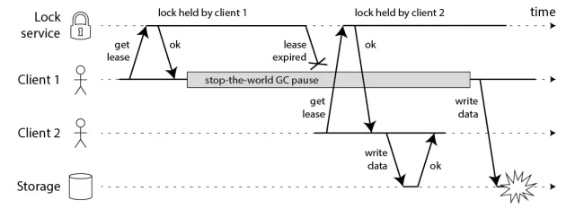

> STW问题是很难解决的，初看可能可以在客户端1从GC pause恢复过来后判断下锁是否过期，但是GC可能发生在任何时间，例如恰好在判断完没有过期，这时候GC pause发生了
>
> 如果使用没有GC的语言，仍然有很多其他可能使得进程pause。例如内存缺页，CPU资源竞争，网络延迟等
>
> **可能的解决方案：** fencing token，fencing token是一个单增的数字，客户端获取锁的时候，它随同锁一起返回给客户端，客户端访问共享资源必须戴着这个fencing token，这样提供共享资源的服务会进行检查，拒绝掉所有比当前token的值小的token的访问，这样就避免了冲突。但是很多时候共享资源没法提供这种检查机制。
>
> 此外Redlock的random token其实也可以通过操作共享资源时使用CAS操作来避免这个问题
>
> 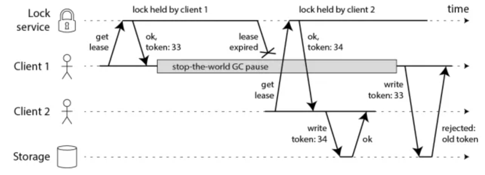

例2，**选择难题**：算法第4步，锁获取成功之后，如果由于获取锁的过程消耗了过长时间，重新计算出来的锁的有效时间很短了，那么还来得及去完成共享资源的操作吗？如果认为太短或许应该进行锁的释放，但是到底多短算算很难决定。


例3，**持久化和时钟同步问题**：客户端1获取节点ABC上的锁，但由于网络问题无法访问DE，这时客户端1加锁成功。之后C节点宕机重启了，并且客户端1在C上加的锁没有持久化下来，于是C的锁没了，客户端2获取CDE上的锁成功，由于网络问题无法访问AB。这时候客户端1和客户端2都拿到了锁。此外C节点时钟跳跃也会导致客户端1获取的C上的锁失效，从而客户端2也成功拿到锁（时钟跳跃，例如系统管理员手动修改机器时钟，或者机器时钟在同步NTP时间时发生了大的跳跃）

> **持久化问题：**
>
> 默认情况下，AOF持久化方式是每秒写一次磁盘（fsync），最坏情况丢失1秒的数据，为了尽可能不丢失，在做分布式锁的时候应该修改为每次写都进行fsync，但会降低性能。但是依然有丢失数据的风险，fsync也可能丢失数据(这取决于操作系统的实现，而不是Redis的实现)，所以上面的节点重启是有可能引发锁失效问题的。
>
> 针对这个问题，作者也提出了解决方案：**延迟重启**，一个节点崩溃后，先不立即重启，而是等待一段时间（这个时间应该大于锁的有效时间）。这样的话这个节点在重启前参与的锁都会过期，重启后就不会对现有的锁造成影响。
>
> 
>
> **时钟同步问题：**
>
> Redlock的安全性对系统的时钟有比较强的依赖，一旦系统时钟不准确，算法安全性就保证不了了


#### 3. 基于ZK的锁一定安全吗

ZK实现分布式锁的基本步骤：

1. 客户端1和客户端2都尝试创建临时节点，例如`/lock`
2. 假设客户端1先到达，则加锁成功，客户端2加锁失败
3. 客户端1操作共享资源结束后删出节点`/lock`，释放锁

ZK不像redis那样要考虑锁续命的问题，因为它采用了**临时节点**，保证客户端1拿到锁之后，只要连接不断，就可以一直持有锁，而且如果客户端1拿到锁后异常崩溃了，临时节点就会**自动删除**，保证锁一定会被释放掉。

锁没有过期时间的问题，还可以自动释放掉，但是依然存在问题：

ZK在客户端1创建临时节点后，实际上是通过维护一个`Session`，通过**心跳检测**来和客户端维持连接的，如果ZK长时间收不到客户端心跳，就认为Session过期了，就把临时节点删出了。这时依然有GC导致的问题：

例子：

1. 客户端1创建节点/lock成功，拿到锁
2. 客户端1发生了长时间的GC，导致无法发送心跳给ZK，ZK把临时节点删除了
3. 客户端2创建临时节点/lock成功，拿到锁了，这时客户端1GC结束，仍然认为自己持有锁，导致冲突


**基于ZK的分布式锁的优点：**

1. 不用考虑锁过期时间
2. 不用考虑锁释放问题

**缺点：**

1. 性能不如redis
2. 部署和运维成本高
3. 客户端与ZK长时间失联，锁被释放问题


#### 4. 如何正确使用redis锁

Redlock建立在时钟正确的前提下（注：cpu温度，机器负载，芯片材料都可能导致时钟偏移，也有运维修改时钟的情况发生），而且性能较低，部署成本高，大部分场景使用Redis模式（主从+哨兵）实现分布式锁就够了

对于要求数据绝对正确的情况，可以使用token方案，每次拿锁时发一个递增token，操作共享资源，由共享资源记住当前token，共享资源会拒绝一切比上一次操作的token值小的进程的访问


[基于Redis的分布式锁到底安全吗（上）？](https://mp.weixin.qq.com/s?__biz=MzA4NTg1MjM0Mg==&mid=2657261514&idx=1&sn=47b1a63f065347943341910dddbb785d&chksm=84479e13b3301705ea29c86f457ad74010eba8a8a5c12a7f54bcf264a4a8c9d6adecbe32ad0b&cur_album_id=1550842358601187329&scene=189#rd)

[基于Redis的分布式锁到底安全吗（下）？](https://mp.weixin.qq.com/s?__biz=MzA4NTg1MjM0Mg==&mid=2657261521&idx=1&sn=7bbb80c8fe4f9dff7cd6a8883cc8fc0a&chksm=84479e08b330171e89732ec1460258a85afe73299c263fcc7df3c77cbeac0573ad7211902649&cur_album_id=1550842358601187329&scene=189#rd)


### 3.9.7 Redis做消息队列

当我们在使用一个消息队列时，希望它的功能如下：

- 支持阻塞等待拉取消息
- 支持发布 / 订阅模式
- 消费失败，可重新消费，消息不丢失
- 实例宕机，消息不丢失，数据可持久化
- 消息可堆积

#### 1. 使用List队列

生产者使用LPUSH发布消息：

```c
127.0.0.1:6379> LPUSH queue msg1
(integer) 1
127.0.0.1:6379> LPUSH queue msg2
(integer) 2
```

消费者使用RPOP拉取消息：

```c
127.0.0.1:6379> RPOP queue
"msg1"
127.0.0.1:6379> RPOP queue
"msg2"
```


这里存在的问题是，我们消费者一般是个死循环，不断去拉取消息，如果队列为空，势必会造成**CPU资源浪费**，还会对Redis造成压力

我们可以修改为，当队列为空时，进程**睡一会儿再拉消息**，这会带来消息处理的延迟问题，对于那些对及时性要求不高的任务，完全是可以的。

此外，还有既能及时处理消息，又能避免CPU空转的方法。Redis提供了**阻塞式拉取消息的命令**：`BRPOP/BLPOP`，没消息时会自动阻塞等待

```c
while true:
    // 没消息阻塞等待，0表示不设置超时时间，直到有新消息才返回。如果设置超时时间则在超时后返回null
    msg = redis.brpop("queue", 0)
    if msg == null:
        continue
    // 处理消息
    handle(msg)
```


解决了消息处理不及时的问题，但是依然有缺点：

**不支持重复消费：** 不支持多个消费者消费同一批数据，消费者拉取消息后，消息就从list中删除了。

**消息丢失：** 如果消费者拉取消息后宕机，消息就丢失了。


#### 2. 发布/订阅模型 Pub/Sub

这个模块是Redis专门针对发布订阅这种队列模型设计的，可以解决重复消费的问题

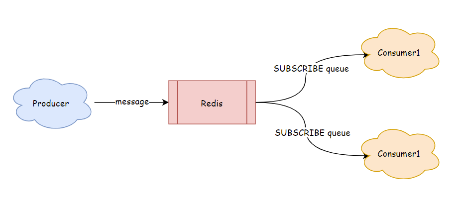

```c
// 2个消费者 都订阅一个队列
127.0.0.1:6379> SUBSCRIBE queue
Reading messages... (press Ctrl-C to quit)
1) "subscribe"
2) "queue"
3) (integer) 1
```


此时，2 个消费者都会被阻塞住，等待新消息的到来。之后，再启动一个生产者，发布一条消息到queue，2个消费者就会解除阻塞，收到消息。

这种发布订阅模型，**既支持阻塞式拉取消息，还很好的满足了多消费者重复消费同一批消息的需求**

还可以用匹配的方式订阅多个自己感兴趣的队列，例如 `PSUBSCRIBE queue.*` 就订阅了所有queue.开头的队列消息，这样可以**支持多组生产者、消费者处理消息**


发布订阅模式最大的问题是：丢数据。

Redis维护了一个映射关系：队列->消费者，生产者向队列发布消息，Redis就从映射关系中找到对应消费者，把消息转发给他，发布订阅模式没有基于任何数据类型实现，**不具备持久化能力**，不会写入到RDB和AOF中。**实际上整个过程没有任何数据存储，一切都是实时转发的(有缓冲区)，这也是要先启动消费者订阅，后启动生产者的原因**。

如果消费者下线，Redis宕机，或者消息堆积，都有可能造成消息的丢失。一个消费者异常挂掉后，再重新上线只能接收新的消息，在下线期间生产者发布的消息就收不到了。

List的数据可以一直积压在内存中，消费者什么时候来拉都可以。但是Pub/Sub是先把消息推到消费者所在的Redis Server上的缓冲区，然后等消费者来取，一旦缓冲区超过上限，会强制把消费者踢下线


Pub/Sub 的优缺点：

1. 支持发布 / 订阅，支持多组生产者、消费者处理消息
2. 消费者下线，数据会丢失
3. 不支持数据持久化，Redis 宕机，数据也会丢失
4. 消息堆积，缓冲区溢出，消费者会被强制踢下线，数据也会丢失

实际应用不多，目前只在哨兵集群和Redis实例通信时采用。而且依然无法解决处理消息时消费者宕机无法再次消费的问题


#### 3. Stream

Redis5.0版本，作者把之前的disque(Redis坐着写的另一个基于内存的分布式消息中间件)功能移植到了Redis，并定义了一个新的数据类型Stream

Stream通过 `XADD` 和 `XREAD` 来发布和读取消息

```c
// *表示让Redis自动生成消息ID
127.0.0.1:6379> XADD queue * name zhangsan
"1618469123380-0"
127.0.0.1:6379> XADD queue * name lisi
"1618469127777-0"

    
// 从开头读取5条消息，0-0表示从开头读取
127.0.0.1:6379> XREAD COUNT 5 STREAMS queue 0-0
1) 1) "queue"
   2) 1) 1) "1618469123380-0"
         2) 1) "name"
            2) "zhangsan"
      2) 1) "1618469127777-0"
         2) 1) "name"
            2) "lisi"
// 如果想继续拉取消息，需要传入上一条消息的 ID：
127.0.0.1:6379> XREAD COUNT 5 STREAMS queue 1618469127777-0
(nil)
```


支持阻塞式拉取消息：

```c
// BLOCK 0 表示阻塞等待，不设置超时时间
127.0.0.1:6379> XREAD COUNT 5 BLOCK 0 STREAMS queue 1618469127777-0
```


支持发布/订阅模式：可以使用消费者组

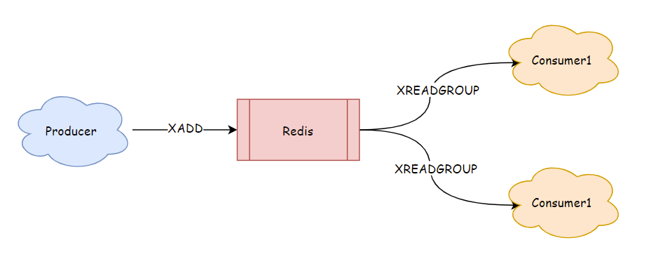


**消息处理异常时，Stream可以保证消息不丢失：**

当一组消费者处理完消息后，需要执行`XACK`命令，告知Redis，这时候Redis把消息标记为处理完成。

如果消费者异常宕机，重新上线后，Redis就会把之前没有处理成功的消息重新发送给消费者，这样即使消费者异常也不会丢失数据了

```c
// group1下的 1618472043089-0 消息已处理完成
127.0.0.1:6379> XACK queue group1 1618472043089-0
```


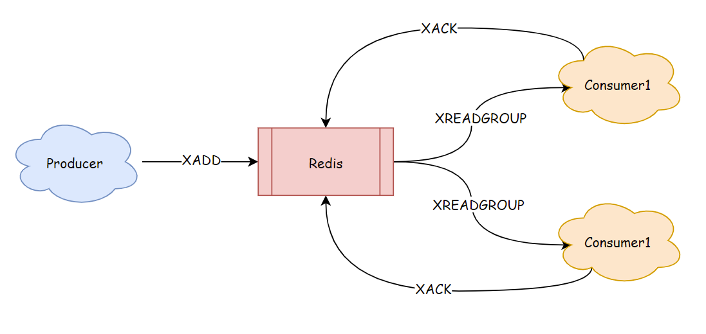

**持久化问题：**

Stream是新加的数据类型，它与其他数据类型一样，每个写操作都会写入到RDB和AOF中(如果开启了的话)，只要我们配置好持久化策略，就算Redis宕机，Stram中的数据也可以从RDB和AOF中恢复回来


**消息堆积问题：**

当消息队列发生消息堆积时，一般*要么对生产者限流，要么丢弃消息*。Redis的Stream采用的是丢弃消息的方案。在发布消息的时候可以指定队列的最大长度，防止队列积压。。在队列长度超过上限后，旧的消息会被删除，只保留固定长度的新消息


#### 4. 与专业的消息队列相比...

一个专业的消息队列必须要做到两大块：消息不丢失，消息可堆积

- **生产者会不会丢失消息？**

生产者可能由于网络问题，导致数据发送成功，但是读取相应的结果超时，这样就会认为没有发布成功，只能继续重试！这样消息会重复发送！**在消息队列里，要保证消息不丢失，宁可重发，也不能丢弃，由消费者设计幂等逻辑来保证业务的正确性**。所以无论是redis还是专业的消息队列，生产者都可以保证消息不丢失


- **消费者会不会丢失消息？**

这种情况就是消费者拿到消息后，还没处理完就宕机了，这时候消费者还能否重新消息之前失败的消息。redis的Stream通过消费者消息处理完后必须告知redis后才会标记已处理的方式，已经可以做到消息不丢失了，合格


- **队列中间件会不会丢失消息？**

AOF持久化配置的写盘是异步的，可能会丢失消息。另外主从复制也是异步的，主从切换的时候也存在消息丢失的可能

所以严格意义上来讲，redis是不能保证消息不丢失的

像RabbitMQ和Kafka这类专业的消息中间件，一般是部署一个集群，生产者在发布消息时会写入多个节点，以此来保证消息的完整性，这样即使一个节点挂了，也能保证集群的数据不丢失。他们的设计也更为复杂


- **消息积压问题？**

Redis数据都存储在内存中，一旦积压超过机器内存，就面临OOM的风险，所以为了避免这种情况，Stream提供了指定队列最大长度的功能

但是Kafka和RabbitMQ这类专业的消息队列，消息都是持久化到磁盘上，对消息积压的应对能力大得多


综上，如果业务场景简单，对于数据丢失不敏感，而且消息积压改率较小的情况下，把Redis当作队列完全可以，它的部署和运维也比专业的消息队列轻很多。但是如果业务场景对于数据丢失非常敏感，写入量大，消息积压概率大，还是要使用专业的消息队列中间件


# 4. Jedis

## 1. QuickStart
- 获取Jedis连接对象 `Jedis jedis = new Jedis("localhost", 6379);`，空参构造默认就是localhost和3306
- 关闭连接 `jedis.close();`

~~~java
    public void test1(){
        //获取连接,空参构造默认就是localhost和3306
        Jedis jedis = new Jedis("localhost", 6379);
        jedis.set("username","zhangsan");
        jedis.setex("name", 20, "lisi");  //20秒后自动删除数据

        jedis.hset("user", "username", "张三");
        jedis.hset("user", "password", "zhangsan123");
        Map<String, String> user = jedis.hgetAll("user");
        for(Map.Entry<String,String> entry:user.entrySet()){
            System.out.println(entry.getKey()+"--->"+entry.getValue());     //password--->zhangsan123  username--->张三
        }

        jedis.lpush("list", "张三", "李四", "王五");
        jedis.rpush("list", "赵六");
        List<String> list = jedis.lrange("list", 0, -1);
        System.out.println(list);       //[王五, 李四, 张三, 赵六]

        jedis.sadd("nameSet", "张三", "李四", "王五");
        Set<String> nameSet = jedis.smembers("nameSet");
        System.out.println(nameSet);    //[王五, 张三, 李四]

        jedis.zadd("nameZ", 40, "李四");
        jedis.zadd("nameZ", 50, "王五");
        jedis.zadd("nameZ", 30, "张三");
        Set<String> nameZ = jedis.zrange("nameZ", 0, -1);
        System.out.println(nameZ);      //[张三, 李四, 王五]

        //关闭连接
        jedis.close();
    }
~~~

## 2. Jedis连接池
- 创建 JedisPool 连接池对象
- 使用 `getResource()` 方法获取Jedis 连接

~~~java
    public void test2(){
        //创建配置对象
        JedisPoolConfig config = new JedisPoolConfig();
        config.setMaxTotal(50); //最大连接
        config.setMaxIdle(10); //最大空闲连接
        
        //创建jedis连接池对象
        JedisPool jedisPool = new JedisPool(config, "localhost", 6379);
        
        //获取连接对象
        Jedis jedis = jedisPool.getResource();
        
        //使用jedis
        jedis.set("name","张三");
        
        //释放资源
        jedis.colse();
    }
~~~

- jedis连接池工具类 JedisPoolUtils

~~~java
public class JedisPoolUtils {
    private static JedisPool jedisPool;

    static{
        //读取配置文件
        Properties properties = new Properties();
        try {
            properties.load(JedisPoolUtils.class.getClassLoader().getResourceAsStream("jedis.properties"));
        } catch (IOException e) {
            e.printStackTrace();
        }

        //配置JedisPoolConfig
        JedisPoolConfig config = new JedisPoolConfig();
        config.setMaxTotal(Integer.parseInt(properties.getProperty("maxTotal")));
        config.setMaxIdle(Integer.parseInt(properties.getProperty("maxIdle")));

        //初始化JedisPool
        jedisPool = new JedisPool(config, properties.getProperty("host"), Integer.parseInt(properties.getProperty("port")));
    }

    public static Jedis getJedis(){
        return jedisPool.getResource();
    }
}
~~~
