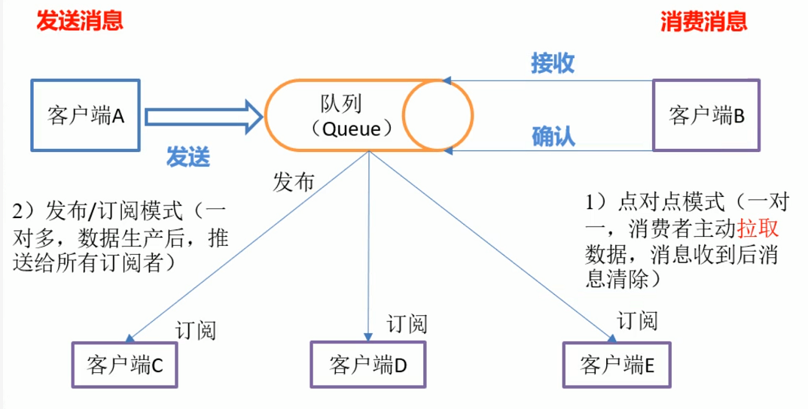
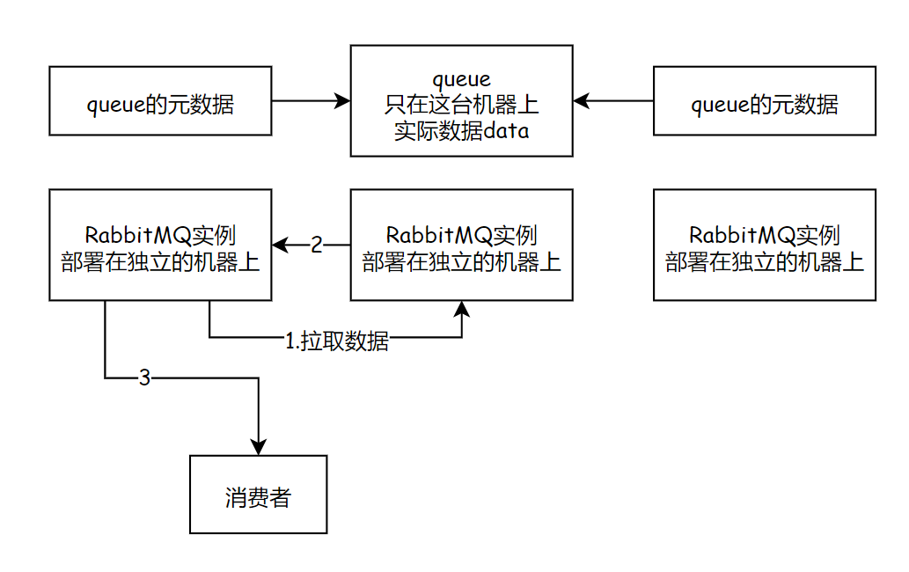
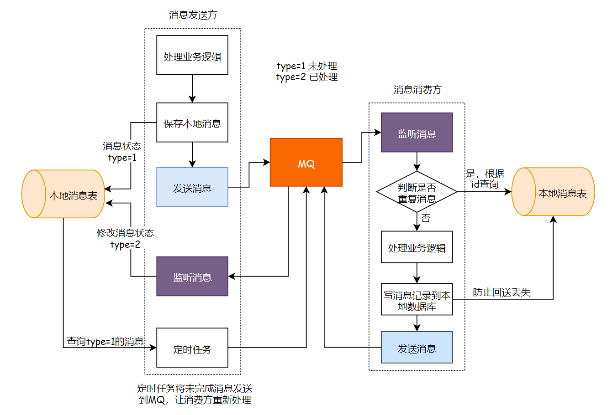

# 1. 消息队列

##  1.1 消息队列的两种模式

1. 点对点模式：一对一，消费者主动拉取数据，消息收到后消息清除。速度由客户端控制，需要客户端自己监控队列
2. 发布订阅模式：一对多，速度由发送方控制，无需客户端自己监控队列。**可以队列主动推送或者消费者自己主动拉取**，消费者消费数据之后不会立即清除消息

## 1.2 消息队列的优缺点

### **优点：**

**解耦**

扩展性

灵活性，峰值处理(**削峰**)

可恢复性：消息处理的进程挂掉，加入队列的消息仍然可以在系统恢复后被处理

顺序保证

缓冲：解决生产消息和消费消息的速度不一致的情况

**异步通信**

### 缺点：

系统**可用性降低**(MQ宕机对业务造成影响，如何保证高可用？)

系统**复杂度变高**(如何解决消息丢失？消息重复处理？保证消息的顺序？越来越复杂)

**一致性问题**：如何让保证消息数据处理的一致性(使用分布式事务)

## 1.3 如何保证消息队列的高可用

### RabbitMQ：使用普通集群

1. 在多台机器上分别启动RabbitMQ实例
2. 多个实例之间可以相互通信
3. 创建的Queue只会放在一个RabbitMQ上，其他的实例都去同步元数据(元数据不是真正的实际数据，而只是实际数据的"引用")
4. 消费的时候，如果连接的实例没有Queue，则取queue所在的实例拉取数据

缺点：

没有真正做到高可用（如果真正存放queue的集群挂了，数据就丢失了）

有数据拉取的开销和单实例的瓶颈（所有的数据都要从主实例拉取，有性能瓶颈）

### RabbitMQ：使用镜像集群

1. 每次生产者写消息到queue的时候，都会自动把消息同步到多个实例的queue上，每个RabbitMQ的节点上都有queue的消息数据和元数据，某个节点宕机，其他节点依然保存了完整的数据，不影响消费者的消费

### RocketMQ：双主双从

1. 生产者通过Name Server发现Broker
2. 生产者发送队列消息到2个Broker主节点
3. Broker主节点分别和各自从节点同步数据
4. 消费者从主节点或者从节点订阅消息

数据真正存储在Broker中，Name Server记录了Broker的地址。因为生产者并不知道哪个主节点可用，所以要去Name Server询问

## 1.4 如何保证消息不丢失

**消息丢失的原因：**

1. 生产者没有成功发送到MQ
2. 消息发送给MQ之后，MQ还没来得及持久化，MQ的Broker宕机，导致内存中的消息数据丢失了

3. 消费者获取到消息，但是消费者还没有来得及处理就宕机了，此时MQ的消息已经删除，消费者重启之后不能再消费之前的消息了            

**确保消息不丢失的方案**

1. 消息发送给MQ之后，MQ给生产者**确认收到**，否则生产者应重试
2. MQ收到消息之后进行消息的**持久化**
3. 消费者收到消息**处理完毕之后进行ack确认**，MQ收到ack之后才删除持久化的消息

## 1.5 如何保证消息不被重复消费

**重复消息产生的原因**：

生产者发送消息，MQ应答的时候由于网络原因应答失败，生产者就会发送重复消息

消费者消费完成后，ack由于网络原因没有被MQ接收到，此时消费者就会收到两条相同的消息

**如何保证不被重复消费/保证消息的幂等性**

1. 消息发送者发送消息的时候携带一个全局唯一id
2. 消费者获取消息后先根据id在redis中查询是否存在消费记录
3. 如果没有消费过就正常消费，消费完后写入redis
4. 如果消息已经消费，就应该直接舍弃

## 1.6 如何保证消息消费的顺序性

**顺序性消费**：

例如一笔订单产生了3条消息：订单创建，订单付款和订单完成，消费的时候要按照顺序依次消费才有意义

**但是多笔订单之间又是可以并行消费的**

**首先要保证消息顺序到达MQ，还要保证消息被顺序消费？** 生产者：MQ Server：消费者=1：1：1

但是这样效率太低了。。。多笔订单之间不能并行消费。。。。怎么进行并行消费呢

1. **生产者根据消息ID将同一组消息发送到一个queue中**

2. 多个消费者同时获取queue中的消息进行消费

3. **MQ使用分段锁，锁住该queue，保证单个queue中的有序消费**，当M1被消费完后，**消费者1回复ack，这时候MQ才释放该queue的锁**，这时候M2才能被消费

## 1.7 基于MQ的分布式事务

分布式事务：用户提交订单，库存服务操作库存DB减库存，订单服务操作订单DB生成订单数据。库存服务和订单服务要么同时成功，要么同时失败。。分布式事务就是为了保证不同数据库的数据的一致性

基于MQ的分布式事务是一个异步模型，将两个服务方解耦了

## 1.9 几种MQ的对比

| 特性       | ActiveMQ           | RabbitMQ                 | RocketMQ               | Kafka                                                        |
| ---------- | ------------------ | ------------------------ | ---------------------- | ------------------------------------------------------------ |
| 开发语言   | java               | erlang                   | java                   | scala                                                        |
| 单机吞吐量 | 万级               | 万级                     | **十万级**             | **十万级**                                                   |
| 时效性     | ms级               | **us级**                 | ms级                   | ms级以内                                                     |
| 可用性     | 高(主从架构)       | 高(主从架构)             | **非常高(分布式架构)** | **非常高(分布式架构)**                                       |
| 功能特性   | 文档多，协议支持好 | 并发能力强，延迟低性能好 | 功能完善，扩展性好     | 只支持主要的MQ功能，消息查询、 消息回溯等功能没有提供，大数据领域应用广泛 |

RabbitMQ，如果不考虑二次开发的话，追求稳定性和性能可以考虑使用

RocketMQ是java开发的，稳定性和性能都不错，还方便二次开发，推荐使用

Kafka一般在大数据领域用的多

# 2. Kafka

Kafka是`分布式`的基于`发布订阅`模式的`消息队列`，对消息保存时根据Topic进行归类，kafka集群有多个kafka实例，每个实例被称为一个broker

无论是kafka集群还是consumer，都依赖于`zookeeper`集群保存一些meta信息，来保证系统的可用性

## 2.1 Kafka架构

- 副本机制：Topic的partition可以创建副本，放到其他的Broker里面，保证高可用
- 同一个Topic的同一个partition只能被一个消费者组中的一个消费者消费。最好让partition的数量等于被消费的组中的消费者数量，这样正好一个partition被一个消费者消费
- **Topic只是逻辑概念，partition是物理概念**，每个partition都对应一个log文件，log文件存储的就是producer生产的数据，不断追加到log文件的末尾，每条数据都有自己的offset。
- 消费者组中的每个消费者都会实时记录自己消费到哪个offset了，以便出错恢复时，从上次的位置继续消费

### 2.1.1 Kafka文件存储

- 为了防止log文件过大导致数据定位效率低下，Kafka采用**分片**和**索引**机制，每个partition分为多个segment，每个segment对应两个文件：.log和.index，这些文件位于一个文件夹：topic名+分区号
- **而.log和.index文件命名以`当前segment中的第一条消息`的offset命名**：00000000000000239430.log

### 2.1.2 Kafka生产者

分区的原因：方便在集群中扩展，可以提高并发(可以以Partition未单位读写)

生产者发送`ProducerRecord`到分区的原则：

1. 有指明对应partition的情况下，直接将指明的值作为partition值，发送到指定的partition
2. 没有指明partition的值，但是有key，将**key的hash值与topic的partition数进行取模**得到partition值
3. 没有partition也没有key，round-robin算法生成随机的partition值。(**第一个partition随机，后续就轮询了**)

**数据的可靠性**：

- Topic的**全部follower**与leader全部同步完成后，才发送ack给生产者：`延迟高`，容忍n台故障需要n+1个副本

- Topic的**半数以上follower**与leader全部同步完成后，才发送ack给生产者：`延迟低`，容忍n台故障需要2n+1个副本

1. **Kafka采用全部follower同步才发送ack的方案，但进行了优化**，但是Leader维护了一个`ISR`(in-sync replica set)，即和leader保持同步的follower集合。只要ISR中的follower完成同步后，leader就给follower发送ack，**如果follower长时间**(replica.lag.time.max.ms)**未向leader同步数据**，**该follower将被踢出ISR**。Leader发生故障之后，会从ISR中选举新Leader
2. **ack应答机制，三种级别，acks参数**：
   - 0：**producer不等待broker的ack**，最低延迟，但是可能丢失数据
   - 1：**producer等待broker的ack**，**partition的leader落盘成功就返回ack**，如果follower同步之前leader故障，会丢失数据
   - -1：**producer等待broker的ack，pritition的leader和ISR的所有follower全部落盘才返回ack**，但是follower同步完成后，broker返回ack前若leader故障，可能造成数据重复

**数据的一致性：故障处理**

- LEO：每个副本的最后一个offset
- HW：所有副本最小的LEO
- **消费一致性：HW之前的数据才对Consumer可见**
- **存储一致性**：出现故障，重新选举Leader，会保证其他follower与HW一致，然后**同步新leader中到LEO的数据**

## 2.2 Kafka集群

## 2.3 Kafka工作流程

## 2.4 Kafka API

## 2.5 prooducer拦截器

## 2.6 Streams

