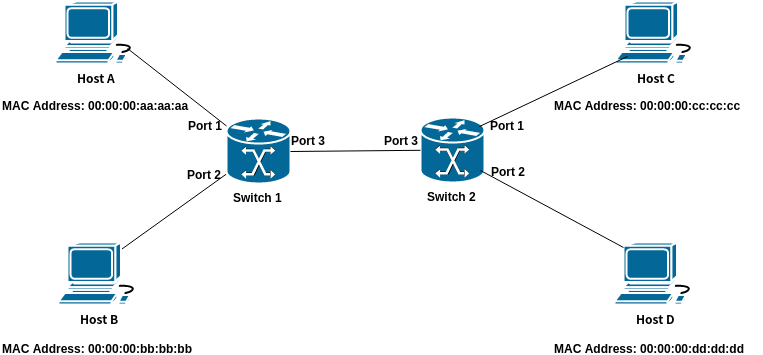
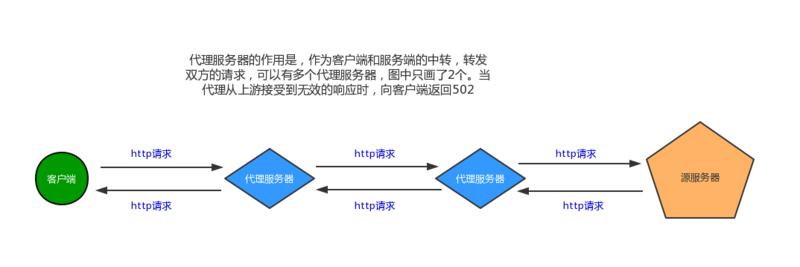
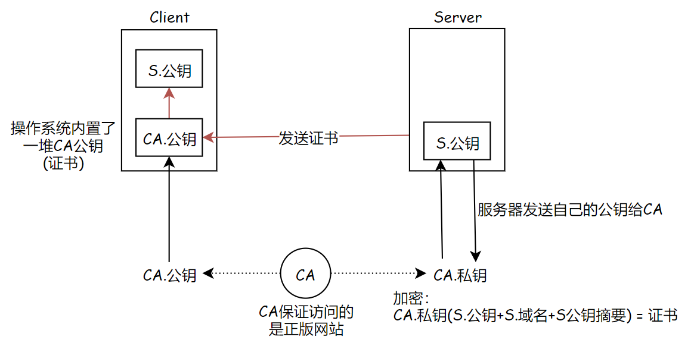
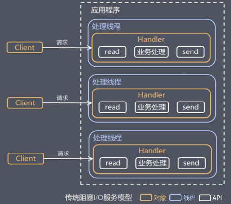

# 1. 基础知识

## 1.1 OSI模型
OSI模型把网络通信的工作分为7层，分别是物理层、数据链路层、网络层、传输层、会话层、表示层和应用层
1. 物理层       
物理层处于OSI的最底层，是整个开放系统的基础。物理层涉及通信信道上传输的原始比特流(bits)，它的功能主要是为数据端设备提供传送数据的通路以及传输数据  

2. 数据链路层               
数据链路层的主要任务是实现计算机网络中相邻节点之间的可靠传输，把原始的、有差错的物理传输线路加上数据链路协议以后，构成逻辑上可靠的数据链路。需要完成的功能有链路管理、成帧、差错控制以及流量控制等。其中成帧是对物理层的原始比特流进行界定，数据链路层也能够对帧的丢失进行处理

3. 网络层       
网络层涉及源主机节点到目的主机节点之间可靠的网络传输，它需要完成的功能主要包括路由选择、网络寻址、流量控制、拥塞控制、网络互连等        

4. 传输层           
传输层起着承上启下的作用，涉及源端节点到目的端节点之间可靠的信息传输。传输层需要解决跨越网络连接的建立和释放，对底层不可靠的网络，建立连接时需要三次握手，释放连接时需要四次挥手        

5. 会话层       
会话层的主要功能是负责应用程序之间建立、维持和中断会话，同时也提供对设备和结点之间的会话控制，协调系统和服务之间的交流，并通过提供单工、半双工和全双工3种不同的通信方式，使系统和服务之间有序地进行通信

6. 表示层       
表示层关心所传输数据信息的格式定义，其主要功能是把应用层提供的信息变换为能够共同理解的形式，提供字符代码、数据格式、控制信息格式、加密等的统一表示  

7. 应用层       
应用层为OSI的最高层，是直接为应用进程提供服务的。其作用是在实现多个系统应用进程相互通信的同时，完成一系列业务处理所需的服务     

## 1.2 TCP/IP模型
OSI参考模型的初衷是提供全世界范围的计算机网络都要遵循的统一标准，但是由于存在模型和协议自身的缺陷，迟迟没有成熟的产品推出。TCP/IP协议在实践中不断完善和发展取得成功，作为网络的基础     
TCP/IP即Transmission Control Protocol/Internet Protocol     
TCP/IP参考模型采用4层的层级结构，每一层都呼叫它的下一层所提供的协议来完成自己的需求，这4个层次分别是：数据链路层层、网络层(IP层)、传输层(TCP层)、应用层

1. 网络接口层       
TCP/IP协议对网络接口层没有给出具体的描述，数据链路层对应着物理层和数据链路层    

2. 网络层(IP层)             
互联网层是整个TCP/IP协议栈的核心。它的功能是把分组发往目标网络或主机。同时，为了尽快地发送分组，可能需要沿不同的路径同时进行分组传递。因此，分组到达的顺序和发送的顺序可能不同，这就需要上层必须对分组进行排序。互联网层除了需要完成路由的功能外，也可以完成将不同类型的网络（异构网）互连的任务。除此之外，互联网层还需要完成拥塞控制的功能

3. 传输层(TCP层)        
TCP层负责在应用进程之间建立端到端的连接和可靠通信，它只存在与端节点中。TCP层涉及两个协议，TCP和UDP。其中，TCP协议提供面向连接的服务，提供按字节流的有序、可靠传输，可以实现连接管理、差错控制、流量控制、拥塞控制等。UDP协议提供无连接的服务，用于不需要或无法实现面向连接的网络应用中

4. 应用层       
应用层为Internet中的各种网络应用提供服务        
  

## 1.3 IP和端口号       
端口号是一个逻辑端口编号，OS为网络软件分配一个随机的端口号，**端口号由两个字节组成(0~65535)**，1024之前的端口号被系统分配给了一直的网络软件，不能使用       
常用端口号：        
1. 80端口 ： 网络端口
2. 数据库 ： mysql:3306   oracle:1521       
3. Tomcat服务器 ： 8080

## 1.4 数据在各个层之间的传递过程
**在向下的过程中，需要添加下层协议所需要的首部或者尾部**，在向上的过程中不断的拆开首部和尾部
路由器只有物理层，数据链路层，网络层这三层，因为不需要为进程或者应用程序提供服务，不需要传输层和应用层

# 2. 物理层
通信方式：单工，半双工，全双工

数字信号到模拟信号的转换

## 2.1 集线器Hub

集线器是物理层设备，是一种"共享"设备，集线器本身不能识别目的地址，当同一个局域网的A主机发送数据给B主机时，数据包在集线器上是**以广播的方式传输**的，由每台终端通过验证数据包头的地址信息来确定是否接收

集线器一个时钟周期内只能传输一组信息，所以一台集线器的机器数目过多，同时通信就会导致功能效率很差（集线器有数据传输的时候，其他主机想通过集线器发送数据只能先等待），发生堵塞、碰撞等

半双工

主要作用：由于非屏蔽双绞线（中继器）传输信号时信号功率会逐渐衰减，所以需要集线器将衰减的信号重新整理，重新产生出完整的信号再继续传送

# 3. 链路层
## 3.1 主要职责
1. **封装成帧**：将网络层传下来的分组添加首部和尾部，用于标记帧的开始和结束

2. **透明传输**：帧使用首部尾部进行界定，如果帧中有首尾部相同内容需要进行转义，如果有与转移字符相同内容，需要再次转义，接受端可以进行数据还原。整个过程透明，用户察觉不到转移字符的存在
3. **差错检测**：使用循环冗余检测(CRC)来检查比特差错
   - CRC：将二进制数据流(bit)作为多项式系数， 和密码的除数做多项式除法，得到的余数多项式的系数作为校验位

## 3.2 信道
信道的分类：
1. **广播信道**：一对多通信，一个节点发送的数据能被整个广播信道上的所有节点接收到。为了避免碰撞，使用信道复用技术和CSMA/CD协议控制
2. **点对点信道**：不会碰撞，使用PPP协议控制

### 3.2.1 信道复用
**信道复用技术**： 频分复用、时分复用、波分复用、码分复用

**码分复用**：为每个用户分配 m bit的码片，不同码片相互正交 $\frac{1}{m} \vec{S} \cdot \vec{T}=0$ ，用户发送1时即发送自己的码片值，发送0即发送码片的反码。接受端使用相同码片进行计算，值为1表示是该用户发送的1，值为-1表示是该用户发送的0，值为0表示是其他用户发送的数据。**码分复用的缺点是需要发送m倍的原始数据！** 

### 3.2.2 CSMA/CD协议

`CSMA/CS协议`：载波监听多点接入/碰撞检测
多点接入：总线型网络，许多主机以多点方式连接到总线上
载波监听：每个主机不停的监听信道。发送前监听到信道正在使用就必须等待。多站点同时发送时电压变化幅度增大(叠加)，检测电压以监听
碰撞检测：发送中监听到信道已有其他主机在发送数据，则发生碰撞。虽然发送前监听到了空闲，但是发送时状态可能发生变化了
一旦监听到发生冲突，则立即停止发送数据，等待一段随机时间后再次发送
碰撞最迟需要2t时间才能检测到

### 3.2.3 PPP协议
互联网用户需要连接到某个ISP(运营商)后才能接入互联网，PPP协议是用户计算机和ISP进行通信时使用的链路层协议

点到点的，不会发生碰撞。一个PPP网络只能包含两个PPP接口

如图，二层网络A是一个以太网，二层网络B是一个PPP网络，二层网络C也是一个PPP网络
路由器A有两个接口，一个是以太口，一个是PPP接口。如图所示：路由器A的以太口从以太链路上接收到一个以太帧后，会将这个以太帧中的IP报文提取出来，再将IP报文转移到PPP接口。PPP接口会将这个IP报文封装成一个PPP帧，然后将其PPP帧发送至PPP链路上。另外，路由器A的PPP接口从PPP链路上接收到一个PPP帧后，会将这个PPP帧中的IP报文提取出来，然后将这个IP报文转移到以太口。以太口会将这个IP报文封装成一个以太帧，然后将此帧发送到以太网链路上

## 3.3 MAC地址
mac地址是链路层地址，长度为6字节(48bit)，**用于唯一标识网络适配器(网卡)**
一台主机有多少个网络适配器就有多少MAC地址。例如有无线网卡和有线网卡就有两个MAC地址

**为什么有了IP地址唯一区分主机，还要MAC地址？**
首先功能不一样，IP地址为了确定终点的地址，而MAC地址用于确定下一跳的地址
IP地址具有地域性，而MAC地址是分配给厂家的，厂家的产品遍布全球，不具有地域性。网络上希望路由的转发规则尽量简单，所以一般要用ip地址前多少位而不是整个ip地址做转发，mac地址是没法做汇聚的

## 3.4 局域网
局域网是一种典型的广播信道，主要特点是网络为一个单位所拥有，地理范围和站点数目有限
主要有以太网、令牌环网、ATM等技术，目前以太网为主

**以太网帧**：`星型拓扑结构的局域网`，使用`交换机`(链路层设备，根据MAC地址转发，无碰撞)连接
以太网帧：

**交换机**：具有自学习能力，学习的是交换表，存储着MAC地址到接口的映射。每次发送数据首先查找表，表中没有对应MAC地址主机的表项则进行广播，其他主机收到会丢弃，目标主机收到后回应，交换机添加主机到映射表

## 3.5 交换机

交换机也叫交换式集线器，**在数据链路层使用MAC地址转发数据**（通过引入路由功能，一些交换机也可以在网络层转发数据，称为三层交换机或者多层交换机）。

交换机内部的CPU会在每个端口成功连接时，通过**将MAC地址和端口对应，形成一张MAC表**。在今后的通讯中，**发往该MAC地址的数据包将仅送往其对应的端口，而不是所有的端口**。因此交换机可用于划分数据链路层广播，即冲突域；但它不能划分网络层广播，即广播域

交换机对数据包的转发是**建立在MAC地址——物理地址基础之上的**，对于IP网络协议来说，它是透明的，即交换机在转发数据包时，不知道也无须知道源IP和目的IP地址，只需知其物理地址

## 3.6 转发表(MAC表)工作原理

当局域网中存在多个交换机的时候，如下图：

**假设主机A与主机C进行通信**：

1. 首先主机A通过ARP请求，获得主机C的IP对应的MAC地址
2. 主机A将一个源MAC地址为本机网卡物理地址，**目的MAC地址为主机C网卡物理地址**的数据帧发送给交换机1
3. 交换机1收到此数据帧后，会学习源MAC地址，并检查MAC地址表，发现没有目的MAC地址的记录，则会将数据帧广播出去，**主机B和交换机2都会收到此数据帧**
4. 交换机2收到此数据帧后也会将数据帧中的**源MAC地址和对应的端口**记录到MAC地址表中，并检查自己的MAC地址表，发现没有目的MAC地址的记录，则会**广播此数据帧**，主机C和主机D都会收到此数据帧
5. 主机C收到数据帧后，会响应这个数据帧，并回复一个源MAC地址为本机网卡物理地址的数据帧，该帧最终会送往主机A，这时**交换机1和交换机2都会将主机C的MAC地址记录到自己的MAC地址表中**，并且以单播的形式将此数据帧发送给主机A
6. 这时，主机A和主机C再通信，就可以**以单播的形式传输数据帧**了，A与D、B与C及B与D的通信与上述过程一样，因此交换机2的MAC地址表中记录着主机A和主机B的MAC地址都对应其端口3

# 4. 网络层
因为网络层是整个互联网的核心，因此应当让网络层尽可能简单。**网络层向上只提供简单灵活的、无连接的、尽最大努力交付的数据报服务**     
使用 IP 协议，可以把异构的物理网络连接起来，使得在网络层看起来好像是一个统一的网络          

网络层的数据是数**分组/数据包(packet)**

与 IP 协议配套使用的还有三个协议：
- 地址解析协议 ARP（Address Resolution Protocol）
- 网际控制报文协议 ICMP（Internet Control Message Protocol） 
- 网际组管理协议 IGMP（Internet Group Management Protocol）

IPv4和IPv6：IPv4以`4字节`32位作为IP地址，IPv6以`16字节`128位作为IP地址

## 4.1 IP数据包格式      

- `版本号` : 有 4（IPv4）和 6（IPv6）两个值
- `首部长度` : 4位，四字节为单位，所以最长64字节，最短就是可变部分全都没有，只有20字节，也就是该值最小为5（如果可变部长度不是4的字节的整数倍，就用尾部的填充部分来填充）             
- `服务类型` ： 8位，一般不用(00H)，只有在网络提供分区服务(DiffServ)时使用
- `总长度` ： 16位，一个字节为单位，包括首部长度和数据部分的长度，最大IP分组长度65535B，IP分组可以封装的最大数据为65535-20=65515B    
- `标识` ： 数据报长度过长而发生分片时，相同的数据包的不同分片具有相同的标识      
- `标志位` ： [保留位，DF，MF]，DF=1表示禁止分片， MF=1表示非最后一片                
- `片偏移` ： 片偏移的单位是8字节，和标识符结合使用，记录数据报片的第一个字节的报文偏移量

- `生存时间` : TTL，以路由器跳数为单位，防止无法交付的数据报在互联网中不断兜圈子，当TTL为0时就丢弃该数据包        
- `协议` : 指出携带的数据应该上交给哪个协议进行处理，如ICMP，TCP(6)，UDP(17)等
- `首部校验和` : 数据包每经过一个路由器都要重新计算校验和，对IP分组首部进行差错检测，计算时全部置0，反码算数运算求和，和的反码作为首部检验和字段          
- `源和目的IP地址` ： 各16位
- `选项字段` ： 1~40B之间，可以携带时间戳、路由记录等，实际很少使用       
- `填充字段` ： 1~3B，目的是补齐整个首部为4B的整数倍

## 4.2 IP地址的编址方式  
IP地址编址经历三个历史阶段：分类，子网划分，无分类
1. 分类：`IP地址::={<网络号>,<主机号>}`

2. 子网划分：`IP地址::={<网络号>,<子网号>,<主机号>}`，要使用子网，就必须要配置子网掩码
3. 无分类编址CIDR：`IP地址::={<网络前缀号>,<主机号>}`消除了传统ABC类地址即划分子网的概念。如128.14.35.7/20 表示前 20 位为网络前缀

**对于电脑来说，访问同网段的目标和访问不同网段的目标是不同的**，访问不同网段（通过子网掩码计算判断是不是同一个网段）的目标主机，**需要通过网关进行转发**，而访问同网段内的主机直接进行通信就可以了

## 4.3 ARP地址解析协议

网络层实现主机之间的通信，而链路层实现具体每段链路之间的通信。因此在通信过程中，IP 数据报的源地址和目的地址始终不变，而 MAC 地址随着链路的改变而改变

**ARP协议实现由IP地址到MAC地址的映射**：每个`主机`都有一个`ARP高速缓存`，存放了本局域网的各个**主机和路由器的IP地址到MAC地址的映射表**

**主机A向主机B(IP)发送数据，首先检查自己的ARP表中是否有B的IP对应的MAC地址**，如果A的ARP缓存中有B的IP与MAC地址的对应关系，就将B的MAC地址作为目的MAC封装到数据帧中，但是如果A的ARP缓存中没有B的IP的MAC地址映射，就要通过**广播的方式发送ARP请求分组**，请求的源IP和MAC地址是A的IP和MAC地址，`目的IP地址是B的IP地址`，请求的`目的MAC地址是MAC层的广播地址FF:FF:FF:FF:FF:FF`，当交换机收到这个数据帧后，发现是**广播帧**，于是交换机将这个数据帧从非接收端口的所有端口转发出去，**同一个网段中的所有节点都会收到该ARP请求包**，目的IP不匹配的直接忽略该请求，当B收到请求后发现自己IP与数据帧中目的IP一样，于是**先将A的IP地址及其MAC地址保存到自己的ARP缓存中**，然后发送一个**ARP应答**给主机A，告知其`MAC地址`，**主机A向ARP缓存中写入B的IP到MAC地址的映射**

## 4.4 ICMP网际控制报文协议
由于**IP层只提供无连接的、尽最大努力交付的服务**，这就意味着**无法进行流量控制和差错控制**，因此IP数据包的传输过程中，出现各种错误是在所难免的，这就需要出现错误的时候通知源主机IP数据报传输中遇到了什么问题，这就是通过ICMP协议完成的

ICMP 是为了更有效地转发 IP 数据报和提高交付成功的机会。它**封装在 IP 数据报中**，但是不属于高层协议
两个应用：一方面是测试网络连接是否畅通，另一方面如果丢包了，IP协议并不能通知传输层是否丢包及丢包原因，这就需要ICMP协议

ICMP报文分为**差错报告报文**和**查询报文**

**查询报文**：如`ping命令`，`子网掩码查询`，`时间戳查询`等情况，都会发送查询报文

**差错报文**：当对应路由器或者终端设备`收到查询报文后，产生一系列问题`，把出现的问题`回复给发起者`的报文就是差错报文

但是考虑到网络整体资源的占用，下列情况不会产生差错报文：

1. 差错报文不会产生差错报文，防止ICMP无限产生和传送差错报文
2. 目的地址是广播或者多播的IP数据包
3. 链路层广播的数据包
4. 不是IP分片的第一片不会产生差错报文，因为IP只是尽力交付，不需要可靠性
5. 源地址不是某个主机的数据包

ICMP头：

| Type | code | Description                             |
| ---- | ---- | --------------------------------------- |
| 0    | 0    | Echo 回复报文，如 Ping 命令的回复报文。 |
| 3    | 0    | 网络不可达                              |
| 3    | 1    | 主机不可达                              |
| 3    | 3    | 协议不可达                              |
| 3    | 4    | 端口不可达                              |
| 3    | 6    | 网络不知道                              |
| 3    | 7    | 主机不知道                              |
| 8    | 0    | Echo 请求报文，如 Ping 命令的请求报文。 |
| 13   | 0    | 时间戳请求报文                          |

**如何知道主机A发送到主机B的数据包在网络中都经过了哪些路由呢？**

**当IP数据包在路由中出错时，路由器会向发送源发送一个ICMP错误报文，发送端从该ICMP错误报文中，可以得到该路由的IP**。要得到从主机A到目标主机B之间的所有路由的IP，那么我们必须让IP数据包在每个路由器中都出错一次

可以**为数据包分配一个目标主机几乎不可能监听的端口**，从而，当IP数据包到达目标主机后，目标主机会回复相应的”不可到达、端口不可到达”的ICMP错误信息，从而，我们可以确认IP数据包已经到达了目标主机

综上，我们可以：源主机A发送IP数据包，IP为目标主机B，port为几乎不可能监听的port，TTL从1开始每次往上增加1，直到收到来自主机B的ICMP 不可到达（端口不可到达）信息

Traceroute 命令就是实现这样功能的一个程序。我们可以通过tracerouter ip来调用此功能

## 4.5 路由器

路由器功能：路由选择，分组转发
分组转发：从数据报首部提取目的主机IP地址和目的网络地址。如果目的网络与此路由直接相连，则交付，否则若路由表中有含有目的地址的特定主机路由，则把数据报传送给表中指明的下一跳路由，否则若有默认路由则转给默认路由，否则报告转发分组出错

## 4.6 路由选择协议

一个`自治系统AS`(Autonomous System)由多个路由器组成，由一个组织管辖，如移动、联通、电信，AS内部使用内部网关协议IGP(RIP/OSPF)，AS之间使用外部网关协议BGP

`内部网关协议RIP`：**距离向量算法**，实现简单，开销小，但最大距离为15跳(16表示不可达)，限制了网络规模，且要**经过比较长的时间才能将此消息传送到所有路由**。距离向量(如果路由1和某个网络C以及路由2直接相连，则向路由2通知网络C的路径时将跳数+1，以此类推)。**只知道相邻节点，对更远处节点不了解。**一旦中途某个路径断了就挂掉了
`内部网关协议OSPF`：使用**Dijkstra的最短路径算法**，为了克服RIP的缺点。**每个路由都有自己相邻路由的链路状态**，向本自治系统中所有路由发送自己的相邻路由的链路状态，只有链路状态发生变化时，路由器才会发送信息。更新很快！**每个节点都有整个网络的拓扑结构。**而且一旦某个路径断了，可以及时选择其他链路，对通信影响小
`外部网关协议BGP`：选择比较好的而不是最佳路由线路。每个AS都必须配置BGP发言人，通过再相邻BGP发言人之间建立TCP连接来交换路由信息

## 4.7 再看IP和MAC地址的配合传输

假设网络上要将一个数据包（名为`PAC`）由北京的一台主机（名称为`A`，IP地址为`IP_A`，MAC地址为`MAC_A`）发送到纽约的一台主机（名称为`B`，IP地址为`IP_B`，MAC地址为`MAC_B`）。这两台主机之间不太可能是直连起来的，因而数据包在传递时必然要经过许多中间节点(如路由器，网关服务器等)，假定在传输过程中要经过C1、C2、C3(其输入、输出端口的MAC地址分别为M1_In/M1_Out，M2_In/M2_Out，M3_In/M3_Out)三个节点。A在将PAC发出之前，先发送一个`ARP请求`，找到其要到达IP_B所必须经历的第一个中间节点C1的到达端口MAC地址`M1_In`，然后在其数据包中封装地址：`IP_A、IP_B，MAC_A和M1_In`。当PAC传到C1后，再由ARP根据其目的IP地址IP_B，找到其要经历的第二个中间节点C2的到达端口MAC地址M2_In，然后再封装目的MAC地址为M2_Out的数据包传送到C2。如此类推，直到最后找到IP地址为IP_B的B主机的MAC地址MAC_B，最终传送给主机B。在传输过程中，数据包源IP地址IP_A、目的IP地址IP_B不变，而源MAC地址和目的MAC地址，由于中间节点重新封装数据帧而不断改变，直至目的地址MAC地址为MAC_B，数据包最终到达目的主机B

即：**源、目的MAC地址在帧转发过程中会被修改为本跳和下一跳的MAC地址，而源、目的IP地址则始终不变**

[局域网内和局域网间的通信（交换机和路由器）](https://blog.csdn.net/ff900709/article/details/82225288)

# 5. 传输层
网络层只把分组发送到目的主机，但是真正通信的并不是主机而是主机中的进程。传输层提供了进程间的逻辑通信，传输层向高层用户屏蔽了下面网络层的核心细节，使应用程序看起来像是在两个传输层实体之间有一条端到端的逻辑通信信道

不同主机之间常常要建立可靠的、像管道一样的连接，但是IP层不提供这样的流机制

- TCP：面向连接，提供可靠的交付，有流量控制和拥塞控制，全双工通信，面向字节流，一对一
- UDP：无连接的，尽最大可能交付，没有流量控制和拥塞控制，面向报文，全双工通信，支持一对一、一对多、多对一、多对多

## 5.1 TCP报文格式      

- `端口号(port)` ： 16位(65535)，除去 0~1023
- `序号(seq)` ： TCP是面向字节流的。在一个TCP连接中传送的字节流中的每一个字节都按顺序编号。整个要传送的字节流的起始序号必须在连接建立时设置。首部中的序号字段值则是指的是**本报文段所发送的数据的第一个字节的序号**。长度32位,序号到达2^32 - 1后又从0开始
- `确认号(ack)` ： 发送确认的一端期望收到的下一个序号(确认端上次收到的最后一个字节序号加1，只有标志位ACk为1时确认序号才有效)     
- `数据偏移`  ： 4字节为单位，即是首部长度   
- `保留(reserve)` : 6位保留位为日后使用，目前应置0
- `紧急URG` : 本报文段发送的数据是否包含紧急数据，为1表示包含，**紧急指针字段只有URG=1时才有效**
- `确认ACK` ： 前面的确认号字段是否有效，ACK=1时前面的确认号字段才有效，**TCP规定建立连接后ACK必须为1**
- `推送PSH` ： 告诉对方收到数据后**是否应该把数据立即推送给上层而不是缓存起来**，为1表示有效
- `复位RST` ： RST为1表示TCP连接中出现了严重错误，必须释放连接，然后**重新建立连接**，也用来拒绝非法报文段或拒绝打开一个连接  
- `同步SYN` ： **建立连接时用来同步序号**，SYN=1，ACK=0，表明是请求连接的报文，若对方同意连接则响应中SYN=1，ACK=1       
- `终止FIN` : 释放一个连接，FIN=1表示此报文段发送的数据已发送完毕，要求释放传输层的连接      
- `窗口` ： 指的是发送本报文段的一方的**接收窗口，窗口大小是给对方用的**，从确认号开始算起，目前允许对方一次发送的数据量(字节为单位)，受接收方的数据缓存空间所限制        
- `校验和` ： 计算时要在报文前加上12字节的伪首部
- `紧急指针` ： URG=1时生效，指示紧急数据的字节数(紧急数据结束后就是普通数据)     
- `选项` ： 长度可变      

**首部总长20字节**

## 5.2 TCP协议      

**面向连接的，可靠的字节流数据传输协议**
连接：三次握手之后建立。确认机制保证了可靠性
四次挥手之后，释放资源(套接字)

### 套接字
~~~
[root@iZwz91j9t2admw7xtplq6bZ ~]# exec 9<> /dev/tcp/www.baidu.com/80
[root@iZwz91j9t2admw7xtplq6bZ ~]# echo -e "GET / HTTP/1.0\n" 1>& 9
[root@iZwz91j9t2admw7xtplq6bZ ~]# cat <& 9
HTTP/1.0 200 OK
Accept-Ranges: bytes
Cache-Control: no-cache
Content-Length: 14615
Content-Type: text/html
Date: Fri, 13 Nov 2020 06:18:41 GMT
P3p: CP=" OTI DSP COR IVA OUR IND COM "
P3p: CP=" OTI DSP COR IVA OUR IND COM "
Pragma: no-cache
Server: BWS/1.1
Set-Cookie: BAIDUID=838773DFE1A784F9DC733582D6B9A393:FG=1; expires=Thu, 31-Dec-37 23:55:55 GMT; max-age=2147483647; path=/; domain=.baidu.com
Set-Cookie: BIDUPSID=838773DFE1A784F9DC733582D6B9A393; expires=Thu, 31-Dec-37 23:55:55 GMT; max-age=2147483647; path=/; domain=.baidu.com
Set-Cookie: PSTM=1605248321; expires=Thu, 31-Dec-37 23:55:55 GMT; max-age=2147483647; path=/; domain=.baidu.com
Set-Cookie: BAIDUID=838773DFE1A784F944D9449A00EDC286:FG=1; max-age=31536000; expires=Sat, 13-Nov-21 06:18:41 GMT; domain=.baidu.com; path=/; version=1; comment=bd
Traceid: 160524832108692994668786985059522302527
Vary: Accept-Encoding
X-Ua-Compatible: IE=Edge,chrome=1

<!DOCTYPE html><!--STATUS OK-->
...
~~~

### 5.2.1 三次握手

**为什么要握手？**
- TCP 是可靠通信协议， 而 UDP 是不可靠通信协议。
- TCP 的可靠性含义： 接收方收到的数据是完整， 有序， 无差错的。
- UDP 不可靠性含义： 接收方接收到的数据可能存在部分丢失， 顺序也不一定能保证        

TCP 协议为了实现可靠传输， 通信双方需要判断自己已经发送的数据包是否都被接收方收到， 如果没收到， 就需要重发。 为了实现这个需求， 很自然地就会引出序号（sequence number） 和 确认号（acknowledgement number） 的使用

**三次握手的过程**
一开始服务器处于监听(LISTEN)状态，等待客户的连接请求
1. 第一次：client发送建立连接请求，SYN=1，seqc=x,      
TCP规定：**SYN=1的报文段不能携带数据，但是要消耗掉一个序号**：seqc=x             
此时，client进入到`SYN-SENT(同步已发送)`状态
2. 第二次：service同意建立连接，SYN=1，ACK=1，确认号 ack=seqc+1=x+1          
同时携带自己的初始化，用于认证的信息，SYN=1的报文同理不能携带数据，但是消耗掉一个序号：seqs=y        
此时，service进入到`SYN-RCVD(同步已接收状态) `    
3. 第三次：client收到service的确认信息后，向service再次发送确认，ACK=1，确认号ack=seqs+1=y+1   
TCP规定ACK报文可以携带数据，但是如果不携带数据则不消耗序号，这时下一数据报文的序号仍是seqc=x+1
client在收到第二次握手信息后进入`ESTABKISHED状态(已建立连接)`，service在收到第三次握手信息后进入`ESTABLISH状态`

**初始seq序号为什么要随机？**   
如果初始序号从0开始，就只需要两次握手就可以了，但是这样上次连接相同序号的失效报文延迟到达容易**扰乱本次连接**，序号随即就可以降低这种情况的发生。

同时还可以**防止中间人攻击**：中间人FC假冒客户端C，发送一个seq，服务器进行ACK，客户端收到一个不是自己发送的序列号的ACK，于是会发送reset给C，关闭连接。如果不是随机的，FC就可以推测到真实的seq，可以模拟一个ACK给服务器，这样FC就和S建立了连接，C传递数据就会产生严重的安全问题，FC直接发送伪造的数据

**为什么要三次握手**        
无效的重复请求，资源浪费，序号的确认。      
服务端和客户端的随机序号都要得到确认，所以需要三次握手      
如果只有两次握手，在第二次握手消息发出之后服务端就认为已经建立连接了，这时候如果客户端没收到第二次握手信息，服务端开始发送数据(全双工通信)，客户端是区分不了这是哪个TCP连接的第几个数据包的(一个客户端和一个服务端可以建立多个TCP连接)，因为没有第二次握手的序号信息。需要注意的是，对于TCP全双工通信，连接建立之后，客户端是可以完全沉默的，两次握手服务器一直发送信息就是得不到确认的，连接是不可靠的。所以如果只是单向通信的话，是可以只两次握手的(然而TCP通信是全双工)          

### 5.2.2 四次挥手

**四次挥手的过程**      
1. 第一次：主动方发送 FIN=1 请求关闭数据传输
2. 第二次：被动方发送 ACK=1 确认           
此时被动方依然可以向主动方发送未发送完的信息，主动方不再发送信息
3. 第三次：被动方发送 FIN=1 请求关闭数据传输
4. 第四次：主动方发送 ACK=1 确认关闭        

**挥手过程中的状态变化**
- **FIN_WAIT：** 第一次挥手发出后主动方进入 FIN_WAIT_1 状态，当收到第二次挥手的确认报文后进入 FIN_WAIT_2 状态，此时TCP 是半连接状态
- **CLOSE_WAIT:** 当第二次挥手后被动方进入到 CLOSE_WAIT 状态，当被动方接收到FIN 时会立刻回复ACK 给主动方，接下来就进入到CLOSE_WAIT 状态，等需要发送给主动方的数据发送完毕之后就发送一个FIN，请求关闭连接
- **TIME_WAIT：** 第三次挥手后，主动方发送ACK报文确认，进入TIME_WAIT状态，这个状态就是等待 2MSL 就可以进入CLOSED 状态了，如果主动方在 FIN_WAIT_1 状态收到被动方的 FIN+ACK (两边同时发送FIN) 可以直接跳过 FIN_WAIT_2 直接进入 TIME_WAIT        
- **LAST_ACK：** 被动方发送第三次挥手后进入 LAST_ACK 状态，等待最后的 ACK报文，收到ACK报文就可以进入CLOSED 状态了       
- **CLOSED：** 连接关闭     

**为什么需要TIME_WAIT？**       

1. 如果没有TIME_WAIT，主动方在发送第四次挥手信息后就直接进入了CLOSED，此时如果最后一次ACK 丢失，被动方就会重复发送 FIN 请求，而主动方已关闭，收到不正常的包会回复RST，被动方就会收到一个错误，不能正常关闭。所以需要主动方等待**2MSL(两个报文最大生命周期)**，等待的这段时间如果收到了重发的FIN 可以进行最后一次的 ACK 回复。**让在网络中延迟的FIN/ACK数据都消失在网络中**，不会对后续连接造成影响
2. 防止已断开的连接1在链路中残留的FIN包终止掉了新的连接2，概率很低，因为要重用连接1的ip和端口，序列号也要一样
3. 防止链路上已经关闭的连接的残余数据包干扰正常的数据包，造成数据流的不正常
4. **`需要注意的是TIME_WAIT时如果收到了新的FIN(ACK丢失)，进行ACK，又需要继续等待2MSL`**

**为什么TIME_WAIT的时间是2MSL？**       

A并不知道B是否接到自己的ACK，A是这么想的：

1）如果B没有收到自己的ACK，会超时重传FiN，那么A再次接到重传的FIN，会再次发送ACK

2）如果B收到自己的ACK，也不会再发任何消息，包括ACK

无论是1还是2，A都需要等待，要取这两种情况等待时间的最大值，**以应对最坏的情况发生**，正常应该等**B的timeout+FIN的传输时间**，但是保守起见取了：去向ACK消息最大存活时间（MSL) + 来向FIN消息的最大存活时间(MSL)。这恰恰就是**2MSL( Maximum Segment Life)**：

1. 为了保证客户端发送的最后一个ACK报文段能够到达服务器。因为这个ACK有可能会丢失，从而导致处在LAST-ACK状态的服务器收不到对FIN-ACK的确认报文。服务器会超时重传这个FIN-ACK，接着客户端再重传一次确认，重新启动时间等待计时器。最后客户端和服务器都能正常的关闭。假设客户端不等待2MSL，而是在发送完ACK之后直接释放关闭，一但这个ACK丢失的话，服务器就无法正常的进入关闭连接状态

2. 他还可以防止已失效的报文段干扰。客户端在发送最后一个ACK之后，再经过经过2MSL，就可以使本链接持续时间内所产生的所有报文段都从网络中消失。从保证在关闭连接后不会有还在网络中滞留的报文段去骚扰服务器

**TIME_WAIT带来的问题** 
作为服务器，短时间关闭大量Client连接，会造成服务器上大量的TIME_WAIT连接，严重消耗服务器的资源。作为客户端，短时间大量的短链接会大量消耗Client机器的端口，毕竟只有65535个端口号，被耗尽之后就无法再发起新的连接了

**四次挥手能不能变成三次挥手呢？**
答案是可能的。TCP 是全双工通信，Cliet 在自己已经不会在有新的数据要发送给 Server 后，可以发送 FIN 信号告知 Server，这边已经终止 Client 到对端 Server 那边的数据传输。但是，这个时候对端 Server 可以继续往 Client 这边发送数据包。于是，两端数据传输的终止在时序上是独立并且可能会相隔比较长的时间，这个时候就必须最少需要 2+2= 4 次挥手来完全终止这个连接。但是，如果 Server 在收到 Client 的 FIN 包后，在也没数据需要发送给 Client 了，那么对 Client 的 ACK 包和 Server 自己的 FIN 包就可以合并成为一个包发送过去，这样四次挥手就可以变成三次了

### 5.2.3 延迟确认和超时重传机制

**延迟确认**
- 延迟确认：按照 TCP 协议，**确认机制是累积的**，也就是确认号 X 的确认指示的是所有 X 之前但不包括 X 的数据已经收到了。**确认号(ACK)本身就是不含数据的分段**，因此大量的确认号消耗了大量的带宽，虽然大多数情况下，ACK 还是可以和数据一起捎带传输的，但是如果没有捎带传输，那么就只能单独回来一个 ACK，如果这样的分段太多，网络的利用率就会下降。为缓解这个问题，RFC 建议了一种延迟的 ACK，也就是说，**ACK 在收到数据后并不马上回复，而是延迟一段可以接受的时间**，延迟一段时间的目的是**看能不能和接收方要发给发送方的数据一起回去**，因为 TCP 协议头中总是包含确认号的，如果能的话，就将数据一起捎带回去，这样网络利用率就提高了。
- Linux 实现中，有延迟 ACK 和快速 ACK，并根据当前的包的收发情况来在这两种 ACK 中切换。一般情况下，ACK 并不会对网络性能有太大的影响，延迟 ACK 能减少发送的分段从而节省了带宽，而快速 ACK 能及时通知发送方丢包，避免滑动窗口停等，提升吞吐率。

**超时重传**

- 如果发送的包一直没收到 ACK 确认，等太长时间的话，数据包都丢了很久了才重发，没有效率，性能差；等太短时间的话，可能 ACK 还在路上快到了，这时候却重传了，造成浪费，同时过多的重传会造成网络拥塞，进一步加剧数据的丢失。所以需要随着网络的状态变化去计算**超时重传的时间 （RTO）**，一般根据RTT(传输往返时间)来自适应调整 

### 5.2.4 流量控制：滑动窗口
窗口是缓存的一部分，用来暂存字节流，发送方和接收方各有一个窗口，**通过TCP报文头的窗口字段告诉对方自己的窗口大小**，发送方根据窗口大小和其他信息设置自己的窗口大小
**发送窗口**：当发送窗口左部字节已经**全部发送且全部被确认**，则可以向右滑动到左边第一个字节不是已发送且确认的状态
**接收窗口**：左部字节已经**`全部确认且交付给主机`**，则向右滑动窗口。**接收窗口只会对窗口内`最后一个按序到达的字节进行确认`**

**流量控制**就是为了控制对方的发送速率，保证接收方来得及接收
通过调节接收方发送的窗口字段来控制发送方的窗口大小，从而影响发送方的发送速率。窗口为0则发送方不能发送数据

### 5.2.5 拥塞控制
如果网络拥塞，报文段可能会会丢失，发送方就会重传，导致拥塞程度更高。因此拥塞时应控制发送方速率。
**与流量控制的区别**：都是去控制发送方的发送速率，但是流量控制是为了让接收方能来得及接收，拥塞控制是为了降低整个网络的拥塞程度

TCP主要通过四个算法来进行拥塞控制：慢开始和拥塞避免、快重传和快恢复
发送方需要维护一个`拥塞窗口(cwnd)`的状态变量(**拥塞窗口只是一个状态变量**，实际决定发送方能发送多少数据的还是发送方的滑动窗口)

1. **慢开始和拥塞避免：基于ACK超时来检测**

**慢开始**：一开始cwnd=1，发送方只能发送一个报文段，收到确认后将cwnd加倍：2，4，8...增长非常快，当`cwnd>=ssthresh`(慢开始阈值)，进入拥塞避免
**拥塞避免**：拥塞避免阶段，每轮只将cwnd加1，如果出现**超时**，将`ssthresh=cwnd/2`，重新执行慢开始

2. **快重传和快恢复：基于ACK重复来检测**
判断网络拥塞的办法：ack超时或者多个重复的ack。**慢开始和拥塞避免是等到ack超时才进行重传和慢开始算法**。而快重传和机制收到多个重复ack就直接重传，不用等超时，所以有效避免了拥塞

**快重传**：发送端接收到 **3个连续的重复ACK则重传**，不需要等重传定时器溢出
**快恢复**：在这种情况下只是丢失个别报文段，而不是网络拥塞，所以快恢复。令`ssthresh=cwd/2, cwd=ssthresh`直接进入到拥塞避免阶段

### 5.2.6 流量控制+拥塞控制
上述流量控制时假设了网络好，不拥塞，拥塞控制时假设了接收方缓冲区无限大。
实际综合考虑时，只需要将`接收方的窗口rwnd`和`拥塞窗口cwnd`放在一起比较，取较小者即可
$$发送方窗口上限值=min\{rwnd, cwnd\}$$
当 $rwnd<cwnd$ 说明是接收方的接收能力限制了发送方窗口的最大值
当 $cwnd<rwnd$ 说明是网络的拥塞限制了发送方窗口的最大值

## 5.3 UDP报文格式  

- **长度：** UDP用户数据包的长度，单位是字节，`最小值是8`(只有首部)
- **校验值：** 检测数据包在传输过程中是否有错，有错就丢弃   
## 5.4 UDP协议

UDP协议是提供与IP一样的不可靠，无连接的交付服务，UDP报文可能出现丢失，重复或者乱序到达等现象        

UDP协议在IP协议上增加了复用、分用和差错检测功能。UDP的特点：
- **无连接：** 相比于TCP协议，UDP协议在传送数据前不需要建立连接，当然也就没有释放连接
- **尽最大努力交付：** UDP协议无法保证数据能够准确的交付到目的主机。也不需要对接收到的UDP报文进行确认
- **面向报文：** UDP协议将应用层传输下来的数据封装在一个UDP包中，不进行拆分或合并。因此，运输层在收到对方的UDP包后，会去掉首部后，将数据原封不动的交给应用进程   
- **没有拥塞控制：** 因此UDP协议的发送速率不受网络的拥塞度影响
- UDP支持一对一、一对多、多对一和多对多的交互通信
- UDP的头部占用较小，只占用8个字节      

## 5.5 TCP的分段和IP的分片

`MTU`：最大传输单元，是**`链路层`中的网络对数据帧的限制**，以**以太网**为例，MTU为`1500`个字节，也就是说一个IP数据报在以太网中传输，如果长度超过MTU的值，就会进行**IP数据报的分片传输**，使得么个数据报的长度小于MTU。分片传输的IP数据报不一定按顺序到达，但是IP首部的信息可以让这些数据报片按顺序组装，IP数据报的分片和重组是在网络层中进行的

**`MSS = MTU - TCP/UDP Header - IP Header`**

`MSS`：TCP报文的最大分段大小，MSS是TCP的数据报每次能够传输的最大数据分段，TCP报文段大于MSS就要进行分段传输。TCP协议建议在**建立连接的时候双方协商好MSS的值(SYN报文中)**，一般MSS的大小是MTU的值减去两个首部大小(IP数据包头的20字节+TCP数据报头的20字节)，所以如果链路层是以太网，MSS的值往往是`1460`。而`Internet上标准的最小MTU是576`，如果不设置，默认的MSS就是536。TCP报文段的分段和重组是在传输层完成的。**控制了TCP报文段不超过MSS，就可以保证IP数据包不用在网络层再分片了**

考虑一个问题，虽然发送方和接收方网络的MTU都是1500，数据包以1500封装，然而传输过程中可能遇到一段X.25网段，它的MTU是576，那么就会发生分片，如果恰好IP数据包设置了不允许分片，那么数据包就直接被丢弃了，然后收到`ICMP`不可达差错，告诉你需要分片

对于UDP数据报，由于UDP自己不会进行分段，因此当长度超过MTU的时候，就会在网络层进行IP分片

总结：TCP自己会分段，控制好大小，不需要IP再分段，而UDP自己不会分段，就需要IP层分段

# 6. 应用层 

## 6.1 DNS域名系统
DNS是一个分布式数据库，提供了主机名和ip地址之间的转换服务。分布式数据库是指**每个站点都只保留了它自己的那部分数据**
域名具有层次结构：根域名、顶级域名、二级域名
DNS可以使用UDP或者TCP传输，端口为53，一般使用UDP，**使用UDP就得要求域名解析器和域名服务器都必须自己处理超时重传从而保证可靠性**。

- 两种情况使用TCP进行传输：
  - 返回的响应超过512字节(DNS规定UDP最大只支持512字节的数据)
  - 区域传输(主域名服务器向辅助域名服务器传送变化的那部分数据)

**区域传输：**DNS的规范规定了2种类型的DNS服务器，主DNS服务器和辅助DNS服务器。在一个区中主DNS服务器从自己本机的数据文件中读取该区的DNS数据信息，而辅助DNS服务器则从区的主DNS服务器中读取该区的DNS数据信息。当一个辅助DNS服务器启动时（启动后也会定时同步最新数据，一般3小时一次），它需要**与主DNS服务器通信，并同步主服务器的数据信息**，这就叫做区传送（zone transfer）。**区域传输是DNS的事务，对准确性要求比较高，而且会产生大于512字节的数据包，因此使用TCP协议**

## 6.2 FTP文件传送协议
FTP使用TCP进行连接，需要两个连接来传送一个文件
- 控制连接：服务器打开端口`21`等待客户端的连接，客户端主动建立连接后，使用这个连接进行命令和应答的传送
- 数据连接：用来传送文件的数据

根据数据连接是否是服务器端主动建立起来的，FTP可以分为主动模式和被动模式。
- 主动模式服务器端口`20`，客户端端口随机，服务器主动建立数据连接。需要配置客户端的防火墙
- 被动模式服务器端口随机，客户端端口自己指定，无需客户端配置防火墙，但会导致服务器安全性减弱，因为开放了过多的端口号

## 6.3 DHCP动态主机配置协议
`DHCP(Dynamic Host Configuration Protocol)`提供了即插即用的连接方式，用户不再需要手动配置IP地址等信息
当我们将客户端主机IP设置为**动态获取**方式时,DHCP服务器就根据DHCP协议为客户端配置IP，使客户端利用这个IP上网
**DHCP配置**的不仅仅是`IP地址`，还包括`子网掩码`、`网关IP地址`
工作过程如下：

- 客户端在局域网内`发送一个DHCP Discover报文`，目的是`想发现能够给他提供IP的DHCP Server`。报文的目的地址是255.255.255.255:67，源地址是0.0.0.0:68，被放入UDP中，该报文被广播到同一个子网的所有主机上，如果客户端和DHCP Server不在同一个子网，就需要使用`中继代理`
- DHCP服务器收到Discover报文后，`发送Offer报文给客户端`，Offer报文给与应答，告诉客户端它可以提供IP地址。因为客户端可能收到多个DHCP服务器提供的信息，因此客户端需要进行选择
- 如果客户端选择了某个DHCP服务器提供的信息，就`发送DHCP Request报文`给该DHCP服务器
- DHCP服务器收到后，发送ACK报文，表示客户端此时可以使用提供给它的信息

## 6.4 Web页面请求过程
### 1. URL解析
首先判断输入是否是合法的URL，如果合法，判断对应协议，如果不合法，浏览器使用搜索引擎搜索关键字

### 2. 查询缓存
查询浏览器中是否有对应网页的缓存(Expires或Cache-Control未过期)，如果或有缓存且未过期则直接使用缓存文件

### 3. DNS查询获取IP
通过DNS获取URL对应的IP地址
首先查看**浏览器和操作系统中是否有对应缓存**，如果没有就需要向本地DNS发起请求
本地DNS缓存也不能直接将域名转换为IP地址，就需要进行迭代查询

### 4. 建立TCP连接

三次握手，建立连接

### 5. 发送HTTP请求
用已经建立的TCP连接把HTTP请求报文发送给客户端
如果是HTTPS，还需要经过SSL/TLS层加密

### 6. 获取HTTP响应结果
服务器返回HTTP响应报文
如果是HTTPS，还需要先用密钥解密
### 7. 浏览器解析渲染页面

---
# 7. HTTP协议  
HTTP，超文本传输协议，英文全称是Hypertext Transfer Protocol，它是互联网上应用最为广泛的一种网络协议。HTTP是一种应用层协议，它是基于TCP协议之上的请求/响应式的协议，即一个客户端与服务器建立连接后，向服务器发送一个请求；服务器接到请求后，给予相应的响应信息。HTTP协议默认的端口号为80    

HTTP协议定义了客户端和服务端通讯的数据格式          

- DNS : 负责解析域名，将域名和IP地址相互映射为一个分布式数据库，查询数据库将域名解析为主机的IP地址      
- HTTP ： 产生请求报文数据      
- TCP协议 : 分割 HTTP 数据，保证数据的准确运输
- IP协议 ： 传输数据包，找到通信的目的地址。IP地址可能会变换，可以使用ARP协议将IP地址反映射为MAC地址

## 7.1 HTTP 简介
### 7.1.1 告知服务器请求的意图
POST、GET、Input、Delete、OPTIONS等方法，告知服务器该客户端想进行的操作

#### get和post的区别

### 7.1.2 无状态协议
**HTTP协议不会对通信状态进行保存**，不知道之前通信的双方是谁。      
服务器想知道访问的客户端是哪一个，就给客户端一个`Cookie`保存到硬盘，之后每次访问服务器的时候，浏览器自动把客户端的Cookie传过去，浏览器就知道两次请求是否是同一个客户端发出的
而Cookie最大只能保存4KB的数据，于是就有了Session，服务器保存了客户端的Session，Cookie用于保存SessionID。这样就把HTTP协议改造成了有状态的协议        

### 7.1.3 持久连接(短链接/长连接)        
浏览器访问一个包含多张图片的html页面，除了请求html页面资源，还要请求图片资源，如果每次http通信都要建立tcp连接，开销就会很大。长连接允许以此tcp连接进行多次http通信

HTTP1.0 默认**短连接**，每一次进行HTTP通信就会断开一次连接，一个网页往往有多个HTTP请求，**需要多次TCP连接**，浪费资源。`Connection:close`          
HTTP1.1 默认是**长连接/持久连接**，一次HTTP连接能够处理多个请求。`Connection:Keep-Alive`

## 7.2 HTTP报文
### 7.2.1 Request 请求报文
在请求中，HTTP报文由方法、URL、HTTP版本、HTTP首部字段等组成         

- **请求行：** 描述客户端的**请求方式(GET,POST,HEAD)、请求的资源名称**，以及使用的**HTTP协议版本号**
- **首部字段：** 描述客户端请求**哪台主机**，以及客户端的一些环境信息等     
- **空行：** 最后一个请求头之后是一个空行，发送回车符和换行符，通知服务器以下不再有请求头    
- **请求数据：** 请求数据不在GET方法中使用，而是在POST方法中使用。POST方法适用于需要客户填写表单的场合。与请求数据相关的最常使用的请求头是Content-Type和Content-Length

**请求方式**
- **GET：** 最常见，当客户端要从服务器中读取文档时，当点击网页上的链接或者通过在浏览器的地址栏输入网址来浏览网页的，使用的都是GET方式，使用GET方法时，**请求参数和对应的值附加在URL后面(在请求行中)**，利用一个问号（"?"）代表URL的结尾与请求参数的开始，传递参数长度受限制，一般不超过1024个字符，**不适合传输隐私数据或者数据量比较大的数据**      
- **POST：** 对于GET不适合的情况，可以使用POST方式，**POST方法将请求参数封装在HTTP请求体中，以名称/值的形式出现**，可以传输大量数据，这样POST方式对传送的数据大小没有限制，而且也不会显示在URL中，POST方式大多用于页面表单中   
- **HEAD：** HEAD就像GET，只不过服务端接受到HEAD请求后只返回响应头，而不会发送响应内容。当我们只需要查看某个页面的状态的时候，使用HEAD是非常高效的，因为在传输的过程中省去了页面内容     
- **DELETE, PUT,  TRACE**

**头部**            
请求头部由字段/值对组成，每行一对，关键字和值用英文冒号“:”分隔。请求头部通知服务器有关于客户端请求的信息        
- **User-Agent：** 产生请求的浏览器类型           
- **Accept：** 客户端可识别的内容类型列表（如：Accept: text/html,image/*    【浏览器告诉服务器，它支持的数据类型】）     
- **Host：** **请求的主机名，允许多个域名同处一个IP地址，即虚拟主机**    
- **Cookie：** 浏览器告诉服务器，带来的Cookie

### 7.2.2 Response 响应报文

- HTTP响应也由三个部分组成，分别是：状态行、消息报头、响应正文  
- 在响应中唯一真正的区别在于第一行中用**状态信息**代替了请求信息。状态行（status line）通过提供一个状态码来说明所请求的资源情况 

#### 1 状态行            
状态行格式：HTTP-Version Status-Code Reason-Phrase CRLF             
HTTP-Version表示服务器HTTP协议的版本；Status-Code表示服务器发回的响应状态代码；Reason-Phrase表示状态代码的文本描述。状态代码由三位数字组成，第一个数字定义了响应的类别，且有五种可能取值。

**响应状态码**    

- 1xx：**请求正在被处理**--表示请求已接收客户端消息，但没有接收完成，需要继续处理(客户端继续发送等)
  - `100 Continue` 请求已经接受，客户端应当继续发送请求的其余部分
  - 101 Switching Protocols，服务器将遵从客户端的请求转换到另一种协议

- 2xx：**请求处理成功**--表示请求已被成功接收、理解、接受
  - `200 OK` 正常处理，有时候服务器内部错误也会返回200，通过响应体约定的code表示，在msg中说明错误原因        
  - 202 Accepted，已经接收请求，但处理尚未完成
  - `204 No Content`, 成功处理，但服务器没有新数据返回，一般用作正式请求的预请求        
  - `206 Partial Content`，对服务器进行范围请求（Range），只返回范围内的这部分数据

- 3xx：**需要附加操作**--要完成请求必须进行更进一步的操作
  
  - 300 Multiple Choices，客户端的请求可以在多个位置找到，这些位置都在响应体中列出，如果服务器提出了优先选择，则应该在Location应答头指明
    
  - `301 Moved Permanently 永久重定向`，请求的资源已分配了新的URI，原URL地址改变了，以后应使用新的URL访问，常用作域名跳转，这种情况的响应头的Location字段一般会返回新的地址                
  
  - `302 Found 临时重定向`，请求的资源临时分配了新的URI中，原URL地址没变，常用作临时跳转如未登录访问用户中心跳转登录页  

    > 301与302：用户都可以看到url替换为了一个新的，都根据服务器返回的location进行二次请求，但是301是可以缓存的，在抓取新的内容的同时也将旧的网址替换为了重定向之后的网址，但是302是暂时的，抓取新内容也保留旧的地址        
  
  - `303 See Other`，与302很像，但是除了返回Location外，还会要求访问Location时采用GET请求方式 
  
    > 实际的浏览器在处理301和302时，默认就会把原先的POST请求改为GET请求，所以实际上使用303的意义，单纯只是让语义化更清晰点。303表示服务器**明确告诉**客户端，你要使用GET方法访问location，如果是302，就是仅仅告诉客户端要访问location,不限制方法，但是实际上客户端自己也会用`GET`
  
  - `304 Not Modified`，访问的是未更改(未过期)的本地缓存资源        
  
  - `307 Temporary Redirect`，与302类似，但不会把POST请求变成GET。由于浏览器默认会采用GET方式去请求重定向的location，而若是307，则严格限制了**不允许从post转变为get**      

- 4xx：**客户端错误**--请求有语法错误或请求无法实现
  - `400 Bad Request` 请求报文语法错误了      
  - `401 Unauthorized` 请求未经授权，需要认证身份。一般用户登录之后会获得一个身份认证信息，放在请求头的Authorization字段中发给服务端，如果没有发送该字段或者字段有误，就会返回401        
  - `403 Forbidden` 服务器收到，但是拒绝提供服务，客户端没有权限访问           
  - `404 Not Found` 请求的资源不存在    
  - `405 Method not allowed` 请求方式(GET,POST,HEAD,DELETE,PUT等)对指定的资源不适用 

- 5xx：**服务器端错误**--服务器未能实现合法的请求        
  
  - `500 Internal Server Error` 服务器内部出错
  - `502 Bad GateWay` 代理或者网关服务器尝试执行请求时，从上游服务器接收到了无效的响应
  
  
  
  
  
  - `503 Service Unavailable` 服务器正忙，不能处理客户请求，可能是维护或者升级，一段时间后恢复服务
  - `504 Gateway Timeout` 作为网关或者代理工作的服务器访问超时
  - 505  HTTP Version Not Supported，服务器不支持请求指明的HTTP版本

~~~http
HTTP/1.1 200 OK
Date: Sat, 31 Dec 2005 23:59:59 GMT
Content-Type: text/html;charset=ISO-8859-1
Content-Length: 122

<html>
<head>
<title>Wrox Homepage</title>
</head>
<body>
<!-- body goes here -->
</body>
</html>
~~~

#### 2 响应头   
- 请求头格式：`头部字段：值`  
- **Content-Type**: text/html;charset=utf-8 ： content-type 服务器告诉客户端本次响应体数据格式以及编码格式
- **Content-disposition**: in-line ： 服务器告诉客户端以什么格式打开响应体数据(in-line默认值表示在当前页面打开，**attachment表示以附件形式打开响应体如文件下载**时)         
- **location**： 重定向时，指明重定向的资源路径     

#### 3 响应空行   

#### 4 响应体      
- 传输的数据   

## 7.3 各个版本Http的情况
Http0.9（1991） → Http1.0（1996） → Http1.1（1997） → Http2.0（2015） → Http3.0（2018）

### 7.3.1 Http 0.9
只支持GET方式的请求，因此客户端向服务端发送的数据信息非常有限       
不支持请求头header，服务端只能返回HTML字符串
响应即关闭：服务端响应之后就关闭TCP连接

### 7.3.2 Http 1.0
**请求方式**：新增POST，DELETE，PUT，HEADER等，提高了发送信息的量级
**添加请求头和响应头**：添加各种header信息
**扩展了传输内容**：图片，音视频，二进制
**链接复用性差**：一个TCP链接只能发送一次Http请求，建立连接成本高，基于拥塞控制开始时发送数据慢
**无状态无连接的弊端**：每次请求都要建立tcp连接，不能复用，相应到达之后才能发送下一次请求

### 7.3.3 Http 1.1
**增加长连接**：keep-alive，一个TCP连接可以进行多次Http请求，但是Service端只有处理完一个回应才进行下一个回应，要是前面回应慢，后面就会有许多请求排着队等着，存在**队头阻塞问题**
**管道化**：若干个请求排队串行化单线程处理，后面的请求等待前面请求的返回才能获得执行机会，一旦有某请求超时等，后续请求只能被阻塞，毫无办法，也就是队头阻塞
**更多的请求方式**：PUT、PATCH、OPTIONS等
**host字段**：用于指定服务器的域名，可以将多种请求发往同一台服务器上的不同网站，提高了机器的复用。（Nginx可以根据不同的Host在同一端口serve不同的网站内容）

### 7.3.4 Http 2.0
**二进制格式**：分帧进行传输
**多路复用**：解决队头阻塞问题。即连接共享，即每一个request都是是用作连接共享机制的。**一个request对应一个id，这样一个连接上可以有多个request**，每个连接的request可以随机的混杂在一起，接收方可以根据request的 id将request再归属到各自不同的服务端请求里面。从而实现TCP链路的多路复用
**头部压缩**：压缩算法对头部进行压缩，减少了请求的大小，提高效率。HTTP2.0可以维护一个字典，差量更新HTTP头部，大大降低因头部传输产生的流量
**服务端推送**：对客户端的一个请求，发送多个响应。可以推送额外的资源，无需客户端明确的接收也可以推送

### 7.3.5 QUIC协议和Http 3.0
TCP建立连接太慢！谷歌基于UDP开发了新一代Http协议

UDP无连接，没有建立连接和关闭连接的成本，UDP数据包没有队头阻塞问题，改造成本小

**队头阻塞问题的解决**：一个数据包影响了一堆数据包。。源头是TCP协议。Http2.0的多路复用只解决了Http的队头阻塞，没有解决TCP的队头阻塞问题。QUIC是基于UDP的，多个数据流之间互不影响，当一个数据流出现丢包影响的范围非常小，从而解决了队头阻塞的问题

**ORTT建链**：衡量网络建链的畅通指标是RTT(数据包一个来回的时间)，包括三个部分：**往返传播时延、链路中网络设备排队时间、应用程序处理时间**，HTTPS需要TCP握手和TLS握手，至少需要2-3个RTT。**QUIC协议可以实现第一个包就包含有效的应用数据**（对于第一次交互的B和S不可以，非首次连接可以）

**连接迁移**：TCP使用`五元组（IP:PORT,IP:PORT,传输层协议）`唯一标识连接，从4G网络切换wifi时要重新建立TCP连接。而**QUIC使用64位随机数作为连接ID**，wifi和4g的切换、不同基站之间的切换都不会重连

**可靠传输、流量控制、拥塞控制**迁移到了用户态来实现

## 7.10 HTTPS
HTTP存在安全问题：
- 使用明文进行通信，内容可能被窃听
- 不验证通信方的身份，身份可能遭遇伪装
- 无法证明报文的完整性，报文可能被篡改

HTTPS并不是新的协议，而是先让HTTP和SSL(Secure Sockets Layer)通信，再由SSL和TCP通信。也就是说HTTPS使用了隧道进行通信。通过使用SSL，HTTPS具有了加密(防窃听)、认证(防伪装)、完整性保护(防篡改)

Https使用443端口，而Http使用80端口。。

443端口不能修改

1. 浏览器发现是https请求，则直接向`443端口`发送请求，所以不能修改，改了之后浏览器不知道向哪个端口发送请求

2. 验证通过之后浏览器最终还是向`80端口`获取http数据

### 7.10.1 加密(防窃听)

**加密方式**：混合加密(对称加密+非对称加密)
对称加密的方式，加密解密使用同一个密钥，运算快，但无法安全地将密钥传输给对方。如AES、DES

非对称加密的方式，加密解密必须使用不同的密钥，运算慢，但是安全。如RSA、DSA

对称加密一般使用**简单的位运算**，而非对称加密一般比较复杂，涉及**大数乘法、大数取模**等运算

1. 服务器首先将自己的非对称加密的公钥传给客户端
2. 客户端使用公钥加密自己的对称加密的`Session key`
3. 服务器使用私钥解密，获得了对称加密的`Session key`
4. 双方可以通过对称加密的方式进行通信了
这时既使用对称加密保证了效率，又使用非对称加密保证了安全

### 7.10.2 认证(防伪装)
通过使用 **证书** 来对通信方进行认证。`数字证书认证机构(CA)`是客户端和服务器双方都可以信赖的第三方机构

服务器的运营人员向 CA 提出公开密钥的申请，CA 在判明提出申请者的身份之后，会对已申请的公开密钥做数字签名，然后分配这个已签名的公开密钥，并将该公开密钥放入公开密钥证书后绑定在一起。

进行 HTTPS 通信时，**服务器会把证书发送给客户端。客户端取得其中的公开密钥之后，先使用数字签名进行验证，如果验证通过，就可以开始通信了**

### 7.10.3 完整性保护
SHA-2，MD5等

服务器发送：**数据+摘要+算法**。客户端使用相同的算法计算数据，得到的摘要和服务器发送的摘要相同即完整

# 8. I/O

## 8.1 I/O的分类

**同步和异步**是针对应用程序和内核的交互而言的

- 同步指的是用户进程触发IO操作并**等待**或者轮询的**去查看IO操作是否就绪**
- 异步是指用户进程触发IO操作以后便开始做自己的事情，而当IO操作已经完成的时候会**得到IO完成的通知**（异步的特点就是通知）

**阻塞和非阻塞**是针对于进程在访问数据的时候，根据IO操作的就绪状态来采取的不同方式，说白了是一种读取或者写入操作函数的实现方式

- 阻塞方式下读取或者写入函数将一直等待
- 非阻塞方式下，读取或者写入函数会立即返回一个状态值

IO过程分为两步：
1. 等待I/O数据准备好. 这取决于IO目标返回数据的速度, 如网络IO时看网速和数据本身的大小
2. 数据从内核缓冲区拷贝到进程内

对于一个套接字上的输入操作，第一步通常涉及等待数据从网络中到达。当所等待数据到达时，它被复制到内核中的某个缓冲区。第二步就是把数据从内核缓冲区复制到应用进程缓冲区

Unix 有五种 I/O 模型：
1. `阻塞式 I/O`：BIO，应用进程被阻塞，直到数据从内核缓冲区复制到应用进程缓冲区后才返回。**由于read阻塞，无法再响应新的连接请求，多个连接的时候只能使用多线程，每个连接使用一个单独的线程**
~~~c
int socket(int domain, int type, int protocol);
int bind(int sockfd, const struct sockaddr *addr, socklen_t addrlen);
int listen(int sockfd, int backlog);
int accept(int sockfd, struct sockaddr *addr, socklen_t *addrlen);
ssize_t read(int fd, void *buf, size_t count);
~~~

2. `非阻塞式 I/O`：NIO，应用进程执行系统调用后，内核返回一个错误码，**应用进程可以继续执行**，但是要**不断执行系统调用获知IO是否完成**，`轮询(polling)`。CPU处理了很多的系统调用，CPU利用率低。**缺点：每次都要轮询所有连接，而且都要通过系统调用来获知数据是否准备好，系统调用消耗了大量的资源**
~~~c
//支持设置非阻塞
SOCK_NONBLOCK   Set  the  O_NONBLOCK  file  status flag on the new open
file description.  Using this flag saves extra calls to fcntl(2) to achieve the same result.
~~~

3. `I/O 复用（select，poll和epoll）`：
使用`select`来等待数据，并且可以等待多个套接字中的任何一个变为可读。**等待数据阶段也需要阻塞**，可读后再调用recvfrom把数据从内核复制到进程。实现单进程具有处理多个IO事件的能力，所以又叫**事件驱动I/O**。如果一个服务器没有IO复用，那么每个socket连接都需要创建一个线程去处理，并发量大时内存不够用。**只在有事件的连接上进行系统调用，通过select监控多个文件描述符**
~~~c
//每次只需要调用select，把所有的文件描述符作为参数传递给kernel
int select(int nfds, fd_set *readfds, fd_set *writefds, fd_set *exceptfds, struct timeval *timeout);

DESCRIPTION
       select()  and  pselect()  allow  a program to monitor multiple file descriptors, 
       waiting until one or more of the file descriptors become "ready" for
        some class of I/O operation (e.g., input possible). 
~~~

4. `信号驱动式 I/O（SIGIO）`：**等待数据阶段是非阻塞的**，**数据准备好了后内核发送信号**，应用进程调用recvfrom从内核复制数据到引用进程

5. `异步 I/O（AIO）`：应用进程执行aio_read系统调用后会立即返回，应用进程继续执行，内核会在**数据复制到应用进程完成之后才向应用进程发送信号**(比信号驱动式晚了一些)，全程非阻塞

五种IO的比较

**同步和异步**：同步都需要调用者自己去读写数据(read, recv)，

## 8.2 I/O复用

**多路复用器仅仅是返回一个文件的状态，如果程序自己读取IO，还是属于同步的IO**
windows的IOCP是内核有线程，负责拷贝到程序的内存空间，不需要程序自己去读取IO，是异步IO

### 8.2.1 select
~~~c
//每次只需要调用select，把所有的文件描述符作为参数传递给kernel
// nfds 表示集合中所有的文件描述符的范围，即最大文件描述符的值加1
// fd_set 是文件描述符的结构体
// 当 readfds 中文件可读了，就会返回可读文件数量，当writefds中文件可写了就会返回可写文件数量，当exceptfds中文件异常，就会返回异常文件数量

// 返回值：负数表示select错误，正值表示有文件可读写或异常，0表示等待超时，没有满足条件的文件
int select(int nfds, fd_set *readfds, fd_set *writefds, fd_set *exceptfds, struct timeval *timeout);

FD_ZERO(fd_set *);     //清空集合的描述符
FD_SET(int ,fd_set *); //将一个给定的文件描述符加入集合之中
FD_CLR(int ,fd_set*);  //将一个给定的文件描述符从集合中删除
FD_ISSET(int ,fd_set* ); //检查集合中的文件描述符是否可读写

DESCRIPTION
       select()  and  pselect()  allow  a program to monitor multiple file descriptors, 
       waiting until one or more of the file descriptors become "ready" for
        some class of I/O operation (e.g., input possible). 

//recv和send 支持非阻塞模式发送和接收数据
recv(sockfd, buff, buff_size,MSG_WAITALL); //阻塞模式接收        
send(scokfd, buff, buff_size,MSG_WAITALL); //阻塞模式发送
recv(sockfd, buff, buff_size,MSG_DONTWAIT); //非阻塞模式接收        
send(scokfd, buff, buff_size,MSG_DONTWAIT); //非阻塞模式发送

//select编程例子
while(1)   {    
	FD_ZERO(&fds); //每次循环都要清空重新设置集合，否则不能检测描述符变化，因为被集合修改了    
	FD_SET(connfd,&readfds); //添加描述符    
	FD_SET(connfd,&exceptionfds); //同上    
	maxfdp=sock>fp?sock+1:fp+1; //描述符最大值加1    
	switch(select(maxfdp,&readfds,NULL,&exceptionfds,&timeout)){  //select使用      
		case -1: exit(-1);break; //select错误，退出程序    
		case 0:break; //再次轮询    
		default:    
            if(FD_ISSET(connfd,&readfds)){//测试sock是否可读，即是否网络上有数据
                ret = recvfrom(connfd,buffer,sizeof(buff)-1,0);//接受网络数据
                if(ret<=0)	break;
            }                           
            if(FD_ISSET(connfd,&exceptionfds)){ //测试文件是否异常    
                ret = recv(connfd,buff,sizeof(buff)-1,MSG_OOB);
				if(ret <= 0)	break;   
            }
            buffer清空;      
	}// end switch    
}//end while 
~~~

select 允许应用程序监视一组文件描述符，等待一个或者多个描述符成为就绪状态，从而完成 I/O 操作。
- fd_set 使用`数组`实现，数组大小使用 FD_SETSIZE 定义，所以`只能监听少于 FD_SETSIZE 数量的描述符`。有三种类型的描述符类型：`readset`、`writeset`、`exceptset`，分别对应读、写、异常条件的描述符集合。
- timeout 为超时参数，调用 select 会一直阻塞直到有描述符的事件到达或者等待的时间超过 timeout。
- 成功调用返回结果大于 0，出错返回结果为 -1，超时返回结果为 0。
- **select函数只返回有事件的文件描述符数量，返回大于0后还需要遍历fdset来找到就绪的描述符**

**select存在的弊端**：
- **单个进程可监视的fd数量被限制**，即能监听端口的大小有限(1024(x86), 2048(x64))
- 对socket进行扫描时是**线性扫描**，即采用**轮询**的方法，**效率较低**，浪费CPU的时间
- 需要维护一个用来存放大量fd的数据结构，**每次调用select都要从用户空间到内核空间复制该数组**，这样会使得复制开销很大

### 8.2.2 poll
~~~c
// select 使用三个fds 指针分别描述读写异常的文件描述符集合
// 而poll全都在一个集合中 pollfd *fds
int poll(struct pollfd *fds, unsigned int nfds, int timeout);

// pollfd 中定义了文件要监视的event和发生的event
struct pollfd {
               int   fd;         /*  文件描述符  */
               short events;     /* 监视的event */
               short revents;    /* 发生的event */
};
~~~

poll 的功能与 select 类似，也是等待一组描述符中的一个成为就绪状态。

**select的pollfd中，自己就定义了要监视的event和发生的event**

和select函数一样，poll()返回后，需要轮询pollfd来获取就绪的描述符

**select和poll比较**

- select 的描述符类型使用数组实现，`FD_SETSIZE 大小默认为 1024`，因此默认`只能监听少于 1024 个描述符`。如果要监听更多描述符的话，需要修改 FD_SETSIZE 之后重新编译；而poll的描述符类型使用链表实现， `poll 没有描述符数量的限制`
- poll 提供了更多的事件类型，并且对描述符的重复利用上比 select 高
- 如果一个线程对某个描述符调用了 select 或者 poll，另一个线程关闭了该描述符，会导致调用结果不确定
- select 会修改描述符，而 poll 不会
- **优势：** select和poll将fds的遍历转移到内核进行，相比于NIO，**减少了系统调用的次数**。没有了最大连接数的限制
- **缺点：** select 和 poll 速度都比较慢，**循环中的每次调用select/poll都需要将全部描述符从应用进程缓冲区复制到内核缓冲区**，解决办法：内核开辟空间！保留fd，无需每次都传入所有fd → epoll

- **缺点：select和poll都需要在`函数返回后`，通过`遍历文件描述符来获取已经就绪的socket`，但是实际上同时连接的大量客户端同一个时刻可能只有少量处于就绪状态，因此效率很低**

### 8.2.3 epoll
~~~c
// 返回一个epoll的文件描述符,size告诉内核这个文件描述符监听的数目一共有多大，并不是限制监听的描述符的最大个数，只是对内核初始分配内部数据结构的一个建议
// 函数返回一个epoll的 fd，使用完epoll之后必须调用close()关闭，否则可能导致fd被耗尽
int epoll_create(int size);

//传入epoll的文件描述符epfd和要注册的文件描述符fd，向内核注册文件描述符。
//op参数表示添加、删除、修改对fd的监听事件，event是传入的监听事件
int epoll_ctl(int epfd, int op, int fd, struct epoll_event *event);

//每次循环调用的是epoll_wait，内核无需遍历fds，内核通过中断事件机制把有事
//件的fd放入到就绪链表，epoll_wait只需要从就绪链表取回fd即可。相当于select和poll方法
//最多返回maxevents个事件
int epoll_wait(int epfd, struct epoll_event * events, int maxevents, int timeout);
~~~

- `epoll_ctl()` 用于**向内核注册新的描述符**或者是改变某个文件描述符的状态。已注册的描述符在内核中会被维护在一棵**红黑树**上，并`为每个fd指定一个回调函数`。当某个fd就绪时，就会调用这个`回调函数`，把就绪的fd加入到一个`就绪链表`中管理，进程调用 epoll_wait() 便可以得到就绪链表的fd。
- **内核无需遍历fds**，内核通过`中断事件机制`，调用`回调函数`，把有事件的fd放入到就绪链表
- 从上面的描述可以看出，**epoll 只需要在epoll_ctl时将描述符从进程缓冲区向内核缓冲区拷贝一次**，并且进程**不需要通过轮询来获得事件完成的描述符**。
- epoll 仅适用于 Linux，跨平台性不好
- epoll 比 select 和 poll 更加灵活而且没有描述符数量限制。
- epoll 对多线程编程更有友好，一个线程调用了 epoll_wait() 另一个线程关闭了同一个描述符也不会产生像 select 和 poll 的不确定情况。

两种工作模式：
- LT 模式：默认模式，当 epoll_wait() 检测到描述符事件到达时，将此事件通知进程，进程可以不立即处理该事件，下次调用 epoll_wait() 会再次通知进程。**只要这个fd还有数据可读，每次epoll_wait都会返回它的事件，提醒用户程序去操作**。是默认的一种模式，并且同时支持 Blocking 和 No-Blocking
- ET 模式：高速模式，和 LT 模式不同的是，通知之后进程必须立即处理事件，下次再调用 epoll_wait() 时不会再得到事件到达的通知。**只提示一次，无论下次epoll_wait时fd中是否还有剩余数据可读，直到下次再有数据流入fd时才提示**。很大程度上减少了 epoll 事件被重复触发的次数，因此效率要比 LT 模式高。只支持 No-Blocking，以避免由于一个文件句柄的阻塞读/阻塞写操作把处理多个文件描述符的任务饿死

ET模式的优点：如果系统中有大量不需要读写的就绪文件描述符，在默认的LT模式下每次调用epoll_wait都会返回，大大降低了系统效率，而ET模式下就不会，只通知一次直到该文件描述符上出现第二次可读写事件时才再次通知。**避免系统充斥大量用户不关心的就绪文件描述符**

### 8.2.4 总结和各自应用场景

||select|poll|epoll|
|---|---|---|---|
|操作方式|遍历|遍历|回调|
|底层实现|数组|链表|哈希表|
|IO效率|线性遍历O(n)|线性遍历O(n)|事件通知，回调函数，将就绪fd放入rdllist，O(1)|
|最大连接数|默认1024(x86)或2048(x64)|无上限|无上限|
|fd拷贝|每次调用select，都将fd集合从用户态拷贝到内核态|每次调用poll，都将fd集合从用户态拷贝到内核态|调用epoll_ctl时拷贝进内核并保存，之后每次epoll_wait不拷贝|

**select 应用场景**

select 的 timeout 参数精度为微秒，而 poll 和 epoll 为毫秒，因此 select 更加适用于实时性要求比较高的场景，比如核反应堆的控制
select 可移植性更好，几乎被所有主流平台所支持

**poll 应用场景**
poll 没有最大描述符数量的限制，如果平台支持并且对实时性要求不高，应该使用 poll 而不是 select。

**epoll 应用场景**
只需要运行在 Linux 平台上，有**大量的描述符**需要同时轮询，并且这些连接最好是**长连接**的时候。

在连接数少并且连接都十分活跃的情况下，select和poll的性能可能比epoll好，毕竟**epoll的通知机制需要很多函数回调**

需要监控的描述符状态变化多，而且都是非常短暂的，也没有必要使用 epoll。因为 epoll 中的所有描述符都存储在内核中，造成**每次需要对描述符的状态改变都需要通过 epoll_ctl() 进行系统调用**，频繁系统调用降低效率。并且 epoll 的描述符存储在内核，不容易调试。

## 8.3 NIO与零拷贝
零拷贝：没有CPU拷贝
常用拷贝：`mmap`(内存映射)和`sendFile`

DMA：本质上，DMA技术就是我们在主板上放⼀块独立的芯片。在进行内存和I/O设备的数据传输的时候，我们不再通过CPU来控制数据传输，而直接通过 DMA控制器（DMA Controller，简称DMAC）。这块芯片，我们可以认为它其实就是一个协处理器（Co-Processor）)

#### 1. 传统拷贝技术

当应用程序访问某块数据时，操作系统首先会检查，是不是最近访问过此文件，**文件内容是否缓存在内核缓冲区**，如果是，操作系统则直接根据read系统调用提供的buf地址，**将内核缓冲区的内容拷贝到buf所指定的用户空间缓冲区中**去。如果不是，操作系统则首先将磁盘上的数据拷贝的内核缓冲区，这一步目前主要依靠`DMA`来传输，然后再把内核缓冲区上的内容拷贝到用户缓冲区中。
接下来，write系统调用再把用户缓冲区的内容拷贝到网络堆栈相关的内核缓冲区中，最后socket再把内核缓冲区的内容发送到网卡上

- **一共需要四次数据拷贝！！**

#### 2. mmap方式优化
**在进程的非堆内存开辟一块内存空间，与OS的内核空间的一块内存进行映射，这样这块内核空间的内存可以直接供用户空间访问，这样用户态数据可以直接保存到内核的buffer，再由DMA写入磁盘即可，不用再拷贝到一次kernel**

**通过mmap，进程像读写硬盘一样读写内存（当然是虚拟机内存）**

磁盘上的数据首先通过DMA拷贝到内核缓冲区
由于**操作系统把这段内核缓冲区与应用程序共享了**，这样就不需要把内核缓冲区的内容向用户空间拷贝(**内存映射，将文件映射到内核缓冲区**)
应用程序调用write()时，操作系统直接将内核缓冲区的内容拷贝到socket缓冲区中，这一切都发生在内核态，最后socket缓冲区再把数据发送到网卡

- **减少了一次拷贝，但不算真正的零拷贝。没有减少用户态和内核态的切换次数**

#### 3. sendFile方式优化
~~~c
//没有了到用户态的过程
ssize_t sendfile(int out_fd, int in_fd, off_t *offset, size_t count);
~~~
Linuix2.1版本的sendFile，数据不经过用户态，**直接从内核缓冲区到SocketBuffer，和用户态无关，减少了一次用户态和内核态的切换**

Linux2.4版本做了修改，避免了从内核缓冲区拷贝到SocketBuffer的操作，**直接从内核缓冲区通过DMA拷贝到协议栈**，再次减少了数据拷贝。(内核缓冲区到SocketBuffer拷贝的信息极少，只需要拷贝length、offset等)

## 8.4 Java BIO

java中实现BIO通信的两个类：

- 客户端：`java.net.Socket` ，创建 Soket 对象，向服务端发送连接请求，服务端响应请求，两者建立连接开始通信
- 服务端：`java.net.ServerSocket` ，创建 ServerSocket 对象，相当于开启一个服务，并等待客户端的连接      

客户端和服务端的连接中包含IO对象(字节流对象)            
服务端使用客户端的字节输入流读取客户端数据，使用客户端的字节输出流给客户端写回数据      

**Socket类** 

实现客户端套接字(包含IP和端口号)        

**构造方法：**  

- `Socket(String host, int port)` ：服务器的IP和端口创建Socket        

**常用方法：**

- `OutputStream getOutputStream()` : 返回此套接字的输出流           
- `OutputStream getInputStream()` : 返回此套接字的输入流    
- `void close()` : 关闭此套接字

**ServerSocket类**

**构造方法：**

- `ServerSocket(int port)`      

**常用方法：**

- `Socket accept()` : 侦听并接收到此套接字的连接

**socket实际上是一个四元组，对应操作系统的一个文件描述符** 

~~~java
public class BIOClient {
    public static void main(String[] args) {
        Socket socket=null;
        try {
            socket = new Socket("localhost", 6666);
            OutputStream outputStream = socket.getOutputStream();
            while(true) {
                String s = new Scanner(System.in).nextLine();
                outputStream.write(s.getBytes());
            }
        } catch (IOException e) {
            e.printStackTrace();
        } finally{
            if(socket!=null){
                try {
                    socket.close();
                } catch (IOException e) {
                    e.printStackTrace();
                }
            }
        }
    }
}

public class BIOServer {
    public static void main(String[] args) {
        ExecutorService threadPool = Executors.newCachedThreadPool();
        try {
            ServerSocket serverSocket = new ServerSocket(6666);
            while(true){
                Socket socket = serverSocket.accept();
                System.out.println("有新的客户端连接"+socket.getInetAddress()+",启动新的线程处理：");
                threadPool.execute(new Runnable() {
                    @Override
                    public void run() {
                        try {
                            InputStream inputStream = socket.getInputStream();
                            byte[] bytes = new byte[1024];
                            int len = 0;
                            while((len=inputStream.read(bytes))!=-1){
                                System.out.println(new String(bytes,0,len));
                            }
                        } catch (IOException e) {
                            e.printStackTrace();
                        } finally{
                            try {
                                socket.close();
                            } catch (IOException e) {
                                e.printStackTrace();
                            }
                        }
                    }
                });
            }
        } catch (IOException e) {
            e.printStackTrace();
        }
    }
}
~~~

### 8.4.1 BIO存在的问题

- 服务端第一次阻塞：`serverSocket.accept()`，等待连接。可以阻塞
- 服务端第二次阻塞：`inputStream.read()`，阻塞读取。不好
- 多个服务端请求连接发送消息时，只有第一个服务端成功连接，只有第一个服务端发送完成后才能接收到其他服务端的消息，可以使用多线程解决这个办法。

但是如果并发量很大，对于32位系统，一个线程对象默认最大需要320KB内存，64位系统默认最大需要1M内存，业务对象还需要内存，内存不够用。过多的线程还需要OS频繁切换，大大影响性能

这时可以使用**线程池**，虽然解决了资源占用问题，但是并发量解决不了
于是就有了NIO

## 8.5 Java NIO

**事件驱动的非阻塞IO**
**NIO的三个核心**：`Channel、Buffer、Selector`

一个线程对应一个Selector
一个Selector可以被多个Channel注册
一个Channel唯一对应一个Buffer，Buffer底层是一个数组
**程序切换到哪个Channel是由事件决定的**，Selector根据不同的事件，在各个通道上切换

BIO中，线程阻塞在read()，而NIO中线程不会阻塞，当一个通道有事件时就去处理，当所有通道都没有事件时，线程可以去处理其其他任务

BIO是以`流`的方式处理数据(**单向的，输入流或者输出流**)，而NIO是以`块`的方式处理数据块(**双向的，可以读也可以写，但是要flip**)

### 8.5.1 Buffer

#### 1. Buffer的简单使用

~~~java
        //创建buffer：存放5个int的buffer
        IntBuffer intBuffer = IntBuffer.allocate(5);

        //存放数据
        for(int i = 0; i<intBuffer.capacity(); i++){
            intBuffer.put(i*i);
        }

        //反转（重置指针到初始位置）
        intBuffer.flip();

        while(intBuffer.hasRemaining()){
            System.out.println(intBuffer.get());
        }
~~~

#### 2. Buffer的子类

**Buffer的子类**：`CharBuffer`、`FloatBuffer`、`IntBuffer`、`DoubleBuffer`、`ShortBuffer`、`LongBuffer`、`ByteBuffer`。没有boolean，其他基本数据类型都有
Buffer的本质是一个**可读写的内存块**，是个含有数组的容器，提供了对内存块的操作方法。缓冲区内置机制可以跟踪和记录缓冲区的状态变化情况，**Channel提供从文件、网络读写数据的通道，但是读写数据都必须要经过Buffer**

#### 3. Buffer的属性和方法

- Buffer的属性：`mark`，`position`，`limit`(当前数据量)，`capacity`(buffer的容量)
  

**mark的说明**：调用`mark()`会将mark设置为当前position的值，以后调用reset()会将position属性设置为mark。
总有`0<=mark<=position<=limit<=capacity`

- **Buffer的常用方法：**
  **转为只读buffer**：`buffer.asReadOnlyBuffer()`

**clear()，flip()，rewind()的区别**：

- `clear()`： **limit设为capacity**，将position设为0，mark设为-1，**一般在数据写入buffer前调用**
- `flip()` ： **limit设为当前position**，将position设为0，mark设为-1，**一般在从buffer中读出数据前调用**
- `rewind()` ：**limit不变**，将position设为0，mark设为-1，**一般把数据重写入buffer前调用**

### 8.5.2 Channel

Channel可以实现异步读写数据，流只能读或者写

#### 1. 常用Channel

**常用的Channel的子接口:**

- `FileChannel` 文件数据读写
  - public int `read(ByteBuffer dst)` ，读取通道的数据，并放到缓冲区中
  - public int `write(ByteBuffer src)` ，把缓冲区的数据写到通道中
  - public long `transferFrom(ReadableByteChannel src, long position, long count)`，从目标通道中复制数据到当前通道
  - public long `transferTo(long position, long count, WritableByteChannel target)`，把数据从当前通道复制给目标通道
- `DatagramChannel` UDP数据读写
- `ServerSocketChannel` TCP数据读写
- `SocketChannel` TCP数据读写

#### 2. ServerSocketChannel方法

`public static ServerSocketChannel open()`，得到一个 ServerSocketChannel 通道
`public final ServerSocketChannel bind(SocketAddress local)`，设置服务器端端口号
`public final SelectableChannel configureBlocking(boolean block)`，设置阻塞或非阻塞模式，取值 false 表示采用非阻塞模式
`public SocketChannel accept()`，接受一个连接，返回代表这个连接的通道对象
`public final SelectionKey register(Selector sel, int ops)`，注册一个选择器并设置监听事件

#### 3. SocketChannel方法

`public static SocketChannel open()`  得到一个 SocketChannel 通道
`public final SelectableChannel configureBlocking(boolean block)`  设置阻塞或非阻塞模式，取值 false 表示采用非阻塞模式
`public boolean connect(SocketAddress remote)` 连接服务器
`public boolean finishConnect()`  如果上面的方法连接失败，接下来就要通过该方法完成连接操作
`public int write(ByteBuffer src)`  往通道里写数据
`public int read(ByteBuffer dst)`  从通道里读数据
`public final SelectionKey register(Selector sel, int ops, Object att)` 注册一个选择器并设置监听事件，最后一个参数可以设置共享数据
`public final void close()` 关闭通道

#### 4. FileChannel实例

~~~java
//file写
public static void main(String[] args) throws Exception {
    String s = "hello啊";
    //创建buffer
    ByteBuffer byteBuffer = ByteBuffer.allocate(1024);
    //将string写入到buffer
    byteBuffer.put(s.getBytes());
    //反转
    byteBuffer.flip();

    FileOutputStream fileOutputStream = new FileOutputStream("D:\\a.txt");
    //通过fileOutputStream获取Channel
    FileChannel fileChannel = fileOutputStream.getChannel();
    //向channel中写入缓冲区数据
    fileChannel.write(byteBuffer);

    fileOutputStream.close();
}

//file读
public static void main(String[] args) throws IOException {
    FileInputStream fileInputStream = new FileInputStream("D:\\a.txt");
    FileChannel channel = fileInputStream.getChannel();

    ByteBuffer byteBuffer = ByteBuffer.allocate(1024);

    while(channel.read(byteBuffer)!=-1){
        //获取byteBuffer的字节数组，按字符串输出
        System.out.println(new String(byteBuffer.array()));
    }

    fileInputStream.close();
}

//transforFrom进行文件拷贝
public static void main(String[] args) throws IOException {
    FileInputStream fileInputStream = new FileInputStream("D:\\a.txt");
    FileOutputStream fileOutputStream = new FileOutputStream("D:\\b.txt");
    FileChannel fromChannel = fileInputStream.getChannel();
    FileChannel toChannel = fileOutputStream.getChannel();
    toChannel.transferFrom(fromChannel, 0, fromChannel.size());

    fromChannel.close();
    toChannel.close();
    fileInputStream.close();
    fileOutputStream.close();
}
~~~

#### 5. MappedByteBuffer

可以在内存(堆外内存)中直接对文件进行修改。操作系统不需要再拷贝一次

~~~java
    public static void main(String[] args) throws IOException {
        RandomAccessFile randomAccessFile = new RandomAccessFile("D:\\a.txt","rw");
        FileChannel channel = randomAccessFile.getChannel();

        //使用读写模式，直接修改的起始位置是0，映射5字节的内存(可修改的范围)
        MappedByteBuffer mappedByteBuffer = channel.map(FileChannel.MapMode.READ_WRITE, 0, 5);

        mappedByteBuffer.put(0, (byte)'*');
        mappedByteBuffer.put(1, (byte)'&');
        mappedByteBuffer.put(3, (byte)'@');

        randomAccessFile.close();
    }
~~~

#### 6. Scattering和Gathering

Scattering：将数据写入到buffer时，可以采用buffer数组，依次写入[分散]
Gathering：从buffer数组读取数据
通道可以直接读写buffer数组

~~~java
    public static void main(String[] args) throws IOException {
        //channel
        ServerSocketChannel serverSocketChannel = ServerSocketChannel.open();

        //绑定端口到socket
        InetSocketAddress inetSocketAddress = new InetSocketAddress(7000);
        serverSocketChannel.socket().bind(inetSocketAddress);

        //buffer数组
        ByteBuffer[] byteBuffers = new ByteBuffer[2];
        byteBuffers[0] = ByteBuffer.allocate(5);
        byteBuffers[1] = ByteBuffer.allocate(3);

        //等待客户端连接
        SocketChannel socketChannel = serverSocketChannel.accept();

        int messageLen = 8;

        //循环读取
        while (true) {
            int byteCountRead = 0;
            while (byteCountRead < messageLen) {
                byteCountRead += socketChannel.read(byteBuffers);
                System.out.println("已读取" + byteCountRead + "个字节");
                Arrays.asList(byteBuffers).stream().map(buffer -> "positon=" +
                        buffer.position() + ",limit=" + buffer.limit()).forEach(System.out::println);
            }
            //将buffer反转
            Arrays.asList(byteBuffers).forEach(buffer -> buffer.flip());

            //回显到客户端
            int byteCountWrite = 0;
            while(byteCountWrite<messageLen){
                byteCountWrite += socketChannel.write(byteBuffers);
            }

            //buffer进行clear
            Arrays.asList(byteBuffers).forEach(buffer -> buffer.clear());

            System.out.println("一共读取了"+byteCountRead+",一共写入"+byteCountWrite);
        }
    }
~~~

### 8.5.3 Selector

**Selector可以检测多个注册的通道上是都有事件发生**，如果有事件发生，便获取事件，然后针对每个事件进行相应的处理。这样就可以只用一个单线程去管理多个通道
只有在通道有读写事件时才会进行读写，大大减少了系统开销，不必为每个连接都创建一个线程，同时减少了多线程之间上下文切换的开销

- Selector特点
  - Netty的IO线程`NioEventLoop`聚合了`Selector`，可以同时并发处理成百上千个客户端连接
  - 当线程从某个客户端Socket通道进行读写数据时，**若没有数据可用了，线程可以去执行其他任务**
  - 线程通常将**非阻塞I/O的空闲时间用于在其他通道上执行IO操作**，所以单独的线程可以管理多个输入和输出通道

#### 1. Selector类相关方法

- `public static Selector open();`//得到一个选择器对象
- `public int select(long timeout);`//监控所有注册的通道，当其中有 IO 事件时，将需要IO操作的通道的 **SelectionKey** 加入到内部集合中并返回，参数用来设置超时时间
- `public Set<SelectionKey> selectedKeys();`//返回publicSelectedKeys集合，所有有事件的key
- `public Set<SelectionKey> keys();`	//返回publicKeys集合，所有key
- `select()`方法是**阻塞监控直到有IO事件发生**，`select(long timeout)`是阻塞一定时间，**到了超时时间也还没有事件就直接返回**，`selectNow()`是非阻塞的，不管有没有事件**都会立即返回**。`selector.wakeup()`可以唤醒阻塞的selector

#### 2. SelectionKey和相关方法

**SelectionKey**：
public static final int OP_READ = 1 << 0;   【读操作】
public static final int OP_WRITE = 1 << 2;  【写操作】
public static final int OP_CONNECT = 1 << 3;    【连接已经建立】
public static final int OP_ACCEPT = 1 << 4;   【有新的网络连接可以 accept】
方法：
`public abstract Selector selector();`  得到与之关联的 Selector 对象
`public abstract SelectableChannel channel();` 得到与之关联的通道
`public final Object attachment();` **得到与之关联的共享数据**
`public abstract SelectionKey interestOps(int ops);` 设置或改变监听事件
`public final boolean isAcceptable();`   是否可以 accept
`public final boolean isReadable();`  是否可以读
`public final boolean isWritable();`  是否可以写

#### 3. NIO的编程流程和原理

需要注意的是，Selector首先就会被ServerSocketChannel注册OP_ACCEPT事件，所以没有客户端连接时selector.keys()已经为1

~~~java
public class Demo7_NIOServer {
    public static void main(String[] args) throws IOException {
        ServerSocketChannel serverSocketChannel = ServerSocketChannel.open();
        Selector selector = Selector.open();

        //1. 绑定端口，设置非阻塞
        serverSocketChannel.socket().bind(new InetSocketAddress(6666));
        serverSocketChannel.configureBlocking(false);

        //2. serverSocketChannel的连接事件注册到selector
        serverSocketChannel.register(selector, SelectionKey.OP_ACCEPT);

        //3. 循环等待客户端的连接
        while(true){
            if(selector.select(1000)==0){
                System.out.println("服务器阻塞等待了一秒，无事发生");
                continue;
            }
            //4. 获取有事件的selectionKeys集合，并获得对应Channel
            Set<SelectionKey> selectionKeys = selector.selectedKeys();
            Iterator<SelectionKey> iterator = selectionKeys.iterator();
            while(iterator.hasNext()){
                SelectionKey selectionKey = iterator.next();
                if(selectionKey.isAcceptable()){ //是连接事件，说明有新的客户端来连接

                    // accept不会阻塞了，因为确实有连接事件来了！！而不是BIO的一直等待连接
                    SocketChannel socketChannel = serverSocketChannel.accept();
                    System.out.println("客户端连接成功 生成了一个 socketChannel " + socketChannel.hashCode());
                    socketChannel.configureBlocking(false); //设置非阻塞
                    // 注册到selector，关联一个buffer
                    socketChannel.register(selector, SelectionKey.OP_READ, ByteBuffer.allocate(1024));
                    System.out.println("该客户端连接后 ，目前注册的selectionkey 数量=" + selector.keys().size()); //2,3,4..
                }else if(selectionKey.isReadable()){
                    //获取OP_READ事件的channel
                    SocketChannel channel = (SocketChannel) selectionKey.channel();
                    //获取之间注册时关联的buffer
                    ByteBuffer buffer = (ByteBuffer)selectionKey.attachment();
                    if(channel.read(buffer)>0){
                        String msg = new String(buffer.array()).trim();
                        System.out.println("收到客户端消息"+ msg);
                        channel.write(ByteBuffer.wrap("OK".getBytes())); //避免关闭客户端循环读问题
                    }else{
                        System.out.println("客户端关闭连接");
                        selectionKey.channel();
                    }
                }
                //移除key，防止重复操作
                iterator.remove();
            }
        }
    }
}

public class Demo7_NIOClient {
    public static void main(String[] args) throws IOException, InterruptedException {
        SocketChannel socketChannel = SocketChannel.open();
        socketChannel.configureBlocking(false);
        InetSocketAddress inetSocketAddress = new InetSocketAddress("127.0.0.1", 6666);
        if(!socketChannel.connect(inetSocketAddress)){
            while(!socketChannel.finishConnect()){
                System.out.println("因为连接需要时间，客户端不会阻塞，可以做其他事情");
                Thread.sleep(100);
            }
        }

        String s = "hello,NIO";
        //wrap直接根据字符串大小创建对应大小的ByteBuffer，不需要手动指定大小
        ByteBuffer byteBuffer = ByteBuffer.wrap(s.getBytes());

        socketChannel.write(byteBuffer);
        socketChannel.close();
    }
}
~~~

### 8.5.4 NIO实现群聊系统

编写一个 NIO 群聊系统，实现服务器端和客户端之间的数据简单通讯（非阻塞）
实现多人群聊
服务器端：可以监测用户上线，离线，并实现消息转发功能
客户端：通过channel 可以无阻塞发送消息给其它所有用户，同时可以接受其它用户发送的消息(有服务器转发得到)

# 9. 高性能网络模型

## 9.1  基本概念

**同步和异步**是针对应用程序和内核的交互而言的

- 同步指的是用户进程触发IO操作并**等待**或者轮询的**去查看IO操作是否就绪**
- 异步是指用户进程触发IO操作以后便开始做自己的事情，而当IO操作已经完成的时候会**得到IO完成的通知**（异步的特点就是通知）

**阻塞和非阻塞**是针对于进程在访问数据的时候，根据IO操作的就绪状态来采取的不同方式，说白了是一种读取或者写入操作函数的实现方式

- 阻塞方式下读取或者写入函数将一直等待
- 非阻塞方式下，读取或者写入函数会立即返回一个状态值

**Reactor模式应用于同步I/O的场景。以读操作为例来看看Reactor中的具体步骤：**

> 1. 应用程序注册读**就绪事件**和相关联的**事件处理器**
> 2. 事件分离器**`等待事件的发生`**
> 3. 当发生读就绪事件的时候，事件分离器调用第一步注册的事件处理器
> 4. **事件处理器首先执行实际的读取操作**，然后根据读取到的内容进行进一步的处理

**Proactor模式中读取操作的过程：**

> 1. 应用程序初始化一个异步读取操作，然后注册相应的事件处理器，此时事件处理器不关注读取就绪事件，而是**关注读取完成事件**，这是区别于Reactor的关键。
> 2. 事件分离器**`等待读取操作完成事件`**
> 3. 在事件分离器等待读取操作完成的时候，操作系统调用内核线程完成读取操作（异步IO都是操作系统负责将数据读写到应用传递进来的缓冲区供应用程序操作，操作系统扮演了重要角色），并将读取的内容放入用户传递过来的缓存区中。这也是区别于Reactor的一点，Proactor中，应用程序需要传递缓存区。
> 4. 事件分离器捕获到读取完成事件后，激活应用程序注册的事件处理器，事件处理器**直接从缓存区读取数据，不需要进行实际的读取操作**

## 9.2 传统BIO服务模型

阻塞式IO，每个连接都需要独立的线程处理，并发数量大时会创建大量线程，占用很大的系统资源。连接创建后如果当前线程没有数据可读，会阻塞在read()上， 造成线程资源浪费 

## 9.3 Reactor模型--同步IO

基于IO复用模型，多个连接共用一个阻塞对象，应用程序只需要在一个阻塞对象等待，无需阻塞等待所有的连接，当某个连接有新的数据可以处理时，操作系统通知应用程序，线程从阻塞状态返回，开始业务处理 基于线程池复用线程资源，M:N 

Reactor的时序图如下：

根据 Reactor 的数量和处理资源池线程的数量不同，有 3 种典型的实现

### 9.3.1 单 Reactor 单线程

**单 Reactor 单线程**：实现一个阻塞对象监听多路连接请求。`Reactor`通过`Select`监听客户端事件，收到事件后通过`Dispatch`分发，如果是连接事件就交给`Acceptor的accept`处理，否则分发调用连接对应的`Handler`来处理，Handler会完成 `read→业务处理→send` 的完整业务流程。**客户端数量有限，且业务处理时间很短的情况可以使用，如Redis**

 

### 9.3.2 单Reactor多线程

**单 Reactor 多线程**：其他单线程模式基本一样，但是`Handler`只负责**响应事件和读写操作**，不做业务处理，`Handler在read读取数据`之后，会把业务处理分发给`worker线程池`里的线程，处理完成后将结果返回给Handler，`Hander再send`给客户端。**可以充分利用多核CPU，但Reactor在单线程运行，高并发场景容易出现瓶颈**

 

### 9.3.3 主从Reactor多线程

**主从 Reactor 多线程**：`MainReactor`通过`Select`监听连接事件，收到连接请求交给Reactor主线程的`Acceptor`处理，Acceptor处理连接事件后将被分配给`SubReactor`(一个MainReactor可以关联多个SubReactor)，**Subreactor将连接加入到连接队列，监听各种事件**并创建`Handler`进行处理，Handler通过`read读取`数据后，将业务处理交给Worker线程池，处理完成后将结果返回给Handler，`Hander再send`给客户端。**父子线程交互简单，职责明确，父线程只需要接收新连接，子线程完成后续业务处理，父线程只需把新连接传递给子线程，子线程无需返回给父线程数据。可以根据需要增加Reactor子线程数量。复用性好** 

## 9.4 Proactor模式--异步IO

Reactor和Proactor模式的主要区别就是**真正的读取和写入操作是有谁来完成的**，`Reactor`中需要**应用程序自己读取或者写入数据**，而`Proactor`模式中，应用程序**不需要进行实际的读写过程**，它只需要从缓存区读取或者写入即可，**操作系统会读取缓存区或者写入缓存区到真正的IO设备**

# 10. Netty
Netty是一个**异步的，基于事件驱动的网络应用**框架。主要针对TCP协议下，面向Clients端的高并发应用

Java一共支持三种网络编程模型：BIO、NIO、AIO

## 10.1 Netty入门

### 10.1.1 网络模型

### 10.1.2 Netty的网络模型

- Netty抽象出两组线程池：
  - `BossGroup`：负责接收客户端连接
  - `WorkerGroup`：负责网络的读写
  - 他们的类型都是`NioEventLoopGroup`，相当于一个事件循环组，这个组中有**多个事件循环**，每个事件循环都是`NioEventLoop`
  - NioEventLoop是一个不断循环的执行处理任务的线程，**每个NioEventLoop都有一个**`Selector`，用于监听绑定在它上面的socket的事件
- Boss的NioEventLoop**处理accept事件**，与client建立**连接**，生成`NioSocketChannel`并注册到**Worker下**的一个NioEventLoop上的`Selector`，然后处理任务队列的其他任务 runALLTasks
- Worker的NioEventLoop**轮询read,write的IO事件**，在对应NioSocketChannel处理，完成后再去处理任务队列的其他任务 runALLTasks
- Worker的NioEventLoop处理业务时，会使用pipeline，通过pipeline可以获取对应通道

### 10.1.3 Netty简单案例
~~~java
public class simpleServer {
    public static void main(String[] args) throws InterruptedException {
        //创建bossGroup和WorkerGroup,默认是cpu核心数*2
        NioEventLoopGroup bossGroup = new NioEventLoopGroup(1);   //处理连接
        NioEventLoopGroup workerGroup = new NioEventLoopGroup();    //处理IO的业务

        try {
            //创建服务器端的启动对象，配置参数
            ServerBootstrap bootstrap = new ServerBootstrap();
            bootstrap.group(bossGroup, workerGroup)     //设置两个线程组组
                    .channel(NioServerSocketChannel.class)  //使用NioServerSocketChannel作为通道的实现
                    .option(ChannelOption.SO_BACKLOG, 128)  //设置队列得到连接个数
                    .childOption(ChannelOption.SO_KEEPALIVE, true) //保持连接
                    .childHandler(new ChannelInitializer<SocketChannel>() { //创建通道初始化对象
                        //给Pipeline设置处理器
                        @Override
                        protected void initChannel(SocketChannel socketChannel) throws Exception {
                            socketChannel.pipeline().addLast(new NettyServerHandler()); //传入自己的Handler
                        }
                    });
            System.out.println("服务器 ready...");
            ChannelFuture channelFuture = bootstrap.bind(6666).sync();  //启动服务器

            //对关闭通道进行监听
            channelFuture.channel().closeFuture().sync();
        } catch (InterruptedException e) {
            e.printStackTrace();
        } finally {
            bossGroup.shutdownGracefully();
            workerGroup.shutdownGracefully();
        }
    }
}

public class NettyServerHandler extends ChannelInboundHandlerAdapter {
    @Override
    public void channelRead(ChannelHandlerContext ctx, Object msg) throws Exception {
        System.out.println("server ctx="+ctx);

        //将msg转成buffer（Netty的ByteBuf，比NIO的NettyBuffer性能更高）
        ByteBuf buf = (ByteBuf) msg;
        System.out.println("收到客户端消息:"+buf.toString(Charset.forName("utf-8")));
        System.out.println("客户端地址:"+ctx.channel().remoteAddress());
    }

    @Override
    public void channelReadComplete(ChannelHandlerContext ctx) throws Exception {
        ctx.writeAndFlush(Unpooled.copiedBuffer("hello,客户端",Charset.forName("utf-8")));
    }

    @Override
    public void exceptionCaught(ChannelHandlerContext ctx, Throwable cause) throws Exception {
        cause.printStackTrace();
        ctx.close();
    }
}

public class simpleClient {
    public static void main(String[] args) throws InterruptedException {
        //客户端需要一个事件循环组
        NioEventLoopGroup eventLoopGroup = new NioEventLoopGroup();

        try {
            Bootstrap bootstrap = new Bootstrap();
            bootstrap.group(eventLoopGroup).channel(NioSocketChannel.class)
                    .handler(new ChannelInitializer<SocketChannel>() {
                        @Override
                        protected void initChannel(SocketChannel socketChannel) throws Exception {
                            socketChannel.pipeline().addLast(new NettyClientHandler());
                        }
                    });
            System.out.println("客户端 ready...");

            //启动客户端，连接服务器
            ChannelFuture channelFuture = bootstrap.connect("localhost", 6666).sync();
            //对关闭通道进行监听
            channelFuture.channel().closeFuture().sync();

        } catch (InterruptedException e) {
            e.printStackTrace();
        } finally {
            eventLoopGroup.shutdownGracefully();
        }
    }
}

public class NettyClientHandler extends ChannelInboundHandlerAdapter {
    //通道就绪时触发
    @Override
    public void channelActive(ChannelHandlerContext ctx) throws Exception {
        System.out.println("ctx:"+ctx);
        ctx.writeAndFlush(Unpooled.copiedBuffer("Hello,服务器，我是客户端", Charset.forName("utf-8")));
    }

    //通道有读取事件时触发
    @Override
    public void channelRead(ChannelHandlerContext ctx, Object msg) throws Exception {
        ByteBuf buf = (ByteBuf)msg;
        System.out.println("收到服务器的消息："+buf.toString(Charset.forName("utf-8")));
    }

    @Override
    public void exceptionCaught(ChannelHandlerContext ctx, Throwable cause) throws Exception {
        cause.printStackTrace();
        ctx.close();
    }
}
~~~

### 10.1.4 taskQueue和scheduledTaskQueue
每个NioEvenetLoopGroup中有多个NioEventLoop，**每个NioEventLoop都有一个Selector和一个taskQueue**，而灭个selector上可以注册监听多个NioChannel，每个NioChannel都绑定到唯一的NioEventLoop上

任务队列中的 Task 有 3 种典型使用场景：
- 用户程序自定义的普通任务`ctx.channel().eventLoop().execute()`
- 用户自定义定时任务`ctx.channel().eventLoop().schedule()`
- 非当前 Reactor 线程调用 Channel 的各种方法
例如在推送系统的业务线程里面，根据用户的标识，找到对应的 Channel 引用，然后调用 Write 类方法向该用户推送消息，就会进入到这种场景。最终的 Write 会提交到任务队列中后被异步消费

~~~java
public class NettyServerHandler extends ChannelInboundHandlerAdapter {
    @Override
    public void channelRead(ChannelHandlerContext ctx, Object msg) throws Exception {
        System.out.println("开始执行channelRead()的时间------"+LocalTime.now());

        //***自定义Task加入任务队列***，提交到taskQueue
        ctx.channel().eventLoop().execute(new Runnable() { //提交到ctx的channel的eventLoop的taskQueue中异步执行
            @Override
            public void run() {
                Thread.sleep(5000);     //费时的任务，希望异步
                System.out.println("ok1------"+LocalTime.now());  //第5秒后输出
            }
        });

        //**自定义Task加入任务队列***
        ctx.channel().eventLoop().execute(()->{//有一个费时任务，提交到taskQueue
            Thread.sleep(5000);
            System.out.println("ok2------"+LocalTime.now());  //第10秒后输出
        });  //taskQueue是阻塞队列，是被单线程执行的！！所以一共要休眠10秒

        //***自定义延时任务***，提交到scheduledTaskQueue，并且延迟12秒执行
        ctx.channel().eventLoop().schedule(()->{
            Thread.sleep(5000);
            System.out.println("ok3------"+ LocalTime.now());  //再延迟两秒执行，17秒后输出
        }, 12, TimeUnit.SECONDS); //总共延迟12秒，已经过了10秒，还要延迟2秒

        System.out.println("go on....");   //由于异步处理了，所以可以继续执行

    }
    @Override
    public void channelReadComplete(ChannelHandlerContext ctx) throws Exception { //异步，go on后直接执行
        System.out.println("开始执行channelReadComplete()的时间-----"+LocalTime.now());
        ctx.writeAndFlush(Unpooled.copiedBuffer("hello,客户端",Charset.forName("utf-8")));
    }
}
/*
服务器 ready...
开始执行channelRead()的时间------23:32:53.789
go on....
开始执行channelReadComplete()的时间-----23:32:53.794
ok1------23:32:58.802
ok2------23:33:03.802
ok3------23:33:10.797

客户端 ready...23:32:53.434
收到服务器的消息：hello,客户端23:32:53.803
*/
~~~

### 10.1.5 Netty的异步模型
当异步过程调用发出后，调用者不能立即得到结果，实际处理这个调用的组件在完成操作后，通过状态、通知和回调来通知调用者
Netty的IO操作是异步的，包括`Bind、Write、Connect`等操作，都会简单的返回一个`ChannelFuture`，用户通过Future-Listener机制或者通知机制获得结果（**耗时方法fun在调用时，立即返回Future，后续通过Future去监控方法 fun 的处理过程**，即 ： Future-Listener 机制)）

#### 1. Future-Listener机制

## 10.2 Netty核心模块

### 10.2.1 BootStrap和ServerBootStrap
一个 Netty 应用通常由一个 Bootstrap 开始，主要作用是配置整个 Netty 程序，串联各个组件，Netty 中 Bootstrap 类是客户端程序的启动引导类，ServerBootstrap 是服务端启动引导类

常见的方法有
`public ServerBootstrap group(EventLoopGroup parentGroup, EventLoopGroup childGroup)`，该方法用于服务器端，用来设置两个 EventLoop
`public B group(EventLoopGroup group)` ，该方法用于客户端，用来设置一个 EventLoop
`public B channel(Class<? extends C> channelClass)`，该方法用来设置一个服务器端的通道实现
`public <T> B option(ChannelOption<T> option, T value)`，用来给 ServerChannel 添加配置
`public <T> ServerBootstrap childOption(ChannelOption<T> childOption, T value)`，用来给接收到的通道添加配置
`public ServerBootstrap childHandler(ChannelHandler childHandler)`，该方法用来设置业务处理类（自定义的 handler）
`public ChannelFuture bind(int inetPort)` ，该方法用于服务器端，用来设置占用的端口号
`public ChannelFuture connect(String inetHost, int inetPort)` ，该方法用于客户端，用来连接服务器端

### 10.2.2 Future和ChannelFuture
 Netty 中所有的 IO 操作都是异步的，不能立刻得知消息是否被正确处理。但是可以过一会等它执行完成或者直接注册一个监听，具体的实现就是通过 Future 和 ChannelFutures，他们可以注册一个监听，当操作执行成功或失败时监听会自动触发注册的监听事件

常见的方法有
`Channel channel()`，返回当前正在进行 IO 操作的通道
`ChannelFuture sync()`，等待异步操作执行完毕

### 10.2.3 Channel
Netty 网络通信的组件，能够用于执行网络 I/O 操作。
通过Channel 可获得**当前网络连接的通道的状态**
通过Channel 可获得 网络连接的配置参数 （例如接收缓冲区大小）
Channel 提供异步的网络 I/O 操作(如建立连接，读写，绑定端口)，异步调用意味着任何 I/O 调用都将立即返回，并且不保证在调用结束时所请求的 I/O 操作已完成
调用立即返回一个 `ChannelFuture` 实例，**通过注册监听器到 ChannelFuture 上，可以 I/O 操作成功、失败或取消时回调通知调用方**

支持关联 I/O 操作与对应的处理程序
不同协议、不同的阻塞类型的连接都有不同的 Channel 类型与之对应，常用的 Channel 类型:
`NioSocketChannel`，异步的**客户端 TCP Socket 连接**。
`NioServerSocketChannel`，异步的**服务器端 TCP Socket 连接**。
`NioDatagramChannel`，异步的 **UDP 连接**。
`NioSctpChannel`，异步的**客户端 Sctp 连接**。
`NioSctpServerChannel`，异步的 **Sctp 服务器端连接**，这些通道涵盖了 UDP 和 TCP 网络 IO 以及文件 IO。

### 10.2.4 Selector
Netty 基于 Selector 对象实现 I/O 多路复用，**通过 Selector 一个线程可以监听多个连接的 Channel 事件**。
当向一个 Selector 中注册 Channel 后，Selector 内部的机制就可以自动不断地查询(Select) 这些注册的 Channel 是否有已就绪的 I/O 事件（例如可读，可写，网络连接完成等），这样程序就可以很简单地使用一个线程高效地管理多个 Channel 

### 10.2.5 ChannelHandler 及其实现类
ChannelHandler 是一个接口，处理 I/O 事件或拦截 I/O 操作，并将其转发到其 `ChannelPipeline(业务处理链)`中的下一个处理程序。
ChannelHandler 本身并没有提供很多方法，因为这个接口有许多的方法需要实现，方便使用期间，可以继承它的子类

ChannelInboundHandler 用于处理入站 I/O 事件。
ChannelOutboundHandler 用于处理出站 I/O 操作。

//适配器
ChannelInboundHandlerAdapter 用于处理入站 I/O 事件。
ChannelOutboundHandlerAdapter 用于处理出站 I/O 操作。
ChannelDuplexHandler 用于处理入站和出站事件

我们经常需要自定义一个 Handler 类去继承 ChannelInboundHandlerAdapter，然后通过重写相应方法实现业务逻辑
~~~java
    //通道就绪事件
    public void channelActive(ChannelHandlerContext ctx) throws Exception {
        ctx.fireChannelActive();
    }

    //通道读取数据事件
    public void channelRead(ChannelHandlerContext ctx, Object msg) throws Exception {
        ctx.fireChannelRead(msg);
    }

    //数据读取完毕事件
    public void channelReadComplete(ChannelHandlerContext ctx) throws Exception {
        ctx.fireChannelReadComplete();
    }
~~~

### 10.2.6 Pipeline 和 ChannelPipeline
- **ChannelPipeline 是一个 Handler 的集合**，它负责处理和拦截 `inbound` 或者 `outbound` 的事件和操作，相当于一个贯穿 Netty 的链。(也可以这样理解：ChannelPipeline 是 保存 ChannelHandler 的 List，用于处理或拦截 Channel 的入站事件和出站操作)

- ChannelPipeline 实现了一种高级形式的拦截过滤器模式，使用户可以完全控制事件的处理方式，以及 Channel 中各个的 ChannelHandler 如何相互交互
- 在 Netty 中每个 Channel 都有且仅有一个 ChannelPipeline 与之对应，它们的组成关系如下:**一个 Channel 包含了一个 ChannelPipeline，而 ChannelPipeline 中又维护了一个由 ChannelHandlerContext 组成的双向链表，并且每个 ChannelHandlerContext 中又关联着一个 ChannelHandler**

入站事件和出站事件在一个双向链表中，入站事件会从链表 head 往后传递到最后一个入站的 handler，出站事件会从链表 tail 往前传递到最前一个出站的 handler，两种类型的 handler 互不干扰

`ChannelPipeline addFirst(ChannelHandler... handlers)`，把一个业务处理类（handler）添加到链中的第一个位置
`ChannelPipeline addLast(ChannelHandler... handlers)`，把一个业务处理类（handler）添加到链中的最后一个位置

#### 10.2.7 ChannelHandlerContext

保存 Channel 相关的所有上下文信息，同时关联一个 ChannelHandler 对象
ChannelHandlerContext 中包一个具体的事件处理器 ChannelHandler ，同时ChannelHandlerContext 中也绑定了对应的 pipeline 和 Channel 的信息，方便对 ChannelHandler进行调用

`ChannelFuture close()`，关闭通道
`ChannelOutboundInvoker flush()`，刷新
`ChannelFuture writeAndFlush(Object msg)` ， 将数据写到 ChannelPipeline中当前ChannelHandler 的下一个 ChannelHandler 开始处理（出站）

#### 10.2.8 ChannelOption

ChannelOption 参数如下:

- `ChannelOption.SO_BACKLOG` 对应 TCP/IP 协议 listen 函数中的 backlog 参数，用来初始化服务器可连接队列大小。服务端处理客户端连接请求是顺序处理的，所以同一时间只能处理一个客户端连接。多个客户端来的时候，服务端将不能处理的客户端连接请求放在队列中等待处理，backlog 参数指定了队列的大小
- `ChannelOption.SO_KEEPALIVE`

#### 10.2.9 EventLoopGroup 和其实现类 NioEventLoopGroup
EventLoopGroup 是一组 EventLoop 的抽象，Netty 为了更好的利用多核 CPU 资源，一般会有多个 EventLoop 同时工作，每个 EventLoop 维护着一个 Selector 实例。

EventLoopGroup 提供 next 接口，可以从组里面按照一定规则获取其中一个 EventLoop来处理任务。在 Netty 服务器端编程中，我们一般都需要提供两个 EventLoopGroup，例如：BossEventLoopGroup 和 WorkerEventLoopGroup。

BossEventLoopGroup 通常是一个单线程的 EventLoop，EventLoop 维护着一个注册了ServerSocketChannel 的 Selector 实例BossEventLoop 不断轮询 Selector 将连接事件分离出来。通常是 OP_ACCEPT 事件，然后将接收到的 SocketChannel 交给 WorkerEventLoopGroup

WorkerEventLoopGroup 会由 next 选择其中一个 EventLoop来将这个 SocketChannel 注册到其维护的 Selector 并对其后续的 IO 事件进行处理

`public NioEventLoopGroup()`，构造方法
`public Future<?> shutdownGracefully()`，断开连接，关闭线程

#### 10.2.10 Unpooled

Netty 提供一个专门用来操作缓冲区(即Netty的数据容器)的工具类

`public static ByteBuf copiedBuffer(CharSequence string, Charset charset)` 通过给定的数据和字符编码返回一个ByteBuf对象

